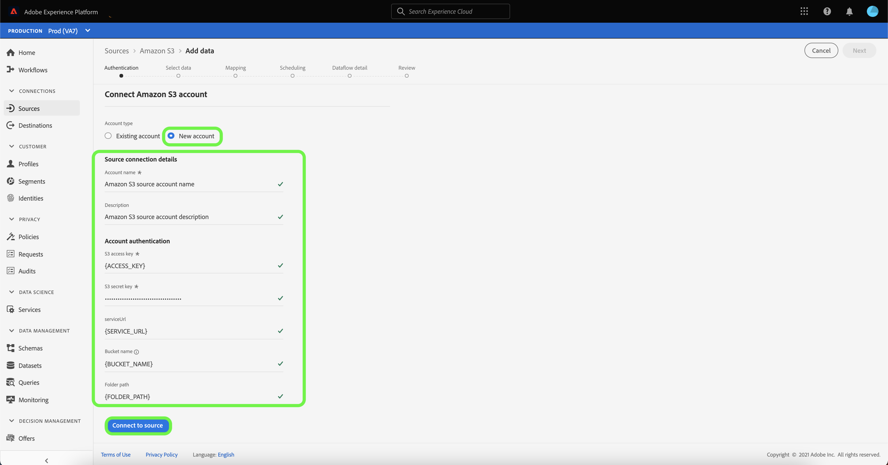

# Een [!DNL Amazon S3]-bronverbinding maken in de gebruikersinterface

De bronschakelaars in Adobe Experience Platform verstrekken de capaciteit om van buitenaf afkomstige gegevens op een geplande basis in te voeren. Deze zelfstudie biedt stappen voor het maken van een [!DNL Amazon S3] (hierna &quot;[!DNL S3]&quot; genoemd) bronconnector met behulp van de gebruikersinterface van het Platform.

## Aan de slag

Deze zelfstudie vereist een goed begrip van de volgende onderdelen van Adobe Experience Platform:

- [[!DNL Experience Data Model (XDM)] Systeem](../../../../../xdm/home.md): Het gestandaardiseerde kader waardoor het Experience Platform gegevens van de klantenervaring organiseert.
   - [Basisbeginselen van de schemacompositie](../../../../../xdm/schema/composition.md): Leer over de basisbouwstenen van schema&#39;s XDM, met inbegrip van zeer belangrijke principes en beste praktijken in schemacompositie.
   - [Zelfstudie](../../../../../xdm/tutorials/create-schema-ui.md) Schema-editor: Leer hoe te om douaneschema&#39;s tot stand te brengen gebruikend de Redacteur UI van het Schema.
- [[!DNL Real-time Customer Profile]](../../../../../profile/home.md): Verstrekt een verenigd, real-time consumentenprofiel dat op bijeengevoegde gegevens van veelvoudige bronnen wordt gebaseerd.

Als u al een geldige [!DNL S3] verbinding hebt, kunt u de rest van dit document overslaan en aan het leerprogramma te werk gaan [vormend een dataflow](../../dataflow/batch/cloud-storage.md).

### Vereiste referenties verzamelen

Om tot uw [!DNL S3] emmertje op Platform toegang te hebben, moet u geldige waarden voor de volgende geloofsbrieven verstrekken:

| Credentials | Beschrijving |
| ---------- | ----------- |
| `s3AccessKey` | De toegangs belangrijkste identiteitskaart voor uw [!DNL S3] emmertje. |
| `s3SecretKey` | De geheime zeer belangrijke identiteitskaart voor uw [!DNL S3] emmertje. |
| `serviceUrl` | (Optioneel) Het aangepaste [!DNL S3]-eindpunt waarmee verbinding moet worden gemaakt. Dit gebied wordt vereist wanneer uw [!DNL S3] emmertje gebied-specifiek is. De notatie voor `serviceUrl` is: `https://s3.{REGION}.amazonaws.com/)`. |
| `bucketName` | Het emmertje [!DNL S3] bevat uw gegevens en zijn overeenkomstige beschrijvende meta-gegevens. De emmernaam [!DNL S3] moet tussen drie en 63 karakters lang zijn en met of een brief of een aantal beginnen en eindigen. De naam van het emmertje kan slechts kleine letters, aantallen, of koppeltekens (`-`) hebben, en kan niet als IP adres worden geformatteerd. |
| `folderPath` | Het pad naar de map in het emmertje [!DNL S3] waar uw gegevens zijn opgeslagen. Deze referentie is vereist wanneer de gebruiker toegang heeft beperkt. |

Voor meer informatie over aan de slag gaan, surf naar [dit AWS-document](https://aws.amazon.com/blogs/security/wheres-my-secret-access-key/).

## Uw [!DNL S3]-account aansluiten

Selecteer **[!UICONTROL Sources]** in de gebruikersinterface van het Platform in de linkernavigatiebalk voor toegang tot de werkruimte [!UICONTROL Sources]. In het scherm [!UICONTROL Catalog] worden diverse bronnen weergegeven waarmee u een account kunt maken.

U kunt de juiste categorie selecteren in de catalogus aan de linkerkant van het scherm. U kunt ook de specifieke bron vinden waarmee u wilt werken met de zoekoptie.

Selecteer **[!UICONTROL Cloud storage]** onder de categorie **[!UICONTROL Amazon S3]** en selecteer **[!UICONTROL Add data]**.

De pagina **[!UICONTROL Connect to Amazon S3]** wordt weergegeven. Op deze pagina kunt u nieuwe of bestaande referenties gebruiken.

### Nieuwe account

Als u nieuwe geloofsbrieven gebruikt, uitgezocht **[!UICONTROL New account]**. Geef in het invoerformulier dat wordt weergegeven een naam, een optionele beschrijving en uw [!DNL S3]-referenties op. Wanneer gebeëindigd, selecteer **[!UICONTROL Connect to source]** en laat dan wat tijd voor de nieuwe verbinding toe om te vestigen.

### Bestaande account

Als u een bestaande account wilt verbinden, selecteert u de [!DNL S3]-account waarmee u verbinding wilt maken en selecteert u **[!UICONTROL Next]** om door te gaan.

## Volgende stappen en extra bronnen

Aan de hand van deze zelfstudie hebt u een verbinding tot stand gebracht met uw [!DNL S3]-account. U kunt nu verdergaan naar de volgende zelfstudie en [een gegevensstroom configureren om gegevens van uw cloudopslag naar Platform te brengen](../../dataflow/batch/cloud-storage.md).
