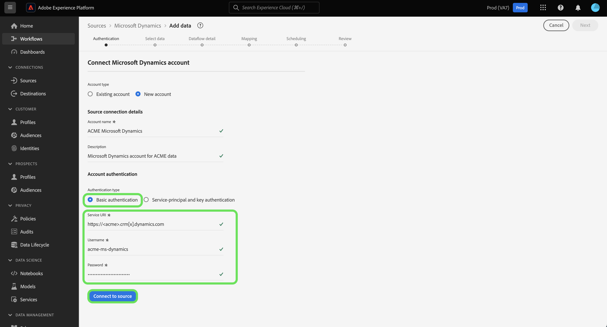

# Een [!DNL Microsoft Dynamics] bronverbinding in de gebruikersinterface

Deze zelfstudie bevat stappen om een [!DNL Microsoft Dynamics] (hierna &quot;[!DNL Dynamics]&quot;) bronverbinding via de gebruikersinterface van Adobe Experience Platform.

## Aan de slag

Deze zelfstudie vereist een goed begrip van de volgende onderdelen van Adobe Experience Platform:

* [[!DNL Experience Data Model (XDM)] Systeem](../../../../../xdm/home.md): Het gestandaardiseerde kader waardoor Experience Platform gegevens van de klantenervaring organiseert.
   * [Basisbeginselen van de schemacompositie](../../../../../xdm/schema/composition.md): Leer over de basisbouwstenen van schema&#39;s XDM, met inbegrip van zeer belangrijke principes en beste praktijken in schemacompositie.
   * [Zelfstudie Schema-editor](../../../../../xdm/tutorials/create-schema-ui.md): Leer hoe u aangepaste schema&#39;s maakt met de gebruikersinterface van de Schema-editor.
* [[!DNL Real-Time Customer Profile]](../../../../../profile/home.md): Biedt een uniform, real-time consumentenprofiel dat is gebaseerd op geaggregeerde gegevens van meerdere bronnen.

Als u al een geldige [!DNL Dynamics] account, kunt u de rest van dit document overslaan en doorgaan naar de zelfstudie op [het vormen van een dataflow voor een bron van CRM](../../dataflow/crm.md).

### Vereiste referenties verzamelen

Om uw [!DNL Dynamics] bron, moet u waarden voor de volgende verbindingseigenschappen verstrekken:

>[!BEGINTABS]

>[!TAB Basisverificatie]

| Credentials | Beschrijving |
| --- | --- |
| `serviceUri` | De service-URL van uw [!DNL Dynamics] -instantie. |
| `username` | De gebruikersnaam voor uw [!DNL Dynamics] gebruikersaccount. |
| `password` | Het wachtwoord voor uw [!DNL Dynamics] account. |

>[!TAB Service-principal en sleutelverificatie]

| Credentials | Beschrijving |
| --- | --- |
| `servicePrincipalId` | De client-id van uw [!DNL Dynamics] account. Deze ID wordt vereist wanneer het gebruiken van de dienst hoofd en op sleutel-gebaseerde authentificatie. |
| `servicePrincipalKey` | De geheime sleutel van de dienst belangrijkste geheim. Deze referentie wordt vereist wanneer het gebruiken van de dienst belangrijkste en op sleutel-gebaseerde authentificatie. |

>[!ENDTABS]

Raadpleeg voor meer informatie over aan de slag gaan [dit [!DNL Dynamics] document](https://docs.microsoft.com/en-us/powerapps/developer/common-data-service/authenticate-oauth).

## Verbind uw [!DNL Dynamics] account

Selecteer in de interface Platform de optie **[!UICONTROL Sources]** van de linkernavigatie om tot [!UICONTROL Sources] werkruimte. De [!UICONTROL Catalog] in het scherm worden verschillende bronnen weergegeven waarmee u een account kunt maken.

U kunt de juiste categorie selecteren in de catalogus aan de linkerkant van het scherm. U kunt ook de specifieke bron vinden waarmee u wilt werken met de zoekoptie.

Onder de [!UICONTROL CRM] categorie, selecteert u **[!UICONTROL Microsoft Dynamics]** en selecteer vervolgens **[!UICONTROL Add data]**.

De **[!UICONTROL Connect Microsoft Dynamics account]** wordt weergegeven. Op deze pagina kunt u nieuwe of bestaande referenties gebruiken.

### Bestaande account

Als u een bestaande account wilt gebruiken, selecteert u de optie [!DNL Dynamics] account dat u wilt gebruiken, selecteert u **[!UICONTROL Next]** in de rechterbovenhoek om verder te gaan.

### Nieuwe account

>[!TIP]
>
>Nadat u een verificatietype hebt gemaakt, kunt u dit type van een [!DNL Dynamics] basisverbinding. Als u het verificatietype wilt wijzigen, moet u een nieuwe basisverbinding maken.

Als u een nieuwe account wilt maken, selecteert u **[!UICONTROL New account]** en geef vervolgens een naam en een optionele beschrijving voor uw nieuwe [!DNL Dynamics] account.

U kunt of basisauthentificatie of dienst-hoofd en zeer belangrijke authentificatie gebruiken wanneer het creëren van een [!DNL Dynamics] account.

>[!BEGINTABS]

>[!TAB Basisverificatie]

Een [!DNL Dynamics] account met basisverificatie, selecteer [!UICONTROL Basic authentication] en geef vervolgens waarden op voor uw [!UICONTROL Service URI], [!UICONTROL Username], en [!UICONTROL Password]. **Opmerking**: Basisverificatie in [!DNL Dynamics] Deze optie kan worden geblokkeerd door verificatie met twee factoren, die momenteel niet door Platform wordt ondersteund. In dit geval wordt aangeraden op sleutels gebaseerde verificatie te gebruiken om een bronconnector te maken die [!DNL Dynamics].

Selecteer **[!UICONTROL Connect to source]** en laat vervolgens enige tijd over voor de nieuwe account.

>[!TAB Service-principal en sleutelverificatie]

Een [!DNL Dynamics] account met service-principal en sleutelverificatie, selecteer **[!UICONTROL Service-principal and key authentication]** en geef vervolgens waarden op voor uw [!UICONTROL Service principal ID] en [!UICONTROL Service principal key].

Selecteer **[!UICONTROL Connect to source]** en laat vervolgens enige tijd over voor de nieuwe account.

>[!ENDTABS]

## Volgende stappen

Aan de hand van deze zelfstudie hebt u een verbinding tot stand gebracht met uw [!DNL Dynamics] account. U kunt nu verdergaan met de volgende zelfstudie en [een gegevensstroom configureren om gegevens over te brengen naar het platform](../../dataflow/crm.md).
