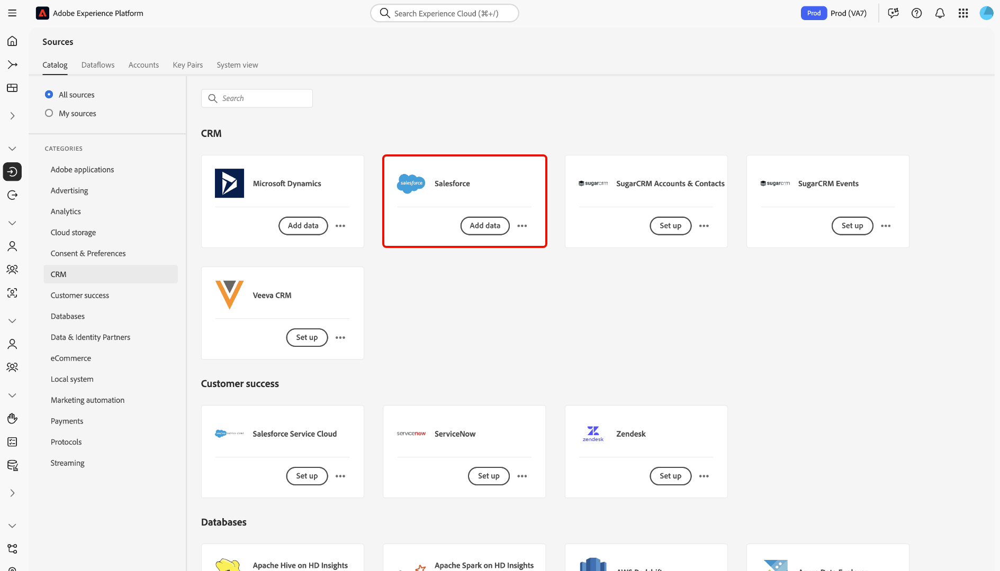

# Een [!DNL Salesforce]-bronverbinding maken in de gebruikersinterface

De bronschakelaars in Adobe Experience Platform verstrekken de capaciteit om extern gesourceerde gegevens van CRM op een geplande basis in te voeren. Deze zelfstudie bevat stappen voor het maken van een [!DNL Salesforce]-bronconnector met behulp van de [!DNL Platform]-gebruikersinterface.

## Aan de slag

Deze zelfstudie vereist een goed begrip van de volgende onderdelen van Adobe Experience Platform:

* [[!DNL Experience Data Model (XDM)] Systeem](../../../../../xdm/home.md): Het gestandaardiseerde kader waardoor de gegevens van de  [!DNL Experience Platform] klantenervaring worden georganiseerd.
   * [Basisbeginselen van de schemacompositie](../../../../../xdm/schema/composition.md): Leer over de basisbouwstenen van schema&#39;s XDM, met inbegrip van zeer belangrijke principes en beste praktijken in schemacompositie.
   * [Zelfstudie](../../../../../xdm/tutorials/create-schema-ui.md) Schema-editor: Leer hoe te om douaneschema&#39;s tot stand te brengen gebruikend de Redacteur UI van het Schema.
* [[!DNL Real-time Customer Profile]](../../../../../profile/home.md): Verstrekt een verenigd, real-time consumentenprofiel dat op bijeengevoegde gegevens van veelvoudige bronnen wordt gebaseerd.

Als u al een geldige [!DNL Salesforce] rekening hebt, kunt u de rest van dit document overslaan en aan het leerprogramma te werk gaan [vormend een dataflow](../../dataflow/crm.md).

### Vereiste referenties verzamelen

| Credentials | Beschrijving |
| ---------- | ----------- |
| `environmentUrl` | De URL van de broninstantie [!DNL Salesforce]. |
| `username` | De gebruikersnaam voor de [!DNL Salesforce]-gebruikersaccount. |
| `password` | Het wachtwoord voor de [!DNL Salesforce] gebruikersaccount. |
| `securityToken` | Het beveiligingstoken voor de [!DNL Salesforce]-gebruikersaccount. |

Raadpleeg [dit Salesforce-document](https://developer.salesforce.com/docs/atlas.en-us.api_rest.meta/api_rest/intro_understanding_authentication.htm) voor meer informatie over aan de slag gaan.

## Uw [!DNL Salesforce]-account aansluiten

Nadat u de vereiste gegevens hebt verzameld, kunt u de onderstaande stappen volgen om uw [!DNL Salesforce]-account te koppelen aan [!DNL Platform].

Meld u aan bij [Adobe Experience Platform](https://platform.adobe.com) en selecteer **[!UICONTROL Sources]** in de linkernavigatiebalk om de werkruimte **[!UICONTROL Sources]** te openen. In het scherm **[!UICONTROL Catalog]** worden diverse bronnen weergegeven waarmee u een account kunt maken.

U kunt de juiste categorie selecteren in de catalogus aan de linkerkant van het scherm. U kunt ook de specifieke bron vinden waarmee u wilt werken met de zoekoptie.

Selecteer **[!UICONTROL Salesforce]** onder de categorie **[!UICONTROL Databases]**. Als dit uw eerste keer gebruikend deze schakelaar is, uitgezocht **[!UICONTROL Configure]**. Anders, selecteer **[!UICONTROL Add data]** om een nieuwe schakelaar te creëren Salesforce.

De pagina **[!UICONTROL Connect to Salesforce]** wordt weergegeven. Op deze pagina kunt u nieuwe of bestaande referenties gebruiken.

### Nieuwe account

Als u nieuwe geloofsbrieven gebruikt, uitgezocht **[!UICONTROL New account]**. Geef in het invoerformulier dat wordt weergegeven een naam, een optionele beschrijving en uw [!DNL Salesforce]-referenties op. Wanneer gebeëindigd, selecteer **[!UICONTROL Connect]** en laat dan wat tijd voor de nieuwe verbinding toe om te vestigen.

### Bestaande account

Als u een bestaande account wilt verbinden, selecteert u de [!DNL Salesforce]-account waarmee u verbinding wilt maken en selecteert u **[!UICONTROL Next]** in de rechterbovenhoek om door te gaan.

## Volgende stappen

Aan de hand van deze zelfstudie hebt u een verbinding tot stand gebracht met uw [!DNL Salesforce]-account. U kunt nu doorgaan naar de volgende zelfstudie en [een gegevensstroom configureren om gegevens over te brengen naar [!DNL Platform]](../../dataflow/crm.md).
