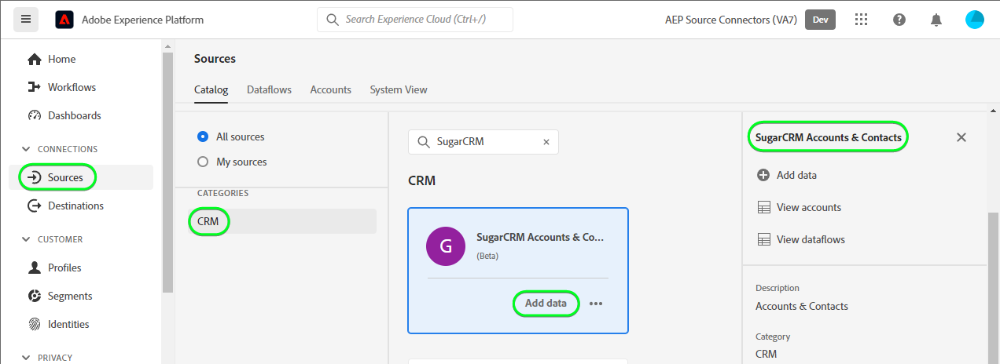

# (Beta) Maak een [!DNL SugarCRM Accounts & Contacts] bronverbinding in de gebruikersinterface

>[!NOTE]
>
>De [!DNL SugarCRM Accounts & Contacts] De bron is in bèta. Zie de [overzicht van bronnen](../../../../home.md#terms-and-conditions) voor meer informatie over het gebruik van bronnen met een bètalabel.

Deze zelfstudie bevat stappen voor het maken van een [!DNL SugarCRM Accounts & Contacts] bronverbinding via de Adobe Experience Platform-gebruikersinterface.

## Aan de slag

Deze zelfstudie vereist een goed begrip van de volgende onderdelen van het Experience Platform:

* [[!DNL Experience Data Model (XDM)] Systeem](../../../../../xdm/home.md): Het gestandaardiseerde kader waardoor [!DNL Experience Platform] organiseert de gegevens van de klantenervaring.
   * [Basisbeginselen van de schemacompositie](../../../../../xdm/schema/composition.md): Leer over de basisbouwstenen van schema&#39;s XDM, met inbegrip van zeer belangrijke principes en beste praktijken in schemacompositie.
   * [Zelfstudie Schema Editor](../../../../../xdm/tutorials/create-schema-ui.md): Leer hoe te om douaneschema&#39;s tot stand te brengen gebruikend de Redacteur UI van het Schema.
* [[!DNL Real-Time Customer Profile]](../../../../../profile/home.md): Verstrekt een verenigd, real-time consumentenprofiel dat op bijeengevoegde gegevens van veelvoudige bronnen wordt gebaseerd.

Als u al een geldige [!DNL SugarCRM] account, kunt u de rest van dit document overslaan en doorgaan naar de zelfstudie op [configureren, gegevensstroom](../../dataflow/crm.md).

### Vereiste referenties verzamelen

Om verbinding te maken [!DNL SugarCRM Accounts & Contacts] als u een Platform wilt maken, moet u waarden opgeven voor de volgende verbindingseigenschappen:

| Credentials | Beschrijving | Voorbeeld |
| --- | --- | --- |
| `Host` | Het SugarCRM API eindpunt de bron verbindt met. | `developer.salesfusion.com` |
| `Username` | Uw gebruikersnaam voor de SugarCRM-ontwikkelaarsaccount. | `abc.def@example.com@sugarmarketdemo000.com` |
| `Password` | Wachtwoord voor uw SugarCRM-ontwikkelaarsaccount. | `123456789` |

### Een Platform-schema maken

Voordat u een [!DNL SugarCRM] bronverbinding, moet u ook ervoor zorgen dat u eerst een schema van het Platform aan gebruik voor uw bron creeert. Zie de zelfstudie aan [een Platform-schema maken](../../../../../xdm/schema/composition.md) voor uitgebreide stappen over hoe te om een schema tot stand te brengen.

De [!DNL SugarCRM Accounts & Contacts] ondersteunt meerdere API&#39;s. Dit betekent dat u een afzonderlijk schema moet maken, afhankelijk van het objecttype dat u gebruikt. Zie de voorbeelden hieronder voor zowel rekeningen als contactschema&#39;s:

>[!BEGINTABS]

>[!TAB Accounts]

>[!TAB Contactpersonen]

>[!ENDTABS]

## Verbind uw [!DNL SugarCRM Accounts & Contacts] account

Selecteer in de gebruikersinterface van het Platform de optie **[!UICONTROL Sources]** van de linkernavigatiebalk voor toegang tot de [!UICONTROL Sources] werkruimte. De [!UICONTROL Catalog] in het scherm worden diverse bronnen weergegeven waarmee u een account kunt maken.

U kunt de juiste categorie selecteren in de catalogus aan de linkerkant van het scherm. U kunt ook de specifieke bron vinden waarmee u wilt werken met de zoekoptie.

Onder de *CRM* categorie, selecteert u **[!UICONTROL SugarCRM Accounts & Contacts]** en selecteer vervolgens **[!UICONTROL Add data]**.

De **[!UICONTROL Connect SugarCRM Accounts & Contacts account]** wordt weergegeven. Op deze pagina kunt u nieuwe of bestaande referenties gebruiken.

### Bestaande account

Als u een bestaande account wilt gebruiken, selecteert u de optie [!DNL SugarCRM Accounts & Contacts] account waarmee u een nieuwe gegevensstroom wilt maken, selecteert u **[!UICONTROL Next]** om verder te gaan.

### Nieuwe account

Als u een nieuwe account maakt, selecteert u **[!UICONTROL New account]** en geef vervolgens een naam, een optionele beschrijving en uw referenties op. Als u klaar bent, selecteert u **[!UICONTROL Connect to source]** en laat dan wat tijd voor de nieuwe verbinding tot stand brengen.

### Gegevens selecteren

Tot slot moet u het objecttype selecteren dat u aan Platform wilt toevoegen.

| Objecttype | Beschrijving |
| --- | --- |
| `Accounts` | De bedrijven waarmee uw organisatie een relatie heeft. |
| `Contacts` | De individuele mensen met wie uw organisatie een gevestigde verhouding heeft. |

>[!BEGINTABS]

>[!TAB Accounts]

>[!TAB Contactpersonen]

>[!ENDTABS]

## Volgende stappen

Aan de hand van deze zelfstudie hebt u een verbinding tot stand gebracht met uw [!DNL SugarCRM Accounts & Contacts] account. U kunt nu verdergaan met de volgende zelfstudie en [een gegevensstroom configureren om gegevens naar het Platform te brengen](../../dataflow/crm.md).

## Aanvullende bronnen

In de volgende secties vindt u aanvullende bronnen die u kunt raadplegen wanneer u de [!DNL SugarCRM] bron.

### Guardrails {#guardrails}

De [!DNL SugarCRM] De snelheid van de API is 90 vraag per minuut of 2000 vraag per dag, welke eerste gebeurt. Deze beperking is echter omzeild door een parameter toe te voegen aan de verbindingsspecificatie die de aanvraagtijd vertraagt zodat de tarieflimiet nooit wordt bereikt.

### Validatie {#validation}

Om te controleren of u de bron correct hebt ingesteld en [!DNL SugarCRM Accounts & Contacts] Voer de volgende stappen uit om gegevens in te voeren:

* Selecteer in de gebruikersinterface van het Platform de optie **[!UICONTROL View Dataflows]** naast de [!DNL SugarCRM Accounts & Contacts] kaartmenu in de broncatalogus. Selecteer vervolgens **[!UICONTROL Preview dataset]** om de gegevens te verifiëren die werden opgenomen.

* Afhankelijk van het objecttype waarmee u werkt, kunt u de samengevoegde gegevens controleren op basis van de tellingen die op het tabblad [!DNL SugarMarket] Pagina&#39;s met accounts of contactpersonen hieronder:

>[!BEGINTABS]

>[!TAB Accounts]

>[!TAB Contactpersonen]

>[!ENDTABS]

>[!NOTE]
>
>De [!DNL SugarMarket] pagina&#39;s bevatten niet het aantal verwijderde objecten. De gegevens die via deze bron worden opgehaald, bevatten echter ook het verwijderde aantal. Deze gegevens worden gemarkeerd met een verwijderde vlag.
