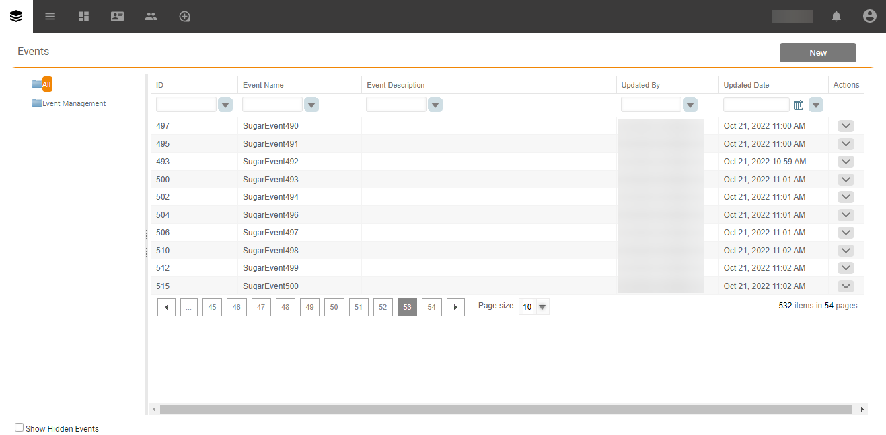

# Een [!DNL SugarCRM Events] bronverbinding maken in de gebruikersinterface

Deze zelfstudie bevat stappen voor het maken van een [!DNL SugarCRM Events] -bronverbinding met de Adobe Experience Platform-gebruikersinterface.

## Aan de slag

Deze zelfstudie vereist een goed begrip van de volgende onderdelen van het Experience Platform:

* [[!DNL Experience Data Model (XDM)]  Systeem ](../../../../../xdm/home.md): Het gestandaardiseerde kader waardoor [!DNL Experience Platform] gegevens van de klantenervaring organiseert.
   * [ Grondbeginselen van schemacompositie ](../../../../../xdm/schema/composition.md): Leer over de basisbouwstenen van schema&#39;s XDM, met inbegrip van zeer belangrijke principes en beste praktijken in schemacompositie.
   * [ het leerprogramma van de Redacteur van het Schema ](../../../../../xdm/tutorials/create-schema-ui.md): Leer hoe te om douaneschema&#39;s tot stand te brengen gebruikend de Redacteur UI van het Schema.
* [[!DNL Real-Time Customer Profile]](../../../../../profile/home.md): biedt een uniform, real-time consumentenprofiel dat is gebaseerd op geaggregeerde gegevens van meerdere bronnen.

Als u reeds een geldige [!DNL SugarCRM] rekening hebt, kunt u de rest van dit document overslaan en aan het leerprogramma te werk gaan op [ vormend een dataflow ](../../dataflow/crm.md).

### Vereiste referenties verzamelen

Als u [!DNL SugarCRM Events] wilt verbinden met Platform, moet u waarden opgeven voor de volgende verbindingseigenschappen:

| Credentials | Beschrijving | Voorbeeld |
| --- | --- | --- |
| `Host` | Het SugarCRM API eindpunt de bron verbindt met. | `developer.salesfusion.com` |
| `Username` | Uw gebruikersnaam voor de SugarCRM-ontwikkelaarsaccount. | `abc.def@example.com@sugarmarketdemo000.com` |
| `Password` | Wachtwoord voor uw SugarCRM-ontwikkelaarsaccount. | `123456789` |

### Een platformschema maken voor [!DNL SugarCRM]

Voordat u een [!DNL SugarCRM] -bronverbinding maakt, moet u er ook voor zorgen dat u eerst een Platform-schema maakt dat u voor uw bron kunt gebruiken. Zie het leerprogramma op [ creërend een schema van het Platform ](../../../../../xdm/schema/composition.md) voor uitvoerige stappen op hoe te om een schema tot stand te brengen.

{het schermschot van het platform UI die een voorbeeldschema voor de Gebeurtenissen van SugarCRM ](../../../../images/tutorials/create/sugarcrm-events/sugarcrm-schema-events.png) toont![

>[!WARNING]
>
>Wanneer u het schema toewijst, moet u ook de verplichte `event_id` - en `timestamp` -velden toewijzen die vereist zijn voor Platform.

## Sluit uw [!DNL SugarCRM Events] -account aan

Selecteer in de gebruikersinterface van het platform **[!UICONTROL Sources]** in de linkernavigatiebalk voor toegang tot de werkruimte van [!UICONTROL Sources] . In het scherm [!UICONTROL Catalog] worden diverse bronnen weergegeven waarmee u een account kunt maken.

U kunt de juiste categorie selecteren in de catalogus aan de linkerkant van het scherm. U kunt ook de specifieke bron vinden waarmee u wilt werken met de zoekoptie.

Onder de *CRM* categorie, selecteer **[!UICONTROL SugarCRM Events]**, en selecteer dan **[!UICONTROL Add data]**.

{het schermschot van het platform UI voor catalogus met de kaart van Gebeurtenissen SugarCRM ](../../../../images/tutorials/create/sugarcrm-events/catalog-sugarcrm-events.png)![

De pagina **[!UICONTROL Connect SugarCRM Events account]** wordt weergegeven. Op deze pagina kunt u nieuwe of bestaande referenties gebruiken.

### Bestaande account

Als u een bestaande account wilt gebruiken, selecteert u de [!DNL SugarCRM Events] -account waarmee u een nieuwe gegevensstroom wilt maken en selecteert u vervolgens **[!UICONTROL Next]** om door te gaan.

{het schermschot van het platform UI voor de rekening van Gebeurtenissen Connect SugarCRM met een bestaande rekening ](../../../../images/tutorials/create/sugarcrm-events/existing.png)![

### Nieuwe account

Als u een nieuwe account maakt, selecteert u **[!UICONTROL New account]** en geeft u een naam, een optionele beschrijving en uw referenties op. Als u klaar bent, selecteert u **[!UICONTROL Connect to source]** en laat u de nieuwe verbinding enige tijd tot stand brengen.

{het schermschot van het platform UI voor de rekening van Gebeurtenissen Connect SugarCRM met een nieuwe rekening ](../../../../images/tutorials/create/sugarcrm-events/new.png)![

## Volgende stappen

Aan de hand van deze zelfstudie hebt u een verbinding tot stand gebracht met uw [!DNL SugarCRM Events] -account. U kunt nu aan het volgende leerprogramma verdergaan en [ een dataflow vormen om gegevens in Platform ](../../dataflow/crm.md) te brengen.

## Aanvullende bronnen

De onderstaande secties bevatten aanvullende bronnen waarnaar u kunt verwijzen wanneer u de [!DNL SugarCRM] -bron gebruikt.

### Guardrails {#guardrails}

De snelheid van de API van [!DNL SugarCRM] is 90 vraag per minuut of 2000 vraag per dag, welke eerste gebeurt. Deze beperking is echter omzeild door een parameter toe te voegen aan de verbindingsspecificatie die de aanvraagtijd vertraagt zodat de tarieflimiet nooit wordt bereikt.

### Validatie {#validation}

Volg onderstaande stappen om te controleren of u de bron juist hebt ingesteld en of [!DNL SugarCRM Events] -gegevens worden ingevoerd:

* Selecteer in de interface Platform de optie **[!UICONTROL View Dataflows]** naast het kaartmenu [!DNL SugarCRM Events] in de catalogus met bronnen. Selecteer vervolgens **[!UICONTROL Preview dataset]** om de gegevens te verifiëren die zijn ingevoerd.

* Afhankelijk van het objecttype waarmee u werkt, kunt u de samengevoegde gegevens vergelijken met de tellingen die op de onderstaande pagina Gebeurtenissen van [!DNL SugarMarket] worden weergegeven:

>[!NOTE]
>
>Op de pagina&#39;s van [!DNL SugarMarket] staan geen aantallen verwijderde objecten. De gegevens die via deze bron worden opgehaald, bevatten echter ook het verwijderde aantal. Deze gegevens worden gemarkeerd met een verwijderde vlag.
