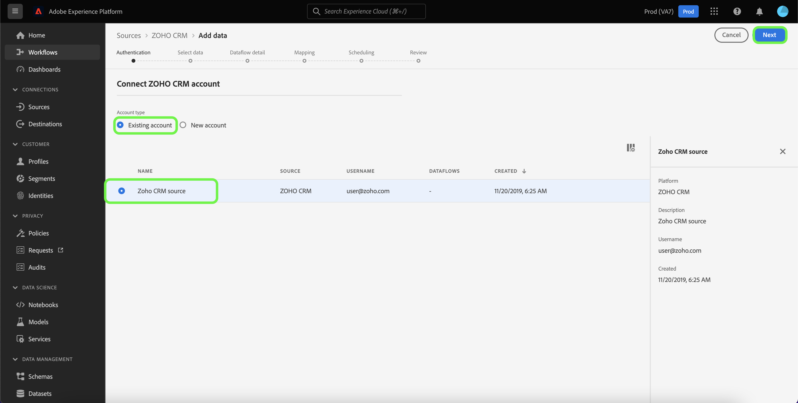

# Een [!DNL Zoho CRM] bronverbinding in de gebruikersinterface

De bronschakelaars in Adobe Experience Platform verstrekken de capaciteit om extern gesourceerde gegevens van CRM op een geplande basis in te voeren. Deze zelfstudie bevat stappen voor het maken van een [!DNL Zoho CRM] bronaansluiting met behulp van de [!DNL Platform] gebruikersinterface.

## Aan de slag

Deze zelfstudie vereist een goed begrip van de volgende onderdelen van Adobe Experience Platform:

* [[!DNL Experience Data Model (XDM)] Systeem](../../../../../xdm/home.md): Het gestandaardiseerde kader waardoor [!DNL Experience Platform] organiseert de gegevens van de klantenervaring.
   * [Basisbeginselen van de schemacompositie](../../../../../xdm/schema/composition.md): Leer over de basisbouwstenen van schema&#39;s XDM, met inbegrip van zeer belangrijke principes en beste praktijken in schemacompositie.
   * [Zelfstudie Schema Editor](../../../../../xdm/tutorials/create-schema-ui.md): Leer hoe te om douaneschema&#39;s tot stand te brengen gebruikend de Redacteur UI van het Schema.
* [[!DNL Real-time Customer Profile]](../../../../../profile/home.md): Verstrekt een verenigd, real-time consumentenprofiel dat op bijeengevoegde gegevens van veelvoudige bronnen wordt gebaseerd.

Als u al een geldige [!DNL Zoho CRM] account, kunt u de rest van dit document overslaan en doorgaan naar de zelfstudie op [configureren, gegevensstroom](../../dataflow/crm.md).

### Vereiste referenties verzamelen

Om verbinding te maken [!DNL Zoho CRM] als u een Platform wilt maken, moet u waarden opgeven voor de volgende verbindingseigenschappen:

| Credentials | Beschrijving |
| --- | --- |
| Endpoint | Het eindpunt van het [!DNL Zoho CRM] server waarop u uw verzoek indient. |
| Accounts-URL | De account-URL wordt gebruikt om uw toegangs- en vernieuwingstokens te genereren. De URL moet domeinspecifiek zijn. |
| Client-id | De client-id die overeenkomt met uw [!DNL Zoho CRM] gebruikersaccount. |
| Clientgeheim | Het clientgeheim dat overeenkomt met uw [!DNL Zoho CRM] gebruikersaccount. |
| Toegangstoken | Het toegangstoken verleent uw veilige en tijdelijke toegang tot uw [!DNL Zoho CRM] account. |
| Token vernieuwen | Een vernieuwingstoken is een teken dat wordt gebruikt om een nieuw toegangstoken te produceren, zodra uw toegangstoken is verlopen. |

Zie de documentatie over [[!DNL Zoho CRM] verificatie](https://www.zoho.com/crm/developer/docs/api/v2/oauth-overview.html).

## Verbind uw [!DNL Zoho CRM] account

Nadat u de vereiste gegevens hebt verzameld, kunt u de onderstaande stappen volgen om uw [!DNL Zoho CRM] account aan [!DNL Platform].

Selecteer in de gebruikersinterface van het Platform de optie **[!UICONTROL Sources]** van de linkernavigatiebalk voor toegang tot de [!UICONTROL Sources] werkruimte. De [!UICONTROL Catalog] in het scherm worden diverse bronnen weergegeven waarmee u een account kunt maken.

U kunt de juiste categorie selecteren in de catalogus aan de linkerkant van het scherm. U kunt ook de specifieke bron vinden waarmee u wilt werken met de zoekoptie.

Onder de [!UICONTROL CRM] categorie, selecteert u **[!UICONTROL Zoho CRM]** en selecteer vervolgens **[!UICONTROL Add data]**.

De **[!UICONTROL Connect Zoho CRM account]** wordt weergegeven. Op deze pagina kunt u nieuwe of bestaande referenties gebruiken.

### Bestaande account

Als u een bestaande account wilt gebruiken, selecteert u de optie [!DNL Zoho CRM] account waarmee u een nieuwe gegevensstroom wilt maken, selecteert u **[!UICONTROL Next]** om verder te gaan.

### Nieuwe account

Als u een nieuwe account maakt, selecteert u **[!UICONTROL New account]** en geef vervolgens een naam, een optionele beschrijving en uw [!DNL Zoho CRM] referenties. Als u klaar bent, selecteert u **[!UICONTROL Connect to source]** en laat dan wat tijd voor de nieuwe verbinding tot stand brengen.

>[!TIP]
>
>Het URL-domein van uw accounts moet overeenkomen met de juiste domeinlocatie. Hieronder ziet u de verschillende domeinen en de bijbehorende account-URL&#39;s:<ul><li>Verenigde Staten: https://accounts.zoho.com</li><li>Australië: https://accounts.zoho.com.au</li><li>Europa: https://accounts.zoho.eu</li><li>India: https://accounts.zoho.in</li><li>China: https://accounts.zoho.com.cn</li></ul>

## Volgende stappen

Aan de hand van deze zelfstudie hebt u een verbinding tot stand gebracht met uw [!DNL Zoho CRM] account. U kunt nu verdergaan met de volgende zelfstudie en [een gegevensstroom configureren om gegevens naar het Platform te brengen](../../dataflow/crm.md).
