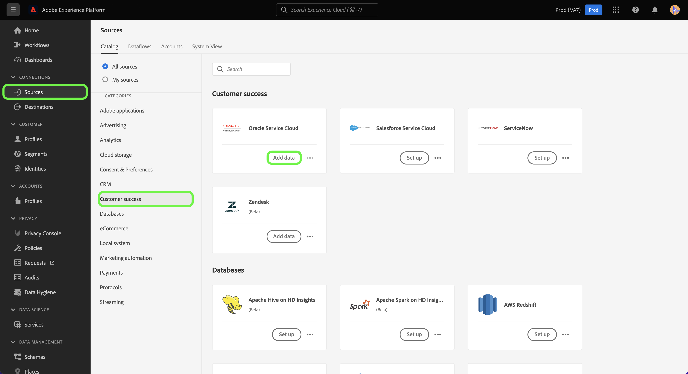

# Een Oracle Service Cloud-bronverbinding maken in de gebruikersinterface

>[!WARNING]
>
>De bron [!DNL Oracle Service Cloud] wordt eind juni 2025 vervangen.

Deze zelfstudie bevat stappen voor het maken van een Oracle Service Cloud-bronverbinding via de Adobe Experience Platform-gebruikersinterface.

## Aan de slag

Deze zelfstudie vereist een goed begrip van de volgende onderdelen van Experience Platform:

* [[!DNL Experience Data Model (XDM)]  Systeem ](../../../../../xdm/home.md): Het gestandaardiseerde kader waardoor Experience Platform gegevens van de klantenervaring organiseert.
   * [ Grondbeginselen van schemacompositie ](../../../../../xdm/schema/composition.md): Leer over de basisbouwstenen van schema&#39;s XDM, met inbegrip van zeer belangrijke principes en beste praktijken in schemacompositie.
   * [ het leerprogramma van de Redacteur van het Schema ](../../../../../xdm/tutorials/create-schema-ui.md): Leer hoe te om douaneschema&#39;s tot stand te brengen gebruikend de Redacteur UI van het Schema.
* [[!DNL Real-Time Customer Profile]](../../../../../profile/home.md): biedt een uniform, real-time consumentenprofiel dat is gebaseerd op geaggregeerde gegevens van meerdere bronnen.

Als u reeds een geldige de bronverbinding van de Wolk van de Dienst van Oracle hebt, kunt u de rest van dit document overslaan en aan het leerprogramma te werk gaan op [ vormend een dataflow ](../../dataflow/customer-success.md)

### Vereiste referenties verzamelen

Als u toegang wilt krijgen tot uw Oracle Service Cloud-account op [!DNL Experience Platform] , moet u de volgende waarden opgeven:

| Credentials | Beschrijving |
| ---------- | ----------- |
| Host | De host-URL van uw Oracle Service Cloud-instantie. |
| Gebruikersnaam | De gebruikersnaam voor uw Oracle Service Cloud-gebruikersaccount. |
| Wachtwoord | Het wachtwoord voor uw Oracle Service Cloud-account. |

Voor meer informatie bij het voor authentiek verklaren van uw rekening van de Wolk van de Dienst van Oracle, verwijs naar de [[!DNL Oracle]  gids over authentificatie ](https://docs.oracle.com/en/cloud/saas/b2c-service/20c/cxska/OKCS_Authenticate_and_Authorize.html).

## Connect uw Oracle Service Cloud-account

Selecteer in de gebruikersinterface van Experience Platform de optie **[!UICONTROL Sources]** in de linkernavigatie voor toegang tot de werkruimte van [!UICONTROL Sources] . In het scherm [!UICONTROL Catalog] worden diverse bronnen weergegeven die kunnen worden gebruikt om een account te maken.

U kunt de juiste categorie selecteren in de catalogus aan de linkerkant van het scherm. U kunt ook de specifieke bron vinden waarmee u wilt werken met de zoekbalk.

Selecteer onder de categorie [!UICONTROL Customer success] de optie **[!UICONTROL Oracle Service Cloud]** en selecteer vervolgens **[!UICONTROL Add data]** .

De pagina **[!UICONTROL Connect to Oracle Service Cloud]** wordt weergegeven. Op deze pagina kunt u nieuwe of bestaande referenties gebruiken.

### Bestaande account

Als u een bestaande account wilt verbinden, selecteert u het Oracle Service Cloud-account waarmee u verbinding wilt maken en selecteert u **[!UICONTROL Next]** om door te gaan.

### Nieuwe account

Selecteer **[!UICONTROL New account]** als u nieuwe referenties gebruikt. Geef op het invoerformulier dat wordt weergegeven een naam, een optionele beschrijving en uw Oracle Service Cloud-referenties. Als u klaar bent, selecteert u **[!UICONTROL Connect to source]** en laat u de nieuwe verbinding enige tijd tot stand brengen.

## Volgende stappen

Door deze zelfstudie te volgen, hebt u een verbinding tot stand gebracht met uw Oracle Service Cloud-account. U kunt nu aan het volgende leerprogramma verdergaan en [ een dataflow vormen om de gegevens van het klantensucces in Experience Platform ](../../dataflow/crm.md) te brengen.
