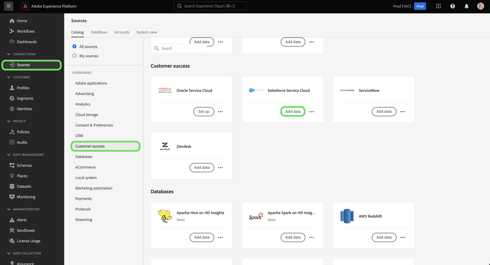

# Verbind uw [!DNL Salesforce Service Cloud] account aan Experience Platform met behulp van de gebruikersinterface

Deze zelfstudie bevat stappen voor het tot stand brengen van een verbinding met uw [!DNL Salesforce Service Cloud] en breng uw gegevens over klantsucces naar Adobe Experience Platform via de gebruikersinterface van het Experience Platform.

## Aan de slag

Deze zelfstudie vereist een goed begrip van de volgende onderdelen van het Experience Platform:

* [[!DNL Experience Data Model (XDM)] Systeem](../../../../../xdm/home.md): Het gestandaardiseerde kader waardoor Experience Platform gegevens van de klantenervaring organiseert.
   * [Basisbeginselen van de schemacompositie](../../../../../xdm/schema/composition.md): Leer over de basisbouwstenen van schema&#39;s XDM, met inbegrip van zeer belangrijke principes en beste praktijken in schemacompositie.
   * [Zelfstudie Schema-editor](../../../../../xdm/tutorials/create-schema-ui.md): Leer hoe u aangepaste schema&#39;s maakt met de gebruikersinterface van de Schema-editor.
* [[!DNL Real-Time Customer Profile]](../../../../../profile/home.md): Biedt een uniform, real-time consumentenprofiel dat is gebaseerd op geaggregeerde gegevens van meerdere bronnen.

Als u al een geldige [!DNL Salesforce Service Cloud] verbinding hebt, kunt u de rest van dit document overslaan en doorgaan naar de zelfstudie op [het vormen van een gegevensstroom voor een klantensucces](../../dataflow/customer-success.md)

### Vereiste referenties verzamelen

Voor toegang tot uw [!DNL Salesforce Service Cloud] account op Experience Platform, moet u de volgende waarden opgeven:

| Credentials | Beschrijving |
| --- | --- |
| `environmentUrl` | De URL van de [!DNL Salesforce Service Cloud] broninstantie. |
| `username` | De gebruikersnaam voor de [!DNL Salesforce Service Cloud] gebruikersaccount. |
| `password` | Het wachtwoord voor de [!DNL Salesforce Service Cloud] gebruikersaccount. |
| `securityToken` | De beveiligingstoken voor de [!DNL Salesforce Service Cloud] gebruikersaccount. |
| `apiVersion` | (Optioneel) De REST API-versie van de [!DNL Salesforce Service Cloud] -instantie die u gebruikt. Als dit veld niet wordt ingevuld, gebruikt het Experience Platform automatisch de meest recente beschikbare versie. |

Raadpleeg voor meer informatie over verificatie de [dit [!DNL Salesforce] verificatiehandleiding](https://developer.salesforce.com/docs/atlas.en-us.api_rest.meta/api_rest/quickstart_oauth.htm).

## Verbind uw [!DNL Salesforce Service Cloud] account

Nadat u de vereiste gegevens hebt verzameld, kunt u de onderstaande stappen volgen om uw [!DNL Salesforce] aan Experience Platform.

Selecteer in de interface Platform de optie **[!UICONTROL Sources]** van de linkernavigatie om tot de bronwerkruimte toegang te hebben. De *[!UICONTROL Catalog]* het scherm toont een verscheidenheid van bronnen beschikbaar op de Experience Platform broncatalogus.

U kunt de juiste categorie selecteren in de catalogus aan de linkerkant van het scherm. U kunt ook een specifieke bron zoeken met de zoekoptie.

Selecteren **[!UICONTROL Customer success]** in de lijst met categorieën bronnen en selecteer vervolgens **[!UICONTROL Add data]** van de [!DNL Salesforce Service Cloud] kaart.

De **[!UICONTROL Connect to Salesforce Service Cloud]** wordt weergegeven. Op deze pagina kunt u nieuwe of bestaande referenties gebruiken.

>[!BEGINTABS]

>[!TAB Bestaande Salesforce Service Cloud-account gebruiken]

Als u een bestaande account wilt gebruiken, selecteert u **[!UICONTROL Existing account]** en selecteer vervolgens de account die u wilt gebruiken in de lijst die wordt weergegeven. Selecteer **[!UICONTROL Next]** om verder te gaan.

>[!TAB Een nieuw Salesforce Service Cloud-account maken]

Als u een nieuwe account wilt gebruiken, selecteert u **[!UICONTROL New account]** en geef een naam, beschrijving en uw [!DNL Salesforce Service Cloud] verificatiegegevens. Selecteer **[!UICONTROL Connect to source]** en wacht een paar seconden tot de nieuwe verbinding tot stand is gebracht.

>[!ENDTABS]

## Volgende stappen

Aan de hand van deze zelfstudie hebt u een verbinding tot stand gebracht met uw [!DNL Salesforce Service Cloud] account. U kunt nu verdergaan met de volgende zelfstudie en [een gegevensstroom configureren om gegevens van Klantsucces in Experience Platform te brengen](../../dataflow/customer-success.md).
