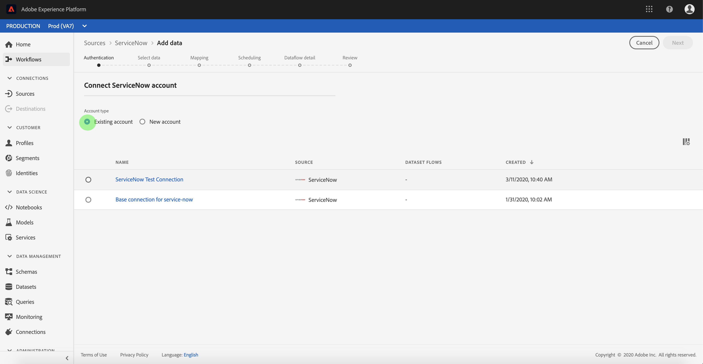

# Een [!DNL ServiceNow] bronverbinding maken in de gebruikersinterface

Source-connectors in Adobe Experience Platform bieden de mogelijkheid om volgens een schema extern gesourceerde gegevens in te voeren. Deze zelfstudie bevat stappen voor het maken van een [!DNL ServiceNow] bronaansluiting met behulp van de gebruikersinterface van [!DNL Experience Platform] .

## Aan de slag

Deze zelfstudie vereist een goed begrip van de volgende onderdelen van Adobe Experience Platform:

* [[!DNL Experience Data Model (XDM)]  Systeem ](../../../../../xdm/home.md): Het gestandaardiseerde kader waardoor [!DNL Experience Platform] gegevens van de klantenervaring organiseert.
   * [ Grondbeginselen van schemacompositie ](../../../../../xdm/schema/composition.md): Leer over de basisbouwstenen van schema&#39;s XDM, met inbegrip van zeer belangrijke principes en beste praktijken in schemacompositie.
   * [ het leerprogramma van de Redacteur van het Schema ](../../../../../xdm/tutorials/create-schema-ui.md): Leer hoe te om douaneschema&#39;s tot stand te brengen gebruikend de Redacteur UI van het Schema.
* [[!DNL Real-Time Customer Profile]](../../../../../profile/home.md): biedt een uniform, real-time consumentenprofiel dat is gebaseerd op geaggregeerde gegevens van meerdere bronnen.

Als u reeds een geldige [!DNL ServiceNow] verbinding hebt, kunt u de rest van dit document overslaan en aan het leerprogramma te werk gaan op [ vormend een dataflow ](../../dataflow/customer-success.md)

### Vereiste referenties verzamelen

Als u toegang wilt krijgen tot uw [!DNL ServiceNow] account op [!DNL Experience Platform] , moet u de volgende waarden opgeven:

| Credentials | Beschrijving |
| ---------- | ----------- |
| `endpoint` | Het eindpunt van de [!DNL ServiceNow] server. |
| `username` | De gebruikersnaam die wordt gebruikt voor verbinding met de [!DNL ServiceNow] -server voor verificatie. |
| `password` | Het wachtwoord waarmee verbinding moet worden gemaakt met de [!DNL ServiceNow] -server voor verificatie. |

Voor meer informatie over begonnen worden, verwijs naar [ dit  [!DNL ServiceNow]  document ](https://developer.servicenow.com/app.do#!/rest_api_doc?v=newyork&amp;id=r_TableAPI-GET).

## Sluit uw [!DNL ServiceNow] -account aan

Nadat u de vereiste gegevens hebt verzameld, voert u de onderstaande stappen uit om uw [!DNL ServiceNow] -account te koppelen aan [!DNL Experience Platform] .

Login aan [ Adobe Experience Platform ](https://platform.adobe.com) en selecteer dan **[!UICONTROL Sources]** van de linkernavigatiebar om tot de **[!UICONTROL Sources]** werkruimte toegang te hebben. In het scherm **[!UICONTROL Catalog]** worden diverse bronnen weergegeven waarmee u een account kunt maken.

U kunt de juiste categorie selecteren in de catalogus aan de linkerkant van het scherm. U kunt ook de specifieke bron vinden waarmee u wilt werken met de zoekoptie.

Selecteer onder de categorie **[!UICONTROL Customer Success]** de optie **[!UICONTROL ServiceNow]** . Selecteer **[!UICONTROL Configure]** als dit de eerste keer is dat u deze connector gebruikt. Anders selecteert u **[!UICONTROL Connect source]** om een nieuwe [!DNL ServiceNow] -connector te maken.

De pagina **[!UICONTROL Connect to ServiceNow]** wordt weergegeven. Op deze pagina kunt u nieuwe of bestaande referenties gebruiken.

### Nieuwe account

Selecteer **[!UICONTROL New account]** als u nieuwe referenties gebruikt. Geef in het invoerformulier dat wordt weergegeven een naam, een optionele beschrijving en uw [!DNL ServiceNow] -gegevens op. Als u klaar bent, selecteert u **[!UICONTROL Connect]** en laat u de nieuwe verbinding enige tijd tot stand brengen.

### Bestaande account

Als u een bestaande account wilt verbinden, selecteert u de [!DNL ServiceNow] -account waarmee u verbinding wilt maken en selecteert u **[!UICONTROL Next]** om door te gaan.

## Volgende stappen

Aan de hand van deze zelfstudie hebt u een verbinding tot stand gebracht met uw [!DNL ServiceNow] -account. U kunt nu aan het volgende leerprogramma verdergaan en [ een dataflow vormen om gegevens in  [!DNL Experience Platform]](../../dataflow/customer-success.md) te brengen.
