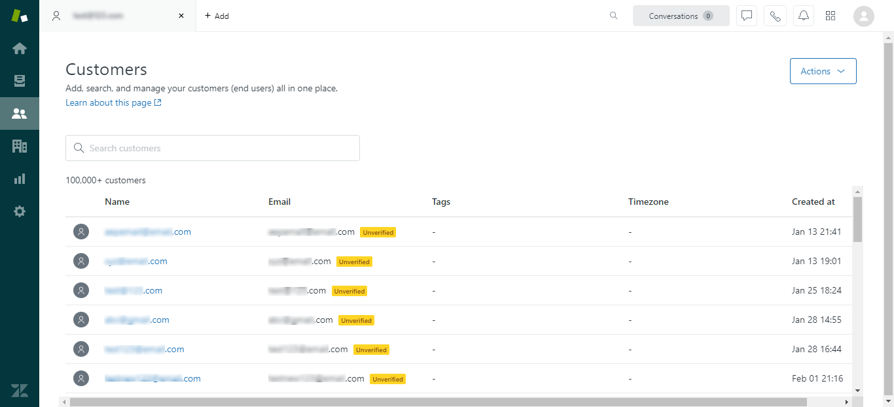

# (Beta) Maak een [!DNL Zendesk] bronverbinding in de gebruikersinterface

>[!NOTE]
>
>De [!DNL Zendesk] De bron is in bèta. Zie de [overzicht van bronnen](../../../../home.md#terms-and-conditions) voor meer informatie over het gebruik van bronnen met een bètalabel.

Deze zelfstudie bevat stappen voor het maken van een [!DNL Zendesk] bronverbinding via de Adobe Experience Platform-gebruikersinterface.

## Aan de slag

Deze zelfstudie vereist een goed begrip van de volgende onderdelen van Adobe Experience Platform:

* [[!DNL Experience Data Model (XDM)] Systeem](../../../../../xdm/home.md): Het gestandaardiseerde kader waardoor [!DNL Experience Platform] organiseert de gegevens van de klantenervaring.
   * [Basisbeginselen van de schemacompositie](../../../../../xdm/schema/composition.md): Leer over de basisbouwstenen van schema&#39;s XDM, met inbegrip van zeer belangrijke principes en beste praktijken in schemacompositie.
   * [Zelfstudie Schema Editor](../../../../../xdm/tutorials/create-schema-ui.md): Leer hoe te om douaneschema&#39;s tot stand te brengen gebruikend de Redacteur UI van het Schema.
* [[!DNL Real-time Customer Profile]](../../../../../profile/home.md): Verstrekt een verenigd, real-time consumentenprofiel dat op bijeengevoegde gegevens van veelvoudige bronnen wordt gebaseerd.

### Vereiste referenties verzamelen

Om toegang te krijgen tot uw [!DNL Zendesk] account op Platform, moet u waarden opgeven voor de volgende referenties:

| Credentials | Beschrijving | Voorbeeld |
| --- | --- | --- |
| Subdomein | Het unieke domein dat specifiek is voor uw account dat tijdens het registratieproces is gemaakt. | `yoursubdomain` |
| Toegangstoken | Zendesk API-token. | `0lZnClEvkJSTQ7olGLl7PMhVq99gu26GTbJtf` |

Voor meer informatie over het verifiëren van uw [!DNL Zendesk] bron, zie [[!DNL Zendesk] bronoverzicht](../../../../connectors/customer-success/zendesk.md).

### Een Platform maken voor [!DNL Zendesk]

Voordat u een [!DNL Zendesk] bronverbinding, moet u ook ervoor zorgen dat u eerst een schema van het Platform aan gebruik voor uw bron creeert. Zie de zelfstudie aan [een Platform-schema maken](../../../../../xdm/schema/composition.md) voor uitgebreide stappen over hoe te om een schema tot stand te brengen.

Voor aanvullende informatie over uw [!DNL Zendesk] schema vereist voor het [!DNL Zendesk Search API], verwijst u naar de [limieten](#limits) hieronder.

## Verbind uw [!DNL Zendesk] account

Selecteer in de gebruikersinterface van het Platform de optie **[!UICONTROL Sources]** van de linkernavigatiebalk voor toegang tot de [!UICONTROL Sources] werkruimte. De [!UICONTROL Catalog] in het scherm worden diverse bronnen weergegeven waarmee u een account kunt maken.

U kunt de juiste categorie selecteren in de catalogus aan de linkerkant van het scherm. U kunt ook de specifieke bron vinden waarmee u wilt werken met de zoekoptie.

Onder de *Klant geslaagd* categorie, selecteert u **[!UICONTROL Zendesk]** en selecteer vervolgens **[!UICONTROL Add data]**.

De **[!UICONTROL Connect Zendesk account]** wordt weergegeven. Op deze pagina kunt u nieuwe of bestaande referenties gebruiken.

### Bestaande account

Als u een bestaande account wilt gebruiken, selecteert u de optie *Zendesk* account waarmee u een nieuwe gegevensstroom wilt maken, selecteert u **[!UICONTROL Next]** om verder te gaan.

### Nieuwe account

Als u een nieuwe account maakt, selecteert u **[!UICONTROL New account]** en geef vervolgens een naam, een optionele beschrijving en uw referenties op. Als u klaar bent, selecteert u **[!UICONTROL Connect to source]** en laat dan wat tijd voor de nieuwe verbinding tot stand brengen.

### Gegevens selecteren

Zodra uw bron voor authentiek wordt verklaard, werkt de pagina in een interactieve schemaboom bij die u toestaat om de hiërarchie van uw gegevens te onderzoeken en te inspecteren. Selecteren **[!UICONTROL Next]** om verder te gaan.

## Volgende stappen

Aan de hand van deze zelfstudie hebt u een bronverbinding tussen uw [!DNL Zendesk] account en Platform. U kunt nu verdergaan met de volgende zelfstudie en [een gegevensstroom maken om gegevens over klantsucces in Platform te brengen](../../dataflow/customer-success.md).

## Aanvullende bronnen

In de volgende secties vindt u aanvullende bronnen waarnaar u kunt verwijzen wanneer u de [!DNL Zendesk] bron.

### Validatie {#validation}

De volgende contourstappen die u kunt uitvoeren om te controleren of de verbinding met uw [!DNL Zendesk] bron en [!DNL Zendesk] worden opgenomen in het Platform.

Selecteer in de gebruikersinterface van het Platform de optie **[!UICONTROL Datasets]** van de linkernavigatie om tot [!UICONTROL Datasets] werkruimte. De [!UICONTROL Dataset Activity] worden de details van uitvoeringen weergegeven.

Vervolgens selecteert u de uitvoerings-id van de gegevensstroom die u wilt weergeven voor specifieke details over de gegevensstroom die wordt uitgevoerd.

Tot slot selecteert u **[!UICONTROL Preview dataset]** om de gegevens weer te geven die zijn ingevoerd.

U kunt ook de gegevens van uw Platform vergelijken met de gegevens op uw [!DNL Zendesk] > [!DNL Customers] pagina.

### Zendesk-schema

In de onderstaande tabel staan de ondersteunde toewijzingen die moeten worden ingesteld voor Zendesk.

>[!TIP]
>
>Zie [Zendesk Search API > Export Search Results](https://developer.zendesk.com/api-reference/ticketing/ticket-management/search/#export-search-results) voor meer informatie over de API.

| Bron | Type |
|---|---|
| `results.active` | Boolean |
| `results.alias` | Tekenreeks |
| `results.created_at` | Tekenreeks |
| `results.custom_role_id` | Geheel |
| `results.default_group_id` | Geheel |
| `results.details` | Tekenreeks |
| `results.email` | Tekenreeks |
| `results.external_id` | Geheel |
| `results.iana_time_zone` | Tekenreeks |
| `results.id` | Geheel |
| `results.last_login_at` | Tekenreeks |
| `results.locale` | Tekenreeks |
| `results.locale_id` | Geheel |
| `results.moderator` | Boolean |
| `results.name` | Tekenreeks |
| `results.notes` | Tekenreeks |
| `results.only_private_comments` | Boolean |
| `results.organization_id` | Geheel |
| `results.phone` | Tekenreeks |
| `results.photo` | Tekenreeks |
| `results.report_csv` | Boolean |
| `results.restricted_agent` | Boolean |
| `results.result_type` | Tekenreeks |
| `results.role` | Tekenreeks |
| `results.role_type` | Geheel |
| `results.shared` | Boolean |
| `results.shared_agent` | Boolean |
| `results.shared_phone_number` | Boolean |
| `results.signature` | Tekenreeks |
| `results.suspended` | Boolean |
| `results.ticket_restriction` | Tekenreeks |
| `results.time_zone` | Tekenreeks |
| `results.two_factor_auth_enabled` | Boolean |
| `results.updated_at` | Tekenreeks |
| `results.url` | Tekenreeks |
| `results.verified` | Boolean |

{style=&quot;table-layout:auto&quot;}

### Limieten {#limits}

* De [Zendesk Search API > Export Search Results](https://developer.zendesk.com/api-reference/ticketing/ticket-management/search/#export-search-results) retourneert maximaal 1000 records per pagina.
   * De waarde voor de ``filter[type]`` parameter is ingesteld op ``user`` en dus retourneert de Zendesk-verbinding alleen gebruikers.
   * Het aantal resultaten per pagina wordt beheerd door de ``page[size]`` parameter. De waarde is ingesteld op ``100``. Dit wordt gedaan om de impact van de door Zendesk vastgestelde snelheidsbeperkingen te verminderen.
   * Zie [Limieten](https://developer.zendesk.com/api-reference/ticketing/ticket-management/search/#limits) en [Paginering](https://developer.zendesk.com/api-reference/ticketing/ticket-management/search/#pagination-1).
   * U kunt ook verwijzen naar [Pagineren door lijsten met cursorpaginering](https://developer.zendesk.com/documentation/developer-tools/pagination/paginating-through-lists-using-cursor-pagination/).
