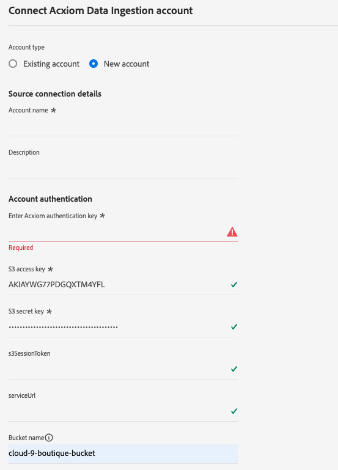

# Een [!DNL Acxiom Data Ingestion] bronverbinding en gegevensstroom maken in de gebruikersinterface

Gebruik de [!DNL Acxiom Data Ingestion] -bron om [!DNL Acxiom] -gegevens in te voeren in Real-Time Customer Data Platform en om eerstelijns-profielen te verrijken. Vervolgens kunt u met uw [!DNL Acxiom] verrijkte first-party-profielen het publiek verbeteren en activeren via verschillende marketingkanalen.

Lees deze zelfstudie om te leren hoe u een [!DNL Acxiom Data Ingestion] bronverbinding en gegevensstroom maakt via de Adobe Experience Platform-gebruikersinterface. De [!DNL Acxiom Data Ingestion] -bron wordt gebruikt om reacties op te halen en toe te wijzen van de [!DNL Acxiom] -verbeteringsservice waarbij Amazon S3 wordt gebruikt als neerzetpunt.

## Vereisten {#prerequisites}

Deze zelfstudie vereist een goed begrip van de volgende onderdelen van Experience Platform:

* [[!DNL Experience Data Model (XDM)]  Systeem &#x200B;](../../../../../xdm/home.md): Het gestandaardiseerde kader waardoor Experience Platform gegevens van de klantenervaring organiseert.
   * [&#x200B; Grondbeginselen van schemacompositie &#x200B;](../../../../../xdm/schema/composition.md): Leer over de basisbouwstenen van schema&#39;s XDM, met inbegrip van zeer belangrijke principes en beste praktijken in schemacompositie.
   * [&#x200B; het leerprogramma van de Redacteur van het Schema &#x200B;](../../../../../xdm/tutorials/create-schema-ui.md): Leer hoe te om douaneschema&#39;s tot stand te brengen gebruikend de Redacteur UI van het Schema.
* [[!DNL Real-Time Customer Profile]](../../../../../profile/home.md): biedt een uniform, real-time consumentenprofiel dat is gebaseerd op geaggregeerde gegevens van meerdere bronnen.

### Vereiste referenties verzamelen

Als u toegang wilt tot uw emmertje op Experience Platform, moet u geldige waarden opgeven voor de volgende referenties:

| Credentials | Beschrijving |
| --- | --- |
| [!DNL Acxiom] verificatiesleutel | De verificatiesleutel. U kunt deze waarde ophalen van het team van [!DNL Acxiom] . |
| [!DNL Amazon S3] toegangstoets | De toegangs belangrijkste identiteitskaart voor uw emmer. U kunt deze waarde ophalen van het team van [!DNL Acxiom] . |
| [!DNL Amazon S3] geheime sleutel | De geheime sleutel-id voor uw emmer. U kunt deze waarde ophalen van het team van [!DNL Acxiom] . |
| Naam van emmertje | Dit is uw emmertje waar de dossiers zullen worden gedeeld. U kunt deze waarde ophalen van het team van [!DNL Acxiom] . |

>[!IMPORTANT]
>
>U moet zowel **[!UICONTROL View Sources]** - als **[!UICONTROL Manage Sources]** -machtigingen hebben ingeschakeld voor uw account om uw [!DNL Acxiom] -account te kunnen verbinden met Experience Platform. Neem contact op met de productbeheerder om de benodigde machtigingen te verkrijgen. Voor meer informatie, lees de [&#x200B; gids UI van de toegangscontrole &#x200B;](../../../../../access-control/ui/overview.md).

## Sluit uw [!DNL Acxiom] -account aan

Selecteer in de gebruikersinterface van Experience Platform de optie **[!UICONTROL Sources]** in de linkernavigatiebalk voor toegang tot de werkruimte van [!UICONTROL Sources] . In het scherm [!UICONTROL Catalog] worden diverse bronnen weergegeven waarmee u een account kunt maken.

U kunt de juiste categorie selecteren in de catalogus aan de linkerkant van het scherm. U kunt ook de specifieke bron vinden waarmee u wilt werken met de zoekoptie.

Selecteer onder de categorie **[!UICONTROL Data & Identity Partners]** de optie **[!UICONTROL Acxiom Data Ingestion]** en selecteer vervolgens **[!UICONTROL Set up]** .

>[!TIP]
>
>Een bronkaart die **[!UICONTROL Add data]** weergeeft, houdt in dat de bron al een geverifieerd account heeft. Een bronkaart die **[!UICONTROL Set up]** weergeeft, betekent daarentegen dat u aanmeldingsgegevens moet opgeven en een nieuwe account moet maken om die bron te kunnen gebruiken.

### Een nieuwe account maken

Selecteer **[!UICONTROL New account]** als u nieuwe referenties gebruikt. Geef in het invoerformulier dat wordt weergegeven een naam, een optionele beschrijving en uw [!DNL Acxiom] -gegevens op. Als u klaar bent, selecteert u **[!UICONTROL Connect to source]** en laat u de nieuwe verbinding enige tijd tot stand brengen.

| Credentials | Beschrijving |
| --- | --- |
| Accountnaam | De naam van de account. |
| Beschrijving | (Optioneel) Een korte toelichting van het doel van de rekening. |
| [!DNL Acxiom] verificatiesleutel | De door [!DNL Acxiom] opgegeven sleutel die is vereist voor accountgoedkeuring. Dit moet overeenkomen met de juiste waarde voordat een verbinding met de database tot stand kan worden gebracht.  Deze sleutel moet 24 tekens lang zijn en mag alleen bestaan uit: A-Z, a-z en 0-9. |
| S3-toegangstoets | De S3 toegangstoets verwijst naar de Amazon S3 locatie. Dit wordt verstrekt door uw beheerder wanneer de S3 roltoestemmingen worden bepaald. |
| S3, geheime sleutel | De geheime sleutel S3 verwijst naar de plaats van Amazon S3. Dit wordt verstrekt door uw beheerder wanneer de S3 roltoestemmingen worden bepaald. |
| s3SessionToken | (Optioneel) De waarde van het verificatietoken bij verbinding met S3. |
| serviceUrl | (Optioneel) De URL-locatie die moet worden gebruikt wanneer verbinding wordt gemaakt met S3 op een niet-standaardlocatie. |
| Naam van emmertje | (Optioneel) De naam van het S3-emmertje dat is ingesteld op S3 en dat fungeert als beginpad voor gegevensselectie. |
| Mappad | Als submappen in een emmertje worden gebruikt, kunt u ook een pad opgeven als beginpad in de gegevensselectie. |

### Een bestaande account gebruiken

Selecteer **[!UICONTROL Existing account]** als u een bestaande account wilt gebruiken.

Selecteer een account in de lijst om details over dat account weer te geven. Nadat u een account hebt geselecteerd, selecteert u **[!UICONTROL Next]** om door te gaan.

## Gegevens selecteren

Selecteer het bestand dat u wilt opnemen in het gewenste emmertje en de gewenste submap. U kunt een voorbeeld van de gegevens weergeven wanneer het scheidingsteken en het compressietype zijn gedefinieerd. Nadat u het bestand hebt geselecteerd, selecteert u **[!UICONTROL Next]** om door te gaan.

>[!NOTE]
>
>Hoewel de bestandstypen JSON en Parquet worden vermeld, is het niet vereist of verwacht dat u deze zult gebruiken tijdens de [!DNL Acxiom] -bronworkflow.

## Gegevensset en gegevens over gegevensstroom opgeven

Daarna, moet u informatie betreffende uw dataset en uw gegevensstroom verstrekken.

### Gegevens over gegevensset

>[!BEGINTABS]

>[!TAB  Gebruik een nieuwe dataset ]

Een dataset is een opslag en beheersconstructie voor een inzameling van gegevens, typisch een lijst, die een schema (kolommen) en gebieden (rijen) bevat. De gegevens die met succes in Experience Platform worden opgenomen worden voortgeduurd binnen het gegevensmeer als datasets. Selecteer **[!UICONTROL New dataset]** als u een nieuwe gegevensset wilt gebruiken.

| Nieuwe gegevens gegevensset | Beschrijving |
| --- | --- |
| Naam uitvoergegevensset | De naam van de nieuwe dataset. |
| Beschrijving | (Optioneel) Een korte toelichting van het doel van de gegevensset. |
| Schema | Een vervolgkeuzelijst met schema&#39;s die in uw organisatie bestaan. U kunt ook uw eigen schema vóór het proces van de bronconfiguratie maken. Voor meer informatie, lees de gids op [&#x200B; creërend schema in UI &#x200B;](../../../../../xdm/tutorials/create-schema-ui.md). |

>[!TAB  Gebruik een bestaande dataset ]

Selecteer **[!UICONTROL Existing dataset]** als u een bestaande gegevensset wilt gebruiken.

U kunt **[!UICONTROL Advanced search]** selecteren om een venster van alle datasets te bekijken uw organisatie, met inbegrip van hun respectieve details zoals of zij voor opname aan het Profiel van de Klant in real time worden toegelaten.

>[!ENDTABS]

+++Selecteer deze optie als u de stappen voor het inschakelen van profielopname, foutdiagnose en gedeeltelijke inname wilt uitvoeren.

Als uw dataset voor het Profiel van de Klant in real time wordt toegelaten, dan tijdens deze stap, kunt u **[!UICONTROL Profile dataset]** van een knevel voorzien om uw gegevens voor Profiel-opname toe te laten. U kunt deze stap ook gebruiken om **[!UICONTROL Error diagnostics]** en **[!UICONTROL Partial ingestion]** in te schakelen.

* **[!UICONTROL Error diagnostics]**: Selecteer **[!UICONTROL Error diagnostics]** om de bron de instructie te geven foutdiagnostiek te produceren waarnaar u later kunt verwijzen bij het controleren van de gegevenssetactiviteit en de status van de gegevensstroom.
* **[!UICONTROL Partial ingestion]**: Gedeeltelijke batch-opname is de mogelijkheid om gegevens met fouten in te voeren tot een bepaalde configureerbare drempel. Met deze functie kunt u al uw nauwkeurige gegevens in Experience Platform opnemen, terwijl al uw onjuiste gegevens afzonderlijk worden opgeslagen met informatie over waarom deze niet geldig zijn.

+++

### Gegevens gegevensstroom

Zodra uw dataset wordt gevormd, moet u details op uw gegevensstroom, met inbegrip van een naam, een facultatieve beschrijving, en waakzame configuraties dan verstrekken.

| Dataflow-configuraties | Beschrijving |
| --- | --- |
| Naam gegevensstroom | De naam van de gegevensstroom.  Standaard wordt hiervoor de naam gebruikt van het bestand dat wordt geïmporteerd. |
| Beschrijving | (Optioneel) Een korte beschrijving van uw gegevensstroom. |
| Waarschuwingen | Experience Platform kan op gebeurtenissen gebaseerde waarschuwingen produceren waarop gebruikers zich kunnen abonneren. Deze opties zijn allemaal een doorlopende gegevensstroom om deze waarschuwingen te activeren.  Voor meer informatie, lees het [&#x200B; alarm overzicht &#x200B;](../../alerts.md) <ul><li>**het Begin van de Looppas van Bronnen Dataflow**: Selecteer dit alarm om een bericht te ontvangen wanneer uw dataflow looppas begint.</li><li>**Bronnen Dataflow de Succes van de Looppas**: Selecteer dit alarm om een bericht te ontvangen als uw dataflow zonder enige fouten beëindigt.</li><li>**de Uitval van de Looppas van Gegevensstroom van Bronnen**: Selecteer dit alarm om een bericht te ontvangen als uw dataflow looppas met om het even welke fouten beëindigt.</li></ul> |

## Toewijzing

Gebruik de toewijzingsinterface om uw brongegevens toe te wijzen aan de aangewezen schemagebieden alvorens gegevens aan Experience Platform in te voeren.  Voor meer informatie, lees de [&#x200B; kaartgids in UI &#x200B;](../../../../../data-prep/ui/mapping.md)

## Plaats uw gegevensstroomopname

Daarna, gebruik de het plannen interface om het innameprogramma van uw dataflow te bepalen.

| Configuratie plannen | Beschrijving |
| --- | --- |
| Frequentie | Vorm frequentie om erop te wijzen hoe vaak dataflow zou moeten lopen. U kunt de frequentie instellen op: <ul><li>**Eenmaal**: Plaats uw frequentie aan `once` om eenmalig te creëren. Configuraties voor interval en backfill zijn niet beschikbaar wanneer u een eenmalige gegevensstroom maakt. Standaard wordt de planningsfrequentie ingesteld op één keer.</li><li>**Minuut**: Plaats uw frequentie aan `minute` om uw gegevensstroom te plannen om gegevens op een per-minieme basis in te voeren.</li><li>**Uur**: Plaats uw frequentie aan `hour` om uw gegevensstroom te plannen om gegevens op een per-uurbasis in te voeren.</li><li>**Dag**: Plaats uw frequentie aan `day` om uw gegevensstroom te plannen om gegevens op een per-dagbasis in te voeren.</li><li>**Week**: Plaats uw frequentie aan `week` om uw gegevensstroom te plannen om gegevens op een per-weekbasis in te voeren.</li></ul> |
| Interval | Zodra u een frequentie selecteert, kunt u het interval dat dan vormen om het tijdkader tussen elke opname te vestigen. Bijvoorbeeld, als u uw frequentie aan dag plaatst en het interval aan 15 vormt, dan zal uw dataflow om de 15 dagen lopen. U kunt het interval niet instellen op nul. De minimaal toegestane intervalwaarde voor elke frequentie is als volgt:<ul><li>**Eenmaal**: n/a</li><li>**Minuut**: 15</li><li>**Uur**: 1</li><li>**Dag**: 1</li><li>**Week**: 1</li></ul> |
| Begintijd | Het tijdstempel voor de geprojecteerde run, weergegeven in UTC-tijdzone. |
| Achtergrond | Met Backfill wordt bepaald welke gegevens in eerste instantie worden ingevoerd. Als backfill is ingeschakeld, worden alle huidige bestanden in het opgegeven pad tijdens de eerste geplande inname opgenomen. Als terugvullen is uitgeschakeld, worden alleen de bestanden opgenomen die tussen de eerste opname en de begintijd worden geladen. Bestanden die vóór de begintijd zijn geladen, worden niet opgenomen. |

## Controleer uw gegevensstroom

Gebruik de overzichtspagina voor een samenvatting van uw gegevensstroom voorafgaand aan opname. De details worden gegroepeerd in de volgende categorieën:

* **Verbinding** - toont het brontype, de relevante weg van het gekozen brondossier, en het aantal kolommen binnen dat brondossier.
* **wijst dataset en kaartgebieden** toe - toont welke dataset de brongegevens in, met inbegrip van het schema worden opgenomen dat de dataset aan voldoet.
* **Plannend** - toont die actieve periode, frequentie, en interval van het innameprogramma.
Nadat u de gegevensstroom hebt gereviseerd, klikt u op Voltooien en wacht u enige tijd tot de gegevensstroom is gemaakt.

## Volgende stappen

Aan de hand van deze zelfstudie hebt u een gegevensstroom gemaakt om batchgegevens van uw [!DNL Acxiom] -bron naar Experience Platform te verzenden. Voor extra bronnen raadpleegt u de documentatie die hieronder wordt beschreven.

### Uw gegevensstroom controleren

Zodra uw gegevensstroom is gecreeerd, kunt u de gegevens controleren die door het worden opgenomen om informatie over innamesnelheden, succes, en fouten te bekijken. Voor meer informatie over hoe te om dataflow te controleren, bezoek het leerprogramma op [&#x200B; controlerekeningen en dataflows in UI &#x200B;](../../../../../dataflows/ui/monitor-sources.md).

### Uw gegevensstroom bijwerken

Om configuraties voor uw dataflows bij te werken die, afbeelding, en algemene informatie plannen, bezoek het leerprogramma op [&#x200B; bijwerken brondataflows in UI &#x200B;](../../update-dataflows.md).

### Uw gegevensstroom verwijderen

U kunt gegevensstromen verwijderen die niet meer nodig zijn of die onjuist zijn gemaakt met de functie **[!UICONTROL Delete]** die beschikbaar is in de **[!UICONTROL Dataflows]** -werkruimte. Voor meer informatie over hoe te om dataflows te schrappen, bezoek het leerprogramma bij [&#x200B; het schrappen van dataflows in UI &#x200B;](../../delete.md).

## Aanvullende bronnen {#additional-resources}

Voor meer informatie, lees [[!DNL Acxiom]  InfoBase &#x200B;](https://www.acxiom.com/wp-content/uploads/2022/02/fs-acxiom-infobase_AC-0268-22.pdf).
