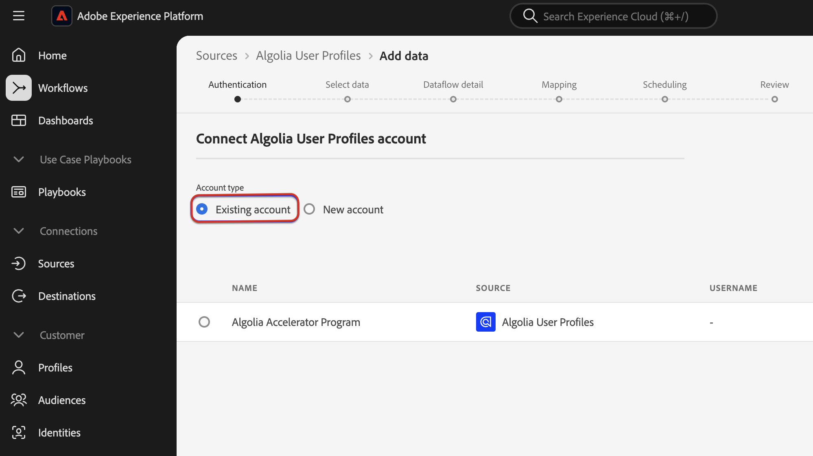
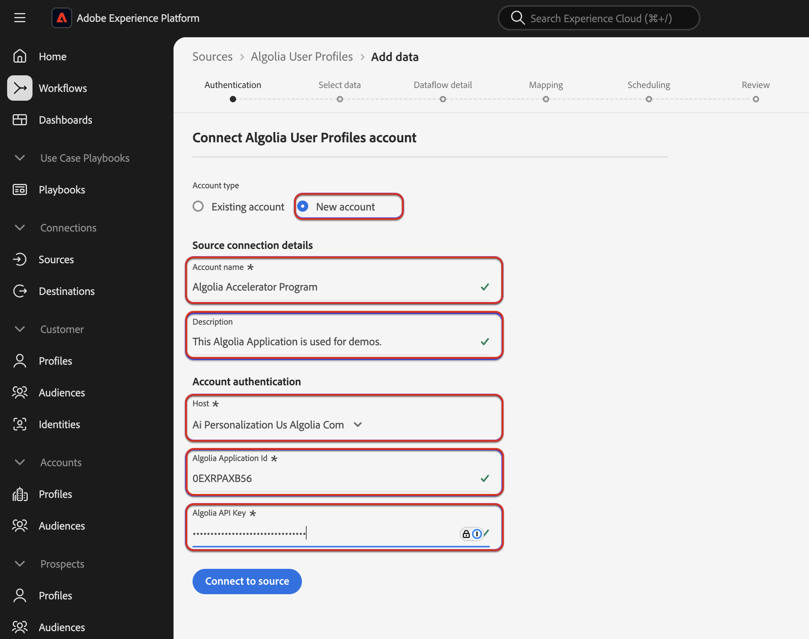
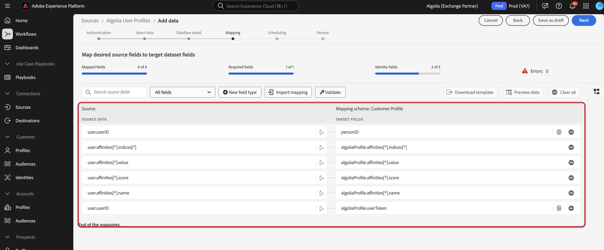

# Gegevens [!DNL Algolia User Profiles] aan Experience Platform toevoegen met de gebruikersinterface

Lees deze zelfstudie om te leren hoe u via de gebruikersinterface betalingsgegevens van uw [!DNL Algolia User Profiles] -account aan Adobe Experience Platform kunt toevoegen.

## Aan de slag

>[!IMPORTANT]
>
>Alvorens begonnen te worden, zorg ervoor dat u de in de eerste plaats vereiste stappen voltooit die in het [[!DNL Algolia User Profiles]  overzicht ](../../../../connectors/data-partners/algolia-user-profiles.md#prerequisites) worden geschetst.

Deze zelfstudie vereist een goed begrip van de volgende onderdelen van Experience Platform:

* [[!DNL Experience Data Model (XDM)]  Systeem ](../../../../../xdm/home.md): Het gestandaardiseerde kader waardoor Experience Platform gegevens van de klantenervaring organiseert.
   * [ Grondbeginselen van schemacompositie ](../../../../../xdm/schema/composition.md): Leer over de basisbouwstenen van schema&#39;s XDM, met inbegrip van zeer belangrijke principes en beste praktijken in schemacompositie.
   * [ het leerprogramma van de Redacteur van het Schema ](../../../../../xdm/tutorials/create-schema-ui.md): Leer hoe te om douaneschema&#39;s tot stand te brengen gebruikend de Redacteur UI van het Schema.
* [[!DNL Real-Time Customer Profile]](../../../../../profile/home.md): biedt een uniform, real-time consumentenprofiel dat is gebaseerd op geaggregeerde gegevens van meerdere bronnen.
* [ Bronnen ](../../../../home.md): Experience Platform staat gegevens toe om van diverse bronnen worden opgenomen terwijl het voorzien van u van de capaciteit om, inkomende gegevens te structureren te etiketteren en te verbeteren gebruikend de diensten van Experience Platform.

### Vereiste referenties verzamelen

Als u [!DNL Algolia] wilt verbinden met Experience Platform, moet u waarden opgeven voor de volgende referenties:

| Credentials | Beschrijving |
| --- | --- |
| Toepassings-id | De toepassings-id van [!DNL Algolia] is een unieke id die is toegewezen aan uw [!DNL Algolia] -account. |
| API-sleutel | De API-sleutel van [!DNL Algolia] is een referentie die wordt gebruikt voor het verifiëren en autoriseren van API-aanvragen voor de zoek- en indexservices van [!DNL Algolia] . |

Voor meer informatie over deze geloofsbrieven, zie [!DNL Algolia] [ authentificatiedocumentatie ](https://www.algolia.com/doc/tools/cli/get-started/authentication/).

## Sluit uw [!DNL Algolia] -account aan

Selecteer in de gebruikersinterface van Experience Platform de optie **[!UICONTROL Sources]** in de linkernavigatie voor toegang tot de werkruimte van *[!UICONTROL Sources]* . U kunt de juiste categorie selecteren in het deelvenster *[!UICONTROL Categories]* . U kunt ook de zoekbalk gebruiken om naar de specifieke bron te navigeren die u wilt gebruiken.

Als u [!DNL Algolia] wilt gebruiken, selecteert u de **[!UICONTROL Algolia]** bronkaart onder *[!UICONTROL Data & Identity Partners]* en selecteert u vervolgens **[!UICONTROL Set up]** .

>[!TIP]
>
>Bronnen in de catalogus met bronnen geven de optie **[!UICONTROL Set up]** weer wanneer een bepaalde bron nog geen geverifieerde account heeft. Zodra een geverifieerd account bestaat, verandert deze optie in **[!UICONTROL Add data]** .

## Verificatie

### Een bestaande account gebruiken

Als u een bestaande account wilt gebruiken, selecteert u **[!UICONTROL Existing account]** en vervolgens de [!DNL Algolia User Profiles] -account die u wilt gebruiken. Selecteer **[!UICONTROL Next]** om door te gaan.

### Een nieuwe account maken

Als u een nieuwe account maakt, selecteert u **[!UICONTROL New account]** en geeft u vervolgens een naam, een optionele beschrijving en [!DNL Algolia] referenties. Als u klaar bent, selecteert u **[!UICONTROL Connect to source]** en laat u de nieuwe verbinding enige tijd tot stand brengen.

## Gegevens toevoegen

Nadat u uw [!DNL Algolia User Profiles] -account hebt gemaakt, wordt de stap **[!UICONTROL Add data]** weergegeven. Deze stap bevat een interface waarmee u uw [!DNL Algolia] -gebruikersprofielen kunt verkennen die u naar Experience Platform wilt verzenden.

* Het linkergedeelte van de interface is dat u optionele velden **[!UICONTROL Indices]** en **[!UICONTROL Affinity(s)]** invoert.
* In het rechtergedeelte van de interface kunt u maximaal 100 rijen gebruikersprofielen voorvertonen.

Selecteer **[!UICONTROL Next]** als u klaar bent met het selecteren en voorvertonen van uw gegevens voor opname.

## Gegevens over gegevensstroom opgeven

Als u een bestaande dataset gebruikt, selecteer een dataset die met een schema wordt geassocieerd dat de [!DNL Algolia Profile] Groep van het Gebied gebruikt.

Als u een nieuwe dataset creeert, selecteer een schema dat de [!DNL Algolia Profile] gebiedsgroep gebruikt die in de toewijzingsstap wordt vereist.

## Gegevensvelden toewijzen aan een XDM-schema

Gebruik de toewijzingsinterface om uw brongegevens toe te wijzen aan de aangewezen schemagebieden alvorens gegevens aan Experience Platform in te voeren.  Voor meer informatie, lees de [ kaartgids in UI ](../../../../../data-prep/ui/mapping.md).

## Planninguitvoering

Daarna, gebruik de het plannen interface om het innameprogramma van uw dataflow te bepalen.

<!-- The Scheduling step allows for configuration of the data/time to execute the [!DNL Algolia Uer Profiles] Source connector. There is configuration to backfill the data from [!DNL Algolia] which will pull all the profiles from the source system.  If the source is scheduled, then it will retrieve modified profiles from the [!DNL Algolia] based on the configured time interval. -->

| Configuratie plannen | Beschrijving |
| --- | --- |
| Frequentie | Vorm frequentie om erop te wijzen hoe vaak dataflow zou moeten lopen. U kunt de frequentie instellen op: <ul><li>**Eenmaal**: Plaats uw frequentie aan `once` om eenmalig te creëren. Configuraties voor interval en backfill zijn niet beschikbaar wanneer u een eenmalige gegevensstroom maakt. Standaard wordt de planningsfrequentie ingesteld op één keer.</li><li>**Minuut**: Plaats uw frequentie aan `minute` om uw gegevensstroom te plannen om gegevens op een per-minieme basis in te voeren.</li><li>**Uur**: Plaats uw frequentie aan `hour` om uw gegevensstroom te plannen om gegevens op een per-uurbasis in te voeren.</li><li>**Dag**: Plaats uw frequentie aan `day` om uw gegevensstroom te plannen om gegevens op een per-dagbasis in te voeren.</li><li>**Week**: Plaats uw frequentie aan `week` om uw gegevensstroom te plannen om gegevens op een per-weekbasis in te voeren.</li></ul> |
| Interval | Zodra u een frequentie selecteert, kunt u het interval dat dan vormen om het tijdkader tussen elke opname te vestigen. Bijvoorbeeld, als u uw frequentie aan dag plaatst en het interval aan 15 vormt, dan zal uw dataflow om de 15 dagen lopen. U kunt het interval niet instellen op nul. De minimaal toegestane intervalwaarde voor elke frequentie is als volgt:<ul><li>**Eenmaal**: n/a</li><li>**Minuut**: 15</li><li>**Uur**: 1</li><li>**Dag**: 1</li><li>**Week**: 1</li></ul> |
| Begintijd | Het tijdstempel voor de geprojecteerde run, weergegeven in UTC-tijdzone. |
| Achtergrond | Met Backfill wordt bepaald welke gegevens in eerste instantie worden ingevoerd. Als backfill is ingeschakeld, worden alle huidige bestanden in het opgegeven pad tijdens de eerste geplande inname opgenomen. Als terugvullen is uitgeschakeld, worden alleen de bestanden opgenomen die tussen de eerste opname en de begintijd worden geladen. Bestanden die vóór de begintijd zijn geladen, worden niet opgenomen. |

## Controleer uw gegevensstroom

Gebruik de overzichtspagina voor een samenvatting van uw gegevensstroom voorafgaand aan opname. De details worden gegroepeerd in de volgende categorieën:

* **Verbinding** - toont het brontype, de relevante weg van het gekozen brondossier, en het aantal kolommen binnen dat brondossier.
* **wijst dataset en kaartgebieden** toe - toont welke dataset de brongegevens in, met inbegrip van het schema worden opgenomen dat de dataset aan voldoet.
* **Plannend** - toont die actieve periode, frequentie, en interval van het innameprogramma.

Nadat u de gegevensstroom hebt gereviseerd, selecteert u **[!UICONTROL Finish]** en laat u enige tijd over om de gegevensstroom te maken.

## Volgende stappen

Aan de hand van deze zelfstudie hebt u een gegevensstroom gemaakt om intentgegevens van uw [!DNL Algolia] -bron naar Experience Platform te verzenden. Voor extra bronnen raadpleegt u de documentatie die hieronder wordt beschreven.

### Uw gegevensstroom controleren

Zodra uw gegevensstroom is gecreeerd, kunt u de gegevens controleren die door het worden opgenomen om informatie over innamesnelheden, succes, en fouten te bekijken. Voor meer informatie over hoe te om dataflow te controleren, bezoek het leerprogramma op [ controlerekeningen en dataflows in UI ](../../../../../dataflows/ui/monitor-sources.md).

### Uw gegevensstroom bijwerken

Om configuraties voor uw dataflows bij te werken die, afbeelding, en algemene informatie plannen, bezoek het leerprogramma op [ bijwerken brondataflows in UI ](../../update-dataflows.md).

### Uw gegevensstroom verwijderen

U kunt gegevensstromen verwijderen die niet meer nodig zijn of die onjuist zijn gemaakt met de functie **[!UICONTROL Delete]** die beschikbaar is in de **[!UICONTROL Dataflows]** -werkruimte. Voor meer informatie over hoe te om dataflows te schrappen, bezoek het leerprogramma bij [ het schrappen van dataflows in UI ](../../delete.md).
