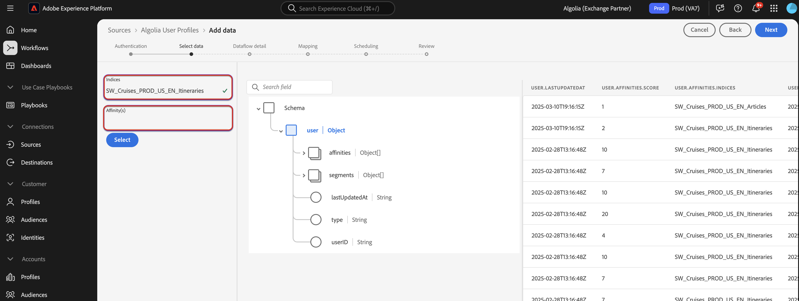
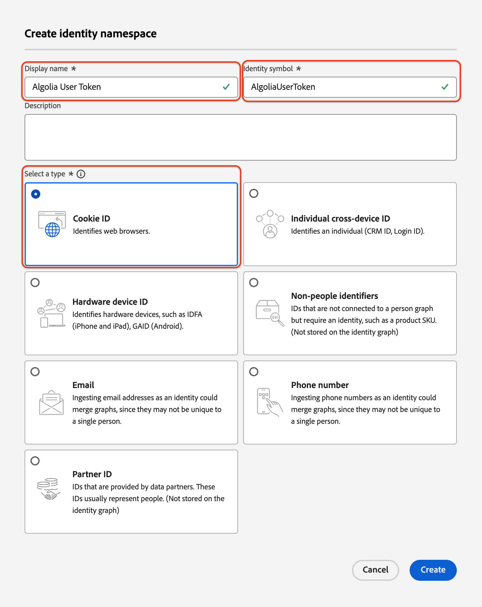

# [!DNL Algolia User Profiles] -gegevens in Experience Platform opnemen met de gebruikersinterface

Deze zelfstudie begeleidt u door via de gebruikersinterface gegevens van uw [!DNL Algolia User Profiles] -account op te nemen in Adobe Experience Platform.

## Aan de slag

>[!IMPORTANT]
>
>Alvorens u begint, zorg ervoor u de eerste vereisten hebt voltooid die in het [[!DNL Algolia User Profiles]  overzicht ](../../../../connectors/data-partners/algolia-user-profiles.md#prerequisites) worden geschetst.

In deze zelfstudie wordt vertrouwd gemaakt met de volgende Experience Platform-componenten:

* [[!DNL Experience Data Model (XDM)]  Systeem ](../../../../../xdm/home.md): Het gestandaardiseerde kader Experience Platform gebruikt om de gegevens van de klantenervaring te organiseren.

   * [ Grondbeginselen van schemacompositie ](../../../../../xdm/schema/composition.md): Leer over schemacompositie, met inbegrip van zeer belangrijke principes en beste praktijken.
   * [ het leerprogramma van de Redacteur van het Schema ](../../../../../xdm/tutorials/create-schema-ui.md): Leer hoe te om douaneschema&#39;s tot stand te brengen gebruikend de Redacteur UI van het Schema.
* [[!DNL Real-Time Customer Profile]](../../../../../profile/home.md): Een verenigd, real-time klantprofiel dat is gebaseerd op geaggregeerde gegevens van meerdere bronnen.
* [ Bronnen ](../../../../home.md): Samenvatting gegevens uit diverse bronnen en gebruik de diensten van Experience Platform om de gegevens te structureren, te etiketteren en te verbeteren.

### Vereiste referenties verzamelen

Geef de volgende gegevens op als u [!DNL Algolia] wilt verbinden met Adobe Experience Platform:

| Credentials | Beschrijving |
| -------------- | ----------------------------------------------------------------------------------------- |
| Toepassings-id | De unieke id die aan uw [!DNL Algolia] -account is toegewezen. |
| API-sleutel | De referentie voor het verifiëren en autoriseren van API-aanvragen bij de services van [!DNL Algolia] . |

Voor meer informatie, verwijs naar de [!DNL Algolia] [ authentificatiedocumentatie ](https://www.algolia.com/doc/tools/cli/get-started/authentication/).

## Sluit uw [!DNL Algolia] -account aan

Selecteer in de gebruikersinterface van Experience Platform de optie **[!UICONTROL Sources]** in de linkernavigatie om de werkruimte van *[!UICONTROL Sources]* te openen. Gebruik het deelvenster *[!UICONTROL Categories]* of de zoekbalk om de gewenste bron te zoeken.

Als u [!DNL Algolia] wilt verbinden, kiest u de **[!UICONTROL Algolia]** bronkaart onder *[!UICONTROL Data & Identity Partners]* en selecteert u **[!UICONTROL Set up]** .

>[!TIP]
>
> Als een bron nog geen geverifieerd account heeft, wordt de optie **[!UICONTROL Set up]** weergegeven. Als de verificatie eenmaal is uitgevoerd, verandert deze in **[!UICONTROL Add data]** .

## Verificatie

### Een bestaande account gebruiken

Als u een bestaande account wilt gebruiken, kiest u **[!UICONTROL Existing account]** en selecteert u de [!DNL Algolia User Profiles] -account die u wilt gebruiken. Selecteer vervolgens **[!UICONTROL Next]** .

### Een nieuwe account maken

Als u een nieuwe account wilt maken, selecteert u **[!UICONTROL New account]** en voert u vervolgens een naam, een optionele beschrijving en uw [!DNL Algolia] -referenties in. Selecteer **[!UICONTROL Connect to source]** en wacht tot de verbinding tot stand is gebracht.

## Gegevens toevoegen

Nadat uw [!DNL Algolia User Profiles] -account is gemaakt, wordt de stap **[!UICONTROL Add data]** weergegeven. Hiermee kunt u gebruikersprofielgegevens selecteren en hiervan een voorvertoning weergeven.

* Typ links optioneel **[!UICONTROL Indices]** en **[!UICONTROL Affinity(s)]** .
* Aan de rechterkant kunt u maximaal 100 rijen gebruikersprofielen voorvertonen.

Selecteer vervolgens **[!UICONTROL Next]** .

## Gegevens over gegevensstroom opgeven

Als u een bestaande gegevensset gebruikt, kiest u een gegevensset die is gekoppeld aan een schema dat de veldgroep [!DNL Algolia Profile] bevat. Zorg ervoor dat het veld [!DNL Algolia User Token] de naamruimte [!DNL Algolia User Token] identity gebruikt.  Als [!DNL Algolia User Token] momenteel niet wordt gecreeerd of toegewezen, worden de instructies hieronder verstrekt.

Als u een nieuwe gegevensset maakt, selecteert u een schema met de veldgroep [!DNL Algolia Profile] .

### Naamruimte [!DNL Algolia User Token] maken

U moet de naamruimte [!DNL Algolia User Token] identity maken als deze nog niet bestaat in uw organisatie.

Gebruik de linkernavigatie en selecteer **[!UICONTROL Identities]** om tot de [ werkruimte van de Dienst van de Identiteit ](../../../../../identity-service/home.md) UI toegang te hebben en dan **[!UICONTROL Create identity namespace]** te selecteren.

Geef vervolgens een **[!UICONTROL Display Name]** en een **[!UICONTROL Identity Symbol]** op voor de aangepaste naamruimte. Tijdens deze stap, moet u het type van uw namespace ook vormen. Selecteer **[!UICONTROL Create]** als u klaar bent.

| Aangepaste naamruimte configureren | Waarde |
| --- | --- |
| **[!UICONTROL Display Name]** | [!DNL Algolia User Token] |
| **[!UICONTROL Identity Symbol]** | [!DNL AlgoliaUserToken] |
| **[!UICONTROL Select a type]** | [!DNL Cookie ID] |

Nadat de naamruimte is toegevoegd, wordt deze in de lijst weergegeven. U kunt het nu toepassen in uw schema.

### Uw naamruimte toepassen op uw schema

Gebruik de linkernavigatie en selecteer **[!UICONTROL Schemas]** om tot de [ werkruimte van Schema&#39;s ](../../../../../xdm/ui/overview.md) UI toegang te hebben. Gebruik de schemawerkruimte om een schema met de [!DNL Algolia Profile Details] gebiedsgroep tot stand te brengen of bij te werken. Navigeer vervolgens naar het veld **[!UICONTROL User Token]** en selecteer het vak **[!UICONTROL Identity]** met behulp van de rechterrail. Gebruik bovendien het invoervak om de naamruimte [!DNL Algolia User Token] identity te definiëren. Selecteer **[!UICONTROL Save]** als u klaar bent.

Nadat aan het veld **[!UICONTROL User Token]** de naamruimte [!DNL Algolia User Token] identity is toegewezen, wordt de identiteit in het gebruikersprofiel voor elk profiel weergegeven.

## Gegevensvelden toewijzen aan een XDM-schema

Gebruik de toewijzingsinterface om uw brongegevens toe te wijzen aan schemagebieden. Voor meer informatie, verwijs naar de [ kaartgids ](../../../../../data-prep/ui/mapping.md).

## Planninguitvoering

Daarna, gebruik de het plannen interface om het innameprogramma van uw dataflow te bepalen.

| Configuratie plannen | Beschrijving |
| --- | --- |
| Frequentie | Vorm frequentie om erop te wijzen hoe vaak dataflow zou moeten lopen. U kunt de frequentie instellen op: <ul><li>**Eenmaal**: Plaats uw frequentie aan `once` om eenmalig te creëren. Configuraties voor interval en backfill zijn niet beschikbaar wanneer u een eenmalige gegevensstroom maakt. Standaard wordt de planningsfrequentie ingesteld op één keer.</li><li>**Minuut**: Plaats uw frequentie aan `minute` om uw gegevensstroom te plannen om gegevens op een per-minieme basis in te voeren.</li><li>**Uur**: Plaats uw frequentie aan `hour` om uw gegevensstroom te plannen om gegevens op een per-uurbasis in te voeren.</li><li>**Dag**: Plaats uw frequentie aan `day` om uw gegevensstroom te plannen om gegevens op een per-dagbasis in te voeren.</li><li>**Week**: Plaats uw frequentie aan `week` om uw gegevensstroom te plannen om gegevens op een per-weekbasis in te voeren.</li></ul> |
| Interval | Zodra u een frequentie selecteert, kunt u het interval dat dan vormen om het tijdkader tussen elke opname te vestigen. Bijvoorbeeld, als u uw frequentie aan dag plaatst en het interval aan 15 vormt, dan zal uw dataflow om de 15 dagen lopen. U kunt het interval niet instellen op nul. De minimaal toegestane intervalwaarde voor elke frequentie is als volgt:<ul><li>**Eenmaal**: n/a</li><li>**Minuut**: 15</li><li>**Uur**: 1</li><li>**Dag**: 1</li><li>**Week**: 1</li></ul> |
| Begintijd | Het tijdstempel voor de geprojecteerde run, weergegeven in UTC-tijdzone. |
| Achtergrond | Met Backfill wordt bepaald welke gegevens in eerste instantie worden ingevoerd. Als backfill is ingeschakeld, worden alle huidige bestanden in het opgegeven pad tijdens de eerste geplande inname opgenomen. Als terugvullen is uitgeschakeld, worden alleen de bestanden opgenomen die tussen de eerste opname en de begintijd worden geladen. Bestanden die vóór de begintijd zijn geladen, worden niet opgenomen. |

## Controleer uw gegevensstroom

Gebruik de overzichtspagina voor een samenvatting van uw gegevensstroom voorafgaand aan opname. De details worden gegroepeerd in de volgende categorieën:

* **Verbinding** - toont het brontype, de relevante weg van het gekozen brondossier, en het aantal kolommen binnen dat brondossier.
* **wijst dataset en kaartgebieden** toe - toont welke dataset de brongegevens in, met inbegrip van het schema worden opgenomen dat de dataset aan voldoet.
* **Plannend** - toont die actieve periode, frequentie, en interval van het innameprogramma.

Nadat u de gegevensstroom hebt gereviseerd, selecteert u **[!UICONTROL Finish]** en laat u enige tijd over om de gegevensstroom te maken.

## Volgende stappen

Aan de hand van deze zelfstudie hebt u een gegevensstroom gemaakt om intentgegevens van uw [!DNL Algolia] -bron naar Experience Platform te verzenden. Voor extra bronnen raadpleegt u de documentatie die hieronder wordt beschreven.

### Uw gegevensstroom controleren

Zodra uw gegevensstroom is gecreeerd, kunt u de gegevens controleren die door het worden opgenomen om informatie over innamesnelheden, succes, en fouten te bekijken. Voor meer informatie over hoe te om dataflow te controleren, bezoek het leerprogramma op [ controlerekeningen en dataflows in UI ](../../../../../dataflows/ui/monitor-sources.md).

### Uw gegevensstroom bijwerken

Om configuraties voor uw dataflows bij te werken die, afbeelding, en algemene informatie plannen, bezoek het leerprogramma op [ bijwerken brondataflows in UI ](../../update-dataflows.md).

### Uw gegevensstroom verwijderen

U kunt gegevensstromen verwijderen die niet meer nodig zijn of die onjuist zijn gemaakt met de functie **[!UICONTROL Delete]** die beschikbaar is in de **[!UICONTROL Dataflows]** -werkruimte. Voor meer informatie over hoe te om dataflows te schrappen, bezoek het leerprogramma bij [ het schrappen van dataflows in UI ](../../delete.md).
