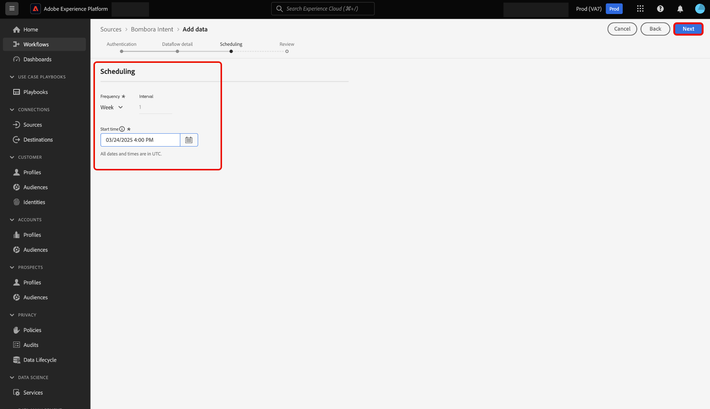

# Verbinding maken [!DNL Bombora Intent] met Experience Platform via de gebruikersinterface

Lees deze handleiding voor informatie over hoe u uw [!DNL Bombora Intent] -account kunt verbinden met Adobe Experience Platform via de gebruikersinterface.

## Aan de slag

Deze zelfstudie vereist een goed begrip van de volgende onderdelen van Experience Platform:

* [&#x200B; Real-Time CDP B2B edition &#x200B;](../../../../../rtcdp/b2b-overview.md): Real-Time CDP B2B edition is speciaal-gebouwd voor marketers die in een zaken-aan-zaken de dienstmodel werken. Het verenigt gegevens uit veelvoudige bronnen en combineert het in één enkele mening van mensen en rekeningsprofielen. Deze verenigde gegevens staan marketers toe om specifiek publiek nauwkeurig te richten en dat publiek over alle beschikbare kanalen in dienst te nemen.
* [&#x200B; Bronnen &#x200B;](../../../../home.md): Experience Platform staat gegevens toe om van diverse bronnen worden opgenomen terwijl het voorzien van u van de capaciteit om, inkomende gegevens te structureren te etiketteren en te verbeteren gebruikend de diensten van Experience Platform.
* [&#x200B; Sandboxes &#x200B;](../../../../../sandboxes/home.md): Experience Platform verstrekt virtuele zandbakken die één enkele instantie van Experience Platform in afzonderlijke virtuele milieu&#39;s verdelen helpen digitale ervaringstoepassingen ontwikkelen en ontwikkelen.

### Vereisten

Lees het [[!DNL Bombora Intent]  overzicht &#x200B;](../../../../connectors/data-partners/bombora.md) voor informatie over hoe te om uw authentificatiegeloofsbrieven terug te winnen.

## Navigeren door de catalogus met bronnen

Selecteer in de gebruikersinterface van Experience Platform de optie **[!UICONTROL Sources]** in de linkernavigatie voor toegang tot de werkruimte van *[!UICONTROL Sources]* . U kunt de juiste categorie selecteren in het deelvenster *[!UICONTROL Categories]* . U kunt ook de zoekbalk gebruiken om naar de specifieke bron te navigeren die u wilt gebruiken.

Als u [!DNL Bombora] wilt gebruiken, selecteert u de **[!UICONTROL Bombora Intent]** bronkaart onder *[!UICONTROL Data & Identity Partners]* en selecteert u vervolgens **[!UICONTROL Add data]** .

>[!TIP]
>
>Bronnen in de catalogus met bronnen geven de optie **[!UICONTROL Set up]** weer wanneer een bepaalde bron nog geen geverifieerde account heeft. Zodra een geverifieerd account bestaat, verandert deze optie in **[!UICONTROL Add data]** .

## Verificatie {#authentication}

### Een bestaande account gebruiken {#existing}

Als u een bestaande account wilt gebruiken, selecteert u **[!UICONTROL Existing account]** en selecteert u vervolgens de account die u wilt gebruiken in de lijst met accounts in de interface.

Nadat u uw account hebt geselecteerd, selecteert u **[!UICONTROL Next]** om door te gaan naar de volgende stap.

### Een nieuwe account maken {#create}

Als u geen bestaand account hebt, moet u een nieuw account maken door de vereiste verificatiereferenties op te geven die overeenkomen met uw bron.

Als u een nieuwe account wilt maken, selecteert u **[!UICONTROL New account]** en geeft u vervolgens een accountnaam en optioneel een beschrijving voor uw accountgegevens. Geef vervolgens de juiste verificatiewaarden op om uw bron te verifiëren op basis van Experience Platform. U moet over de volgende referenties beschikken om verbinding te maken met uw [!DNL Bombora] -account:

* **zeer belangrijke identiteitskaart van de Toegang**: Uw [!DNL Bombora] toegangs belangrijkste identiteitskaart Dit is een alfanumerieke tekenreeks van 61 tekens die vereist is om uw account bij Experience Platform te verifiëren.
* **Geheime toegangstoets**: Uw [!DNL Bombora] geheime toegangstoets. Dit is een tekenreeks van 40 tekens met een basiscodering van 64 tekens die vereist is om uw account bij Experience Platform te verifiëren.
* **naam van het Emmertje**: Uw [!DNL Bombora] emmertje waarvan de gegevens zullen worden getrokken.

## Gegevens over gegevensstroom opgeven {#provide-dataflow-details}

Nadat uw account is geverifieerd en verbinding heeft gemaakt, moet u nu de volgende gegevens voor uw gegevensstroom opgeven:

* **naam Dataflow**: De naam van uw dataflow. U kunt deze naam gebruiken om naar uw gegevensstroom in UI te zoeken, zodra het is gecreeerd en verwerkt.
* **Beschrijving**: (Facultatief) een korte verklaring of extra informatie voor uw dataflow.
* **bron van het Domein**: Het domein of websitegebied dat uw bronrekeningsverslagen tegen de rekeningen van Experience Platform aanpast. Deze waarde kan afhankelijk zijn van uw configuraties. Indien niet opgegeven, wordt voor het domein standaard accountOrganization.website gebruikt.

## Dataflow plannen {#schedule-dataflow}

Daarna, gebruik de het plannen interface om een innameprogramma voor uw dataflow te vormen.

* **Frequentie**: Vorm frequentie om erop te wijzen hoe vaak dataflow zou moeten lopen. U kunt uw [!DNL Bombora] gegevensstroom plannen om gegevens met een wekelijkse snelheid in te voeren.
* **Interval**: Het interval vertegenwoordigt de hoeveelheid tijd tussen elke opnamecyclus. Het enige ondersteunde interval voor een [!DNL Bombora] dataflow is 1. Dit betekent dat uw gegevensstroom gegevens eenmaal per week, elke week, zal innemen.
* **tijd van het Begin**: De begintijd dicteert wanneer de eerste looppasherhaling van uw dataflow zal voorkomen. [!DNL Bombora] laat gegevens eenmaal per week, op maandag, om 12:00 uur UTC naar Adobe gaan. :00 Daarom moet u uw ingangsbegintijd na 12 :00 PM UTC plaatsen. Bovendien moet u de innametijd met [!DNL Bombora] bevestigen, aangezien deze hun planning kunnen veranderen, wanneer het laten vallen van dossiers aan Adobe.

Selecteer **[!UICONTROL Next]** als u het schema voor inname van de gegevensstroom hebt geconfigureerd.

## Gegevensstroom controleren {#review-dataflow}

De laatste stap in het proces voor het maken van een gegevensstroom is het controleren van de gegevensstroom voordat deze wordt uitgevoerd. Gebruik de stap *[!UICONTROL Review]* om de details van de nieuwe gegevensstroom te bekijken voordat deze wordt uitgevoerd. De details worden gegroepeerd in de volgende categorieën:

* **Verbinding**: Toont het brontype, de relevante weg van het gekozen brondossier, en het aantal kolommen binnen dat brondossier.
* **Plannend**: Toont de actieve periode, de frequentie, en het interval van het innameprogramma.

Nadat u de gegevensstroom hebt gecontroleerd, selecteert u **[!UICONTROL Finish]** .

## Volgende stappen

Aan de hand van deze zelfstudie hebt u een gegevensstroom gemaakt om intentgegevens van uw [!DNL Bombora] -bron naar Experience Platform te verzenden. Voor extra bronnen raadpleegt u de documentatie die hieronder wordt beschreven.

### Uw gegevensstroom controleren

Zodra uw gegevensstroom is gecreeerd, kunt u de gegevens controleren die door het worden opgenomen om informatie over innamesnelheden, succes, en fouten te bekijken. Voor meer informatie over hoe te om dataflow te controleren, bezoek het leerprogramma op [&#x200B; controlerekeningen en dataflows in UI &#x200B;](../../../../../dataflows/ui/monitor-sources.md).

### Uw gegevensstroom bijwerken

Om configuraties voor uw dataflows bij te werken die, afbeelding, en algemene informatie plannen, bezoek het leerprogramma op [&#x200B; bijwerken brondataflows in UI &#x200B;](../../update-dataflows.md).

### Uw gegevensstroom verwijderen

U kunt gegevensstromen verwijderen die niet meer nodig zijn of die onjuist zijn gemaakt met de functie **[!UICONTROL Delete]** die beschikbaar is in de **[!UICONTROL Dataflows]** -werkruimte. Voor meer informatie over hoe te om dataflows te schrappen, bezoek het leerprogramma bij [&#x200B; het schrappen van dataflows in UI &#x200B;](../../delete.md).
