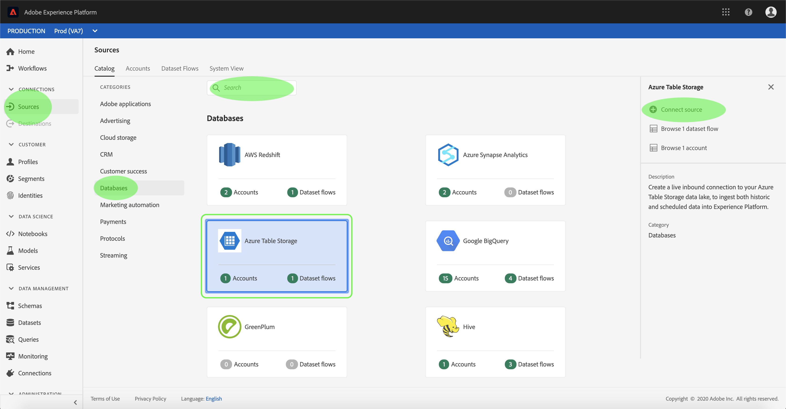

# Een Azure Table Storage-bronconnector in de gebruikersinterface maken

>[!NOTE]
>De Azure Table Storage-connector is in bèta. Zie het [Bronoverzicht](../../../../home.md#terms-and-conditions) voor meer informatie bij het gebruiken van bèta-geëtiketteerde schakelaars.

De bronschakelaars in Adobe Experience Platform verstrekken de capaciteit om van buitenaf afkomstige gegevens op een geplande basis in te voeren. Deze zelfstudie biedt stappen voor het maken van een Azure Table Storage-bronconnector (hierna &quot;ATS&quot; genoemd) met behulp van de gebruikersinterface van het Platform.

## Aan de slag

Deze zelfstudie vereist een goed begrip van de volgende onderdelen van het Adobe Experience Platform:

* [XDM-systeem](../../../../../xdm/home.md)(Experience Data Model): Het gestandaardiseerde kader waardoor het Experience Platform gegevens van de klantenervaring organiseert.
   * [Basisbeginselen van de schemacompositie](../../../../../xdm/schema/composition.md): Leer over de basisbouwstenen van schema&#39;s XDM, met inbegrip van zeer belangrijke principes en beste praktijken in schemacompositie.
   * [Zelfstudie](../../../../../xdm/tutorials/create-schema-ui.md)Schema-editor: Leer hoe te om douaneschema&#39;s tot stand te brengen gebruikend de Redacteur UI van het Schema.
* [Klantprofiel](../../../../../profile/home.md)in realtime: Verstrekt een verenigd, real-time consumentenprofiel dat op bijeengevoegde gegevens van veelvoudige bronnen wordt gebaseerd.

Als u reeds een geldige verbinding ATS hebt, kunt u de rest van dit document overslaan en aan het leerprogramma te werk gaan bij het [vormen van een gegevensstroom](../../dataflow/databases.md).

### Vereiste referenties verzamelen

Als u toegang wilt krijgen tot uw ATS-account op Platform, moet u de volgende waarden opgeven:

| Credentials | Beschrijving |
| ---------- | ----------- |
| `connectionString` | Een verbindingstekenreeks waarmee u verbinding maakt met uw Azure Table Storage-instantie. De verbindingstekenreeks waarmee verbinding moet worden gemaakt met een ATS-instantie. Het patroon van de verbindingstekenreeks voor ATS is `DefaultEndpointsProtocol=https;AccountName={ACCOUNT_NAME};AccountKey={ACCOUNT_KEY}`. |

Raadpleeg [dit Azure Table Storage-document](https://docs.microsoft.com/en-us/azure/storage/common/storage-introduction)voor meer informatie over hoe u aan de slag gaat.

## Sluit uw Azure Table Storage-account aan

Zodra u uw vereiste geloofsbrieven hebt verzameld, kunt u de stappen volgen hieronder om een nieuw ATS rekening tot stand te brengen om met Platform te verbinden.

Login aan <a href="https://platform.adobe.com" target="_blank">Adobe Experience Platform</a> en selecteer dan **Bronnen** van de linkernavigatiebar om tot de werkruimte van *Bronnen* toegang te hebben. Het scherm van de *Catalogus* toont een verscheidenheid van bronnen waarvoor u binnenkomende rekening kunt tot stand brengen, en elke bron toont het aantal bestaande rekeningen en datasetstromen verbonden aan hen.

U kunt de juiste categorie selecteren in de catalogus aan de linkerkant van het scherm. U kunt ook de specifieke bron vinden waarmee u wilt werken met de zoekoptie.

Selecteer onder de categorie *Databases* de optie **Azure Table Storage** om een informatiebalk aan de rechterkant van het scherm weer te geven. De informatiebalk bevat een korte beschrijving van de geselecteerde bron en opties voor het maken van verbinding met de bron of het bekijken van de documentatie. Selecteer **Connect-bron** als u een nieuwe binnenkomende verbinding wilt maken.

De pagina *Connect to Azure Table Storage* wordt weergegeven. Op deze pagina kunt u nieuwe of bestaande referenties gebruiken.

### Nieuwe account

Selecteer **Nieuw account** als u nieuwe referenties gebruikt. Geef in het invoerformulier dat wordt weergegeven, de verbinding een naam, een optionele beschrijving en uw ATS-referenties. Als u klaar bent, selecteert u **Connect** en laat u de nieuwe account enige tijd beginnen.

### Bestaande account

Als u een bestaande account wilt verbinden, selecteert u de ATS-account waarmee u verbinding wilt maken en selecteert u **Volgende** om door te gaan.

## Volgende stappen

Door deze zelfstudie te volgen, hebt u een verbinding met uw ATS-account tot stand gebracht. U kunt nu verdergaan aan het volgende leerprogramma en een dataflow [vormen om gegevens in Platform](../../dataflow/databases.md)te brengen.