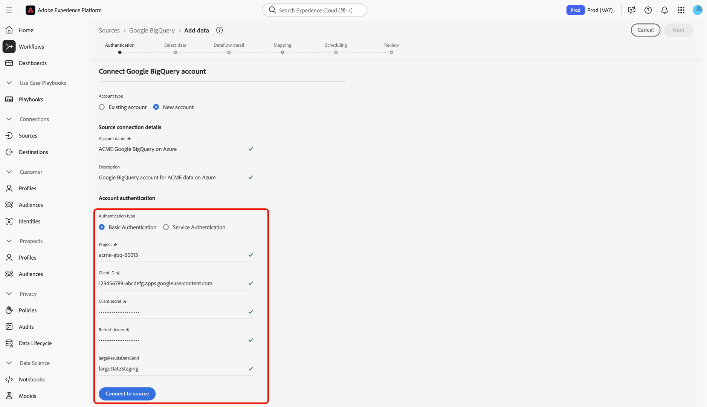

# Verbinding maken [!DNL Google BigQuery] met Experience Platform via de gebruikersinterface

>[!IMPORTANT]
>
>De [!DNL Google BigQuery] -bron is in de broncatalogus beschikbaar voor gebruikers die Real-Time Customer Data Platform Ultimate hebben aangeschaft.

Lees deze zelfstudie om te leren hoe u uw [!DNL Google BigQuery] -account kunt verbinden met Adobe Experience Platform via de gebruikersinterface.

## Aan de slag

Deze zelfstudie vereist een goed begrip van de volgende onderdelen van Experience Platform:

* [[!DNL Experience Data Model (XDM)]  Systeem &#x200B;](../../../../../xdm/home.md): Het gestandaardiseerde kader waardoor Experience Platform gegevens van de klantenervaring organiseert.
   * [&#x200B; Grondbeginselen van schemacompositie &#x200B;](../../../../../xdm/schema/composition.md): Leer over de basisbouwstenen van schema&#39;s XDM, met inbegrip van zeer belangrijke principes en beste praktijken in schemacompositie.
   * [&#x200B; het leerprogramma van de Redacteur van het Schema &#x200B;](../../../../../xdm/tutorials/create-schema-ui.md): Leer hoe te om douaneschema&#39;s tot stand te brengen gebruikend de Redacteur UI van het Schema.
* [[!DNL Real-Time Customer Profile]](../../../../../profile/home.md): biedt een uniform, real-time consumentenprofiel dat is gebaseerd op geaggregeerde gegevens van meerdere bronnen.

Als u reeds een geldige [!DNL Google BigQuery] verbinding hebt, kunt u de rest van dit document overslaan en aan het leerprogramma te werk gaan op [&#x200B; vormend een dataflow &#x200B;](../../dataflow/databases.md).

### Vereiste referenties verzamelen

Lees de [[!DNL Google BigQuery]  authentificatiegids &#x200B;](../../../../connectors/databases/bigquery.md#prerequisites) voor gedetailleerde stappen bij het verzamelen van uw vereiste geloofsbrieven.

## Navigeren door de catalogus met bronnen {#navigate}

Selecteer in de gebruikersinterface van Experience Platform de optie **[!UICONTROL Sources]** in de linkernavigatie voor toegang tot de werkruimte van *[!UICONTROL Sources]* . U kunt de juiste categorie selecteren in het deelvenster *[!UICONTROL Categories]*. U kunt ook de zoekbalk gebruiken om naar de specifieke bron te navigeren die u wilt gebruiken.

Als u [!DNL Google BigQuery] wilt gebruiken, selecteert u de **[!UICONTROL Google BigQuery]** bronkaart onder *[!UICONTROL Databases]* en selecteert u vervolgens **[!UICONTROL Add data]** .

>[!TIP]
>
>Bronnen in de catalogus met bronnen geven de optie **[!UICONTROL Set up]** weer wanneer een bepaalde bron nog geen geverifieerde account heeft. Zodra een geverifieerd account is gemaakt, verandert deze optie in **[!UICONTROL Add data]** .

## Een bestaande account gebruiken {#existing}

Als u een bestaande account wilt gebruiken, selecteert u de [!DNL Google BigQuery] -account waarmee u verbinding wilt maken en selecteert u **[!UICONTROL Next]** om door te gaan.

## Een nieuwe account maken {#create}

Als u geen bestaand account hebt, moet u een nieuw account maken door de vereiste verificatiereferenties op te geven die overeenkomen met uw bron.

Als u een nieuwe account wilt maken, selecteert u **[!UICONTROL New account]** en geeft u een naam op en voegt u desgewenst een beschrijving voor uw account toe.

### Verbinding maken met Experience Platform on Azure {#azure}

U kunt uw [!DNL Google BigQuery] -account op Azure aan Experience Platform koppelen met behulp van basis- of serviceverificatie.

>[!BEGINTABS]

>[!TAB  Basisauthentificatie van het Gebruik ]

Om basisauthentificatie te gebruiken, selecteer **[!UICONTROL Basic Authentication]** en verstrek waarden voor uw [&#x200B; project, cliënt identiteitskaart, cliëntgeheim, verfrist teken, en (facultatieve) identiteitskaart van de resultaatdataset &#x200B;](../../../../connectors/databases/bigquery.md#generate-your-google-bigquery-credentials). Als u klaar bent, selecteert u **[!UICONTROL Connect to source]** en laat de verbinding enkele ogenblikken tot stand komen.

>[!TAB  de dienstauthentificatie van het Gebruik ]

Om de dienstauthentificatie te gebruiken, selecteer **[!UICONTROL Service Authentication]** en verstrek waarden voor uw [&#x200B; project identiteitskaart, zeer belangrijke dossierinhoud, en (facultatieve) grote identiteitskaart van de resultaatdataset &#x200B;](../../../../connectors/databases/bigquery.md#generate-your-google-bigquery-credentials). Als u klaar bent, selecteert u **[!UICONTROL Connect to source]** en laat de verbinding enkele ogenblikken tot stand komen.

>[!ENDTABS]

### Verbinding maken met Experience Platform op Amazon Web Services (AWS) {#aws}

>[!AVAILABILITY]
>
>Deze sectie is van toepassing op implementaties van Experience Platform die op Amazon Web Services (AWS) worden uitgevoerd. Experience Platform die op AWS wordt uitgevoerd, is momenteel beschikbaar voor een beperkt aantal klanten. Meer over de gesteunde infrastructuur van Experience Platform leren, zie het [&#x200B; multi-wolkenoverzicht van Experience Platform &#x200B;](../../../../../landing/multi-cloud.md).

Als u een nieuwe [!DNL Google BigQuery] -account wilt maken en verbinding wilt maken met Experience Platform op AWS, controleert u of u zich in een VA6-sandbox bevindt en geeft u vervolgens de vereiste gegevens voor verificatie op.

* **identiteitskaart van het Project**: Projectidentiteitskaart die met uw [!DNL Google BigQuery] rekening beantwoordt.
* **Zeer belangrijke dossierinhoud**: Het zeer belangrijke dossier dat wordt gebruikt om de de dienstrekening voor authentiek te verklaren. U kunt deze waarde van het [[!DNL Google Cloud service accounts]  dashboard &#x200B;](https://console.cloud.google.com) terugwinnen. De inhoud van het sleutelbestand heeft de JSON-indeling. U moet dit coderen in [!DNL Base64] wanneer u autoriseert aan Experience Platform.
* **identiteitskaart van de Dataset**: [!DNL Google BigQuery] dataset identiteitskaart Deze id geeft aan waar uw gegevenstabellen zich bevinden en moet vooraf zijn gemaakt om ondersteuning voor grote resultaatsets mogelijk te maken.

## Voorvertoning van voorbeeldgegevens overslaan {#skip-preview-of-sample-data}

Tijdens de stap voor gegevensselectie kan er een time-out optreden wanneer u grote tabellen of bestanden met gegevens opgeeft. U kunt gegevensvoorvertoning overslaan om de time-out te omzeilen en toch uw schema weer te geven, zij het zonder voorbeeldgegevens. Als u de gegevensvoorvertoning wilt overslaan, schakelt u de schakeloptie **[!UICONTROL Skip previewing sample data]** in.

De rest van de workflow blijft ongewijzigd. Het enige voorbehoud is dat bij het overslaan van de gegevensvoorvertoning berekende en vereiste velden mogelijk niet automatisch worden gevalideerd tijdens de toewijzingsstap. Vervolgens moet u deze velden handmatig valideren tijdens de toewijzing.

## Volgende stappen

Aan de hand van deze zelfstudie hebt u een verbinding tot stand gebracht met uw [!DNL Google BigQuery] -account. U kunt nu aan het volgende leerprogramma verdergaan en [&#x200B; een dataflow vormen om gegevens in Experience Platform &#x200B;](../../dataflow/databases.md) te brengen.
