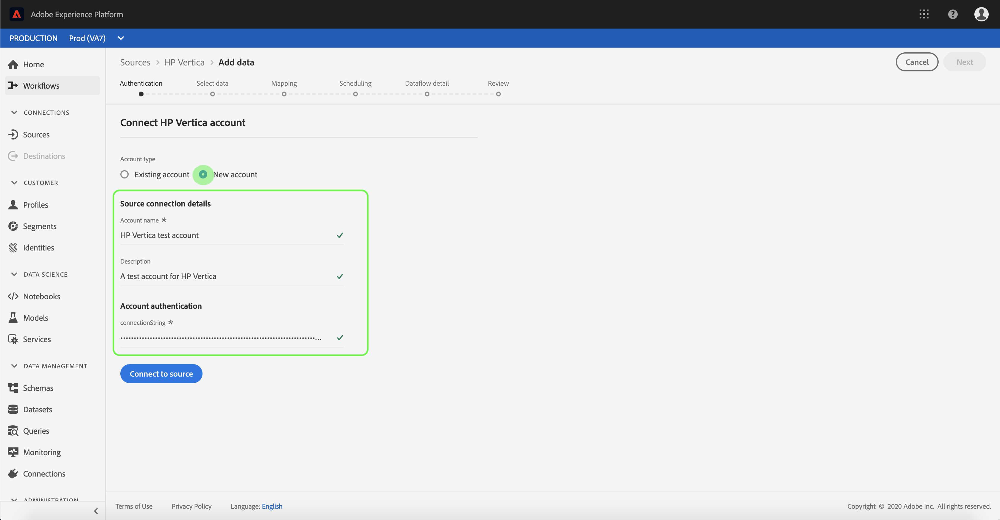

# Creeer HP Vertica bronschakelaar in UI

> [!NOTE]
> De schakelaar van HP Vertica is in bèta. De functies en documentatie kunnen worden gewijzigd.

De bronschakelaars in het Platform van de Ervaring van Adobe verstrekken de capaciteit om van buitenaf afkomstige gegevens op een geplande basis in te voeren. Dit leerprogramma verstrekt stappen voor het creëren van een HP Vertica bronschakelaar gebruikend het gebruikersinterface van het Platform.

## Aan de slag

Voor deze zelfstudie is een goed begrip vereist van de volgende componenten van het Adobe Experience Platform:

* [XDM-systeem](../../../../../xdm/home.md)(Experience Data Model): Het gestandaardiseerde kader waardoor het Platform van de Ervaring gegevens van de klantenervaring organiseert.
   * [Basisbeginselen van de schemacompositie](../../../../../xdm/schema/composition.md): Leer over de basisbouwstenen van schema&#39;s XDM, met inbegrip van zeer belangrijke principes en beste praktijken in schemacompositie.
   * [Zelfstudie](../../../../../xdm/tutorials/create-schema-ui.md)Schema-editor: Leer hoe te om douaneschema&#39;s tot stand te brengen gebruikend de Redacteur UI van het Schema.
* [Klantprofiel](../../../../../profile/home.md)in realtime: Verstrekt een verenigd, real-time consumentenprofiel dat op bijeengevoegde gegevens van veelvoudige bronnen wordt gebaseerd.

Als u reeds een geldige verbinding van HP Vertica hebt, kunt u de rest van dit document overslaan en aan het leerprogramma te werk gaan bij het [vormen van een dataflow](../../dataflow/databases.md).

### Vereiste referenties verzamelen

De volgende secties verstrekken extra informatie die u zult moeten weten om met succes met HP Vertica te verbinden gebruikend de Dienst API van de Stroom.

| Credentials | Beschrijving |
| ---------- | ----------- |
| `connectionString` | De verbindingstekenreeks die wordt gebruikt om met uw instantie van HP Vertica te verbinden. Het patroon van de verbindingstekenreeks voor HP Vertica is `Server={SERVER};Port={PORT};Database={DATABASE};UID={USERNAME};PWD={PASSWORD}` |

Voor meer informatie over begonnen worden verwijs naar [dit document](https://www.vertica.com/docs/9.2.x/HTML/Content/Authoring/ConnectingToVertica/ClientJDBC/CreatingAndConfiguringAConnection.htm)van HP Vertica.

## Uw HP Vertica-account verbinden

Zodra u uw vereiste geloofsbrieven hebt verzameld, kunt u de stappen hieronder volgen om een nieuwe rekening van HP te creëren Vertica om met Platform te verbinden.

Meld u aan bij [Adobe Experience Platform](https://platform.adobe.com) en selecteer vervolgens **[!UICONTROL Bronnen]** in de linkernavigatiebalk voor toegang tot de werkruimte *[!UICONTROL Bronnen]* . Het scherm van de *[!UICONTROL Catalogus]* toont een verscheidenheid van bronnen waarvoor u een binnenkomende rekening met kunt tot stand brengen, en elke bron toont het aantal bestaande rekeningen en datasetstromen verbonden aan hen.

U kunt de juiste categorie selecteren in de catalogus aan de linkerkant van het scherm. U kunt ook de specifieke bron vinden waarmee u wilt werken met de zoekoptie.

Onder de categorie *[!UICONTROL Databases]* selecteert u **[!UICONTROL HP Vertica]** en klikt u **op het plusteken (+)** om een nieuwe HP Vertica-connector te maken.

De pagina *[!UICONTROL Verbinding maken met HP Vertica]* wordt weergegeven. Op deze pagina kunt u nieuwe of bestaande referenties gebruiken.

### Nieuwe account

Selecteer **[!UICONTROL Nieuw account]** als u nieuwe referenties gebruikt. Voor de inputvorm die verschijnt, verstrek de verbinding met een naam, een facultatieve beschrijving, en uw geloofsbrieven van HP Vertica. Als u klaar bent, selecteert u **[!UICONTROL Connect]** en laat u de nieuwe account enige tijd beginnen.

### Bestaande account

Als u een bestaande account wilt verbinden, selecteert u de HP Vertica-account waarmee u verbinding wilt maken en selecteert u **[!UICONTROL Volgende]** in de rechterbovenhoek om door te gaan.

## Volgende stappen

Door dit leerprogramma te volgen, hebt u een verbinding aan uw rekening van HP Vertica gevestigd. U kunt nu doorgaan met de volgende zelfstudie en een gegevensstroom [configureren om gegevens over te brengen naar Platform](../../dataflow/databases.md).