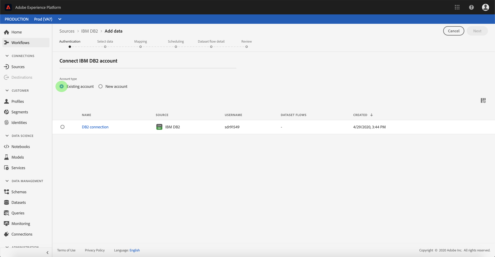

# Een IBM DB2-bronconnector maken in de gebruikersinterface

> [!NOTE]
> De IBM DB2-connector is in bèta. Zie het [Bronoverzicht](../../../../home.md#terms-and-conditions) voor meer informatie bij het gebruiken van bèta-geëtiketteerde schakelaars.

De bronschakelaars in Adobe Experience Platform verstrekken de capaciteit om van buitenaf afkomstige gegevens op een geplande basis in te voeren. Deze zelfstudie biedt stappen voor het maken van een IBM DB2-bronconnector (hierna &quot;DB2&quot; genoemd) via de gebruikersinterface van het Platform.

## Aan de slag

Deze zelfstudie vereist een goed begrip van de volgende onderdelen van het Adobe Experience Platform:

* [XDM-systeem](../../../../../xdm/home.md)(Experience Data Model): Het gestandaardiseerde kader waardoor het Experience Platform gegevens van de klantenervaring organiseert.
   * [Basisbeginselen van de schemacompositie](../../../../../xdm/schema/composition.md): Leer over de basisbouwstenen van schema&#39;s XDM, met inbegrip van zeer belangrijke principes en beste praktijken in schemacompositie.
   * [Zelfstudie](../../../../../xdm/tutorials/create-schema-ui.md)Schema-editor: Leer hoe te om douaneschema&#39;s tot stand te brengen gebruikend de Redacteur UI van het Schema.
* [Klantprofiel](../../../../../profile/home.md)in realtime: Verstrekt een verenigd, real-time consumentenprofiel dat op bijeengevoegde gegevens van veelvoudige bronnen wordt gebaseerd.

Als u reeds een geldige verbinding DB2 hebt, kunt u de rest van dit document overslaan en aan het leerprogramma te werk gaan bij het [vormen van een gegevensstroom](../../dataflow/databases.md).

### Vereiste referenties verzamelen

De volgende secties verstrekken extra informatie die u zult moeten weten om met succes met DB2 gebruikend de Dienst API van de Stroom te verbinden.

| Credentials | Beschrijving |
| ---------- | ----------- |
| `server` | De naam van de DB2-server. U kunt het poortnummer opgeven na de servernaam die is gescheiden door een dubbele punt. Bijvoorbeeld: server:poort. |
| `database` | De naam van de database DB2. |
| `username` | De gebruikersnaam die wordt gebruikt om verbinding te maken met de database DB2. |
| `password` | Het wachtwoord voor de gebruikersaccount die u voor de gebruikersnaam hebt opgegeven. |

Raadpleeg [dit DB2-document](https://www.ibm.com/support/knowledgecenter/SSFMBX/com.ibm.swg.im.dashdb.doc/connecting/connect_credentials.html)voor meer informatie over aan de slag gaan.

## Verbinding maken met uw IBM DB2-account

Zodra u uw vereiste geloofsbrieven hebt verzameld, kunt u de stappen volgen hieronder om een nieuwe rekening tot stand te brengen DB2 om met Platform te verbinden.

Login aan [Adobe Experience Platform](https://platform.adobe.com) en selecteer dan **[!UICONTROL Bronnen]** van de linkernavigatiebar om tot de werkruimte van *[!UICONTROL Bronnen]* toegang te hebben. Het scherm van de *[!UICONTROL Catalogus]* toont een verscheidenheid van bronnen waarvoor u een binnenkomende rekening met kunt tot stand brengen, en elke bron toont het aantal bestaande rekeningen en datasetstromen verbonden aan hen.

U kunt de juiste categorie selecteren in de catalogus aan de linkerkant van het scherm. U kunt ook de specifieke bron vinden waarmee u wilt werken met de zoekoptie.

Onder de categorie *[!UICONTROL Databases]* selecteert u **[!UICONTROL IBM DB2]** en klikt u **op het plus-pictogram (+)** om een nieuwe DB2-connector te maken.

De pagina *[!UICONTROL Verbinding maken met IBM DB2]* wordt weergegeven. Op deze pagina kunt u nieuwe of bestaande referenties gebruiken.

### Nieuwe account

Selecteer **[!UICONTROL Nieuw account]** als u nieuwe referenties gebruikt. Geef in het invoerformulier dat wordt weergegeven, de verbinding een naam, een optionele beschrijving en uw DB2-referenties. Als u klaar bent, selecteert u **[!UICONTROL Connect]** en laat u de nieuwe account enige tijd beginnen.

### Bestaande account

Als u een bestaande account wilt verbinden, selecteert u de DB2-account waarmee u verbinding wilt maken en selecteert u **[!UICONTROL Volgende]** om door te gaan.

## Volgende stappen

Aan de hand van deze zelfstudie hebt u een verbinding met uw DB2-account tot stand gebracht. U kunt nu verdergaan aan het volgende leerprogramma en een dataflow [vormen om gegevens in Platform](../../dataflow/databases.md)te brengen.