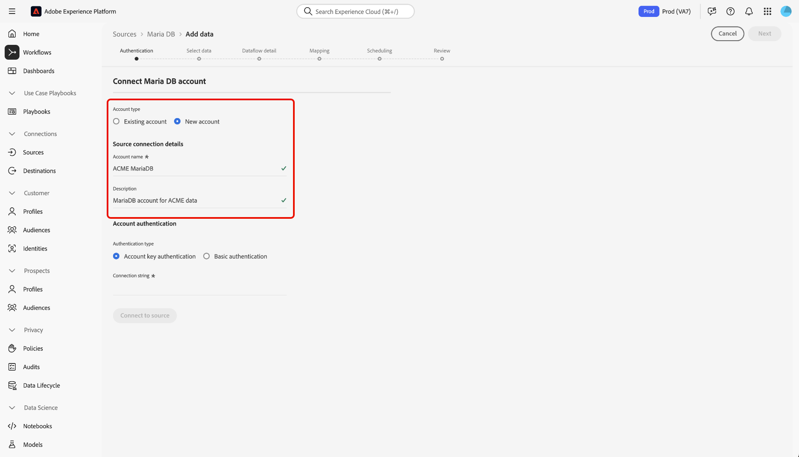

# Creeer een [!DNL MariaDB] bronschakelaar in UI

>[!NOTE]
>
> De [!DNL MariaDB] connector is in bèta. Zie het [Bronoverzicht](../../../../home.md#terms-and-conditions) voor meer informatie bij het gebruiken van bèta-geëtiketteerde schakelaars.

De bronschakelaars in Adobe Experience Platform verstrekken de capaciteit om van buitenaf afkomstige gegevens op een geplande basis in te voeren. Deze zelfstudie bevat stappen voor het maken van een Maria DB-bronconnector met behulp van de [!DNL Platform] gebruikersinterface.

## Aan de slag

Deze zelfstudie vereist een goed begrip van de volgende onderdelen van Adobe Experience Platform:

* [[!DNL Experience Data Model (XDM)] Systeem](../../../../../xdm/home.md): Het gestandaardiseerde kader waardoor de gegevens van de klantenervaring worden [!DNL Experience Platform] georganiseerd.
   * [Basisbeginselen van de schemacompositie](../../../../../xdm/schema/composition.md): Leer over de basisbouwstenen van schema&#39;s XDM, met inbegrip van zeer belangrijke principes en beste praktijken in schemacompositie.
   * [Zelfstudie](../../../../../xdm/tutorials/create-schema-ui.md)Schema-editor: Leer hoe te om douaneschema&#39;s tot stand te brengen gebruikend de Redacteur UI van het Schema.
* [Klantprofiel](../../../../../profile/home.md)in realtime: Verstrekt een verenigd, real-time consumentenprofiel dat op bijeengevoegde gegevens van veelvoudige bronnen wordt gebaseerd.

Als u al een [!DNL MariaDB] verbinding hebt, kunt u de rest van dit document overslaan en verdergaan naar de zelfstudie over het [configureren van een gegevensstroom](../../dataflow/databases.md).

### Vereiste referenties verzamelen

Als u toegang wilt krijgen tot uw [!DNL MariaDB] [!DNL Platform]account op, moet u de volgende waarde opgeven:

| Credentials | Beschrijving |
| ---------- | ----------- |
| `connectionString` | De verbindingstekenreeks die aan uw MariaDB-verificatie is gekoppeld. Het patroon van de [!DNL MariaDB] verbindingstekenreeks is: `Server={HOST};Port={PORT};Database={DATABASE};UID={USERNAME};PWD={PASSWORD}`. |

Raadpleeg dit [[!DNL MariaDB] document](https://mariadb.com/kb/en/about-mariadb-connector-odbc/)voor meer informatie over aan de slag gaan.

## Uw [!DNL Maria DB] account verbinden

Nadat u de vereiste gegevens hebt verzameld, kunt u de onderstaande stappen volgen om uw [!DNL Maria DB] account te koppelen aan [!DNL Platform].

Meld u aan bij [Adobe Experience Platform](https://platform.adobe.com) en selecteer vervolgens **[!UICONTROL Bronnen]** in de linkernavigatiebalk voor toegang tot de werkruimte **[!UICONTROL Bronnen]** . In het scherm **[!UICONTROL Catalogus]** worden diverse bronnen weergegeven waarmee u een account kunt maken.

Selecteer **[!UICONTROL Maria DB]** onder de categorie **[!UICONTROL Databases]**. Als dit uw eerste keer gebruikend deze schakelaar is, uitgezocht **[!UICONTROL vorm]**. Anders, uitgezocht **[!UICONTROL voeg gegevens]** toe om een nieuwe [!DNL Maria DB] schakelaar tot stand te brengen.

De pagina **[!UICONTROL Verbinding maken met Maria DB]** wordt weergegeven. Op deze pagina kunt u nieuwe of bestaande referenties gebruiken.

### Nieuwe account

Selecteer **[!UICONTROL Nieuw account]** als u nieuwe referenties gebruikt. Voer in het invoerformulier dat wordt weergegeven een naam, een optionele beschrijving en uw [!DNL MariaDB] referenties in. Wanneer u klaar bent, selecteert u **[!UICONTROL Connect]** en laat u de nieuwe verbinding enige tijd tot stand brengen.

### Bestaande account

Als u een bestaande account wilt verbinden, selecteert u de [!DNL MariaDB] account waarmee u verbinding wilt maken en selecteert u **[!UICONTROL Volgende]** om door te gaan.

## Volgende stappen

Aan de hand van deze zelfstudie hebt u een verbinding met uw [!DNL MariaDB] account tot stand gebracht. U kunt nu verdergaan naar de volgende zelfstudie en een gegevensstroom [configureren om gegevens in te voeren [!DNL Platform]](../../dataflow/databases.md).