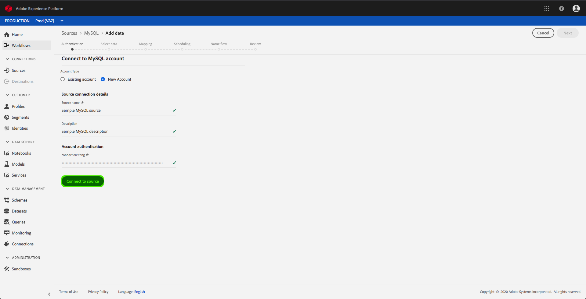

# Creeer een MySQL bronschakelaar in UI

> [!NOTE]
> De MySQL-connector is in bèta. De functies en documentatie kunnen worden gewijzigd.

De bronschakelaars in het Platform van de Ervaring van Adobe verstrekken de capaciteit om van buitenaf afkomstige gegevens op een geplande basis in te voeren. Deze zelfstudie biedt stappen voor het maken van een MySQL-bronconnector met behulp van de gebruikersinterface van Platform.

## Aan de slag

Voor deze zelfstudie is een goed begrip vereist van de volgende componenten van het Adobe Experience Platform:

* [XDM-systeem](../../../../../xdm/home.md)(Experience Data Model): Het gestandaardiseerde kader waardoor het Platform van de Ervaring gegevens van de klantenervaring organiseert.
   * [Basisbeginselen van de schemacompositie](../../../../../xdm/schema/composition.md): Leer over de basisbouwstenen van schema&#39;s XDM, met inbegrip van zeer belangrijke principes en beste praktijken in schemacompositie.
   * [Zelfstudie](../../../../../xdm/tutorials/create-schema-ui.md)Schema-editor: Leer hoe te om douaneschema&#39;s tot stand te brengen gebruikend de Redacteur UI van het Schema.
* [Klantprofiel](../../../../../profile/home.md)in realtime: Verstrekt een verenigd, real-time consumentenprofiel dat op bijeengevoegde gegevens van veelvoudige bronnen wordt gebaseerd.

Als u reeds een MySQL basisverbinding hebt, kunt u de rest van dit document overslaan en aan het leerprogramma te werk gaan bij het [vormen van een gegevensstroom](../../dataflow/databases.md).

### Vereiste referenties verzamelen

Als u toegang wilt krijgen tot uw MySQL-account op Platform, moet u de volgende waarde opgeven:

| Credentials | Beschrijving |
| ---------- | ----------- |
| `connectionString` | De MySQL-verbindingstekenreeks die aan uw account is gekoppeld. |

U kunt meer leren over verbindingskoorden en hoe te om hen te verkrijgen door het document [te lezen](https://dev.mysql.com/doc/connector-net/en/connector-net-connections-string.html)MySQL.

## Verbinding maken met uw MySQL-account

Zodra u uw vereiste geloofsbrieven hebt verzameld, kunt u de stappen volgen hieronder om een nieuwe binnenkomende basisverbinding tot stand te brengen om uw rekening MySQL aan Platform te verbinden.

Meld u aan bij <a href="https://platform.adobe.com" target="_blank">Adobe Experience Platform</a> en selecteer vervolgens **Bronnen** in de linkernavigatiebalk voor toegang tot de werkruimte *Bronnen* . In het scherm *Catalogus* worden diverse bronnen weergegeven waarvoor u binnenkomende basisverbindingen kunt maken met. Elke bron toont het aantal bestaande basisverbindingen dat aan deze verbindingen is gekoppeld.

Onder de categorie *Databases* selecteert u **MySQL** om een informatiebalk aan de rechterkant van het scherm weer te geven. De informatiebalk bevat een korte beschrijving van de geselecteerde bron en opties voor het maken van verbinding met de bron of het bekijken van de documentatie. Selecteer **Connect-bron** als u een nieuwe binnenkomende basisverbinding wilt maken.

De pagina *Verbinding maken met MySQL* wordt weergegeven. Op deze pagina kunt u nieuwe of bestaande referenties gebruiken.

### Nieuwe account

Selecteer **Nieuw account** als u nieuwe referenties gebruikt. Geef op het invoerformulier dat wordt weergegeven, de basisverbinding een naam, een optionele beschrijving en uw MySQL-referenties. Als u klaar bent, selecteert u **Connect** en laat u de nieuwe basisverbinding enige tijd tot stand brengen.

### Bestaande account

Als u een bestaande account wilt verbinden, selecteert u de MySQL-account waarmee u verbinding wilt maken en selecteert u **Volgende** om door te gaan.

## Volgende stappen

Aan de hand van deze zelfstudie hebt u een basisverbinding met uw MySQL-account tot stand gebracht. U kunt nu doorgaan met de volgende zelfstudie en een gegevensstroom [configureren om gegevens over te brengen naar Platform](../../dataflow/databases.md).