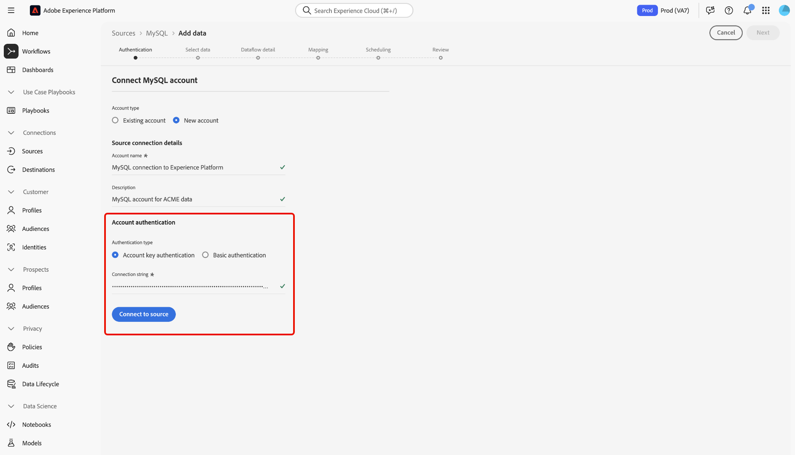

# Verbinding maken [!DNL MySQL] met Experience Platform via de gebruikersinterface

Lees deze handleiding voor informatie over hoe u uw [!DNL MySQL] -database kunt verbinden met Adobe Experience Platform via de werkruimte voor bronnen in de Experience Platform-gebruikersinterface.

## Aan de slag

Deze zelfstudie vereist een goed begrip van de volgende onderdelen van Adobe Experience Platform:

* [[!DNL Experience Data Model (XDM)]  Systeem ](../../../../../xdm/home.md): Het gestandaardiseerde kader waardoor Experience Platform gegevens van de klantenervaring organiseert.
   * [ Grondbeginselen van schemacompositie ](../../../../../xdm/schema/composition.md): Leer over de basisbouwstenen van schema&#39;s XDM, met inbegrip van zeer belangrijke principes en beste praktijken in schemacompositie.
   * [ het leerprogramma van de Redacteur van het Schema ](../../../../../xdm/tutorials/create-schema-ui.md): Leer hoe te om douaneschema&#39;s tot stand te brengen gebruikend de Redacteur UI van het Schema.
* [[!DNL Real-Time Customer Profile]](../../../../../profile/home.md): biedt een uniform, real-time consumentenprofiel dat is gebaseerd op geaggregeerde gegevens van meerdere bronnen.

Als u reeds een [!DNL MySQL] verbinding hebt, kunt u de rest van dit document overslaan en aan het leerprogramma te werk gaan op [ vormend een dataflow ](../../dataflow/databases.md).

### Vereiste referenties verzamelen

Lees het [[!DNL MySQL]  overzicht ](../../../../connectors/databases/mysql.md#prerequisites) voor informatie over authentificatie.

## Navigeren door de catalogus met bronnen

Selecteer in de gebruikersinterface van Experience Platform de optie **[!UICONTROL Sources]** in de linkernavigatie voor toegang tot de werkruimte van *[!UICONTROL Sources]* . Kies een categorie of gebruik de zoekbalk om de bron te zoeken.

Als u verbinding wilt maken met [!DNL MySQL] , gaat u naar de categorie *[!UICONTROL Databases]* , selecteert u de **[!UICONTROL MySQL]** bronkaart en selecteert u vervolgens **[!UICONTROL Set up]** .

>[!TIP]
>
>Bronnen in de catalogus met bronnen geven de optie **[!UICONTROL Set up]** weer wanneer een bepaalde bron nog geen geverifieerde account heeft. Zodra een geverifieerd account is gemaakt, verandert deze optie in **[!UICONTROL Add data]** .

## Een bestaande account gebruiken {#existing}

Als u een bestaande account wilt gebruiken, selecteert u **[!UICONTROL Existing account]** en vervolgens de [!DNL MySQL] -account die u wilt gebruiken.

## Een nieuwe account maken {#new}

Als u een nieuwe account wilt maken, selecteert u **[!UICONTROL New account]** en geeft u een naam op en voegt u desgewenst een beschrijving voor uw account toe.

### Verbinding maken met Experience Platform on Azure {#azure}

U kunt uw [!DNL MySQL] -database op Azure verbinden met Experience Platform via accountsleutel of basisverificatie.

>[!BEGINTABS]

>[!TAB  de belangrijkste authentificatie van de Rekening ]

Om rekeningszeer belangrijke authentificatie te gebruiken, selecteer **[!UICONTROL Account key authentication]**, verstrek uw [ verbindingskoord ](../../../../connectors/databases/mysql.md#azure), en selecteer dan **[!UICONTROL Connect to source]**.

>[!TAB  Basisauthentificatie ]

Om basisauthentificatie te gebruiken, selecteer **[!UICONTROL Basic authentication]**, verstrek waarden voor uw [ authentificatiegeloofsbrieven ](../../../../connectors/databases/mysql.md#azure), en selecteer dan **[!UICONTROL Connect to source]**.

>[!ENDTABS]

### Verbinding maken met Experience Platform op Amazon Web Services (AWS) {#aws}

>[!AVAILABILITY]
>
>Deze sectie is van toepassing op implementaties van Experience Platform die op Amazon Web Services (AWS) worden uitgevoerd. Experience Platform die op AWS wordt uitgevoerd, is momenteel beschikbaar voor een beperkt aantal klanten. Meer over de gesteunde infrastructuur van Experience Platform leren, zie het [ multi-wolkenoverzicht van Experience Platform ](../../../../../landing/multi-cloud.md).

Om een nieuwe [!DNL MySQL] rekening tot stand te brengen en met Experience Platform op AWS te verbinden, zorg ervoor dat u in een zandbak VA6 bent en dan de noodzakelijke [ geloofsbrieven voor authentificatie ](../../../../connectors/databases/mysql.md#aws) verstrekt.

## Een gegevensstroom maken voor [!DNL MySQL] -gegevens

Nu u met succes uw [!DNL MySQL] gegevensbestand hebt verbonden, kunt u [ nu tot een dataflow leiden en gegevens van uw gegevensbestand in Experience Platform ](../../dataflow/databases.md) opnemen.
