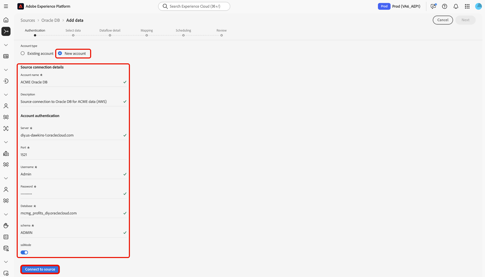

# Verbinding maken [!DNL Oracle DB] met Experience Platform via de gebruikersinterface

Lees deze handleiding voor informatie over hoe u [!DNL Oracle DB] -instantie kunt verbinden met Adobe Experience Platform via de werkruimte Bronnen in de Experience Platform-gebruikersinterface.

## Aan de slag

Deze zelfstudie vereist een goed begrip van de volgende onderdelen van Adobe Experience Platform:

* [[!DNL Experience Data Model (XDM)]  Systeem &#x200B;](../../../../../xdm/home.md): Het gestandaardiseerde kader waardoor Experience Platform gegevens van de klantenervaring organiseert.
   * [&#x200B; Grondbeginselen van schemacompositie &#x200B;](../../../../../xdm/schema/composition.md): Leer over de basisbouwstenen van schema&#39;s XDM, met inbegrip van zeer belangrijke principes en beste praktijken in schemacompositie.
   * [&#x200B; het leerprogramma van de Redacteur van het Schema &#x200B;](../../../../../xdm/tutorials/create-schema-ui.md): Leer hoe te om douaneschema&#39;s tot stand te brengen gebruikend de Redacteur UI van het Schema.
* [[!DNL Real-Time Customer Profile]](../../../../../profile/home.md): biedt een uniform, real-time consumentenprofiel dat is gebaseerd op geaggregeerde gegevens van meerdere bronnen.

Als u reeds een [!DNL Oracle DB] verbinding hebt, kunt u de rest van dit document overslaan en aan het leerprogramma te werk gaan op [&#x200B; vormend een dataflow &#x200B;](../../dataflow/databases.md).

### Vereiste referenties verzamelen

Lees het [[!DNL Oracle DB]  overzicht &#x200B;](../../../../connectors/databases/oracle.md#prerequisites) voor informatie over authentificatie.

## Navigeren door de catalogus met bronnen

Selecteer in de gebruikersinterface van Experience Platform de optie **[!UICONTROL Sources]** in de linkernavigatie voor toegang tot de werkruimte van *[!UICONTROL Sources]* . Kies een categorie of gebruik de zoekbalk om de bron te zoeken.

Als u verbinding wilt maken met [!DNL Oracle DB] , gaat u naar de categorie *[!UICONTROL Databases]* , selecteert u de **[!UICONTROL Oracle DB]** bronkaart en selecteert u vervolgens **[!UICONTROL Set up]** .

>[!TIP]
>
>Bronnen tonen **[!UICONTROL Set up]** voor nieuwe verbindingen en **[!UICONTROL Add data]** als er al een account bestaat.

## Een bestaande account gebruiken {#existing}

Als u een bestaande account wilt gebruiken, selecteert u **[!UICONTROL Existing account]** en vervolgens de [!DNL Oracle DB] -account die u wilt gebruiken.

## Een nieuwe account maken {#new}

Als u een nieuwe account wilt maken, selecteert u **[!UICONTROL New account]** en geeft u een naam op en voegt u desgewenst een beschrijving voor uw account toe.

### Verbinding maken met Experience Platform on Azure {#azure}

U kunt uw [!DNL Oracle DB] -database met Experience Platform on Azure verbinden met behulp van een verbindingstekenreeks.

Om de authentificatie van het verbindingskoord te gebruiken, verstrek uw [&#x200B; verbindingskoord &#x200B;](../../../../connectors/databases/oracle.md#azure) en selecteer **[!UICONTROL Connect to source]**.

### Verbinding maken met Experience Platform op Amazon Web Services (AWS) {#aws}

>[!AVAILABILITY]
>
>Deze sectie is van toepassing op implementaties van Experience Platform die op Amazon Web Services (AWS) worden uitgevoerd. Experience Platform die op AWS wordt uitgevoerd, is momenteel beschikbaar voor een beperkt aantal klanten. Meer over de gesteunde infrastructuur van Experience Platform leren, zie het [&#x200B; multi-wolkenoverzicht van Experience Platform &#x200B;](../../../../../landing/multi-cloud.md).

Om een nieuwe [!DNL Oracle DB] rekening tot stand te brengen en met Experience Platform op AWS te verbinden, zorg ervoor dat u in een zandbak VA6 bent en dan de noodzakelijke [&#x200B; geloofsbrieven voor authentificatie &#x200B;](../../../../connectors/databases/oracle.md#aws) verstrekt.

## Een gegevensstroom maken voor [!DNL Oracle DB] -gegevens

Nu u met succes uw [!DNL Oracle DB] gegevensbestand hebt verbonden, kunt u [&#x200B; nu tot een dataflow leiden en gegevens van uw gegevensbestand in Experience Platform &#x200B;](../../dataflow/databases.md) opnemen.
