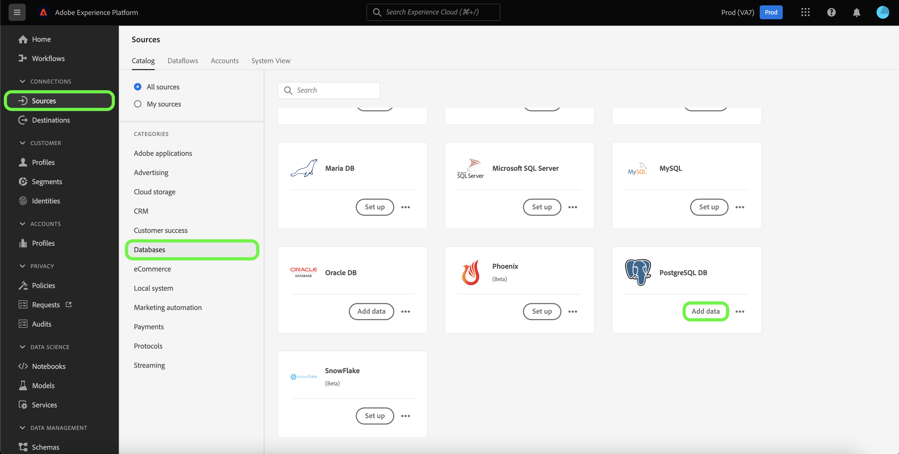

# Een [!DNL PostgreSQL] bronverbinding in de gebruikersinterface

De bronschakelaars in Adobe Experience Platform verstrekken de capaciteit om van buitenaf afkomstige gegevens op een geplande basis in te voeren. Deze zelfstudie bevat stappen voor het maken van een [!DNL PostgreSQL] bronaansluiting met behulp van de [!DNL Platform] gebruikersinterface.

## Aan de slag

Deze zelfstudie vereist een goed begrip van de volgende onderdelen van Adobe Experience Platform:

* [[!DNL Experience Data Model (XDM)] Systeem](../../../../../xdm/home.md): Het gestandaardiseerde kader waardoor [!DNL Experience Platform] organiseert de gegevens van de klantenervaring.
   * [Basisbeginselen van de schemacompositie](../../../../../xdm/schema/composition.md): Leer over de basisbouwstenen van schema&#39;s XDM, met inbegrip van zeer belangrijke principes en beste praktijken in schemacompositie.
   * [Zelfstudie Schema Editor](../../../../../xdm/tutorials/create-schema-ui.md): Leer hoe te om douaneschema&#39;s tot stand te brengen gebruikend de Redacteur UI van het Schema.
* [[!DNL Real-time Customer Profile]](../../../../../profile/home.md): Verstrekt een verenigd, real-time consumentenprofiel dat op bijeengevoegde gegevens van veelvoudige bronnen wordt gebaseerd.

Als u al een geldige [!DNL PostgreSQL] verbinding hebt, kunt u de rest van dit document overslaan en doorgaan naar de zelfstudie op [configureren, gegevensstroom](../../dataflow/databases.md).

### Vereiste referenties verzamelen

Om toegang te krijgen tot uw [!DNL PostgreSQL] account op [!DNL Platform]moet u de volgende waarde opgeven:

| Credentials | Beschrijving |
| ---------- | ----------- |
| `connectionString` | De verbindingstekenreeks die aan uw [!DNL PostgreSQL] account. De [!DNL PostgreSQL] patroon verbindingstekenreeks is: `Server={SERVER};Database={DATABASE};Port={PORT};UID={USERNAME};Password={PASSWORD}`. |

Raadpleeg voor meer informatie over aan de slag gaan [[!DNL PostgreSQL] document](https://www.postgresql.org/docs/9.2/app-psql.html).

#### SSL-versleuteling inschakelen voor uw verbindingstekenreeks

U kunt SSL-codering inschakelen voor uw [!DNL PostgreSQL] verbindingstekenreeks door uw verbindingstekenreeks toe te voegen met de volgende eigenschappen:

| Eigenschap | Beschrijving | Voorbeeld |
| --- | --- | --- |
| `EncryptionMethod` | Hiermee kunt u SSL-codering inschakelen op uw [!DNL PostgreSQL] gegevens. | <uL><li>`EncryptionMethod=0`(Uitgeschakeld)</li><li>`EncryptionMethod=1`(Ingeschakeld)</li><li>`EncryptionMethod=6`(RequestSSL)</li></ul> |
| `ValidateServerCertificate` | Valideert het certificaat dat door uw [!DNL PostgreSQL] database wanneer `EncryptionMethod` wordt toegepast. | <uL><li>`ValidationServerCertificate=0`(Uitgeschakeld)</li><li>`ValidationServerCertificate=1`(Ingeschakeld)</li></ul> |

Hier volgt een voorbeeld van een [!DNL PostgreSQL] verbindingstekenreeks toegevoegd met SSL-codering: `Server={SERVER};Database={DATABASE};Port={PORT};UID={USERNAME};Password={PASSWORD};EncryptionMethod=1;ValidateServerCertificate=1`.

## Verbind uw [!DNL PostgreSQL] account

Nadat u de vereiste gegevens hebt verzameld, kunt u de onderstaande stappen volgen om uw [!DNL PostgreSQL] account aan [!DNL Platform].

Aanmelden bij [Adobe Experience Platform](https://platform.adobe.com) en selecteer vervolgens **[!UICONTROL Sources]** van de linkernavigatiebalk voor toegang tot de **[!UICONTROL Sources]** werkruimte. De **[!UICONTROL Catalog]** in het scherm worden diverse bronnen weergegeven waarmee u een account kunt maken.

U kunt de juiste categorie selecteren in de catalogus aan de linkerkant van het scherm. U kunt ook de specifieke bron vinden waarmee u wilt werken met de zoekoptie.

Onder de **[!UICONTROL Databases]** categorie, selecteert u **[!UICONTROL PostgreSQL DB]**. Als dit de eerste keer is met deze connector, selecteert u **[!UICONTROL Configure]**. Anders selecteert u **[!UICONTROL Add data]** om een nieuwe [!DNL PostgreSQL] -aansluiting.

De **[!UICONTROL Connect to [!DNL PostgreSQL]]** wordt weergegeven. Op deze pagina kunt u nieuwe of bestaande referenties gebruiken.

### Nieuwe account

Als u nieuwe referenties gebruikt, selecteert u **[!UICONTROL New account]**. Geef op het invoerformulier dat wordt weergegeven een naam, een optionele beschrijving en uw [!DNL PostgreSQL] referenties. Als u klaar bent, selecteert u **[!UICONTROL Connect]** en laat dan wat tijd voor de nieuwe verbinding tot stand brengen.

### Bestaande account

Als u een bestaande account wilt verbinden, selecteert u de optie [!DNL PostgreSQL] account waarmee u verbinding wilt maken, selecteert u **[!UICONTROL Next]** om verder te gaan.

## Volgende stappen

Aan de hand van deze zelfstudie hebt u een verbinding tot stand gebracht met uw [!DNL PostgreSQL] account. U kunt nu verdergaan met de volgende zelfstudie en [een gegevensstroom configureren om gegevens over te brengen naar [!DNL Platform]](../../dataflow/databases.md).
