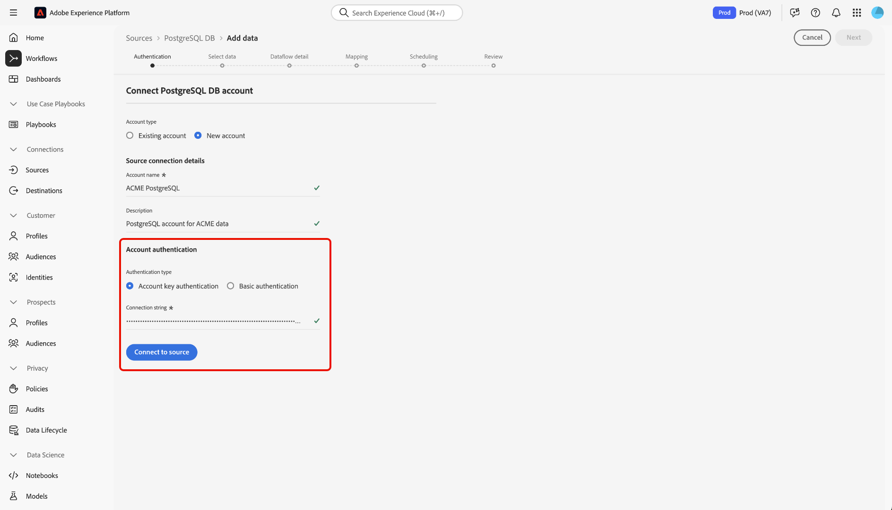
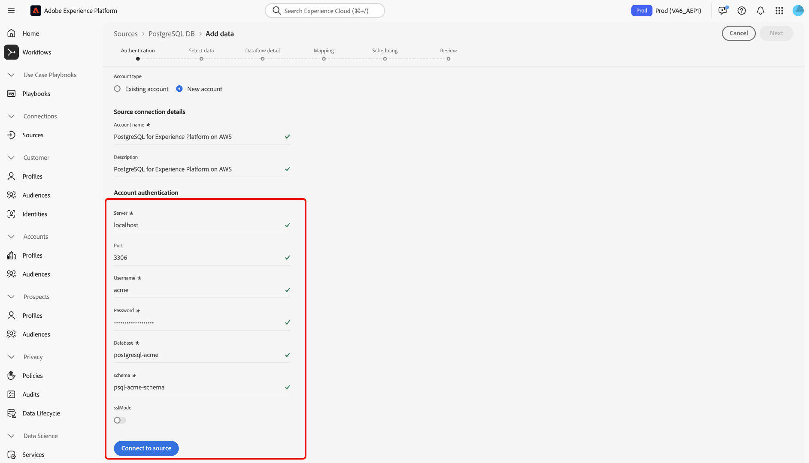

# Verbinding maken [!DNL PostgreSQL] met Experience Platform via de gebruikersinterface

Lees deze handleiding voor informatie over hoe u uw [!DNL PostgreSQL] -database kunt verbinden met Adobe Experience Platform via de werkruimte voor bronnen in de Experience Platform-gebruikersinterface.

## Aan de slag

Deze zelfstudie vereist een goed begrip van de volgende onderdelen van Adobe Experience Platform:

* [[!DNL Experience Data Model (XDM)]  Systeem &#x200B;](../../../../../xdm/home.md): Het gestandaardiseerde kader waardoor Experience Platform gegevens van de klantenervaring organiseert.
   * [&#x200B; Grondbeginselen van schemacompositie &#x200B;](../../../../../xdm/schema/composition.md): Leer over de basisbouwstenen van schema&#39;s XDM, met inbegrip van zeer belangrijke principes en beste praktijken in schemacompositie.
   * [&#x200B; het leerprogramma van de Redacteur van het Schema &#x200B;](../../../../../xdm/tutorials/create-schema-ui.md): Leer hoe te om douaneschema&#39;s tot stand te brengen gebruikend de Redacteur UI van het Schema.
* [[!DNL Real-Time Customer Profile]](../../../../../profile/home.md): biedt een uniform, real-time consumentenprofiel dat is gebaseerd op geaggregeerde gegevens van meerdere bronnen.

Als u reeds een geldige [!DNL PostgreSQL] verbinding hebt, kunt u de rest van dit document overslaan en aan het leerprogramma te werk gaan op [&#x200B; vormend een dataflow &#x200B;](../../dataflow/databases.md).

### Vereiste referenties verzamelen

Lees het [[!DNL PostgreSQL]  overzicht &#x200B;](../../../../connectors/databases/postgres.md) voor meer informatie over authentificatie.

### SSL-versleuteling inschakelen voor uw verbindingstekenreeks

U kunt SSL-codering inschakelen voor de [!DNL PostgreSQL] -verbindingstekenreeks door uw verbindingstekenreeks toe te voegen met de volgende eigenschappen:

| Eigenschap | Beschrijving | Voorbeeld |
| --- | --- | --- |
| `EncryptionMethod` | Hiermee kunt u SSL-codering inschakelen voor uw [!DNL PostgreSQL] -gegevens. | <uL><li>`EncryptionMethod=0` (Uitgeschakeld)</li><li>`EncryptionMethod=1` (Ingeschakeld)</li><li>`EncryptionMethod=6` (RequestSSL)</li></ul> |
| `ValidateServerCertificate` | Hiermee wordt het certificaat gevalideerd dat door de [!DNL PostgreSQL] -database wordt verzonden wanneer `EncryptionMethod` wordt toegepast. | <uL><li>`ValidationServerCertificate=0` (Uitgeschakeld)</li><li>`ValidationServerCertificate=1` (Ingeschakeld)</li></ul> |

Hier volgt een voorbeeld van een [!DNL PostgreSQL] verbindingstekenreeks die is toegevoegd met SSL-codering: `Server={SERVER};Database={DATABASE};Port={PORT};UID={USERNAME};Password={PASSWORD};EncryptionMethod=1;ValidateServerCertificate=1` .

## Navigeren door de catalogus met bronnen {#navigate}

Selecteer in de gebruikersinterface van Experience Platform de optie **[!UICONTROL Sources]** in de linkernavigatie voor toegang tot de werkruimte van *[!UICONTROL Sources]* . Selecteer de juiste categorie in het deelvenster *[!UICONTROL Categories]*. U kunt ook op de zoekbalk navigeren naar de specifieke bron die u wilt gebruiken.

Als u [!DNL PostgreSQL] wilt gebruiken, selecteert u de **[!UICONTROL PostgreSQL DB]** bronkaart onder *[!UICONTROL Databases]* en selecteert u vervolgens **[!UICONTROL Set up]** .

>[!TIP]
>
>Bronnen in de catalogus met bronnen geven de optie **[!UICONTROL Set up]** weer wanneer een bepaalde bron nog geen geverifieerde account heeft. Zodra een geverifieerd account is gemaakt, verandert deze optie in **[!UICONTROL Add data]** .

## Een bestaande account gebruiken {#existing}

Als u een bestaande account wilt gebruiken, selecteert u **[!UICONTROL Existing account]** en vervolgens de [!DNL PostgreSQL] -account die u wilt gebruiken.

## Een nieuwe account maken {#create}

Als u geen bestaand account hebt, moet u een nieuw account maken door de vereiste verificatiereferenties op te geven die overeenkomen met uw bron.

Als u een nieuwe account wilt maken, selecteert u **[!UICONTROL New account]** en geeft u een naam op en voegt u desgewenst een beschrijving voor uw account toe.

### Verbinding maken met Experience Platform on Azure {#azure}

U kunt uw [!DNL PostgreSQL] -account op Azure verbinden met Experience Platform met behulp van een accountsleutel of een basisverificatie.

>[!BEGINTABS]

>[!TAB  de belangrijkste authentificatie van de Rekening ]

Om rekeningszeer belangrijke authentificatie te gebruiken, selecteer **[!UICONTROL Account key authentication]**, verstrek uw [&#x200B; verbindingskoord &#x200B;](../../../../connectors/databases/postgres.md#azure), en selecteer dan **[!UICONTROL Connect to source]**.

>[!TAB  Basisauthentificatie ]

Om basisauthentificatie te gebruiken, selecteer **[!UICONTROL Basic authentication]**, verstrek waarden voor uw [&#x200B; authentificatiegeloofsbrieven &#x200B;](../../../../connectors/databases/postgres.md#azure), en selecteer dan **[!UICONTROL Connect to source]**.

>[!ENDTABS]

### Verbinding maken met Experience Platform op Amazon Web Services (AWS) {#aws}

>[!AVAILABILITY]
>
>Deze sectie is van toepassing op implementaties van Experience Platform die op Amazon Web Services (AWS) worden uitgevoerd. Experience Platform die op AWS wordt uitgevoerd, is momenteel beschikbaar voor een beperkt aantal klanten. Meer over de gesteunde infrastructuur van Experience Platform leren, zie het [&#x200B; multi-wolkenoverzicht van Experience Platform &#x200B;](../../../../../landing/multi-cloud.md).

Om een nieuwe [!DNL PostgreSQL] rekening tot stand te brengen en met Experience Platform op AWS te verbinden, zorg ervoor dat u in een zandbak VA6 bent en dan de noodzakelijke [&#x200B; geloofsbrieven voor authentificatie &#x200B;](../../../../connectors/databases/postgres.md#aws) verstrekt.

## Een gegevensstroom maken voor uw [!DNL PostgreSQL] -gegevens

Aan de hand van deze zelfstudie hebt u een verbinding tot stand gebracht met uw [!DNL MariaDB] -account. U kunt nu aan het volgende leerprogramma verdergaan en [&#x200B; een dataflow vormen om gegevens in Experience Platform &#x200B;](../../dataflow/databases.md) te brengen.
