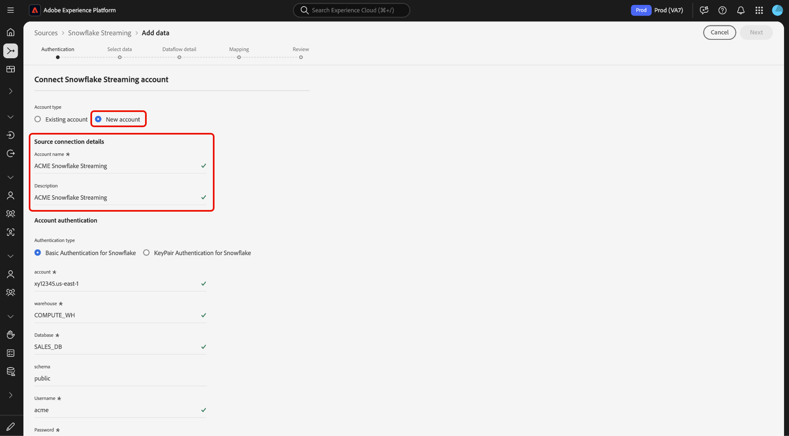
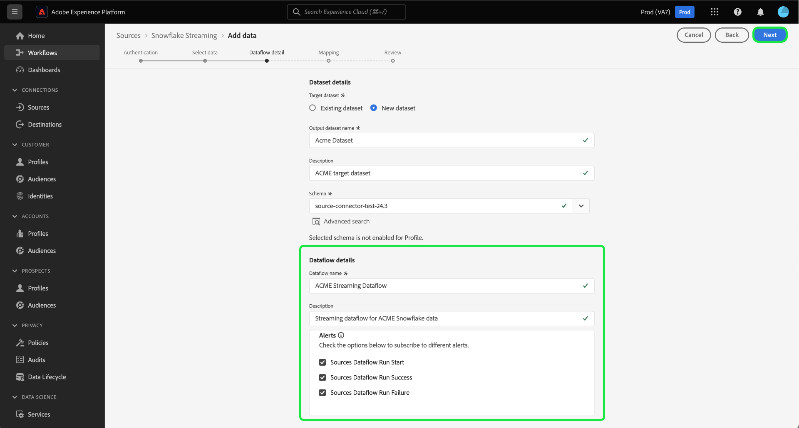
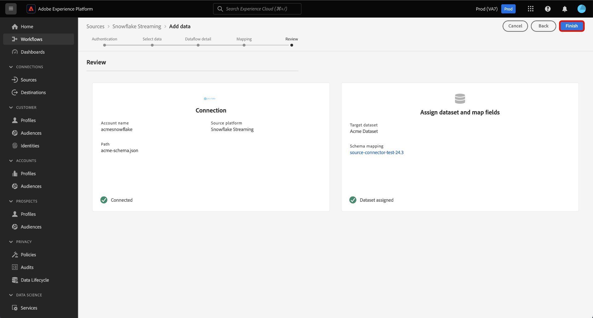

# Gegevens streamen van uw [!DNL Snowflake] database naar Experience Platform met behulp van de gebruikersinterface

Leer hoe u de gebruikersinterface gebruikt om gegevens te streamen vanaf uw [!DNL Snowflake] aan Adobe Experience Platform door deze handleiding te volgen.

## Aan de slag

Deze zelfstudie vereist een goed begrip van de volgende onderdelen van het Experience Platform:

* [[!DNL Experience Data Model (XDM)] Systeem](../../../../../xdm/home.md): Het gestandaardiseerde kader waarbinnen [!DNL Experience Platform] organiseert de gegevens van de klantenervaring.
   * [Basisbeginselen van de schemacompositie](../../../../../xdm/schema/composition.md): Leer over de basisbouwstenen van schema&#39;s XDM, met inbegrip van zeer belangrijke principes en beste praktijken in schemacompositie.
   * [Zelfstudie Schema-editor](../../../../../xdm/tutorials/create-schema-ui.md): Leer hoe u aangepaste schema&#39;s maakt met de gebruikersinterface van de Schema-editor.
* [[!DNL Real-Time Customer Profile]](../../../../../profile/home.md): Biedt een uniform, real-time consumentenprofiel dat is gebaseerd op geaggregeerde gegevens van meerdere bronnen.

### Verificatie

Lees de handleiding op [vereiste installatie voor [!DNL Snowflake] streaming gegevens](../../../../connectors/databases/snowflake-streaming.md) voor informatie over de stappen die u moet voltooien voordat u streaminggegevens kunt invoeren van [!DNL Snowflake] naar Experience Platform.

## Gebruik de [!DNL Snowflake Streaming] bron naar stroom [!DNL Snowflake] gegevens naar Experience Platform

Selecteer in de interface Platform de optie **[!UICONTROL Sources]** van de linkernavigatie om tot [!UICONTROL Sources] werkruimte. U kunt de juiste categorie selecteren in de catalogus aan de linkerkant van het scherm. U kunt ook de specifieke bron vinden waarmee u wilt werken met de zoekoptie.

Onder de *Databases* categorie, selecteert u **[!DNL Snowflake Streaming]** en selecteer vervolgens **[!UICONTROL Add data]**.

>[!TIP]
>
>De bronnen die geen voor authentiek verklaarde rekening in de broncatalogus hebben tonen de **[!UICONTROL Set up]** -optie. Als er eenmaal een geverifieerd account is, wordt deze optie gewijzigd in **[!UICONTROL Add data]**.

De **[!UICONTROL Connect Snowflake Streaming account]** wordt weergegeven. Op deze pagina kunt u nieuwe of bestaande referenties gebruiken.

>[!BEGINTABS]

>[!TAB Een nieuwe account maken]

Als u een nieuwe account wilt maken, selecteert u **[!UICONTROL New account]** en geef een naam, een optionele beschrijving en uw referenties op.

Selecteer **[!UICONTROL Connect to source]** en laat dan wat tijd voor de nieuwe verbinding tot stand brengen.

| Credentials | Beschrijving |
| --- | --- |
| Account | De naam van uw [!DNL Snowflake] account. |
| Warehouse | De naam van uw [!DNL Snowflake] magazijn. De opslagplaatsen beheren de uitvoering van vragen in [!DNL Snowflake]. Elk [!DNL Snowflake] magazijn is onafhankelijk van elkaar en moet individueel worden benaderd om gegevens naar het Experience Platform te brengen. |
| Database | De naam van uw [!DNL Snowflake] database. Het gegevensbestand bevat de gegevens die u aan Experience Platform wilt brengen. |
| Schema | (Optioneel) Het databaseschema dat aan uw [!DNL Snowflake] account. |
| Gebruikersnaam | De gebruikersnaam van uw [!DNL Snowflake] account. |
| Wachtwoord | Het wachtwoord voor uw [!DNL Snowflake] account. |
| Rol | (Optioneel) Een op maat gedefinieerde rol die voor een bepaalde verbinding aan een gebruiker kan worden gegeven. Indien niet opgegeven, wordt deze waarde standaard ingesteld op `public`. |

Voor meer informatie over het maken van accounts leest u de sectie over [rolinstellingen configureren](../../../../connectors/databases/snowflake-streaming.md#configure-role-settings) in de [!DNL Snowflake Streaming] overzicht.

>[!TAB Een bestaande account gebruiken]

Als u een bestaande account wilt gebruiken, selecteert u **[!UICONTROL Existing account]** en selecteert u vervolgens het gewenste account in de bestaande accountcatalogus.

Selecteren **[!UICONTROL Next]** om verder te gaan.

>[!ENDTABS]

## Gegevens selecteren {#select-data}

>[!IMPORTANT]
>
>Er moet een tijdstempelkolom in de brontabel staan om een streaminggegevensstroom te kunnen maken. Het Experience Platform moet weten wanneer gegevens worden ingevoerd en wanneer incrementele gegevens worden gestreamd. Dit is de tijdstempel vereist. U kunt met terugwerkende kracht een tijdstempelkolom toevoegen voor een bestaande verbinding en een nieuwe gegevensstroom creëren.

De [!UICONTROL Select data] wordt weergegeven. In deze stap, moet u de gegevens selecteren u in Experience Platform wilt invoeren, timestamps en timezones vormen, en een dossier van steekproefbrongegevens voor de opname van ruwe gegevens verstrekken.

Gebruik de databasemap links op het scherm en selecteer de tabel die u naar het Experience Platform wilt importeren.

Selecteer vervolgens het kolomtype voor de tijdstempel van de tabel. U kunt kiezen uit twee typen tijdstempelkolommen: `TIMESTAMP_NTZ` of  `TIMESTAMP_LTZ`. Als u een kolomtype selecteert van `TIMESTAMP_NTZ`Dan moet u ook een tijdzone opgeven. De kolommen moeten een beperking hebben die niet null is. Lees voor meer informatie de sectie over [beperkingen en veelgestelde vragen]

Tijdens deze stap kunt u ook instellingen voor backfill configureren. Met Backfill wordt bepaald welke gegevens in eerste instantie worden ingevoerd. Als backfill is ingeschakeld, worden alle huidige bestanden in het opgegeven pad tijdens de eerste geplande inname opgenomen. Als dat niet het geval is, worden alleen de bestanden opgenomen die tussen de eerste opname en de begintijd worden geladen. Bestanden die vóór de begintijd zijn geladen, worden niet opgenomen.

Selecteer de **[!UICONTROL Backfill]** schakelen om terugvullen in te schakelen.

Tot slot selecteert u **[!UICONTROL Choose file]** om een steekproefbrongegevens te uploaden helpen de kaartreeks tot stand brengen, die in een recentere stap zal worden gebruikt om uw originele gegevens aan het Model van Gegevens van de Ervaring (XDM) in kaart te brengen.

Selecteer **[!UICONTROL Next]** om verder te gaan.

## Gegevensset en gegevens over gegevensstroom opgeven {#provide-dataset-and-dataflow-details}

Daarna, moet u informatie over uw dataset en uw gegevensstroom verstrekken.

### Gegevens over gegevensset {#dataset-details}

Een dataset is een opslag en beheersconstructie voor een inzameling van gegevens, typisch een lijst, die een schema (kolommen) en gebieden (rijen) bevat. De gegevens die met succes in Experience Platform worden opgenomen worden voortgeduurd binnen het gegevensmeer als datasets. Tijdens deze stap, kunt u een nieuwe dataset tot stand brengen of een bestaande dataset gebruiken.

>[!BEGINTABS]

>[!TAB Een nieuwe gegevensset gebruiken]

Als u een nieuwe gegevensset wilt gebruiken, selecteert u **[!UICONTROL New dataset]** Geef vervolgens een naam en een optionele beschrijving voor de gegevensset op. U moet ook een schema van het Model van de Gegevens van de Ervaring (XDM) selecteren dat uw dataset volgt aan.

| Nieuwe gegevens gegevensset | Beschrijving |
| --- | --- |
| Naam uitvoergegevensset | De naam van uw nieuwe dataset. |
| Beschrijving | (Optioneel) Een kort overzicht van de nieuwe gegevensset. |
| Schema | Een vervolgkeuzelijst met schema&#39;s die in uw organisatie bestaan. U kunt ook uw eigen schema vóór het proces van de bronconfiguratie maken. Lees voor meer informatie de handleiding op [een XDM-schema maken in de gebruikersinterface](../../../../../xdm/tutorials/create-schema-ui.md). |

>[!TAB Een bestaande gegevensset gebruiken]

Als u al een bestaande dataset hebt, selecteert u **[!UICONTROL Existing dataset]** en gebruikt vervolgens de **[!UICONTROL Advanced search]** optie om een venster van alle datasets in uw organisatie, met inbegrip van hun respectieve details, zoals te bekijken of zij voor opname in het Profiel van de Klant in real time worden toegelaten.

>[!ENDTABS]

+++Selecteer voor stappen om de opname van het Profiel, de diagnostiek van de fout, en gedeeltelijke opname toe te laten.

Als uw dataset voor het Profiel van de Klant in real time wordt toegelaten, dan tijdens deze stap, kunt u van een knevel voorzien **[!UICONTROL Profile dataset]** om uw gegevens in te schakelen voor profielopname. U kunt deze stap ook gebruiken om **[!UICONTROL Error diagnostics]** en **[!UICONTROL Partial ingestion]**.

* **[!UICONTROL Error diagnostics]**: Select **[!UICONTROL Error diagnostics]** om de bron op te dragen om foutendiagnostiek te veroorzaken die u wanneer het controleren van uw datasetactiviteit en dataflow status kunt later van verwijzingen voorzien.
* **[!UICONTROL Partial ingestion]**: Gedeeltelijke batch-opname is de mogelijkheid om gegevens met fouten in te voeren, tot een bepaalde configureerbare drempel. Met deze functie kunt u al uw nauwkeurige gegevens in het Experience Platform opnemen, terwijl al uw onjuiste gegevens afzonderlijk worden opgeslagen met informatie over waarom deze niet geldig zijn.

+++

### Gegevens gegevensstroom {#dataflow-details}

Zodra uw dataset wordt gevormd, moet u details op uw gegevensstroom, met inbegrip van een naam, een facultatieve beschrijving, en waakzame configuraties dan verstrekken.

| Dataflow-configuraties | Beschrijving |
| --- | --- |
| Naam gegevensstroom | De naam van de gegevensstroom.  Standaard wordt hiervoor de naam gebruikt van het bestand dat wordt geïmporteerd. |
| Beschrijving | (Optioneel) Een korte beschrijving van uw gegevensstroom. |
| Waarschuwingen | Experience Platform kan op gebeurtenissen gebaseerde waarschuwingen genereren waarop gebruikers zich kunnen abonneren. Deze opties vereisen een lopende gegevensstroom om hen teweeg te brengen. Lees voor meer informatie de [waarschuwingsoverzicht](../../alerts.md) <ul><li>**Bronnen DataAfter Run Start**: Selecteer deze waarschuwing om een melding te ontvangen wanneer de dataflow-run begint.</li><li>**Bronnen DataAfterFlow voltooid**: Selecteer deze waarschuwing om een melding te ontvangen als de gegevensstroom zonder fouten eindigt.</li><li>**Bronnen DataAfterFlow-fout**: Selecteer deze waarschuwing als u een melding wilt ontvangen als de uitvoering van de gegevensstroom eindigt met fouten.</li></ul> |

Selecteer **[!UICONTROL Next]** om verder te gaan.

## Velden toewijzen aan een XDM-schema {#mapping}

De [!UICONTROL Mapping] wordt weergegeven. Gebruik de toewijzingsinterface om uw brongegevens toe te wijzen aan de aangewezen schemagebieden alvorens die gegevens in Experience Platform in te nemen, dan selecteren **[!UICONTROL Next]**. Voor een uitgebreide gids over hoe te om de kaartinterface te gebruiken, lees [UI-hulplijn voor gegevensvoorinstelling](../../../../../data-prep/ui/mapping.md) voor meer informatie .

## Controleer uw gegevensstroom {#review}

De laatste stap in het proces voor het maken van een gegevensstroom is het controleren van de gegevensstroom voordat deze wordt uitgevoerd. Gebruik de **[!UICONTROL Review]** stap om de details van uw nieuwe gegevensstroom te herzien alvorens het loopt. De details worden gegroepeerd in de volgende categorieën:

* **Verbinding**: Hiermee geeft u het brontype, het relevante pad van het gekozen bronbestand en het aantal kolommen in dat bronbestand weer.
* **Gegevensset- en kaartvelden toewijzen**: Toont welke dataset de brongegevens worden opgenomen in, met inbegrip van het schema dat de dataset volgt.

Nadat u de gegevensstroom hebt gecontroleerd, selecteert u **[!UICONTROL Finish]** en laat enige tijd voor de gegevensstroom worden gecreeerd.

## Volgende stappen

Aan de hand van deze zelfstudie hebt u een streaminggegevensstroom gemaakt voor [!DNL Snowflake] gegevens. Lees de onderstaande documentatie voor aanvullende bronnen.

### Uw gegevensstroom controleren

Zodra uw gegevensstroom is gecreeerd, kunt u de gegevens controleren die door het worden opgenomen om informatie over innamesnelheden, succes, en fouten te bekijken. Voor meer informatie over hoe u streaminggegevens kunt controleren, gaat u naar de zelfstudie op [streaming gegevens controleren in de gebruikersinterface](../../monitor-streaming.md).

### Uw gegevensstroom bijwerken

Ga naar de zelfstudie voor het bijwerken van configuraties voor uw dataflows die plannen, toewijzingen en algemene informatie plannen [het bijwerken van bronnen dataflows in UI](../../update-dataflows.md).

### Uw gegevensstroom verwijderen

U kunt gegevensstromen schrappen die niet meer noodzakelijk of verkeerd gecreeerd gebruikend zijn **[!UICONTROL Delete]** functie beschikbaar in de **[!UICONTROL Dataflows]** werkruimte. Ga voor meer informatie over het verwijderen van gegevensstromen naar de zelfstudie op [gegevens verwijderen in de gebruikersinterface](../../delete.md).