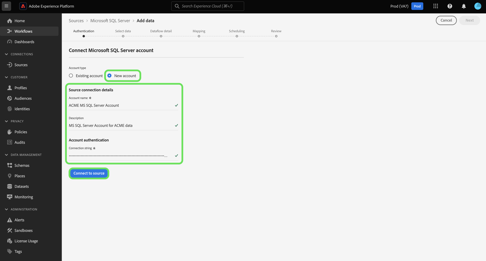

# Creeer een [!DNL Microsoft SQL Server] bronschakelaar in UI

>[!NOTE]
>
> De [!DNL Microsoft SQL Server] connector is in bèta. Zie het [Bronoverzicht](../../../../home.md#terms-and-conditions) voor meer informatie bij het gebruiken van bèta-geëtiketteerde schakelaars.

De bronschakelaars in Adobe Experience Platform verstrekken de capaciteit om van buitenaf afkomstige gegevens op een geplande basis in te voeren. Deze zelfstudie biedt stappen voor het maken van een [!DNL Microsoft SQL Server] (hierna &quot;[!DNL SQL Server]&quot; genoemd) bronconnector met behulp van de [!DNL Platform] gebruikersinterface.

## Aan de slag

Deze zelfstudie vereist een goed begrip van de volgende onderdelen van Adobe Experience Platform:

* [[!DNL Experience Data Model (XDM)] Systeem](../../../../../xdm/home.md): Het gestandaardiseerde kader waardoor het Experience Platform gegevens van de klantenervaring organiseert.
   * [Basisbeginselen van de schemacompositie](../../../../../xdm/schema/composition.md): Leer over de basisbouwstenen van schema&#39;s XDM, met inbegrip van zeer belangrijke principes en beste praktijken in schemacompositie.
   * [Zelfstudie](../../../../../xdm/tutorials/create-schema-ui.md)Schema-editor: Leer hoe te om douaneschema&#39;s tot stand te brengen gebruikend de Redacteur UI van het Schema.
* [[!DNL Real-time Customer Profile]](../../../../../profile/home.md): Verstrekt een verenigd, real-time consumentenprofiel dat op bijeengevoegde gegevens van veelvoudige bronnen wordt gebaseerd.

Als u al een geldige [!DNL SQL Server] verbinding hebt, kunt u de rest van dit document overslaan en verdergaan naar de zelfstudie over het [configureren van een gegevensstroom](../../dataflow/databases.md).

### Vereiste referenties verzamelen

Als u verbinding wilt maken met [!DNL SQL Server] on [!DNL Platform], moet u de volgende eigenschap voor verbinding opgeven:

| Credentials | Beschrijving |
| ---------- | ----------- |
| `connectionString` | De verbindingstekenreeks die aan uw [!DNL SQL Server] account is gekoppeld. Het patroon van de [!DNL SQL Server] verbindingstekenreeks is: `Data Source={SERVER_NAME}\\<{INSTANCE_NAME} if using named instance>;Initial Catalog={DATABASE};Integrated Security=False;User ID={USERNAME};Password={PASSWORD};`. |

Raadpleeg [ [!DNL SQL Server] dit document](https://docs.microsoft.com/en-us/dotnet/framework/data/adonet/sql/authentication-in-sql-server)voor meer informatie over aan de slag gaan.

## Uw [!DNL SQL Server] account verbinden

Nadat u de vereiste gegevens hebt verzameld, kunt u de onderstaande stappen volgen om uw [!DNL SQL Server] account te koppelen aan [!DNL Platform].

Meld u aan bij [Adobe Experience Platform](https://platform.adobe.com) en selecteer vervolgens **[!UICONTROL Bronnen]** in de linkernavigatiebalk voor toegang tot de werkruimte **[!UICONTROL Bronnen]** . In het scherm **[!UICONTROL Catalogus]** worden diverse bronnen weergegeven waarmee u een account kunt maken.

U kunt de juiste categorie selecteren in de catalogus aan de linkerkant van het scherm. U kunt ook de specifieke bron vinden waarmee u wilt werken met de zoekoptie.

Selecteer onder de categorie **[!UICONTROL Databases]** de optie **[!UICONTROL Microsoft SQL Server]**. Als dit uw eerste keer gebruikend deze schakelaar is, uitgezocht **[!UICONTROL vorm]**. Anders, uitgezocht **[!UICONTROL voeg gegevens]** toe om een nieuwe [!DNL SQL Server] schakelaar tot stand te brengen.

De pagina **[!UICONTROL Verbinding maken met Microsoft SQL Server]** wordt weergegeven. Op deze pagina kunt u nieuwe of bestaande referenties gebruiken.

### Nieuwe account

Selecteer **[!UICONTROL Nieuw account]** als u nieuwe referenties gebruikt. Voer in het invoerformulier dat wordt weergegeven een naam, een optionele beschrijving en uw [!DNL SQL Server] referenties in. Wanneer u klaar bent, selecteert u **[!UICONTROL Connect]** en laat u de nieuwe verbinding enige tijd tot stand brengen.

### Bestaande account

Als u een bestaande account wilt verbinden, selecteert u de [!DNL SQL Server] account waarmee u verbinding wilt maken en selecteert u **[!UICONTROL Volgende]** om door te gaan.

## Volgende stappen

Aan de hand van deze zelfstudie hebt u een verbinding met uw [!DNL SQL Server] account tot stand gebracht. U kunt nu verdergaan naar de volgende zelfstudie en een gegevensstroom [configureren om gegevens in te voeren [!DNL Platform]](../../dataflow/databases.md).