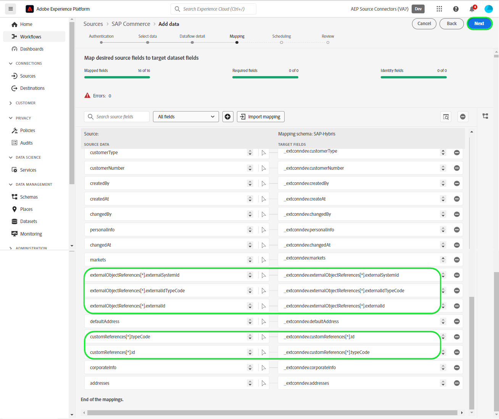

# Een [!DNL SAP Commerce] bronverbinding maken in de gebruikersinterface

>[!NOTE]
>
>De bron [!DNL SAP Commerce] is in bèta. Zie het [ overzicht van bronnen ](../../../../home.md#terms-and-conditions) voor meer informatie bij het gebruiken van bèta-geëtiketteerde bronnen.

Het volgende leerprogramma begeleidt u door de stappen om een [!DNL SAP Commerce] bronverbinding tot stand te brengen om [[!DNL SAP]  het Factureren van het Abonnement ](https://www.sap.com/products/financial-management/subscription-billing.html) contacten en klantengegevens te brengen gebruikend het gebruikersinterface van Adobe Experience Platform.

## Aan de slag {#getting-started}

Deze zelfstudie vereist een goed begrip van de volgende onderdelen van Experience Platform:

* [[!DNL Experience Data Model (XDM)]  Systeem ](../../../../../xdm/home.md): Het gestandaardiseerde kader waardoor [!DNL Experience Platform] gegevens van de klantenervaring organiseert.
   * [ Grondbeginselen van schemacompositie ](../../../../../xdm/schema/composition.md): Leer over de basisbouwstenen van schema&#39;s XDM, met inbegrip van zeer belangrijke principes en beste praktijken in schemacompositie.
   * [ het leerprogramma van de Redacteur van het Schema ](../../../../../xdm/tutorials/create-schema-ui.md): Leer hoe te om douaneschema&#39;s tot stand te brengen gebruikend de Redacteur UI van het Schema.
* [[!DNL Real-Time Customer Profile]](../../../../../profile/home.md): biedt een uniform, real-time consumentenprofiel dat is gebaseerd op geaggregeerde gegevens van meerdere bronnen.

Als u reeds een geldige [!DNL SAP Commerce] rekening hebt, kunt u de rest van dit document overslaan en aan het leerprogramma te werk gaan op [ vormend een dataflow ](../../dataflow/ecommerce.md).

### Vereiste referenties verzamelen {#gather-credentials}

Als u [!DNL SAP Commerce] wilt verbinden met Experience Platform, moet u waarden opgeven voor de volgende verbindingseigenschappen:

| Credentials | Beschrijving |
| --- | --- |
| Client-id | De waarde van `clientId` in de servicetoets. |
| Clientgeheim | De waarde van `clientSecret` in de servicetoets. |
| Punt Token | De waarde van `url` in de servicesleutel komt overeen met `https://subscriptionbilling.authentication.eu10.hana.ondemand.com` . |
| Regio | De locatie van uw datacenter. Het gebied is aanwezig in de `url` en heeft een waarde vergelijkbaar met `eu10` of `us10` . Als de waarde `url` bijvoorbeeld `https://eu10.revenue.cloud.sap/api` is, hebt u `eu10` nodig. |

Voor meer informatie, gelieve te verwijzen naar de [[!DNL SAP Commerce]  documentatie ](https://help.sap.com/docs/CLOUD_TO_CASH_OD/987aec876092428f88162e438acf80d6/c5fcaf96daff4c7a8520188e4d8a1843.html).

### Een Experience Platform-schema maken {#create-platform-schema}

Voordat u een [!DNL SAP Commerce] -bronverbinding maakt, moet u er ook voor zorgen dat u eerst een Experience Platform-schema voor uw bron maakt. Zie het leerprogramma op [ creërend een schema van Experience Platform ](../../../../../xdm/schema/composition.md) voor uitvoerige stappen op hoe te om een schema tot stand te brengen.

Vouw de volgende sectie uit om een voorbeeldschema weer te geven.

+++ Voorbeeld van een schema weergeven

```
{
  "_extconndev": {
    "addresses": [
      {
        "addressUUID": "{ADDRESS_UUID}",
        "city": "Burnaby",
        "country": "Canada",
        "email": "chandni@acme.com",
        "houseNumber": "27",
        "isDefault": false,
        "phone": "123-456-7890",
        "postalCode": "V3J 1X9",
        "state": "British Columbia",
        "street": "Beresford"
      }
    ],
    "changedAt": "1687204041",
    "changedBy": "vero@acme.com",
    "contactNumber": "123-456-7980",
    "corporateInfo": {
      "company": "acme"
    },
    "createAt": "1687204041",
    "createdBy": "vero@acme.com",
    "customReferences": [
      {
        "id": "Sample value",
        "typeCode": "Sample value"
      }
    ],
    "customerNumber": "Sample value",
    "customerType": "Sample value",
    "defaultAddress": {
      "addressUUID": "Sample value",
      "city": "North Vancouver",
      "country": "Canada",
      "email": "chandni@acme.come",
      "houseNumber": "34",
      "isDefault": false,
      "phone": "123-456-7890",
      "postalCode": "V7H 2P1",
      "state": "British Columbia",
      "street": "Maple"
    },
    "externalObjectReferences": [
      {
        "externalId": "{EXTERNAL_ID}",
        "externalIdTypeCode": "{EXTERNAL_ID_TYPE_CODE}",
        "externalSystemId": "{EXTERNAL_SYSTEM_ID}"
      }
    ],
    "markets": [
      {
        "active": false,
        "country": "USA",
        "currency": "USD",
        "marketId": "Sample value",
        "priceinfo": {
          "incoterms": "{INCO_TERMS}",
          "incotermsLocation": "{INCO_TERMS_LOCATION}",
          "priceGroup": "{PRICE_GROUP}",
          "priceListType": "{PRICE_LIST_TYPE}"
        },
        "salesArea": {
          "distributionChannel": "{DISTRIBUTION_CHANNEL}",
          "division": "{DIVISION}",
          "salesOrganization": "{SALES_ORGANIZATION}"
        }
      }
    ],
    "personalInfo": {
      "firstName": "Chandni",
      "lastName": "Kaur"
    }
  },
  "_id": "/uri-reference",
  "_repo": {
    "createDate": "2004-10-23T12:00:00-06:00",
    "modifyDate": "2004-10-23T12:00:00-06:00"
  },
  "createdByBatchID": "/uri-reference",
  "modifiedByBatchID": "/uri-reference",
  "personID": "{PERSON_ID}",
  "repositoryCreatedBy": "kevin@acme.com",
  "repositoryLastModifiedBy": "kevin@acme.com"
}
```

+++

## Sluit uw [!DNL SAP Commerce] -account aan {#connect-account}

Selecteer in de gebruikersinterface van Experience Platform de optie **[!UICONTROL Sources]** in de linkernavigatiebalk voor toegang tot de werkruimte van [!UICONTROL Sources] . In het scherm [!UICONTROL Catalog] worden diverse bronnen weergegeven waarmee u een account kunt maken.

U kunt de juiste categorie selecteren in de catalogus aan de linkerkant van het scherm. U kunt ook de specifieke bron vinden waarmee u wilt werken met de zoekoptie.

Onder de *eCommerce* categorie, selecteer **[!UICONTROL SAP Commerce]**, en selecteer dan **[!UICONTROL Add data]**.

{het schermschot van 0} Experience Platform UI voor catalogus met de kaart van SAP Commerce ](../../../../images/tutorials/create/ecommerce/sap-commerce/catalog-card.png)![

De pagina **[!UICONTROL Connect SAP Commerce account]** wordt weergegeven. Op deze pagina kunt u nieuwe of bestaande referenties gebruiken.

### Bestaande account {#existing-account}

Als u een bestaande account wilt gebruiken, selecteert u de [!DNL SAP Commerce] -account waarmee u een nieuwe gegevensstroom wilt maken en selecteert u vervolgens **[!UICONTROL Next]** om door te gaan.

{het schermschot van 0} Experience Platform UI om de rekening van SAP Commerce met een bestaande rekening te verbinden ](../../../../images/tutorials/create/ecommerce/sap-commerce/existing.png)![

### Nieuwe account {#new-account}

Als u een nieuwe account maakt, selecteert u **[!UICONTROL New account]** en geeft u een naam, een optionele beschrijving en uw referenties op. Als u klaar bent, selecteert u **[!UICONTROL Connect to source]** en laat u de nieuwe verbinding enige tijd tot stand brengen.

{het schermschot van 0} Experience Platform UI om de rekening van SAP Commerce met een nieuwe rekening te verbinden ](../../../../images/tutorials/create/ecommerce/sap-commerce/new.png)![

### Gegevens selecteren {#select-data}

Tot slot moet u het objecttype selecteren dat u aan Experience Platform wilt toevoegen.

| Objecttype | Beschrijving |
| --- | --- |
| `Customers` | De entiteiten met abonnementen. |
| `Contacts` | De contactgegevens voor klanten. |

>[!BEGINTABS]

>[!TAB  Klanten ]

Als u klantgegevens wilt invoeren, selecteert u **[!UICONTROL Customers]** als objecttype en selecteert u vervolgens **[!UICONTROL Next]** .

{het schermschot van 0} Experience Platform UI voor SAP Commerce die configuratie met geselecteerde optie van Klanten toont ](../../../../images/tutorials/create/ecommerce/sap-commerce/configuration-customers.png)![

>[!TAB  Contacten ]

Als u contactgegevens wilt invoeren, selecteert u **[!UICONTROL Contacts]** als objecttype en selecteert u vervolgens **[!UICONTROL Next]** .

{het schermschot van 0} Experience Platform UI voor SAP Commerce die configuratie met geselecteerde optie van Contacten toont ](../../../../images/tutorials/create/ecommerce/sap-commerce/configuration-contacts.png)![

>[!ENDTABS]

## Volgende stappen {#next-steps}

Aan de hand van deze zelfstudie hebt u een verbinding tot stand gebracht met uw [!DNL SAP Commerce] -account. U kunt nu aan het volgende leerprogramma verdergaan en [ een dataflow vormen om gegevens in Experience Platform ](../../dataflow/ecommerce.md) te brengen.

## Aanvullende bronnen {#additional-resources}

De onderstaande secties bevatten aanvullende bronnen waarnaar u kunt verwijzen wanneer u de [!DNL SAP Commerce] -bron gebruikt.

### Toewijzing {#mapping}

Experience Platform biedt intelligente aanbevelingen voor automatisch toegewezen velden op basis van het doelschema of de gegevensset die u hebt geselecteerd. U kunt toewijzingsregels handmatig aanpassen aan uw gebruiksgevallen. Op basis van uw behoeften kunt u ervoor kiezen om velden rechtstreeks toe te wijzen of gegevens prep-functies te gebruiken om brongegevens om berekende of berekende waarden af te leiden. Voor uitvoerige stappen bij het gebruiken van de kaartperinterface en berekende gebieden, zie de [ gids UI van de Prep van Gegevens ](../../../../../data-prep/ui/mapping.md).

De configuraties van de toewijzing voor uw gegevensstroom zullen afhankelijk van uw schema en het objecten type verschillen dat u selecteert om in te voeren.

>[!BEGINTABS]

>[!TAB  Klanten ]

Voor klantengegevens, [!DNL SAP Commerce] gebruikt [ klanten ](https://api.sap.com/api/BusinessPartner_APIs/path/GET_customers) en [ klant-contacten verhoudingen ](https://api.sap.com/api/BusinessPartner_APIs/path/GET_relationships-customer-contacts) eindpunten van [!DNL SAP Business Partners] API om de gegevens terug te winnen

Hieronder ziet u een voorbeeld van het toewijzen van configuraties voor [!DNL SAP Commerce] dataflow voor klantgegevens:

| Doelveld | Beschrijving |
| --- | --- |
| `customerNumber` | Het klantnummer. |
| `corporateInfo` | Het klantnummer. |
| `customerType` | Het type klant. |
| `createdAt` | Een tijdstempel die aangeeft wanneer de klant is gemaakt. |
| `changedAt` | Een tijdstempel die aangeeft wanneer de klant voor het laatst is bijgewerkt. |
| `markets[*].country` | De klanten markten, die als serievoorwerp worden teruggewonnen. |
| `addresses[*].email` | E-mails die zijn gekoppeld aan de meerdere adressen van de klant, opgehaald als een arrayobject. |
| `addresses[*].city` | De steden verbonden aan de veelvoudige adressen van de klant, die als serievoorwerp worden teruggewonnen. |
| `addresses[*].addressUUID` | Id is gekoppeld aan de meerdere adressen van de klant, opgehaald als een matrixobject. |
| `externalObjectReferences[*].externalSystemId` | Aanvullende gegevens, opgehaald als een matrixobject. |
| `externalObjectReferences[*].externalId` | Aanvullende gegevens, opgehaald als een matrixobject. |
| `customReferences[*].id` | Aanvullende gegevens, opgehaald als een matrixobject. |
| `customReferences[*].typeCode` | Aanvullende gegevens, opgehaald als een matrixobject. |



>[!TAB  Contacten ]

Voor contactgegevens, [!DNL SAP Commerce] gebruikt het [ contact ](https://api.sap.com/api/BusinessPartner_APIs/path/GET_contacts) eindpunt van [!DNL SAP Business Partners] API om de gegevens terug te winnen.

Hieronder ziet u een voorbeeld van toewijzingsconfiguraties voor [!DNL SAP Commerce] dataflow voor contactgegevens:

| Doelveld | Beschrijving |
| --- | --- |
| `contactNumber` | Het contactnummer. |
| `createdAt` | Een tijdstempel die aangeeft wanneer de contactpersoon is gemaakt. |
| `changedAt` | Een tijdstempel die aangeeft wanneer de contactpersoon voor het laatst is bijgewerkt. |
| `personalInfo.lastName` | De achternaam van de contactpersoon. |
| `personalInfo.firstName` | De voornaam van de contactpersoon. |
| `externalObjectReferences[*].externalSystemId` | Aanvullende gegevens, opgehaald als een matrixobject. |
| `externalObjectReferences[*].externalId` | Aanvullende gegevens, opgehaald als een matrixobject. |
| `externalObjectReferences[*].externalIdTypeCode` | Aanvullende gegevens, opgehaald als een matrixobject. |


>[!ENDTABS]
