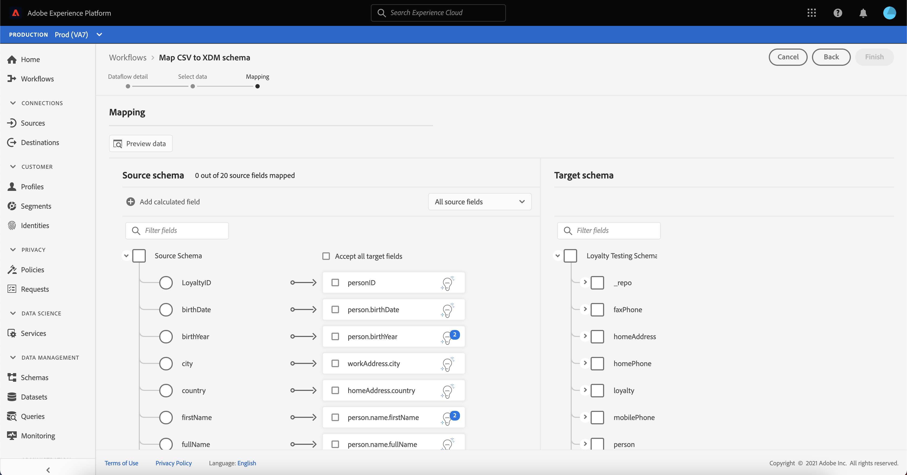
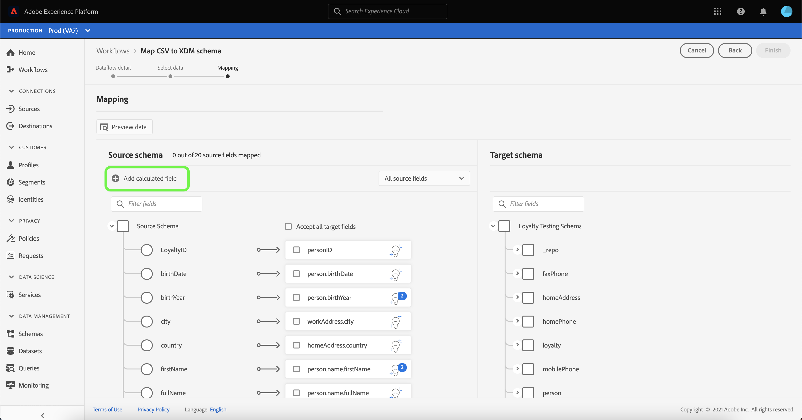
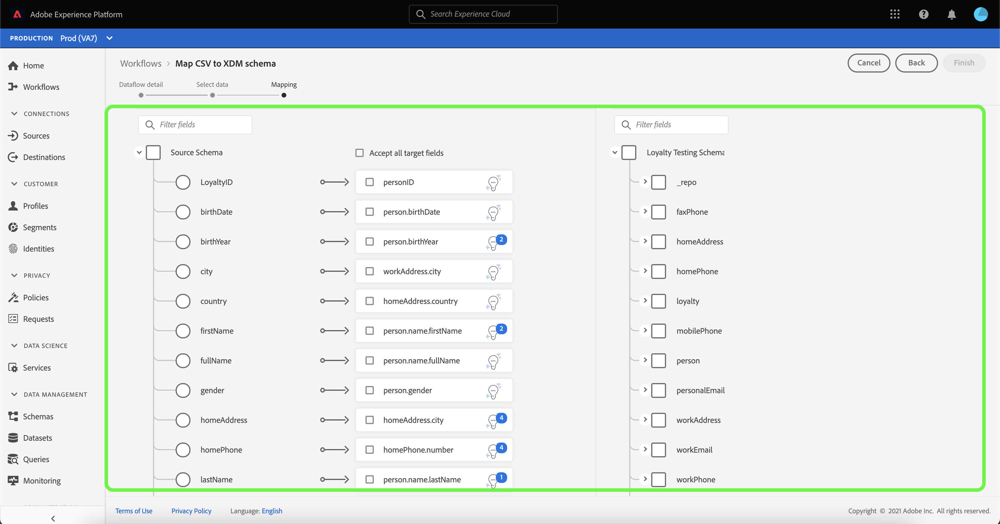

# Een lokale bronconnector voor het uploaden van bestanden maken in de gebruikersinterface

Deze zelfstudie bevat stappen voor het maken van een lokale bronaansluiting voor het uploaden van bestanden om lokale bestanden via de gebruikersinterface in te voeren in het Platform.

## Aan de slag

Deze zelfstudie vereist een goed begrip van de volgende onderdelen van het Platform:

* [[!DNL Experience Data Model (XDM)] Systeem](../../../../../xdm/home.md): Het gestandaardiseerde kader waardoor het Platform gegevens van de klantenervaring organiseert.
   * [Basisbeginselen van de schemacompositie](../../../../../xdm/schema/composition.md): Leer over de basisbouwstenen van schema&#39;s XDM, met inbegrip van zeer belangrijke principes en beste praktijken in schemacompositie.
   * [Zelfstudie](../../../../../xdm/tutorials/create-schema-ui.md) Schema-editor: Leer hoe te om douaneschema&#39;s tot stand te brengen gebruikend de Redacteur UI van het Schema.
* [[!DNL Real-time Customer Profile]](../../../../../profile/home.md): Verstrekt een verenigd, real-time consumentenprofiel dat op bijeengevoegde gegevens van veelvoudige bronnen wordt gebaseerd.

## Lokale bestanden uploaden naar Platform

Selecteer **[!UICONTROL Sources]** in de gebruikersinterface van het Platform in de linkernavigatiebalk voor toegang tot de werkruimte [!UICONTROL Sources]. In het scherm [!UICONTROL Catalog] worden diverse bronnen weergegeven waarvoor u een account kunt maken.

U kunt de juiste categorie selecteren in de catalogus aan de linkerkant van het scherm. U kunt ook de specifieke bron vinden waarmee u wilt werken met de zoekoptie.

Selecteer [!UICONTROL Local system] onder de categorie **[!UICONTROL Local file upload]** en selecteer **[!UICONTROL Configure]**.

### Een bestaande gegevensset gebruiken

De [!UICONTROL Dataflow detail] pagina staat u toe om te selecteren of u uw gegevens CSV in een bestaande dataset of een nieuwe dataset wilt opnemen.

Als u uw CSV-gegevens wilt opnemen in een bestaande gegevensset, selecteert u **[!UICONTROL Existing dataset]**. U kunt of een bestaande dataset terugwinnen gebruikend de [!UICONTROL Advanced search] optie of door door de lijst van bestaande datasets in het dropdown menu te scrollen.

Selecteer een gegevensset en geef een naam op voor de gegevensstroom en een optionele beschrijving.

Tijdens dit proces kunt u [!UICONTROL Error diagnostics] en [!UICONTROL Partial ingestion] ook inschakelen. [!UICONTROL Error diagnostics] laat gedetailleerde foutenmeldingsgeneratie voor om het even welke onjuiste verslagen toe die in uw gegevensstroom voorkomen, terwijl  [!UICONTROL Partial ingestion] staat u toe om gegevens in te voeren die fouten bevatten, tot een bepaalde drempel die u manueel bepaalt. Zie het [overzicht van gedeeltelijke batch-opname](../../../../../ingestion/batch-ingestion/partial.md) voor meer informatie.

### Een nieuwe gegevensset gebruiken

Als u uw CSV-gegevens in een nieuwe gegevensset wilt opnemen, selecteert u **[!UICONTROL New dataset]** en geeft u vervolgens een naam voor de uitvoergegevensset en een optionele beschrijving op. Selecteer vervolgens een schema om toe te wijzen aan de optie [!UICONTROL Advanced search] of door door de lijst met bestaande schema&#39;s in het vervolgkeuzemenu te schuiven.

Selecteer een schema, geef een naam voor de gegevensstroom en een optionele beschrijving op en pas vervolgens de [!UICONTROL Error diagnostics]- en [!UICONTROL Partial ingestion]-instellingen toe die u voor de gegevensstroom wilt gebruiken. Selecteer **[!UICONTROL Next]** als u klaar bent.

### Gegevens selecteren

De stap [!UICONTROL Select data] wordt weergegeven en biedt u een interface voor het uploaden van uw lokale bestanden en het weergeven van een voorvertoning van de structuur en inhoud ervan. Selecteer **[!UICONTROL Choose files]** om een CSV-bestand van uw lokale systeem te uploaden. U kunt ook het CSV-bestand dat u wilt uploaden, slepen en neerzetten in het deelvenster [!UICONTROL Drag and drop files].

>[!TIP]
>
>Momenteel worden alleen CSV-bestanden ondersteund door lokale bestanden te uploaden. De maximale bestandsgrootte voor elk bestand is 1 GB.

Nadat het bestand is geüpload, wordt de voorbeeldinterface bijgewerkt en worden de inhoud en de structuur van het bestand weergegeven.

Afhankelijk van het bestand kunt u een kolomscheidingsteken selecteren, zoals tabs, komma&#39;s, pijpen of een aangepast kolomscheidingsteken voor de brongegevens. Selecteer de **[!UICONTROL Delimiter]** vervolgkeuzepijl en selecteer vervolgens het juiste scheidingsteken in het menu.

Selecteer **[!UICONTROL Next]** als u klaar bent.

### Toewijzing

De stap [!UICONTROL Mapping] verschijnt, die u van een interface voorzien om de brongebieden van uw bronschema aan hun aangewezen doelXDM gebieden in het doelschema in kaart te brengen.

#### Gegevens voorvertonen

Selecteer **[!UICONTROL Preview data]** om toewijzingsresultaten van maximaal 100 rijen steekproefgegevens van de geselecteerde dataset te zien.

Tijdens de voorvertoning krijgt de identiteitskolom de prioriteit als het eerste veld, omdat dit de belangrijkste informatie is die nodig is voor het valideren van toewijzingsresultaten. Selecteer **[!UICONTROL Close]** als u klaar bent.

#### Berekend veld toevoegen

Met berekende velden kunnen waarden worden gemaakt op basis van de kenmerken in het invoerschema. Deze waarden kunnen vervolgens aan kenmerken in het doelschema worden toegewezen en een naam en beschrijving worden gegeven om de referentie eenvoudiger te maken.

Selecteer de **[!UICONTROL Add calculated field]** knoop om te werk te gaan.

Het [!UICONTROL Create calculated field] paneel verschijnt. Het linkerdialoogvenster bevat de velden, functies en operatoren die in berekende velden worden ondersteund. Selecteer een van de tabbladen om functies, velden of operatoren toe te voegen aan de expressie-editor.

| Tab | Beschrijving |
| --------- | ----------- |
| -functie | Op het tabblad Functies staan de functies die beschikbaar zijn voor het transformeren van de gegevens. Voor meer informatie over de functies die u kunt gebruiken binnen berekende velden, leest u de handleiding op [met de functies Data Prep (Mapper)](../../../../../data-prep/functions.md). |
| Veld | Het tabblad Veld bevat velden en kenmerken die beschikbaar zijn in het bronschema. |
| Operator | Het tabblad Operatoren bevat een lijst met operatoren die beschikbaar zijn om de gegevens te transformeren. |

Selecteer de uitdrukkingsredacteur om gebieden, functies, en exploitanten manueel toe te voegen. Nadat u een berekend veld hebt gemaakt, selecteert u **[!UICONTROL Save]** om door te gaan.

#### Bronschematoewijzingsstructuur filteren

Als u door het bronschema wilt filteren, selecteert u **[!UICONTROL All source fields]** en selecteert u in het vervolgkeuzemenu het specifieke veld dat u wilt toewijzen.

In de volgende tabel worden de sorteeropties voor de structuur van het bronschema weergegeven:

| Bronvelden | Beschrijving |
| --- | --- |
| [!UICONTROL All source fields] | Met deze optie worden alle bronvelden van het bronschema weergegeven. Deze optie wordt standaard weergegeven. |
| [!UICONTROL Required fields] | Met deze optie filtert u het bronschema zodat alleen de velden worden weergegeven die nodig zijn om de toewijzing te voltooien. |
| [!UICONTROL Identity fields] | Met deze optie filtert u het bronschema zodat alleen de velden worden weergegeven die zijn gemarkeerd voor Identiteit. |
| [!UICONTROL Mapped fields] | Met deze optie filtert u het bronschema zodat alleen de velden worden weergegeven die al zijn toegewezen. |
| [!UICONTROL Unmapped fields] | Met deze optie filtert u het bronschema zodat alleen de velden worden weergegeven die nog moeten worden toegewezen. |
| [!UICONTROL Fields with recommendation] | Met deze optie filtert u het bronschema om alleen de velden weer te geven die toewijzingsaanbevelingen bevatten. |

#### Intelligente aanbevelingen

Het Platform verstrekt automatisch intelligente aanbevelingen voor auto-in kaart gebrachte gebieden die op het doelschema of de dataset worden gebaseerd die u selecteerde. U kunt toewijzingsregels handmatig aanpassen aan uw gebruiksgevallen.

Als u alle automatisch gegenereerde toewijzingswaarden wilt accepteren, selecteert u **[!UICONTROL Accept all target fields]**.

Soms is er meer dan één aanbeveling beschikbaar voor het bronschema. Als dit gebeurt, wordt op de kaart de meest prominente aanbeveling weergegeven, gevolgd door een blauwe cirkel die het aantal aanvullende aanbevelingen bevat dat beschikbaar is. Als u het gloeilamppictogram selecteert, wordt een lijst met aanvullende aanbevelingen weergegeven. U kunt één van de afwisselende aanbevelingen kiezen door checkbox naast de aanbeveling te selecteren u aan in plaats daarvan wilt in kaart brengen.

Alternatief, kunt u verkiezen om uw bronschema aan uw doelschema manueel in kaart te brengen. Hiervoor plaatst u de muisaanwijzer boven het bronschema dat u wilt toewijzen en selecteert u de plusknop (`+`).

De pop-up **[!UICONTROL Map source to target field]** wordt weergegeven. Van hieruit kunt u selecteren welk veld u wilt toewijzen, gevolgd door **[!UICONTROL Save]** om de nieuwe toewijzing toe te voegen.

Selecteer **[!UICONTROL Finished]** als u klaar bent.

## Gegevens bijhouden

Nadat het CSV-bestand is toegewezen en gemaakt, kunt u de gegevens die ermee worden ingevoerd, controleren met het dashboard voor bewaking. Voor meer informatie, zie de zelfstudie over [controlemeldingen van bronnen in UI](../../../../../dataflows/ui/monitor-sources.md).

## Volgende stappen

Aan de hand van deze zelfstudie hebt u een standaard CSV-bestand toegewezen aan een XDM-schema en het in Platform opgenomen. Deze gegevens kunnen nu worden gebruikt door downstreamservices [!DNL Platform], zoals [!DNL Real-time Customer Profile]. Zie het overzicht voor [[!DNL Real-time Customer Profile]](../../../../../profile/home.md) voor meer informatie.
