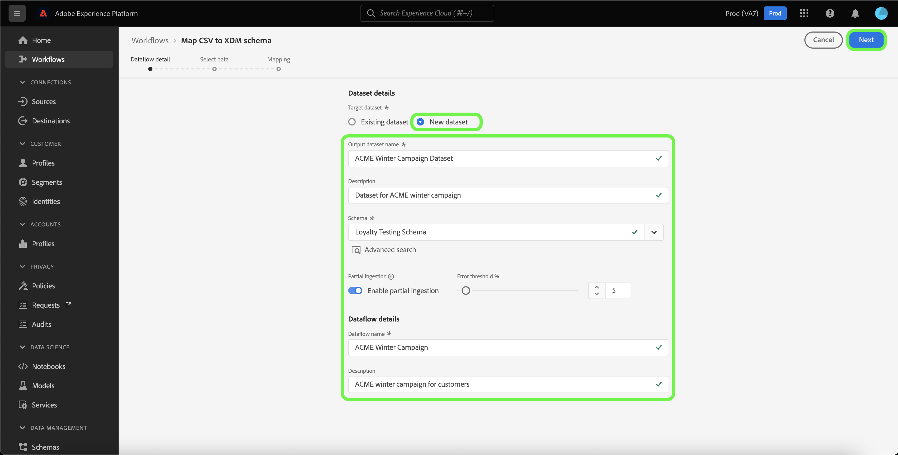

# Een lokale bronconnector voor het uploaden van bestanden maken in de gebruikersinterface

Deze zelfstudie bevat stappen voor het maken van een lokale bronaansluiting voor het uploaden van bestanden om lokale bestanden via de gebruikersinterface in te voeren in Experience Platform.

## Aan de slag

Deze zelfstudie vereist een goed begrip van de volgende onderdelen van Experience Platform:

* [[!DNL Experience Data Model (XDM)]  Systeem ](../../../../../xdm/home.md): Het gestandaardiseerde kader waardoor Experience Platform gegevens van de klantenervaring organiseert.
   * [ Grondbeginselen van schemacompositie ](../../../../../xdm/schema/composition.md): Leer over de basisbouwstenen van schema&#39;s XDM, met inbegrip van zeer belangrijke principes en beste praktijken in schemacompositie.
   * [ het leerprogramma van de Redacteur van het Schema ](../../../../../xdm/tutorials/create-schema-ui.md): Leer hoe te om douaneschema&#39;s tot stand te brengen gebruikend de Redacteur UI van het Schema.
* [[!DNL Real-Time Customer Profile]](../../../../../profile/home.md): biedt een uniform, real-time consumentenprofiel dat is gebaseerd op geaggregeerde gegevens van meerdere bronnen.

## Lokale bestanden uploaden naar Experience Platform

Selecteer in de gebruikersinterface van Experience Platform de optie **[!UICONTROL Sources]** in de linkernavigatiebalk voor toegang tot de werkruimte van [!UICONTROL Sources] . In het scherm [!UICONTROL Catalog] worden diverse bronnen weergegeven waarvoor u een account kunt maken.

U kunt de juiste categorie selecteren in de catalogus aan de linkerkant van het scherm. U kunt ook de specifieke bron vinden waarmee u wilt werken met de zoekoptie.

Selecteer onder de categorie [!UICONTROL Local system] de optie **[!UICONTROL Local file upload]** en selecteer vervolgens **[!UICONTROL Add data]** .

### Een bestaande gegevensset gebruiken

De [!UICONTROL Dataflow detail] pagina staat u toe om te selecteren of u uw gegevens CSV in een bestaande dataset of een nieuwe dataset wilt opnemen.

Als u uw CSV-gegevens in een bestaande gegevensset wilt opnemen, selecteert u **[!UICONTROL Existing dataset]** . U kunt of een bestaande dataset terugwinnen gebruikend de [!UICONTROL Advanced search] optie of door door de lijst van bestaande datasets in het dropdown menu te scrollen.

Selecteer een gegevensset en geef een naam op voor de gegevensstroom en een optionele beschrijving.

Tijdens dit proces kunt u ook [!UICONTROL Error diagnostics] en [!UICONTROL Partial ingestion] inschakelen. In [!UICONTROL Error diagnostics] kunnen gedetailleerde foutberichten worden gegenereerd voor onjuiste records in de gegevensstroom, terwijl u in [!UICONTROL Partial ingestion] gegevens met fouten kunt invoeren tot een bepaalde drempel die u handmatig definieert. Zie het [ gedeeltelijke overzicht van partijingestie ](../../../../../ingestion/batch-ingestion/partial.md) voor meer informatie.

### Een nieuwe gegevensset gebruiken

Als u uw CSV-gegevens in een nieuwe gegevensset wilt opnemen, selecteert u **[!UICONTROL New dataset]** en geeft u vervolgens een naam voor de uitvoergegevensset en een optionele beschrijving op. Selecteer vervolgens het schema dat u wilt toewijzen met de optie [!UICONTROL Advanced search] of door door de lijst met bestaande schema&#39;s in het vervolgkeuzemenu te bladeren.

Selecteer een schema, geef een naam voor de gegevensstroom en een optionele beschrijving op en pas vervolgens de [!UICONTROL Error diagnostics] - en [!UICONTROL Partial ingestion] -instellingen toe die u voor de gegevensstroom wilt gebruiken. Selecteer **[!UICONTROL Next]** als u klaar bent.

### Gegevens selecteren

De stap [!UICONTROL Select data] wordt weergegeven, zodat u een interface hebt om uw lokale bestanden te uploaden en een voorvertoning van de structuur en inhoud ervan weer te geven. Selecteer **[!UICONTROL Choose files]** om een CSV-bestand van uw lokale systeem te uploaden. U kunt ook het CSV-bestand dat u wilt uploaden naar het deelvenster [!UICONTROL Drag and drop files] slepen.

>[!TIP]
>
>Momenteel worden alleen CSV-bestanden ondersteund door lokale bestanden te uploaden. De maximale bestandsgrootte voor elk bestand is 1 GB.

Nadat het bestand is geüpload, wordt de voorbeeldinterface bijgewerkt en worden de inhoud en de structuur van het bestand weergegeven.

Afhankelijk van het bestand kunt u een kolomscheidingsteken selecteren, zoals tabs, komma&#39;s, pijpen of een aangepast kolomscheidingsteken voor de brongegevens. Selecteer de vervolgkeuzepijl **[!UICONTROL Delimiter]** en selecteer vervolgens het juiste scheidingsteken in het menu.

Selecteer **[!UICONTROL Next]** als u klaar bent.

## Toewijzing

De stap [!UICONTROL Mapping] verschijnt, die u van een interface voorziet om de brongebieden van uw bronschema aan hun aangewezen doelXDM gebieden in het doelschema in kaart te brengen.

Op basis van uw behoeften kunt u ervoor kiezen om velden rechtstreeks toe te wijzen of gegevens prep-functies te gebruiken om brongegevens om berekende of berekende waarden af te leiden. Voor uitvoerige stappen bij het gebruiken van de kaartinterface, zie de [ gids UI van de Prep van Gegevens ](../../../../../data-prep/ui/mapping.md).

Als uw sets met toewijzingen gereed zijn, selecteert u **[!UICONTROL Finish]** en laat u enkele ogenblikken de nieuwe gegevensstroom toe.

## Gegevens bijhouden

Nadat het CSV-bestand is toegewezen en gemaakt, kunt u de gegevens die ermee worden ingevoerd, controleren met het dashboard voor bewaking. Voor meer informatie, zie het leerprogramma op [ controlemogelijkheden dataflows in UI ](../../../../../dataflows/ui/monitor-sources.md).

## Volgende stappen

Aan de hand van deze zelfstudie hebt u een standaard CSV-bestand toegewezen aan een XDM-schema en het in Experience Platform opgenomen. Deze gegevens kunnen nu worden gebruikt door downstream [!DNL Experience Platform] -services, zoals [!DNL Real-Time Customer Profile] . Zie het overzicht voor [[!DNL Real-Time Customer Profile]](../../../../../profile/home.md) voor meer informatie.
