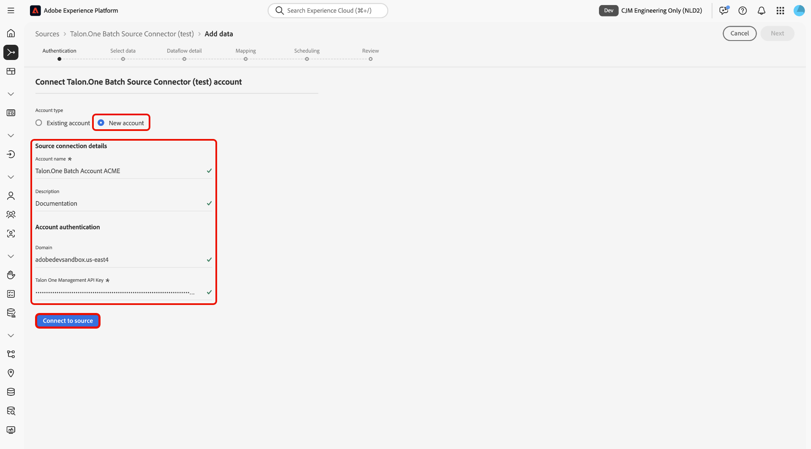

# Batchgegevens vanuit [!DNL Talon.One] in Experience Platform opnemen met de gebruikersinterface

>[!AVAILABILITY]
>
>De bron [!DNL Talon.One] is in bèta. Lees de [&#x200B; termijnen en voorwaarden &#x200B;](../../../../home.md#terms-and-conditions) in het bronoverzicht voor meer informatie bij het gebruiken van bèta-geëtiketteerde bronnen.

Lees deze zelfstudie om te leren hoe u batchgegevens van uw [!DNL Talon.One] -account in Adobe Experience Platform kunt invoeren met de werkruimte voor bronnen in de gebruikersinterface.

## Aan de slag

Deze zelfstudie vereist een goed begrip van de volgende onderdelen van Experience Platform:

* [[!DNL Experience Data Model (XDM)]  Systeem &#x200B;](../../../../../xdm/home.md): Het gestandaardiseerde kader waardoor Experience Platform gegevens van de klantenervaring organiseert.
   * [&#x200B; Grondbeginselen van schemacompositie &#x200B;](../../../../../xdm/schema/composition.md): Leer over de basisbouwstenen van schema&#39;s XDM, met inbegrip van zeer belangrijke principes en beste praktijken in schemacompositie.
   * [&#x200B; het leerprogramma van de Redacteur van het Schema &#x200B;](../../../../../xdm/tutorials/create-schema-ui.md): Leer hoe te om douaneschema&#39;s tot stand te brengen gebruikend de Redacteur UI van het Schema.
* [[!DNL Real-Time Customer Profile]](../../../../../profile/home.md): biedt een uniform, real-time consumentenprofiel dat is gebaseerd op geaggregeerde gegevens van meerdere bronnen.

>[!IMPORTANT]
>
>Lees het [[!DNL Talon.One]  overzicht &#x200B;](../../../../connectors/loyalty/talon-one.md) om over in de eerste plaats vereiste stappen te leren die u moet voltooien alvorens uw rekening met Experience Platform te verbinden.

## Navigeren door de catalogus met bronnen

Selecteer in de gebruikersinterface van Experience Platform de optie **[!UICONTROL Sources]** in de linkernavigatie voor toegang tot de werkruimte van *[!UICONTROL Sources]* . Selecteer de gewenste categorie in het deelvenster *[!UICONTROL Categories]* . U kunt ook met de zoekbalk navigeren naar de specifieke bron die u wilt gebruiken.

Als u gegevens uit [!DNL Talon.One] wilt invoeren, selecteert u de **[!UICONTROL Talon.One Batch Source Connector]** bronkaart onder *[!UICONTROL Loyalty]* en selecteert u vervolgens **[!UICONTROL Add data]** .

>[!TIP]
>
>Bronnen in de catalogus met bronnen geven de optie **[!UICONTROL Set up]** weer wanneer een bepaalde bron nog geen geverifieerde account heeft. Zodra een geverifieerd account is gemaakt, verandert deze optie in **[!UICONTROL Add data]** .

### Een nieuwe account maken

Als u een nieuwe account voor uw [!DNL Talon.One] -bron wilt maken, selecteert u **[!UICONTROL New account]** en geeft u een naam en een optionele beschrijving voor uw account op. Geef vervolgens uw [!DNL Talon.One] -domein en uw [!UICONTROL Talon.One Management API Key] op. Als u klaar bent, selecteert u **[!UICONTROL Connect to source]** en laat u de verbinding enkele ogenblikken tot stand brengen.

### Een bestaande account gebruiken

Als u een bestaande account wilt gebruiken, selecteert u **[!UICONTROL Existing account]** en selecteert u de [!DNL Talon.One] -account die u wilt gebruiken in de accountinterface.

## Gegevens selecteren

Zodra u voor authentiek hebt verklaard, verstrek waarden voor uw **applicationId** en **sessionType**. Tijdens deze stap kunt u de voorvertoningsfuncties gebruiken om de structuur van uw gegevens te inspecteren. Als u klaar bent, selecteert u **[!UICONTROL Next]** om door te gaan.

## Gegevens over gegevensset en gegevensstroom configureren

Daarna, moet u informatie betreffende uw dataset en uw gegevensstroom verstrekken.

### Gegevens over gegevensset

Een dataset is een opslag en beheersconstructie voor een inzameling van gegevens, typisch een lijst, die een schema (kolommen/gebieden) en verslagen (rijen) bevat. De gegevens die met succes in Experience Platform worden opgenomen worden voortgeduurd binnen het gegevensmeer als datasets.

Tijdens deze stap, kunt u of een bestaande dataset gebruiken of een nieuwe dataset creëren.

>[!NOTE]
>
>Ongeacht of u een bestaande dataset gebruikt of een nieuwe dataset creeert, moet u ervoor zorgen dat uw dataset **voor de opname van het Profiel** wordt toegelaten.

+++Selecteer deze optie als u de stappen voor het inschakelen van profielopname, foutdiagnose en gedeeltelijke inname wilt uitvoeren.

Als uw dataset voor het Profiel van de Klant in real time wordt toegelaten, dan tijdens deze stap, kunt u **[!UICONTROL Profile dataset]** van een knevel voorzien om uw gegevens voor de opname van het Profiel toe te laten. U kunt deze stap ook gebruiken om **[!UICONTROL Error diagnostics]** en **[!UICONTROL Partial ingestion]** in te schakelen.

* **[!UICONTROL Error diagnostics]**: Selecteer **[!UICONTROL Error diagnostics]** om de bron de instructie te geven foutdiagnostiek te produceren waarnaar u later kunt verwijzen bij het controleren van de gegevenssetactiviteit en de status van de gegevensstroom.
* **[!UICONTROL Partial ingestion]**: Gedeeltelijke batch-opname is de mogelijkheid om gegevens met fouten in te voeren tot een bepaalde configureerbare drempel. Met deze functie kunt u al uw nauwkeurige gegevens in Experience Platform opnemen, terwijl al uw onjuiste gegevens afzonderlijk worden opgeslagen met informatie over waarom deze niet geldig zijn.

+++

## Gegevens gegevensstroom

Zodra uw dataset wordt gevormd, moet u details op uw gegevensstroom, met inbegrip van een naam, een facultatieve beschrijving, en waakzame configuraties dan verstrekken.

| Dataflow-configuraties | Beschrijving |
| --- | --- |
| Naam gegevensstroom | De naam van de gegevensstroom. Standaard wordt hiervoor de naam gebruikt van het bestand dat wordt geïmporteerd. |
| Beschrijving | (Optioneel) Een korte beschrijving van uw gegevensstroom. |
| Waarschuwingen | Experience Platform kan waarschuwingen op basis van gebeurtenissen produceren waarop gebruikers zich kunnen abonneren. Met deze opties kan een actieve gegevensstroom deze waarschuwingen activeren.  Voor meer informatie, lees het [&#x200B; alarm overzicht &#x200B;](../../alerts.md) <ul><li>**het Begin van de Looppas van Bronnen Dataflow**: Selecteer dit alarm om een bericht te ontvangen wanneer uw dataflow looppas begint.</li><li>**Bronnen Dataflow de Succes van de Looppas**: Selecteer dit alarm om een bericht te ontvangen als uw dataflow zonder enige fouten beëindigt.</li><li>**de Uitval van de Looppas van Gegevensstroom van Bronnen**: Selecteer dit alarm om een bericht te ontvangen als uw dataflow looppas met om het even welke fouten beëindigt.</li></ul> |

{style="table-layout:auto"}

## Toewijzing

Met uw gevormde dataset en dataflow details, kunt u nu te werk gaan om uw brongegevensgebieden aan hun aangewezen doelXDM gebieden in kaart te brengen. Gebruik de toewijzingsinterface om uw brongegevens toe te wijzen aan de aangewezen schemagebieden alvorens gegevens aan Experience Platform in te voeren. Voor meer informatie, lees de [&#x200B; kaartgids in UI &#x200B;](../../../../../data-prep/ui/mapping.md).

>[!IMPORTANT]
>
>Voor extra begeleiding bij het in kaart brengen van uw [!DNL Talon.One] brongegevens, lees het [[!DNL Talon.One]  overzicht &#x200B;](../../../../connectors/loyalty/talon-one.md#mapping).

## Plaats uw gegevensstroomopname

De stap [!UICONTROL Scheduling] wordt weergegeven. Gebruik de interface om een innameprogramma te vormen om de geselecteerde brongegevens automatisch in te nemen gebruikend de gevormde afbeeldingen. De planning wordt standaard ingesteld op `Once` . Als u de innamefrequentie wilt aanpassen, selecteert u **[!UICONTROL Frequency]** en vervolgens een optie in het vervolgkeuzemenu.

>[!TIP]
>
>Interval en backfill zijn niet zichtbaar tijdens een eenmalige opname.

Als u de innamefrequentie instelt op `Minute` , `Hour` , `Day` of `Week` , moet u een interval instellen om een bepaald tijdkader tussen elke inname te maken. Als de innamefrequentie bijvoorbeeld is ingesteld op `Day` en als het interval is ingesteld op `15` , worden gegevens elke 15 dagen opgenomen.

Tijdens deze stap, kunt u **backfill** ook toelaten en een kolom voor de stijgende opname van gegevens bepalen. Backfill wordt gebruikt om historische gegevens in te voeren, terwijl in de kolom die u voor incrementele inname definieert, nieuwe gegevens kunnen worden onderscheiden van bestaande gegevens.

Zie de lijst hieronder voor meer informatie over het plannen van configuraties.

| Configuratie plannen | Beschrijving |
| --- | --- |
| Frequentie | Vorm frequentie om erop te wijzen hoe vaak dataflow zou moeten lopen. U kunt de frequentie instellen op: <ul><li>**Eenmaal**: Plaats uw frequentie aan `once` om eenmalig te creëren. Configuraties voor interval en backfill zijn niet beschikbaar wanneer u een eenmalige gegevensstroom maakt. Standaard wordt de planningsfrequentie ingesteld op één keer.</li><li>**Minuut**: Plaats uw frequentie aan `minute` om uw gegevensstroom te plannen om gegevens op een per-minieme basis in te voeren.</li><li>**Uur**: Plaats uw frequentie aan `hour` om uw gegevensstroom te plannen om gegevens op een per-uurbasis in te voeren.</li><li>**Dag**: Plaats uw frequentie aan `day` om uw gegevensstroom te plannen om gegevens op een per-dagbasis in te voeren.</li><li>**Week**: Plaats uw frequentie aan `week` om uw gegevensstroom te plannen om gegevens op een per-weekbasis in te voeren.</li></ul> |
| Interval | Zodra u een frequentie selecteert, kunt u het interval dat dan vormen om het tijdkader tussen elke opname te vestigen. Bijvoorbeeld, als u uw frequentie aan dag plaatst en het interval aan 15 vormt, dan zal uw dataflow om de 15 dagen lopen. U kunt het interval niet instellen op nul. De minimaal toegestane intervalwaarde voor elke frequentie is als volgt:<ul><li>**Eenmaal**: n/a</li><li>**Minuut**: 15</li><li>**Uur**: 1</li><li>**Dag**: 1</li><li>**Week**: 1</li></ul> |
| Begintijd | Het tijdstempel voor de geprojecteerde run, weergegeven in UTC-tijdzone. |
| Achtergrond | Met Backfill wordt bepaald welke gegevens in eerste instantie worden ingevoerd. Als backfill is ingeschakeld, worden alle huidige bestanden in het opgegeven pad tijdens de eerste geplande inname opgenomen. Als terugvullen is uitgeschakeld, worden alleen de bestanden opgenomen die tussen de eerste opname en de begintijd worden geladen. Bestanden die vóór de begintijd zijn geladen, worden niet opgenomen. |

## Controleren

De stap *[!UICONTROL Review]* wordt weergegeven, zodat u de details van de gegevensstroom kunt bekijken voordat deze wordt gemaakt. De details worden gegroepeerd in de volgende categorieën:

* **[!UICONTROL Connection]**: geeft de accountnaam, het bronplatform en de bronnaam weer.
* **[!UICONTROL Assign dataset and map fields]**: toont de doeldataset en het schema dat de dataset volgt.

Selecteer **[!UICONTROL Finish]** nadat u hebt bevestigd dat de details juist zijn.

## Uw gegevensstroom controleren

Zodra uw gegevensstroom is gecreeerd, kunt u de gegevens controleren die door het worden opgenomen om informatie over innamepercentages, succes, en fouten te zien. Voor meer informatie over hoe te om dataflow te controleren, zie het leerprogramma op [&#x200B; controlerekeningen en dataflows in UI &#x200B;](../../../../../dataflows/ui/monitor-sources.md).

## Bekende beperkingen

Wanneer u gegevens van het schema van [!DNL Talon.One] toewijst aan Adobe Experience Platform, is het momenteel niet mogelijk om meerdere effecten van hetzelfde type in één transactie vast te leggen. Als een transactie bijvoorbeeld meerdere `setDiscount` -effecten bevat (zoals kortingen van verschillende campagnes), blijft slechts een van deze effecten behouden tijdens het toewijzen en worden de andere overschreven.
