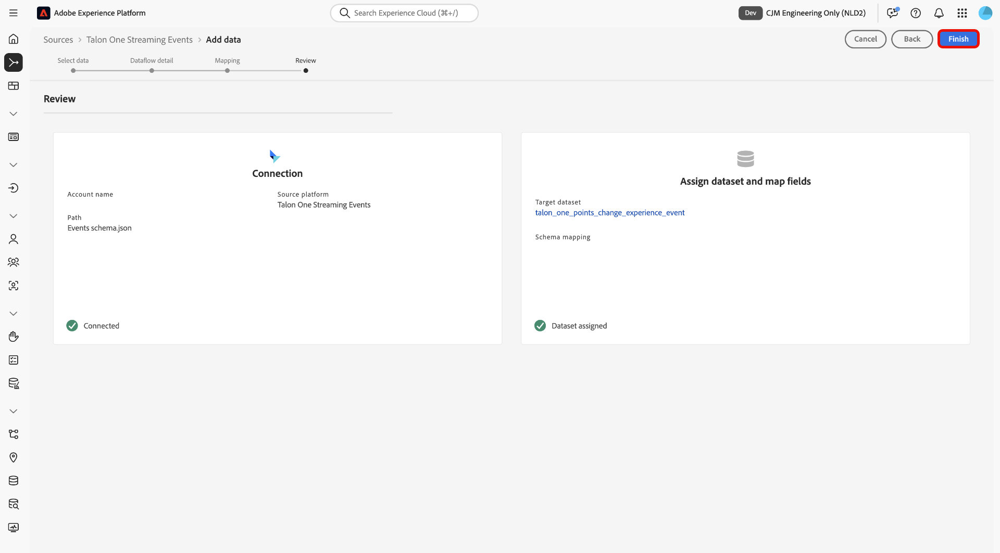

# Gegevens [!DNL Talon.One] naar Experience Platform streamen met de gebruikersinterface

>[!AVAILABILITY]
>
>De bron [!DNL Talon.One] is in bèta. Lees de [ termijnen en voorwaarden ](../../../../home.md#terms-and-conditions) in het bronoverzicht voor meer informatie bij het gebruiken van bèta-geëtiketteerde bronnen.

Lees deze handleiding voor het maken van verbinding en het streamen van gegevens van [!DNL Talon.One] naar Adobe Experience Platform met de werkruimte voor bronnen in de gebruikersinterface.

## Aan de slag

Deze zelfstudie vereist een goed begrip van de volgende onderdelen van Experience Platform:

* [[!DNL Experience Data Model (XDM)]  Systeem ](../../../../../xdm/home.md): Het gestandaardiseerde kader waardoor Experience Platform gegevens van de klantenervaring organiseert.
   * [ Grondbeginselen van schemacompositie ](../../../../../xdm/schema/composition.md): Leer over de basisbouwstenen van schema&#39;s XDM, met inbegrip van zeer belangrijke principes en beste praktijken in schemacompositie.
   * [ het leerprogramma van de Redacteur van het Schema ](../../../../../xdm/tutorials/create-schema-ui.md): Leer hoe te om douaneschema&#39;s tot stand te brengen gebruikend de Redacteur UI van het Schema.
* [[!DNL Real-Time Customer Profile]](../../../../../profile/home.md): biedt een uniform, real-time consumentenprofiel dat is gebaseerd op geaggregeerde gegevens van meerdere bronnen.

>[!IMPORTANT]
>
>Lees het [[!DNL Talon.One]  overzicht ](../../../../connectors/loyalty/talon-one.md) om over in de eerste plaats vereiste stappen te leren die u moet voltooien alvorens uw rekening met Experience Platform te verbinden.

## Navigeren door de catalogus met bronnen

Selecteer in de gebruikersinterface van Experience Platform de optie **[!UICONTROL Sources]** in de linkernavigatie voor toegang tot de werkruimte van *[!UICONTROL Sources]* . Selecteer de gewenste categorie in het deelvenster *[!UICONTROL Categories]* . U kunt ook met de zoekbalk navigeren naar de specifieke bron die u wilt gebruiken.

Als u gegevens wilt streamen vanuit [!DNL Talon.One] , selecteert u de **[!UICONTROL Talon.One Streaming Events]** bronkaart onder *[!UICONTROL Loyalty]* en selecteert u vervolgens **[!UICONTROL Add data]** .

>[!TIP]
>
>Bronnen in de catalogus met bronnen geven de optie **[!UICONTROL Set up]** weer wanneer een bepaalde bron nog geen geverifieerde account heeft. Zodra een geverifieerd account is gemaakt, verandert deze optie in **[!UICONTROL Add data]** .

## Gegevens selecteren

Gebruik vervolgens de interface van *[!UICONTROL Select data]* om een voorbeeld-JSON-bestand te uploaden om uw bronschema te definiëren. Tijdens deze stap kunt u de voorvertoningsinterface gebruiken om de bestandsstructuur van de laadbewerking weer te geven. Selecteer **[!UICONTROL Next]** als u klaar bent.

## Gegevens gegevensstroom

Daarna, moet u informatie betreffende uw dataset en uw gegevensstroom verstrekken.

### Gegevens over gegevensset

Een dataset is een opslag en beheersconstructie voor een inzameling van gegevens, typisch een lijst, die een schema (kolommen/gebieden) en verslagen (rijen) bevat. De gegevens die met succes in Experience Platform worden opgenomen worden voortgeduurd binnen het gegevensmeer als datasets.

Tijdens deze stap, kunt u of een bestaande dataset gebruiken of een nieuwe dataset creëren.

>[!NOTE]
>
>Ongeacht of u een bestaande dataset gebruikt of een nieuwe dataset creeert, moet u ervoor zorgen dat uw dataset **voor de opname van het Profiel** wordt toegelaten.

+++Selecteer deze optie als u de stappen voor het inschakelen van profielopname, foutdiagnose en gedeeltelijke inname wilt uitvoeren.

Als uw dataset voor het Profiel van de Klant in real time wordt toegelaten, dan tijdens deze stap, kunt u **[!UICONTROL Profile dataset]** van een knevel voorzien om uw gegevens voor de opname van het Profiel toe te laten. U kunt deze stap ook gebruiken om **[!UICONTROL Error diagnostics]** en **[!UICONTROL Partial ingestion]** in te schakelen.

* **[!UICONTROL Error diagnostics]**: Selecteer **[!UICONTROL Error diagnostics]** om de bron de instructie te geven foutdiagnostiek te produceren waarnaar u later kunt verwijzen bij het controleren van de gegevenssetactiviteit en de status van de gegevensstroom.
* **[!UICONTROL Partial ingestion]**: Gedeeltelijke batch-opname is de mogelijkheid om gegevens met fouten in te voeren tot een bepaalde configureerbare drempel. Met deze functie kunt u al uw nauwkeurige gegevens in Experience Platform opnemen, terwijl al uw onjuiste gegevens afzonderlijk worden opgeslagen met informatie over waarom deze niet geldig zijn.

+++

### Gegevens gegevensstroom

Zodra uw dataset wordt gevormd, moet u details op uw gegevensstroom, met inbegrip van een naam, een facultatieve beschrijving, en waakzame configuraties dan verstrekken.

| Dataflow-configuraties | Beschrijving |
| --- | --- |
| Naam gegevensstroom | De naam van de gegevensstroom. Standaard wordt hiervoor de naam gebruikt van het bestand dat wordt geïmporteerd. |
| Beschrijving | (Optioneel) Een korte beschrijving van uw gegevensstroom. |
| Waarschuwingen | Experience Platform kan waarschuwingen op basis van gebeurtenissen produceren waarop gebruikers zich kunnen abonneren. Met deze opties kan een actieve gegevensstroom deze waarschuwingen activeren.  Voor meer informatie, lees het [ alarm overzicht ](../../alerts.md) <ul><li>**het Begin van de Looppas van Bronnen Dataflow**: Selecteer dit alarm om een bericht te ontvangen wanneer uw dataflow looppas begint.</li><li>**Bronnen Dataflow de Succes van de Looppas**: Selecteer dit alarm om een bericht te ontvangen als uw dataflow zonder enige fouten beëindigt.</li><li>**de Uitval van de Looppas van Gegevensstroom van Bronnen**: Selecteer dit alarm om een bericht te ontvangen als uw dataflow looppas met om het even welke fouten beëindigt.</li></ul> |

{style="table-layout:auto"}

## Toewijzing

Gebruik de toewijzingsinterface om uw brongegevens toe te wijzen aan de aangewezen schemagebieden alvorens gegevens aan Experience Platform in te voeren. Voor meer informatie, lees de [ kaartgids in UI ](../../../../../data-prep/ui/mapping.md).

<!--
>[!TIP]
>
>You can download the [Events and Profile mappings](../../../../images/tutorials/create/capillary/mappings.zip) for [!DNL Capillary] and [import the files to Data Prep](../../../../../data-prep/ui/mapping.md#import-mapping) when you are ready to map your data.
-->

## Controleren

De stap *[!UICONTROL Review]* wordt weergegeven, zodat u de details van de gegevensstroom kunt bekijken voordat deze wordt gemaakt. De details worden gegroepeerd in de volgende categorieën:

* **[!UICONTROL Connection]**: geeft de accountnaam, het bronplatform en de bronnaam weer.
* **[!UICONTROL Assign dataset and map fields]**: toont de doeldataset en het schema dat de dataset volgt.

Selecteer **[!UICONTROL Finish]** nadat u hebt bevestigd dat de details juist zijn.

## De URL van het streamingeindpunt ophalen

Als de verbinding is gemaakt, wordt de pagina met brondetails weergegeven. Deze pagina bevat details van de zojuist gemaakte verbinding, waaronder eerder uitgevoerde dataflows, ID en URL van het streamingeindpunt.

## Uw gegevensstroom controleren

Zodra uw gegevensstroom is gecreeerd, kunt u de gegevens controleren die door het worden opgenomen om informatie over innamepercentages, succes, en fouten te zien. Voor meer informatie over hoe te om dataflow te controleren, zie het leerprogramma op [ controlerekeningen en dataflows in UI ](../../monitor-streaming.md).

## Bekende beperkingen

Om nauwkeurige gegevensinvoer te verzekeren, zou u gegevens van de getrouwe punten van [!DNL Talon.One] veranderd, de rijverbetering, en de berichten van de rijdaling aan de schakelaar moeten verzenden. Omdat het bericht van de loyaliteitspunten veranderde geen rijinformatie omvat, moet u deze berichten naar een afzonderlijke profieldataset verzenden. Als u punten veranderde gegevens met rijverbetering of downgradeberichten in de zelfde dataset combineert, zal de lijstinformatie met ongeldige waarden worden verloren of worden beschreven. De verbetering van de rij en de dalingsberichten kunnen de zelfde dataset gebruiken, aangezien beide rijdetails omvatten. Na opname wordt het samengevoegde profiel automatisch bijgewerkt door de regels voor het samenvoegen van profielen, zodat deze de meest recente punten en informatie op de laag weerspiegelen.