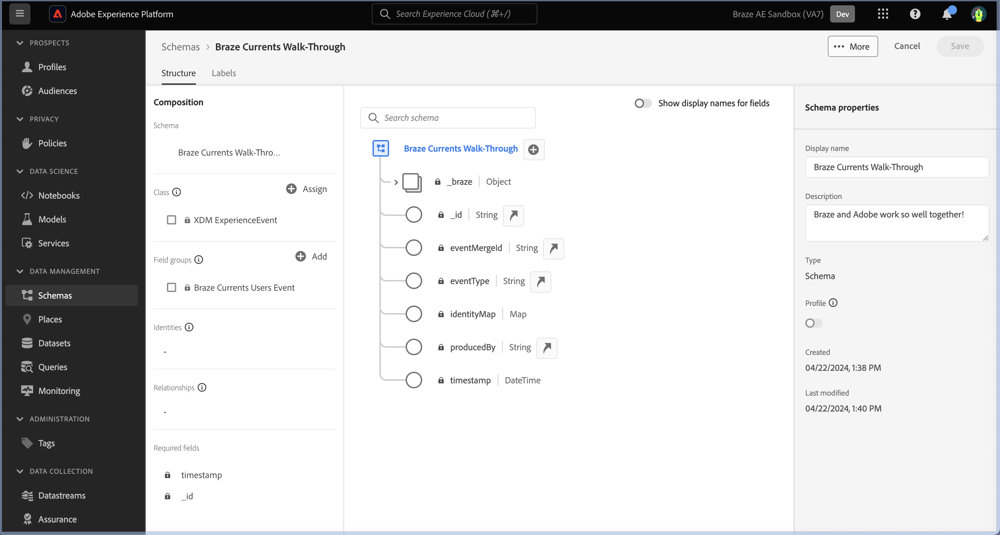
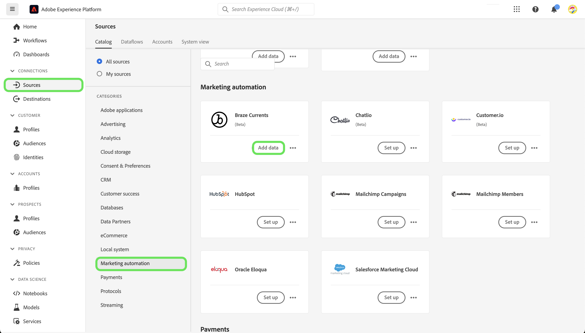

# Een [!DNL Braze Currents] bronverbinding maken in de gebruikersinterface

>[!NOTE]
>
>De bron [!DNL Braze Currents] is in bèta. Gelieve te lezen het [ overzicht van bronnen ](../../../../home.md#terms-and-conditions) voor meer informatie bij het gebruiken van bèta-geëtiketteerde bronnen.

[!DNL Braze] maakt klantgerichte interacties tussen consumenten en merken in real-time mogelijk. [!DNL Braze Currents] is een realtime gegevensstroom van betrokkenheidsgebeurtenissen van het Braze-platform die de meest robuuste maar korrelige export van het [!DNL Braze] -platform is.

Lees de volgende zelfstudie om te leren hoe u gegevens over betrokkenheidsgebeurtenissen van uw [!DNL Braze] -account naar Adobe Experience Platform kunt overbrengen in de gebruikersinterface.

## Vereisten

Voor het uitvoeren van de stappen in deze handleiding hebt u het volgende nodig:

* Login aan [ Adobe Experience Platform ](https://platform.adobe.com) en toestemming om een nieuwe het stromen bronverbinding tot stand te brengen.
* Login aan uw [[!DNL Braze]  dashboard ](https://dashboard.braze.com/sign_in), een ongebruikte [ vergunning van de Schakelaar van Studenten ](https://www.braze.com/docs/user_guide/data_and_analytics/braze_currents), en toestemmingen om een schakelaar tot stand te brengen. Voor meer informatie, lees de [ vereisten aan opstelling  [!DNL Currents] ](https://www.braze.com/docs/user_guide/data_and_analytics/braze_currents/setting_up_currents/#requirements).

## Aan de slag

Deze zelfstudie vereist een goed begrip van de volgende onderdelen van Adobe Experience Platform:

* [[!DNL Experience Data Model (XDM)]  Systeem ](../../../../../xdm/home.md): Het gestandaardiseerde kader waardoor [!DNL Experience Platform] gegevens van de klantenervaring organiseert.
   * [ Grondbeginselen van schemacompositie ](../../../../../xdm/schema/composition.md): Leer over de basisbouwstenen van schema&#39;s XDM, met inbegrip van zeer belangrijke principes en beste praktijken in schemacompositie.
   * [ het leerprogramma van de Redacteur van het Schema ](../../../../../xdm/tutorials/create-schema-ui.md): Leer hoe te om douaneschema&#39;s tot stand te brengen gebruikend de Redacteur UI van het Schema.
* [[!DNL Real-Time Customer Profile]](../../../../../profile/home.md): biedt een uniform, real-time consumentenprofiel dat is gebaseerd op geaggregeerde gegevens van meerdere bronnen.

Dit leerprogramma vereist ook een werkend begrip van [[!DNL Braze]  Huidige teksten ](https://www.braze.com/docs/user_guide/data_and_analytics/braze_currents).

Als u reeds een [!DNL Braze] verbinding hebt, kunt u de rest van dit document overslaan en aan het leerprogramma te werk gaan op [ vormend een dataflow ](../../dataflow/marketing-automation.md).

## Een XDM-schema maken

>[!TIP]
>
>U moet een XDM-schema (Experience Data Model) maken als dit de eerste keer is dat u een [!DNL Braze Currents] -verbinding maakt. Als u reeds een schema voor [!DNL Braze Currents] hebt gecreeerd, dan kunt u deze stap overslaan en aan [ te werk gaan verbindend uw rekening met Experience Platform ](#connect).

In de gebruikersinterface van Experience Platform gebruikt u de linkernavigatie en selecteert u **[!UICONTROL Schemas]** om de werkruimte van [!UICONTROL Schemas] te openen. Selecteer vervolgens **[!UICONTROL Create schema]** en selecteer **[!UICONTROL Experience Event]** . Selecteer **[!UICONTROL Next]** om door te gaan.

Geef een naam en beschrijving op voor uw schema. Gebruik vervolgens het deelvenster [!UICONTROL Composition] om uw schemakenmerken te configureren. Selecteer onder [!UICONTROL Field groups] de optie **[!UICONTROL Add]** en voeg de veldgroep [!UICONTROL Braze Currents User Event] toe. Selecteer **[!UICONTROL Save]** als u klaar bent.

Voor meer informatie over schema&#39;s, lees de gids aan [ creërend schema&#39;s in UI ](../../../../../xdm/tutorials/create-schema-ui.md).

## Sluit uw [!DNL Braze] -account aan op Experience Platform {#connect}

Selecteer in de gebruikersinterface van Experience Platform de optie **[!UICONTROL Sources]** in de linkernavigatie voor toegang tot de werkruimte van [!UICONTROL Sources] . U kunt de juiste categorie selecteren in de catalogus aan de linkerkant van het scherm. U kunt ook de specifieke bron vinden waarmee u wilt werken met de zoekoptie.

Onder de *categorie van de Automatisering van de Marketing*, selecteer **[!UICONTROL Braze Currents]**, en selecteer dan **[!UICONTROL Add data]**.

Daarna, upload het verstrekte [ de steekproefdossier van de Studenten van de Bodemo ](https://github.com/Appboy/currents-examples/blob/master/sample-data/Adobe/adobe_examples.json). Dit bestand bevat alle mogelijke velden die door Braze kunnen worden verzonden als onderdeel van een gebeurtenis.

Zodra uw dossier wordt geupload, moet u uw gegevens verstrekken gegevensstroom, met inbegrip van informatie over uw dataset en het schema dat u aan in kaart brengt.  Als dit uw eerste keer is verbindend een bron van de Huidige Bestanden van de Rooi, dan creeer een nieuwe dataset.  Anders kunt u om het even welke bestaande dataset gebruiken die verwijzingen het schema van de Rimpel.  Als het creëren van een nieuwe dataset, gebruik het schema dat wij in de vorige sectie creeerden.

Dan, vorm afbeelding voor uw gegevens gebruikend de toewijzingsinterface.

De toewijzing zal de volgende kwesties hebben die moeten worden opgelost.

In de brongegevens, *identiteitskaart* zal verkeerd aan *_braze.appID* worden in kaart gebracht. U moet het gebied van de doelafbeelding in *_id* op het wortelniveau van het schema veranderen. Daarna, zorg ervoor dat *properties.is_amp* aan *_braze.messaging.email.isAMP* in kaart wordt gebracht.

Daarna, schrap de *tijd* aan *timestamp* afbeelding, dan selecteer toevoegen (`+`) pictogram en dan selecteren **[!UICONTROL Add calculated field]**. In de verstrekte doos, input *tijd \* 1000* en selecteer **[!UICONTROL Save]**.

Zodra het nieuwe berekende gebied wordt toegevoegd, uitgezocht **[!UICONTROL Map target field]** naast het nieuwe brongebied en het in kaart brengen aan *timestamp* op het wortelniveau van het schema. Selecteer vervolgens **[!UICONTROL Validate]** om ervoor te zorgen dat er geen fouten meer optreden.

>[!IMPORTANT]
>
>Tijdstempels voor rasteren worden niet uitgedrukt in milliseconden, maar in seconden. Als u de tijdstempels in Experience Platform op de juiste wijze wilt laten weergeven, moet u berekende velden maken in milliseconden. Een berekening van &quot;tijd * 1000&quot; wordt correct omgezet in milliseconden, die geschikt zijn voor toewijzing aan een tijdstempelveld binnen Experience Platform.
>
>

Selecteer **[!UICONTROL Next]** als u klaar bent. Gebruik de overzichtspagina om de details van uw gegevensstroom te bevestigen en selecteer dan **[!UICONTROL Finish]**.

### Vereiste referenties verzamelen

Nadat u de verbinding hebt gemaakt, moet u de volgende referentie-waarden verzamelen. U geeft deze waarden op in het dashboard Braze om gegevens naar Experience Platform te verzenden. Voor meer informatie, leest de [!DNL Braze] [ gids bij het navigeren aan Huidige heden ](https://www.braze.com/docs/user_guide/data_and_analytics/braze_currents/setting_up_currents/#step-2-navigate-to-currents).

| Veld | Beschrijving |
| --- | --- |
| Client-id | De client-id die aan uw Experience Platform-bron is gekoppeld. |
| Clientgeheim | Het clientgeheim dat aan uw Experience Platform-bron is gekoppeld. |
| Tenant-id | De huurder-id die aan uw Experience Platform-bron is gekoppeld. |
| Naam sandbox | De sandbox die aan uw Experience Platform-bron is gekoppeld. |
| Dataflow-id | De gegevensstroom-id die aan uw Experience Platform-bron is gekoppeld. |
| Streaming eindpunt | Het streamingeindpunt dat aan uw Experience Platform-bron is gekoppeld. **Nota**: [!DNL Braze] zet automatisch dit in het batch die eindpunt stromen om. |

### Configureer [!DNL Braze Currents] om gegevens te streamen naar uw gegevensbron

Binnen [!DNL Braze Dashboard], navigeer aan de Integraties van de Partner **->** de Uitvoer van Gegevens, dan uitgezochte **[!DNL Create New Current]**. U zal worden ertoe aangezet om een naam voor de schakelaar, contactinformatie voor berichten over de schakelaar, en de hierboven vermelde geloofsbrieven te verstrekken. Selecteer de gebeurtenissen die u wilt ontvangen, configureer desgewenst alle gewenste velduitsluitingen/transformaties en selecteer vervolgens **[!DNL Launch Current]** .

## Volgende stappen

Aan de hand van deze zelfstudie hebt u een verbinding tot stand gebracht met uw [!DNL Braze] -account. U kunt nu aan het volgende leerprogramma verdergaan en [ een dataflow vormen om het systeemgegevens van de marketing automatisering in  [!DNL Experience Platform]](../../dataflow/marketing-automation.md) te brengen.
