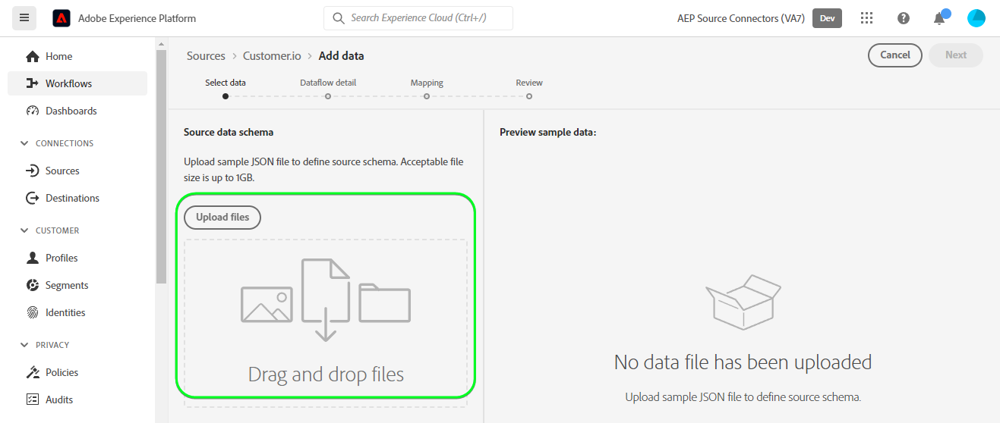

# Een [!DNL Customer.io] bronverbinding en gegevensstroom in de gebruikersinterface

>[!NOTE]
>
>De [!DNL Customer.io] De bron is in bèta. Lees de [overzicht van bronnen](../../../../home.md#terms-and-conditions) voor meer informatie over het gebruik van bronnen met een bètalabel.

Deze zelfstudie bevat stappen voor het maken van een [!DNL Customer.io] bronverbinding en gegevensstroom via de Adobe Experience Platform-gebruikersinterface.

## Aan de slag {#getting-started}

Deze zelfstudie vereist een goed begrip van de volgende onderdelen van het Experience Platform:

* [[!DNL Experience Data Model (XDM)] Systeem](../../../../../xdm/home.md): Het gestandaardiseerde kader waardoor [!DNL Experience Platform] organiseert de gegevens van de klantenervaring.
   * [Basisbeginselen van de schemacompositie](../../../../../xdm/schema/composition.md): Leer over de basisbouwstenen van schema&#39;s XDM, met inbegrip van zeer belangrijke principes en beste praktijken in schemacompositie.
   * [Zelfstudie Schema Editor](../../../../../xdm/tutorials/create-schema-ui.md): Leer hoe te om douaneschema&#39;s tot stand te brengen gebruikend de Redacteur UI van het Schema.
* [[!DNL Real-Time Customer Profile]](../../../../../profile/home.md): Verstrekt een verenigd, real-time consumentenprofiel dat op bijeengevoegde gegevens van veelvoudige bronnen wordt gebaseerd.

## Vereisten {#prerequisites}

De volgende sectie bevat informatie over voorwaarden die moeten worden voltooid voordat u een [!DNL Customer.io] bronverbinding.

### Voorbeeld-JSON om het bronschema te definiëren voor [!DNL Customer.io] {#prerequisites-json-schema}

Voordat u een [!DNL Customer.io] bronverbinding. U moet een bronschema opgeven. U kunt de onderstaande JSON gebruiken.

```
{
  "event_id": "01E4C4CT6YDC7Y5M7FE1GWWPQJ",
  "object_type": "customer",
  "metric": "subscribed",
  "timestamp": 1613063089,
  "data": {
    "customer_id": "42",
    "email_address": "test@example.com",
    "identifiers": {
      "id": "42",
      "email": "test@example.com",
      "cio_id": "d9c106000001"
    }
  }
}
```

### Een Platform maken voor [!DNL Customer.io] {#create-platform-schema}

U moet ook ervoor zorgen dat u een schema van het Platform creeert voor uw bron te gebruiken. Zie de zelfstudie aan [een Platform-schema maken](../../../../../xdm/schema/composition.md) voor uitgebreide stappen over hoe te om een schema tot stand te brengen.


## Verbind uw [!DNL Customer.io] account {#connect-account}

Selecteer in de gebruikersinterface van het Platform de optie **[!UICONTROL Sources]** van de linkernavigatie om tot [!UICONTROL Sources] en bekijk een catalogus met bronnen die beschikbaar zijn in het Experience Platform.

Gebruik de *[!UICONTROL Categories]* om bronnen op categorie te filteren. U kunt ook een bronnaam invoeren in de zoekbalk om een specifieke bron uit de catalogus te zoeken.

Ga naar de [!UICONTROL Marketing automation] categorie om de [!DNL Customer.io] bronkaart. Selecteer [!UICONTROL Add data].


## Gegevens selecteren {#select-data}

De **[!UICONTROL Select data]** wordt weergegeven, zodat u de gegevens kunt selecteren die u naar het Platform verzendt.

* Het linkergedeelte van de interface is een browser waarmee u de beschikbare gegevensstromen binnen uw account kunt bekijken.
* In het rechtergedeelte van de interface kunt u maximaal 100 rijen gegevens uit een JSON-bestand voorvertonen.

Selecteren **[!UICONTROL Upload files]** om een JSON-bestand vanaf uw lokale systeem te uploaden. U kunt ook het JSON-bestand dat u wilt uploaden, slepen naar het [!UICONTROL Drag and drop files] deelvenster.



Nadat het bestand is geüpload, wordt de voorbeeldinterface bijgewerkt en wordt een voorvertoning weergegeven van het schema dat u hebt geüpload. Met de voorvertoningsinterface kunt u de inhoud en structuur van een bestand controleren. U kunt ook de opdracht [!UICONTROL Search field] nut om tot specifieke punten van binnen uw schema toegang te hebben.

Als u klaar bent, selecteert u **[!UICONTROL Next]**.


## Gegevens {#dataflow-detail}

De **Gegevens** de stap verschijnt, die u van opties voorzien om een bestaande dataset te gebruiken of een nieuwe dataset voor uw gegevensstroom te vestigen, evenals een kans om een naam en een beschrijving voor uw gegevensstroom te verstrekken. Tijdens deze stap kunt u ook instellingen configureren voor het opnemen van profielen, foutdiagnose, gedeeltelijke inname en waarschuwingen.

Als u klaar bent, selecteert u **[!UICONTROL Next]**.


## Toewijzing {#mapping}

De [!UICONTROL Mapping] de stap verschijnt, die u van een interface voorziet om de brongebieden van uw bronschema aan hun aangewezen doelXDM gebieden in het doelschema in kaart te brengen.

Platform biedt intelligente aanbevelingen voor automatisch toegewezen velden op basis van het doelschema of de gegevensset die u hebt geselecteerd. U kunt toewijzingsregels handmatig aanpassen aan uw gebruiksgevallen. Op basis van uw behoeften kunt u ervoor kiezen om velden rechtstreeks toe te wijzen of gegevens prep-functies te gebruiken om brongegevens om berekende of berekende waarden af te leiden. Voor uitvoerige stappen bij het gebruiken van de kaartperinterface en berekende gebieden, zie [UI-hulplijn voor gegevensvoorinstelling](../../../../../data-prep/ui/mapping.md).

Alle onderstaande toewijzingen zijn verplicht en moeten worden ingesteld voordat u naar de [!UICONTROL Review] in.

| Doelveld | Beschrijving |
| --- | --- |
| `object_type` | Het objecttype verwijst naar de [!DNL Customer.io] [gebeurtenissen](https://customer.io/docs/webhooks/#events) documentatie voor de ondersteunde typen. |
| `id` | De id van het object. |
| `email` | Het e-mailadres dat aan het object is gekoppeld. |
| `event_id` | De unieke id van de gebeurtenis. |
| `cio_id` | De [!DNL Customer.io] id voor de gebeurtenis. |
| `metric` | Het gebeurtenistype. Raadpleeg voor meer informatie de [!DNL Customer.io] [gebeurtenissen](https://customer.io/docs/webhooks/#events) documentatie voor ondersteunde typen. |
| `timestamp` | De tijdstempel wanneer de gebeurtenis heeft plaatsgevonden. |

>[!IMPORTANT]
>
>Niet toewijzen `cio_id` bij uitvoering [!DNL Customer.io] webhaak in de `test mode` omdat er geen gekoppelde velden worden verzonden van [!DNL Customer.io].

Als de brongegevens eenmaal zijn toegewezen, selecteert u **[!UICONTROL Next]**.


## Controleren {#review}

De **[!UICONTROL Review]** wordt weergegeven, zodat u de nieuwe gegevensstroom kunt controleren voordat deze wordt gemaakt. De details worden gegroepeerd in de volgende categorieën:

* **[!UICONTROL Connection]**: Toont het brontype, de relevante weg van het gekozen brondossier, en de hoeveelheid kolommen binnen dat brondossier.
* **[!UICONTROL Assign dataset & map fields]**: Toont welke dataset de brongegevens worden opgenomen in, met inbegrip van het schema dat de dataset zich aan houdt.

Nadat u de gegevensstroom hebt gecontroleerd, selecteert u **[!UICONTROL Finish]** en laat enige tijd voor de gegevensstroom worden gecreeerd.


## Uw URL voor het streamingeindpunt ophalen {#get-streaming-endpoint}

Wanneer uw streaminggegevens zijn gemaakt, kunt u nu de URL van het streamingeindpunt ophalen. Dit eindpunt zal worden gebruikt om aan uw webhaak in te tekenen, toestaand uw het stromen bron om met Experience Platform te communiceren.

Om URL te construeren die wordt gebruikt om webhaak te vormen op [!DNL Customer.io] u moet het volgende terugwinnen:

* **[!UICONTROL Dataflow ID]**
* **[!UICONTROL Streaming endpoint]**

Om uw **[!UICONTROL Dataflow ID]** en **[!UICONTROL Streaming endpoint]**, ga naar de [!UICONTROL Dataflow activity] pagina van de gegevensstroom die u net creeerde en kopieer de details van de bodem van [!UICONTROL Properties] deelvenster.


Zodra u uw het stromen eindpunt en dataflow identiteitskaart hebt teruggewonnen, bouw een URL die op het volgende patroon wordt gebaseerd: ```{STREAMING_ENDPOINT}?x-adobe-flow-id={DATAFLOW_ID}```. Een geconstrueerde URL voor een webhaak ziet er bijvoorbeeld als volgt uit: ``https://dcs.adobedc.net/collection/febc116d22ba0ea2868e9c93b199375302afb8a589617700991bb8f3f0341ad7?x-adobe-flow-id=439b3fc4-3042-4a3a-b5e0-a494898d3fb0``

## Rapporterende webhaak instellen in [!DNL Customer.io] {#set-up-webhook}

Als de URL van uw webhaak is gemaakt, kunt u nu de rapportwebhaak instellen met de [!DNL Customer.io] gebruikersinterface. Lees de [[!DNL Customer.io] hulplijn](https://customer.io/docs/webhooks/#setup) webhaken instellen.

In de [!DNL Customer.io] gebruikersinterface, voer uw [URL webhaak](#get-streaming-endpoint-url) in de [!DNL WEBHOOK ENDPOINT] veld.


>[!TIP]
>
>U kunt zich abonneren op verschillende gebeurtenissen voor uw rapporterende webhaak. Het bericht van elke gebeurtenis wordt aan het Platform toegevoegd wanneer een [!DNL Customer.io] er is voldaan aan de activeringscriteria voor actiefgebeurtenissen. Voor meer informatie over de verschillende gebeurtenissen raadpleegt u de [[!DNL Customer.io] documentatie bij gebeurtenissen](https://customer.io/docs/webhooks/#events).

## Volgende stappen {#next-steps}

Aan de hand van deze zelfstudie hebt u een streaminggegevensstroom geconfigureerd om uw [!DNL Customer.io] gegevens naar Experience Platform. Als u de gegevens wilt controleren die worden ingevoerd, raadpleegt u de handleiding op [streaming gegevens controleren met de gebruikersinterface van het Platform](../../monitor-streaming.md).

## Aanvullende bronnen {#additional-resources}

In de volgende secties vindt u aanvullende bronnen die u kunt raadplegen wanneer u de [!DNL Customer.io] bron.

### Guardrails {#guardrails}

Voor meer informatie over geleiders raadpleegt u de [[!DNL Customer.io] pagina met onderbrekingen en mislukkingen](https://customer.io/docs/webhooks/#timeouts-and-failures).

### Validatie {#validation}

Om te controleren of u de bron correct hebt ingesteld en [!DNL Customer.io] de berichten worden opgenomen, volg de stappen hieronder:

* U kunt de [!DNL Customer.io] **[!UICONTROL Activity Logs]** pagina om de gebeurtenissen te identificeren die worden vastgelegd door [!DNL Customer.io].


* Selecteer in de gebruikersinterface van het Platform de optie **[!UICONTROL View Dataflows]** naast de [!DNL Customer.io] kaartmenu in de broncatalogus. Selecteer vervolgens **[!UICONTROL Preview dataset]** om de gegevens te verifiëren die voor de gebeurtenissen werden opgenomen die u binnen hebt geselecteerd [!DNL Customer.io].


