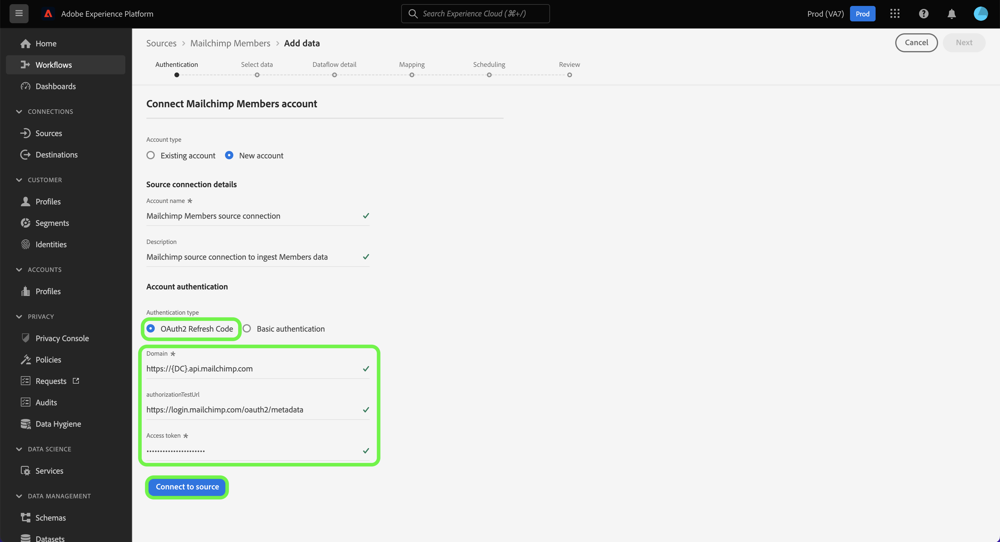
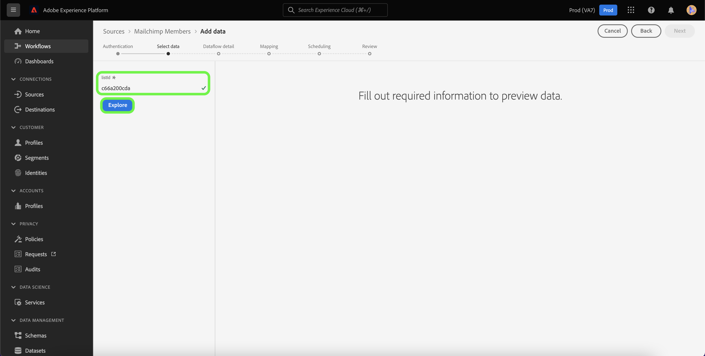

# Een [!DNL Mailchimp Members] bronverbinding maken met de gebruikersinterface van Experience Platform

Deze zelfstudie bevat stappen voor het maken van een [!DNL Mailchimp] bronaansluiting voor het invoeren van [!DNL Mailchimp Members] -gegevens naar Adobe Experience Platform via de gebruikersinterface.

## Aan de slag

Deze handleiding vereist een goed begrip van de volgende onderdelen van Adobe Experience Platform:

* [ Bronnen ](../../../../home.md): Experience Platform staat gegevens toe om van diverse bronnen worden opgenomen terwijl het voorzien van u van de capaciteit om, inkomende gegevens te structureren te etiketteren en te verbeteren gebruikend [!DNL Experience Platform] diensten.
* [ Sandboxes ](../../../../../sandboxes/home.md): Experience Platform verstrekt virtuele zandbakken die één enkele instantie van Experience Platform in afzonderlijke virtuele milieu&#39;s verdelen helpen digitale ervaringstoepassingen ontwikkelen en ontwikkelen.

## Vereiste referenties verzamelen

Als u uw [!DNL Mailchimp Members] -gegevens naar Experience Platform wilt verzenden, moet u eerst de juiste verificatiereferenties opgeven die overeenkomen met uw [!DNL Mailchimp] -account.

De [!DNL Mailchimp Members] -bron ondersteunt zowel OAuth 2 Refresh Code als basisverificatie. Zie de lijsten hieronder voor meer informatie over deze authentificatietypen.

### Code vernieuwen 2

| Credentials | Beschrijving |
| --- | --- |
| Domein | De basis-URL waarmee verbinding wordt gemaakt met de MailChimp-API. De indeling voor de basis-URL is `https://{DC}.api.mailchimp.com` , waarbij `{DC}` het datacenter vertegenwoordigt dat overeenkomt met uw account. |
| Autorisatietest-URL | De autorisatietest-URL wordt gebruikt om referenties te valideren wanneer [!DNL Mailchimp] wordt verbonden met Experience Platform. Als dit niet wordt opgegeven, worden de referenties in plaats daarvan automatisch gecontroleerd tijdens het maken van de bronverbinding. |
| Toegangstoken | Het overeenkomstige toegangstoken dat wordt gebruikt om uw bron voor authentiek te verklaren. Dit is vereist voor verificatie op basis van OAuth. |

Voor meer informatie bij het gebruiken van OAuth 2 om uw [!DNL Mailchimp] rekening aan Experience Platform voor authentiek te verklaren, zie dit [[!DNL Mailchimp]  document bij het gebruiken van OAuth 2 ](https://mailchimp.com/developer/marketing/guides/access-user-data-oauth-2/).

### Basisverificatie

| Credentials | Beschrijving |
| --- | --- |
| Domein | De basis-URL waarmee verbinding wordt gemaakt met de MailChimp-API. De indeling voor de basis-URL is `https://{DC}.api.mailchimp.com` , waarbij `{DC}` het datacenter vertegenwoordigt dat overeenkomt met uw account. |
| Gebruikersnaam | De gebruikersnaam die overeenkomt met uw MailChimp-account. Dit is vereist voor basisverificatie. |
| Wachtwoord | Het wachtwoord dat overeenkomt met uw MailChimp-account. Dit is vereist voor basisverificatie. |

## Sluit uw [!DNL Mailchimp Members] -account aan op Experience Platform

Selecteer in de gebruikersinterface van Experience Platform de optie **[!UICONTROL Sources]** in de linkernavigatiebalk voor toegang tot de werkruimte van [!UICONTROL Sources] . In het scherm [!UICONTROL Catalog] worden diverse bronnen weergegeven waarmee u een account kunt maken.

U kunt de juiste categorie selecteren in de catalogus aan de linkerkant van het scherm. U kunt ook de specifieke bron vinden waarmee u wilt werken met de zoekoptie.

Selecteer onder de categorie [!UICONTROL Marketing automation] de optie **[!UICONTROL Mailchimp Campaign]** en selecteer vervolgens **[!UICONTROL Add data]** .

De pagina **[!UICONTROL Connect Mailchimp Campaigns account]** wordt weergegeven. Op deze pagina kunt u opgeven of u een bestaande account wilt openen of een nieuwe account wilt maken.

### Bestaande account

Als u een bestaande account wilt gebruiken, selecteert u de [!DNL Mailchimp Members] -account waarmee u een nieuwe gegevensstroom wilt maken en selecteert u vervolgens **[!UICONTROL Next]** om door te gaan.

### Nieuwe account

Als u een nieuwe account maakt, selecteert u **[!UICONTROL New account]** en geeft u vervolgens een naam en een beschrijving voor uw [!DNL Mailchimp Members] -bronverbindingsgegevens.

#### Verifiëren met OAuth 2

Als u OAuth 2 wilt gebruiken, selecteert u [!UICONTROL OAuth 2 Refresh Code] , geeft u waarden op voor uw domein, machtigingstest voor URL en toegangstoken. Selecteer vervolgens **[!UICONTROL Connect to source]** . Laat uw gegevens even valideren en selecteer vervolgens **[!UICONTROL Next]** om door te gaan.

#### Verifiëren met gebruik van basisverificatie

Selecteer [!UICONTROL Basic authentication] als u standaardverificatie wilt gebruiken, geef waarden op voor uw domein, gebruikersnaam en wachtwoord en selecteer vervolgens **[!UICONTROL Connect to source]** . Laat uw gegevens even valideren en selecteer vervolgens **[!UICONTROL Next]** om door te gaan.

### [!DNL Mailchimp Members] gegevens selecteren

Nadat de bron is geverifieerd, moet u de `listId` opgeven die overeenkomt met uw [!DNL Mailchimp Members] -account.

Voer op de pagina [!UICONTROL Select data] uw `listId` in en selecteer **[!UICONTROL Explore]** .

De pagina wordt bijgewerkt in een interactieve schemastructuur waarmee u de hiërarchie van uw gegevens kunt verkennen en inspecteren. Selecteer **[!UICONTROL Next]** om door te gaan.

## Volgende stappen

Als uw [!DNL Mailchimp] -account is geverifieerd en uw [!DNL Mailchimp Members] -gegevens zijn geselecteerd, kunt u nu een gegevensstroom beginnen te maken om uw gegevens over te brengen naar Experience Platform. Voor gedetailleerde stappen op hoe te om een dataflow tot stand te brengen, zie de documentatie bij [ het creëren van een dataflow om de gegevens van de marketing automatisering aan Experience Platform ](../../dataflow/marketing-automation.md) te brengen.
