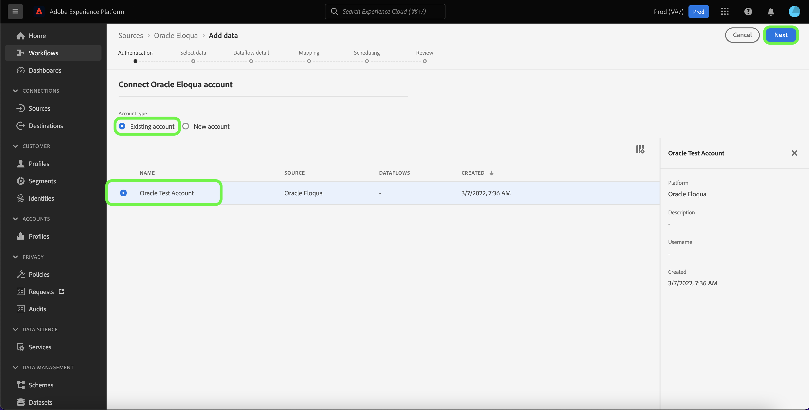

# Een [!DNL Oracle Eloqua] bronverbinding maken met de gebruikersinterface van Experience Platform

>[!WARNING]
>
>De [!DNL Oracle Eloqua] -bron wordt afgekeurd in januari 2026. Later dit jaar zal een nieuwe bron worden vrijgegeven als alternatief. Zodra de nieuwe bron wordt vrijgegeven, moet u van plan zijn om aan de nieuwe bron te migreren door nieuwe rekeningsverbindingen en dataflows vóór eind Januari 2026 te creëren.

Deze zelfstudie bevat stappen voor het maken van een [!DNL Oracle Eloqua] -bronverbinding met de Adobe Experience Platform-gebruikersinterface.

## Aan de slag

Deze handleiding vereist een goed begrip van de volgende onderdelen van Experience Platform:

* [&#x200B; Bronnen &#x200B;](../../../../home.md): Experience Platform staat gegevens toe om van diverse bronnen worden opgenomen terwijl het voorzien van u van de capaciteit om, inkomende gegevens te structureren te etiketteren en te verbeteren gebruikend de diensten van Experience Platform.
* [&#x200B; Sandboxes &#x200B;](../../../../../sandboxes/home.md): Experience Platform verstrekt virtuele zandbakken die één enkele instantie van Experience Platform in afzonderlijke virtuele milieu&#39;s verdelen helpen digitale ervaringstoepassingen ontwikkelen en ontwikkelen.

Als u reeds een voor authentiek verklaarde [!DNL Oracle Eloqua] rekening op Experience Platform hebt, dan kunt u de rest van dit document overslaan en aan het leerprogramma te werk gaan [&#x200B; creërend een dataflow om de gegevens van de marketing automatisering aan Experience Platform &#x200B;](../../dataflow/marketing-automation.md) te brengen.

### Vereiste referenties verzamelen

Als u [!DNL Oracle Eloqua] wilt verbinden met Experience Platform, moet u waarden opgeven voor de volgende verificatie-eigenschappen:

| Credentials | Beschrijving |
| --- | --- |
| Endpoint | Het eindpunt van de [!DNL Oracle Eloqua] -server. [!DNL Oracle Eloqua] ondersteunt meerdere datacenters. Om uw eindpunt te vinden, login aan de [[!DNL Oracle Eloqua]  interface &#x200B;](https://login.eloqua.com) met uw geloofsbrieven en dan het basisURL gedeelte van redirect URL te kopiëren. De notatie voor het URL-patroon is `xxx.xx.eloqua.com` en moet zonder `http` of `https` worden ingevoerd. |
| Gebruikersnaam | De gebruikersnaam van de [!DNL Oracle Eloqua] -server. De gebruikersnaam moet zijn opgemaakt als `siteName + \\ + username` , waarbij `siteName` de bedrijfsnaam is die u hebt gebruikt om u aan te melden bij [!DNL Oracle Eloqua] en `username` de gebruikersnaam is. De gebruikersnaam voor uw aanmelding kan bijvoorbeeld: `Eloqua\Andy` zijn. **Nota**: U moet één enkele backslash (`\`) gebruiken wanneer het gebruiken van UI omdat Experience Platform UI automatisch extra backslash (`\`) toevoegt wanneer het ingaan van een gebruikersbenaming. |
| Wachtwoord | Het wachtwoord voor uw [!DNL Oracle Eloqua] -gebruikersnaam. |

Voor meer informatie over authentificatiegeloofsbrieven voor [!DNL Oracle Eloqua], zie de [[!DNL Oracle Eloqua]  gids over authentificatie &#x200B;](https://docs.oracle.com/en/cloud/saas/marketing/eloqua-rest-api/Authentication_Basic.html).

Nadat u de vereiste gegevens hebt verzameld, kunt u de onderstaande stappen volgen om uw [!DNL Oracle Eloqua] -account te koppelen aan Experience Platform.

## Sluit uw [!DNL Oracle Eloqua] -account aan

Selecteer in de gebruikersinterface van Experience Platform de optie **[!UICONTROL Sources]** in de linkernavigatie voor toegang tot de werkruimte van [!UICONTROL Sources] . In het scherm [!UICONTROL Catalog] worden diverse bronnen weergegeven waarmee u een account kunt maken.

U kunt de juiste categorie selecteren in de catalogus aan de linkerkant van het scherm. U kunt ook de specifieke bron vinden waarmee u wilt werken met de zoekoptie.

Selecteer onder de categorie [!UICONTROL Marketing automation] de optie **[!UICONTROL Oracle Eloqua]** en selecteer vervolgens **[!UICONTROL Add data]** .

De pagina **[!UICONTROL Connect Oracle Eloqua account]** wordt weergegeven. Op deze pagina kunt u nieuwe of bestaande referenties gebruiken.

### Bestaande account

Als u een bestaande account wilt gebruiken, selecteert u de [!DNL Oracle Eloqua] -account waarmee u een nieuwe gegevensstroom wilt maken en selecteert u vervolgens **[!UICONTROL Next]** om door te gaan.

### Nieuwe account

Als u een nieuwe account maakt, selecteert u **[!UICONTROL New account]** en geeft u vervolgens een naam, een optionele beschrijving en de juiste waarden voor uw [!DNL Oracle Eloqua] -referenties op. Als u klaar bent, selecteert u **[!UICONTROL Connect to source]** en laat u de nieuwe verbinding enige tijd tot stand brengen.

## Volgende stappen

Aan de hand van deze zelfstudie hebt u een bronverbinding gemaakt en geverifieerd tussen uw [!DNL Oracle Eloqua] -account en Experience Platform. U kunt nu aan het volgende leerprogramma verdergaan en [&#x200B; een dataflow creëren om de gegevens van de marketing automatisering aan Experience Platform &#x200B;](../../dataflow/marketing-automation.md) te brengen.
