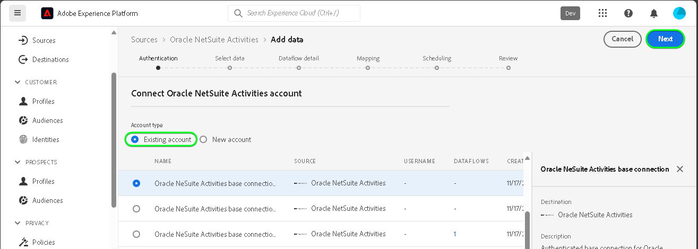

# Een [!DNL Oracle NetSuite Activities] bronverbinding maken in de gebruikersinterface

Lees de volgende zelfstudie om te leren hoe u gebeurtenisgegevens van uw [!DNL Oracle NetSuite Activities] -account naar Adobe Experience Platform kunt overbrengen in de gebruikersinterface.

## Aan de slag {#getting-started}

Deze zelfstudie vereist een goed begrip van de volgende onderdelen van Experience Platform:

* [[!DNL Experience Data Model (XDM)]  Systeem ](../../../../../xdm/home.md): Het gestandaardiseerde kader waardoor [!DNL Experience Platform] gegevens van de klantenervaring organiseert.
   * [ Grondbeginselen van schemacompositie ](../../../../../xdm/schema/composition.md): Leer over de basisbouwstenen van schema&#39;s XDM, met inbegrip van zeer belangrijke principes en beste praktijken in schemacompositie.
   * [ het leerprogramma van de Redacteur van het Schema ](../../../../../xdm/tutorials/create-schema-ui.md): Leer hoe te om douaneschema&#39;s tot stand te brengen gebruikend de Redacteur UI van het Schema.
* [[!DNL Real-Time Customer Profile]](../../../../../profile/home.md): biedt een uniform, real-time consumentenprofiel dat is gebaseerd op geaggregeerde gegevens van meerdere bronnen.

Als u reeds een geldige [!DNL Oracle NetSuite] rekening hebt, kunt u de rest van dit document overslaan en aan het leerprogramma te werk gaan op [ vormend een dataflow ](../../dataflow/marketing-automation.md).

>[!TIP]
>
>Lees het [[!DNL Oracle NetSuite]  overzicht ](../../../../connectors/marketing-automation/oracle-netsuite.md) voor informatie over hoe te om uw authentificatiegeloofsbrieven terug te winnen.

## Sluit uw [!DNL Oracle NetSuite] -account aan {#connect-account}

Selecteer in de gebruikersinterface van Experience Platform de optie **[!UICONTROL Sources]** in de linkernavigatie voor toegang tot de werkruimte van [!UICONTROL Sources] . U kunt de juiste categorie selecteren in de catalogus aan de linkerkant van het scherm. U kunt ook de specifieke bron vinden waarmee u wilt werken met de zoekoptie.

Onder de *categorie van de Automatisering van de Marketing*, selecteer **[!DNL Oracle NetSuite Activities]**, en selecteer dan **[!UICONTROL Add data]**.

De pagina **[!UICONTROL Connect Oracle NetSuite Activities account]** wordt weergegeven. Op deze pagina kunt u nieuwe of bestaande referenties gebruiken.

>[!IMPORTANT]
>
>Het vernieuwingstoken verloopt na zeven dagen. Zodra uw token verlopen, moet u op Experience Platform een account maken met uw bijgewerkte token. Als u geen nieuw account maakt met uw bijgewerkte token, wordt mogelijk het volgende foutbericht weergegeven: `The request could not be processed. Error from flow provider: The request could not be processed. Rest call failed with client error, status code 401 Unauthorized, please check your activity settings.`

### Bestaande account {#existing-account}

Als u een bestaande account wilt gebruiken, selecteert u de [!DNL Oracle NetSuite Activities] -account waarmee u een nieuwe gegevensstroom wilt maken en selecteert u vervolgens **[!UICONTROL Next]** om door te gaan.

### Nieuwe account {#new-account}

Als u een nieuwe account maakt, selecteert u **[!UICONTROL New account]** en geeft u een naam, een optionele beschrijving en uw referenties op. Als u klaar bent, selecteert u **[!UICONTROL Connect to source]** en laat u de nieuwe verbinding enige tijd tot stand brengen.

## Volgende stappen {#next-steps}

Aan de hand van deze zelfstudie hebt u een verbinding tot stand gebracht met uw [!DNL Oracle NetSuite Activities] -account. U kunt nu aan het volgende leerprogramma verdergaan en [ een dataflow vormen om gegevens in Experience Platform ](../../dataflow/marketing-automation.md) te brengen.

## Aanvullende bronnen {#additional-resources}

De onderstaande secties bevatten aanvullende bronnen waarnaar u kunt verwijzen wanneer u de [!DNL Oracle NetSuite Activities] -bron gebruikt.

### Toewijzing {#mapping}

Experience Platform biedt intelligente aanbevelingen voor automatisch toegewezen velden op basis van het doelschema of de gegevensset die u hebt geselecteerd. U kunt toewijzingsregels handmatig aanpassen aan uw gebruiksgevallen. Op basis van uw behoeften kunt u ervoor kiezen om velden rechtstreeks toe te wijzen of gegevens prep-functies te gebruiken om brongegevens om berekende of berekende waarden af te leiden. Voor uitvoerige stappen bij het gebruiken van de kaartperinterface en berekende gebieden, zie de [ gids UI van de Prep van Gegevens ](../../../../../data-prep/ui/mapping.md).

>[!NOTE]
>
>De weergegeven velden zijn afhankelijk van de abonnementen waartoe uw [!DNL Oracle NetSuite] -account toegang heeft. Als u bijvoorbeeld geen toegang hebt tot facturering, worden de betreffende velden voor facturering niet weergegeven.

### Planning {#scheduling}

Wanneer u de gegevensstroom [!DNL Oracle NetSuite Activities] wilt plannen voor opname, moet u de volgende frequentie- en intervalconfiguratie selecteren:

| Frequentie | Interval |
| --- | --- |
| `Once` | 1 |

Tijdens het ophalen van gegevens reageert [!DNL Oracle NetSuite] met de laatst gewijzigde of gemaakte datum als datumnotatie in plaats van als tijdstempel. De planning is daarom beperkt tot één dag.

Als u de waarden voor uw schema hebt opgegeven, selecteert u **[!UICONTROL Next]** .

