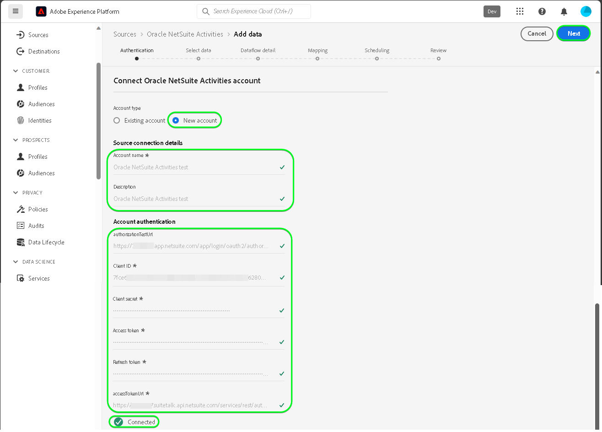

# Een [!DNL Oracle NetSuite Activities] bronverbinding in de gebruikersinterface

>[!NOTE]
>
>De [!DNL Oracle NetSuite Activities] De bron is in bèta. Zie de [overzicht van bronnen](../../../../home.md#terms-and-conditions) voor meer informatie over het gebruik van bronnen met een bètalabel.

Lees de volgende zelfstudie om te leren hoe u gebeurtenisgegevens van uw [!DNL Oracle NetSuite Activities] account aan Adobe Experience Platform in de gebruikersinterface.

## Aan de slag {#getting-started}

Deze zelfstudie vereist een goed begrip van de volgende onderdelen van het Experience Platform:

* [[!DNL Experience Data Model (XDM)] Systeem](../../../../../xdm/home.md): Het gestandaardiseerde kader waarbinnen [!DNL Experience Platform] organiseert de gegevens van de klantenervaring.
   * [Basisbeginselen van de schemacompositie](../../../../../xdm/schema/composition.md): Leer over de basisbouwstenen van schema&#39;s XDM, met inbegrip van zeer belangrijke principes en beste praktijken in schemacompositie.
   * [Zelfstudie Schema-editor](../../../../../xdm/tutorials/create-schema-ui.md): Leer hoe u aangepaste schema&#39;s maakt met de gebruikersinterface van de Schema-editor.
* [[!DNL Real-Time Customer Profile]](../../../../../profile/home.md): Biedt een uniform, real-time consumentenprofiel dat is gebaseerd op geaggregeerde gegevens van meerdere bronnen.

Als u al een geldige [!DNL Oracle NetSuite] account, kunt u de rest van dit document overslaan en doorgaan naar de zelfstudie op [configureren, gegevensstroom](../../dataflow/marketing-automation.md).

>[!TIP]
>
>Lees de [[!DNL Oracle NetSuite] overzicht](../../../../connectors/marketing-automation/oracle-netsuite.md) voor informatie over hoe te om uw authentificatiegeloofsbrieven terug te winnen.

## Verbind uw [!DNL Oracle NetSuite] account {#connect-account}

Selecteer in de interface Platform de optie **[!UICONTROL Sources]** van de linkernavigatie om tot [!UICONTROL Sources] werkruimte. U kunt de juiste categorie selecteren in de catalogus aan de linkerkant van het scherm. U kunt ook de specifieke bron vinden waarmee u wilt werken met de zoekoptie.

Onder de *Marketing Automation* categorie, selecteert u **[!DNL Oracle NetSuite Activities]** en selecteer vervolgens **[!UICONTROL Add data]**.

De **[!UICONTROL Connect Oracle NetSuite Activities account]** wordt weergegeven. Op deze pagina kunt u nieuwe of bestaande referenties gebruiken.

>[!IMPORTANT]
>
>Het vernieuwingstoken verloopt na zeven dagen. Wanneer uw token verlopen is, moet u op het Experience Platform een account maken met uw bijgewerkte token. Als u geen nieuw account maakt met uw bijgewerkte token, wordt mogelijk het volgende foutbericht weergegeven: `The request could not be processed. Error from flow provider: The request could not be processed. Rest call failed with client error, status code 401 Unauthorized, please check your activity settings.`

### Bestaande account {#existing-account}

Als u een bestaande account wilt gebruiken, selecteert u de optie [!DNL Oracle NetSuite Activities] account waarmee u een nieuwe gegevensstroom wilt maken, selecteert u **[!UICONTROL Next]** om verder te gaan.

### Nieuwe account {#new-account}

Als u een nieuwe account maakt, selecteert u **[!UICONTROL New account]** en geef vervolgens een naam, een optionele beschrijving en uw referenties op. Selecteer **[!UICONTROL Connect to source]** en laat dan wat tijd voor de nieuwe verbinding tot stand brengen.

## Volgende stappen {#next-steps}

Aan de hand van deze zelfstudie hebt u een verbinding tot stand gebracht met uw [!DNL Oracle NetSuite Activities] account. U kunt nu verdergaan met de volgende zelfstudie en [een gegevensstroom configureren om gegevens over te brengen naar het platform](../../dataflow/marketing-automation.md).

## Aanvullende bronnen {#additional-resources}

In de volgende secties vindt u aanvullende bronnen die u kunt raadplegen wanneer u de [!DNL Oracle NetSuite Activities] bron.

### Toewijzing {#mapping}

Platform biedt intelligente aanbevelingen voor automatisch toegewezen velden op basis van het doelschema of de gegevensset die u hebt geselecteerd. U kunt toewijzingsregels handmatig aanpassen aan uw gebruiksgevallen. Op basis van uw behoeften kunt u ervoor kiezen om velden rechtstreeks toe te wijzen of gegevens prep-functies te gebruiken om brongegevens om berekende of berekende waarden af te leiden. Voor uitvoerige stappen bij het gebruiken van de kaartperinterface en berekende gebieden, zie [UI-hulplijn voor gegevensvoorinstelling](../../../../../data-prep/ui/mapping.md).

>[!NOTE]
>
>De weergegeven velden zijn afhankelijk van de abonnementen die uw [!DNL Oracle NetSuite] account heeft toegang tot. Als u bijvoorbeeld geen toegang hebt tot facturering, worden de betreffende velden voor facturering niet weergegeven.

### Planning {#scheduling}

Wanneer u uw [!DNL Oracle NetSuite Activities] dataflow voor opname, moet u de volgende frequentie en intervalconfiguratie selecteren:

| Frequentie | Interval |
| --- | --- |
| `Once` | 1 |

Tijdens het ophalen van gegevens worden de [!DNL Oracle NetSuite] reageert met de laatst gewijzigde of gemaakte datum als een datumnotatie in plaats van een tijdstempel. De planning is daarom beperkt tot één dag.

Als u de waarden voor uw schema hebt opgegeven, selecteert u **[!UICONTROL Next]**.

