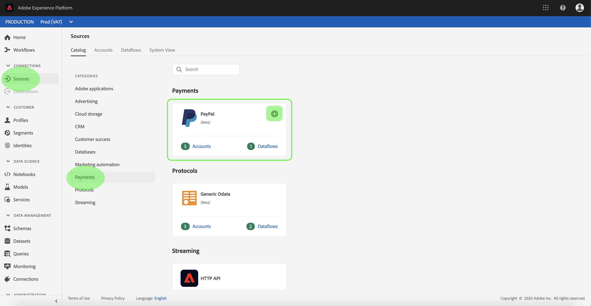

# Een PayPal-bronconnector maken in de gebruikersinterface

> [!NOTE]
> De PayPal-connector bevindt zich in bèta. De functies en documentatie kunnen worden gewijzigd.

De bronschakelaars in het Platform van de Ervaring van Adobe verstrekken de capaciteit om van buitenaf afkomstige gegevens op een geplande basis in te voeren. Deze zelfstudie bevat stappen voor het maken van een PayPal-bronconnector via de gebruikersinterface van Platform.

## Aan de slag

Voor deze zelfstudie is een goed begrip vereist van de volgende componenten van het Adobe Experience Platform:

* [XDM-systeem](../../../../../xdm/home.md)(Experience Data Model): Het gestandaardiseerde kader waardoor het Platform van de Ervaring gegevens van de klantenervaring organiseert.
   * [Basisbeginselen van de schemacompositie](../../../../../xdm/schema/composition.md): Leer over de basisbouwstenen van schema&#39;s XDM, met inbegrip van zeer belangrijke principes en beste praktijken in schemacompositie.
   * [Zelfstudie](../../../../../xdm/tutorials/create-schema-ui.md)Schema-editor: Leer hoe te om douaneschema&#39;s tot stand te brengen gebruikend de Redacteur UI van het Schema.
* [Klantprofiel](../../../../../profile/home.md)in realtime: Verstrekt een verenigd, real-time consumentenprofiel dat op bijeengevoegde gegevens van veelvoudige bronnen wordt gebaseerd.

Als u al een Paypal-basisverbinding hebt, kunt u de rest van dit document overslaan en doorgaan naar de zelfstudie over het [configureren van een gegevensstroom](../../dataflow/payments.md)

### Vereiste referenties verzamelen

U moet de volgende waarden opgeven om toegang te krijgen tot uw PayPal-accountplatform:

| Credentials | Beschrijving |
| ---------- | ----------- |
| `host` | De URL van het PayPal-exemplaar. |
| `clientID` | De client-id die aan uw PayPal-toepassing is gekoppeld. |
| `clientSecret` | Het clientgeheim dat aan uw PayPal-toepassing is gekoppeld. |

Meer informatie over aan de slag gaan vindt u in dit [PayPal-document](https://developer.paypal.com/docs/api/overview/#get-credentials)

## Sluit uw PayPal-account aan

Nadat u de vereiste gegevens hebt verzameld, kunt u de onderstaande stappen volgen om een nieuwe binnenkomende basisverbinding te maken voor de koppeling van uw Paypal-account aan Platform.

Meld u aan bij <a href="https://platform.adobe.com" target="_blank">Adobe Experience Platform</a> en selecteer vervolgens **Bronnen** in de linkernavigatiebalk voor toegang tot de werkruimte *Bronnen* . In het scherm *Catalogus* worden diverse bronnen weergegeven waarvoor u binnenkomende basisverbindingen kunt maken met. Elke bron toont het aantal bestaande basisverbindingen dat aan deze verbindingen is gekoppeld.

Selecteer onder de categorie *CRM* de optie **PayPal** om een informatiebalk aan de rechterkant van het scherm weer te geven. De informatiebalk bevat een korte beschrijving van de geselecteerde bron en opties voor het maken van verbinding met de bron of het bekijken van de documentatie. Selecteer **Connect-bron** als u een nieuwe binnenkomende basisverbinding wilt maken.

De pagina *Verbinding maken met PayPal* wordt weergegeven. Op deze pagina kunt u nieuwe of bestaande referenties gebruiken.

### Nieuwe account

Selecteer **Nieuw account** als u nieuwe referenties gebruikt. Geef in het invoerformulier dat wordt weergegeven, aan de basisverbinding een naam, een optionele beschrijving en uw PayPal-referenties op. Als u klaar bent, selecteert u **Connect** en laat u de nieuwe basisverbinding enige tijd tot stand brengen.

### Bestaande account

Als u verbinding wilt maken met een bestaande account, selecteert u het PayPal-account waarmee u verbinding wilt maken en selecteert u **Volgende** om door te gaan.

## Volgende stappen

Aan de hand van deze zelfstudie hebt u een basisverbinding met uw Paypal-account tot stand gebracht. U kunt nu verdergaan aan het volgende leerprogramma en een dataflow [vormen om de gegevens van CRM in Platform](../../dataflow/payments.md)te brengen.