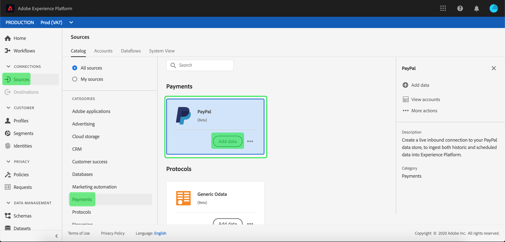

# Creeer een [!DNL PayPal] bronschakelaar in UI

>[!NOTE]
> De [!DNL PayPal] connector is in bèta. Zie het [Bronoverzicht](../../../../home.md#terms-and-conditions) voor meer informatie bij het gebruiken van bèta-geëtiketteerde schakelaars.

De bronschakelaars in Adobe Experience Platform verstrekken de capaciteit om van buitenaf afkomstige gegevens op een geplande basis in te voeren. Deze zelfstudie bevat stappen voor het maken van een [!DNL PayPal] bronaansluiting met behulp van de [!DNL Platform] gebruikersinterface.

## Aan de slag

Deze zelfstudie vereist een goed begrip van de volgende onderdelen van Adobe Experience Platform:

* [XDM-systeem](../../../../../xdm/home.md)(Experience Data Model): Het gestandaardiseerde kader waardoor de gegevens van de klantenervaring worden [!DNL Experience Platform] georganiseerd.
   * [Basisbeginselen van de schemacompositie](../../../../../xdm/schema/composition.md): Leer over de basisbouwstenen van schema&#39;s XDM, met inbegrip van zeer belangrijke principes en beste praktijken in schemacompositie.
   * [Zelfstudie](../../../../../xdm/tutorials/create-schema-ui.md)Schema-editor: Leer hoe te om douaneschema&#39;s tot stand te brengen gebruikend de Redacteur UI van het Schema.
* [Klantprofiel](../../../../../profile/home.md)in realtime: Verstrekt een verenigd, real-time consumentenprofiel dat op bijeengevoegde gegevens van veelvoudige bronnen wordt gebaseerd.

Als u reeds een [!DNL PayPal] basisverbinding hebt, kunt u de rest van dit document overslaan en aan het leerprogramma te werk gaan bij het [vormen van een gegevensstroom](../../dataflow/payments.md)

### Vereiste referenties verzamelen

Als u toegang wilt krijgen tot uw [!DNL PayPal] [!DNL Platform]account, moet u de volgende waarden opgeven:

| Credentials | Beschrijving |
| ---------- | ----------- |
| `host` | De URL van de [!DNL PayPal] instantie. |
| `clientID` | De client-id die aan uw [!DNL PayPal] toepassing is gekoppeld. |
| `clientSecret` | Het clientgeheim dat aan uw [!DNL PayPal] toepassing is gekoppeld. |

Meer informatie over aan de slag gaan vindt u in dit [PayPal-document](https://developer.paypal.com/docs/api/overview/#get-credentials)

## Uw [!DNL PayPal] account verbinden

Nadat u de vereiste gegevens hebt verzameld, kunt u de onderstaande stappen volgen om een nieuwe binnenkomende basisverbinding te maken waarmee u uw [!DNL PayPal] account kunt koppelen [!DNL Platform].

Meld u aan bij [Adobe Experience Platform](https://platform.adobe.com) en selecteer vervolgens **[!UICONTROL Bronnen]** in de linkernavigatiebalk voor toegang tot de werkruimte *[!UICONTROL Bronnen]* . In het scherm *[!UICONTROL Catalogus]* worden diverse bronnen weergegeven waarvoor u binnenkomende basisverbindingen kunt maken met. Elke bron toont het aantal bestaande basisverbindingen dat aan deze verbindingen is gekoppeld.

Selecteer onder de categorie *[!UICONTROL CRM]* de optie **[!UICONTROL PayPal]** om een informatiebalk aan de rechterkant van het scherm weer te geven. De informatiebalk bevat een korte beschrijving van de geselecteerde bron en opties voor het maken van verbinding met de bron of het bekijken van de documentatie. Als u een nieuwe binnenkomende basisverbinding wilt maken, selecteert u Gegevens **** toevoegen.

De pagina *[!UICONTROL Verbinding maken met PayPal]* wordt weergegeven. Op deze pagina kunt u nieuwe of bestaande referenties gebruiken.

### Nieuwe account

Selecteer **[!UICONTROL Nieuw account]** als u nieuwe referenties gebruikt. Geef in het invoerformulier dat wordt weergegeven, aan de basisverbinding een naam, een optionele beschrijving en uw [!DNL PayPal] referenties. Als u klaar bent, selecteert u **[!UICONTROL Connect]** en laat u de nieuwe basisverbinding enige tijd tot stand brengen.

### Bestaande account

Als u een bestaande account wilt verbinden, selecteert u de [!DNL PayPal] account waarmee u verbinding wilt maken en selecteert u **[!UICONTROL Volgende]** om door te gaan.

## Volgende stappen

Aan de hand van deze zelfstudie hebt u een basisverbinding met uw [!DNL PayPal] account tot stand gebracht. U kunt nu aan het volgende leerprogramma verdergaan en een dataflow [vormen om de gegevens van CRM in Platform](../../dataflow/payments.md)te brengen.