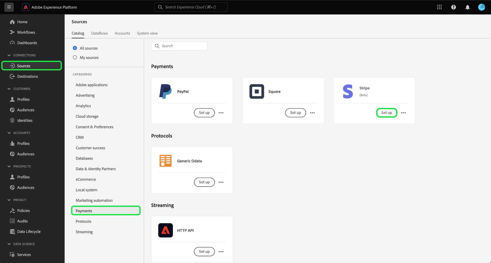

# Betalingsgegevens van uw [!DNL Stripe] account aan Experience Platform met behulp van de gebruikersinterface

>[!NOTE]
>
>De [!DNL Stripe] De bron is in bèta. Lees de [voorwaarden](../../../../home.md#terms-and-conditions) in het overzicht van bronnen voor meer informatie over het gebruik van bronnen met een bètalabel.

Lees de volgende zelfstudie om te leren hoe u betalingsgegevens uit uw [!DNL Stripe] met de gebruikersinterface naar Adobe Experience Platform.

## Aan de slag

Deze zelfstudie vereist een goed begrip van de volgende onderdelen van het Experience Platform:

* [[!DNL Experience Data Model (XDM)] Systeem](../../../../../xdm/home.md): Het gestandaardiseerde kader waarbinnen [!DNL Experience Platform] organiseert de gegevens van de klantenervaring.
   * [Basisbeginselen van de schemacompositie](../../../../../xdm/schema/composition.md): Leer over de basisbouwstenen van schema&#39;s XDM, met inbegrip van zeer belangrijke principes en beste praktijken in schemacompositie.
   * [Zelfstudie Schema-editor](../../../../../xdm/tutorials/create-schema-ui.md): Leer hoe u aangepaste schema&#39;s maakt met de gebruikersinterface van de Schema-editor.
* [[!DNL Real-Time Customer Profile]](../../../../../profile/home.md): Biedt een uniform, real-time consumentenprofiel dat is gebaseerd op geaggregeerde gegevens van meerdere bronnen.

### Verificatie

Lees de [[!DNL Stripe] overzicht](../../../../connectors/payments/stripe.md) voor informatie over hoe te om uw authentificatiegeloofsbrieven terug te winnen.

## Verbind uw [!DNL Stripe] account {#connect}

Selecteer in de interface Platform de optie **[!UICONTROL Sources]** van de linkernavigatie om tot [!UICONTROL Sources] werkruimte. U kunt de juiste categorie selecteren in de catalogus aan de linkerkant van het scherm. U kunt ook de specifieke bron vinden waarmee u wilt werken met de zoekoptie.

Onder de *Betalingen* categorie, selecteert u **[!DNL Stripe]** en selecteer vervolgens **[!UICONTROL Set up]**.

>[!TIP]
>
>De bronnen in de broncatalogus geven de **[!UICONTROL Set up]** als een bepaalde bron nog geen geverifieerde account heeft. Als er eenmaal een geverifieerd account is, wordt deze optie gewijzigd in **[!UICONTROL Add data]**.

De **[!UICONTROL Connect Stripe account]** wordt weergegeven. Op deze pagina kunt u nieuwe of bestaande referenties gebruiken.

>[!BEGINTABS]

>[!TAB Een nieuwe account maken]

Als u een nieuwe account wilt maken, selecteert u **[!UICONTROL New account]** en geef een naam, een optionele beschrijving en uw referenties op.

Selecteer **[!UICONTROL Connect to source]** en laat dan wat tijd voor de nieuwe verbinding tot stand brengen.

| Credentials | Beschrijving |
| --- | --- |
| Toegangstoken | Uw [!DNL Stripe] toegangstoken. Voor informatie over hoe te om uw toegangstoken terug te winnen, lees [[!DNL Stripe] verificatiehandleiding](../../../../connectors/payments/stripe.md). |

>[!TAB Een bestaande account gebruiken]

Als u een bestaande account wilt gebruiken, selecteert u **[!UICONTROL Existing account]** en selecteer vervolgens de account die u wilt gebruiken in de bestaande accountcatalogus.

Selecteren **[!UICONTROL Next]** om verder te gaan.

>[!ENDTABS]

## Gegevens selecteren {#select-data}

Nu u toegang hebt tot uw account, moet u het juiste pad naar het [!DNL Stripe] gegevens die u wilt invoeren. Selecteren **[!UICONTROL Resource path]** en selecteer dan het eindpunt van waar u gegevens van wilt opnemen. De beschikbare [!DNL Stripe] de eindpunten zijn :

* Heffingen
* Lidmaatschappen
* Restituties
* Transacties balanceren
* Klanten
* Prijzen

Zodra uw eindpunt wordt geselecteerd, werkt de interface in een voorproefscherm bij, die de gegevensstructuur van [!DNL Stripe] het eindpunt dat u hebt geselecteerd. Selecteren **[!UICONTROL Next]** om verder te gaan.

## Gegevensset en gegevens over gegevensstroom opgeven {#provide-dataset-and-dataflow-details}

Daarna, moet u informatie over uw dataset en uw gegevensstroom verstrekken.

### Gegevens over gegevensset {#dataset-details}

Een dataset is een opslag en beheersconstructie voor een inzameling van gegevens, typisch een lijst, die een schema (kolommen) en gebieden (rijen) bevat. De gegevens die met succes in Experience Platform worden opgenomen worden opgeslagen binnen het gegevensmeer als datasets. Tijdens deze stap, kunt u een nieuwe dataset tot stand brengen of een bestaande dataset gebruiken.

>[!BEGINTABS]

>[!TAB Een nieuwe gegevensset gebruiken]

Als u een nieuwe gegevensset wilt gebruiken, selecteert u **[!UICONTROL New dataset]** en geef vervolgens een naam en een optionele beschrijving voor uw gegevensset op. U moet ook een schema van het Model van de Gegevens van de Ervaring (XDM) selecteren dat uw dataset volgt aan.

| Nieuwe gegevens gegevensset | Beschrijving |
| --- | --- |
| Naam uitvoergegevensset | De naam van uw nieuwe dataset. |
| Beschrijving | (Optioneel) Een korte toelichting op de nieuwe gegevensset. |
| Schema | Een vervolgkeuzelijst met schema&#39;s die in uw organisatie bestaan. U kunt ook uw eigen schema vóór het proces van de bronconfiguratie maken. Lees voor meer informatie de handleiding op [een XDM-schema maken in de gebruikersinterface](../../../../../xdm/tutorials/create-schema-ui.md). |

>[!TAB Een bestaande gegevensset gebruiken]

Als u al een bestaande dataset hebt, selecteert u **[!UICONTROL Existing dataset]** en gebruikt vervolgens de **[!UICONTROL Advanced search]** optie om een venster van alle datasets in uw organisatie, met inbegrip van hun respectieve details, zoals te bekijken of zij voor opname aan het Profiel van de Klant in real time of niet worden toegelaten.

>[!ENDTABS]

+++Selecteer voor stappen om de opname van het Profiel, de diagnostiek van de fout, en gedeeltelijke opname toe te laten.

Als uw dataset voor het Profiel van de Klant in real time wordt toegelaten, dan tijdens deze stap, kunt u van een knevel voorzien **[!UICONTROL Profile dataset]** om uw gegevens in te schakelen voor profielopname. U kunt deze stap ook gebruiken om **[!UICONTROL Error diagnostics]** en **[!UICONTROL Partial ingestion]**.

* **[!UICONTROL Error diagnostics]**: Select **[!UICONTROL Error diagnostics]** om de bron op te dragen om foutendiagnostiek te veroorzaken die u wanneer het controleren van uw datasetactiviteit en dataflow status kunt later van verwijzingen voorzien.
* **[!UICONTROL Partial ingestion]**: Gedeeltelijke batch-opname is de mogelijkheid om gegevens met fouten in te voeren, tot een bepaalde configureerbare drempel. Met deze functie kunt u al uw nauwkeurige gegevens in het Experience Platform opnemen, terwijl al uw onjuiste gegevens afzonderlijk worden opgeslagen met informatie over waarom deze niet geldig zijn.

+++

### Gegevens gegevensstroom {#dataflow-details}

Zodra uw dataset wordt gevormd, moet u details op uw gegevensstroom, met inbegrip van een naam, een facultatieve beschrijving, en waakzame configuraties dan verstrekken.

| Dataflow-configuraties | Beschrijving |
| --- | --- |
| Naam gegevensstroom | De naam van de gegevensstroom.  Standaard wordt hiervoor de naam gebruikt van het bestand dat wordt geïmporteerd. |
| Beschrijving | (Optioneel) Een korte beschrijving van uw gegevensstroom. |
| Waarschuwingen | Experience Platform kan op gebeurtenissen gebaseerde waarschuwingen genereren waarop gebruikers zich kunnen abonneren. Deze opties vereisen allen een lopende gegevensstroom om hen teweeg te brengen.  Lees voor meer informatie de [waarschuwingsoverzicht](../../alerts.md) <ul><li>**Bronnen DataAfter Run Start**: Selecteer deze waarschuwing om een melding te ontvangen wanneer de dataflow-run begint.</li><li>**Bronnen DataAfterFlow voltooid**: Selecteer deze waarschuwing om een melding te ontvangen als de gegevensstroom zonder fouten eindigt.</li><li>**Bronnen DataAfterFlow-fout**: Selecteer deze waarschuwing als u een melding wilt ontvangen als de uitvoering van de gegevensstroom eindigt met fouten.</li></ul> |

Selecteer **[!UICONTROL Next]** om verder te gaan.

## Velden toewijzen aan een XDM-schema {#mapping}

De **[!UICONTROL Mapping]** wordt weergegeven. Gebruik de toewijzingsinterface om uw brongegevens aan de aangewezen schemagebieden in kaart te brengen alvorens die gegevens in Experience Platform in te voeren. Voor een uitgebreide gids over hoe te om de kaartinterface te gebruiken, lees [UI-hulplijn voor gegevensvoorinstelling](../../../../../data-prep/ui/mapping.md) voor meer informatie .

## Inlogschema configureren {#scheduling}

Daarna, gebruik de het plannen interface om een innameprogramma voor uw dataflow tot stand te brengen.

Selecteer de frequentie dropdown om de de innamefrequentie van uw gegevensstroom te vormen.

U kunt ook het kalenderpictogram selecteren en een pop-upkalender gebruiken om de begintijd van de opname te configureren.

| Configuratie plannen | Beschrijving |
| --- | --- |
| Frequentie | Vorm frequentie om erop te wijzen hoe vaak dataflow zou moeten lopen. U kunt de frequentie instellen op: <ul><li>**Eenmaal**: Stel de frequentie in op `once` een eenmalige opname maken. Configuraties voor interval en backfill zijn niet beschikbaar wanneer u een eenmalige gegevensstroom maakt. Standaard wordt de planningsfrequentie ingesteld op één keer.</li><li>**Minute**: Stel de frequentie in op `minute` om uw gegevensstroom te plannen om gegevens per minuut in te voeren.</li><li>**Uur**:Stel de frequentie in op `hour` om uw gegevensstroom te plannen om gegevens op een per-uurbasis in te voeren.</li><li>**Dag**: Stel de frequentie in op `day` om uw gegevensstroom te plannen om gegevens per dag in te voeren.</li><li>**Week**: Stel de frequentie in op `week` om uw gegevensstroom te plannen om gegevens per week in te voeren.</li></ul> |
| Interval | Zodra u een frequentie selecteert, kunt u het interval dat dan vormen om het tijdkader tussen elke opname te vestigen. Bijvoorbeeld, als u uw frequentie aan dag plaatst en het interval aan 15 vormt, dan zal uw dataflow om de 15 dagen lopen. **Opmerking**: U kunt het interval niet instellen op nul. |
| Begintijd | Het tijdstempel voor de geprojecteerde run, weergegeven in UTC-tijdzone. |
| Achtergrond | Met Backfill wordt bepaald welke gegevens in eerste instantie worden ingevoerd. Als backfill is ingeschakeld, worden alle huidige bestanden in het opgegeven pad tijdens de eerste geplande inname opgenomen. Als terugvullen is uitgeschakeld, worden alleen de bestanden opgenomen die tussen de eerste opname en de begintijd worden geladen. Bestanden die vóór de begintijd zijn geladen, worden niet opgenomen. |

Als u het schema voor inname van uw gegevensstroom hebt geconfigureerd, selecteert u **[!UICONTROL Next]**.

## Controleer uw gegevensstroom

De laatste stap in het proces voor het maken van een gegevensstroom is het controleren van de gegevensstroom voordat deze wordt uitgevoerd. Gebruik de **[!UICONTROL Review]** stap om de details van uw nieuwe gegevensstroom te herzien alvorens het loopt. De details worden gegroepeerd in de volgende categorieën:

* **Verbinding**: Hiermee geeft u het brontype, het relevante pad van het gekozen bronbestand en het aantal kolommen in dat bronbestand weer.
* **Gegevensset- en kaartvelden toewijzen**: Toont welke dataset de brongegevens worden opgenomen in, met inbegrip van het schema dat de dataset volgt.
* **Planning**: Hiermee geeft u de actieve periode, frequentie en interval van het innameschema weer.

Nadat u de gegevensstroom hebt gecontroleerd, selecteert u **[!UICONTROL Finish]** en laat enige tijd voor de gegevensstroom worden gecreeerd.

## Volgende stappen

Door deze zelfstudie te volgen, hebt u een gegevensstroom gemaakt om betalingsgegevens van uw [!DNL Stripe] bron naar Experience Platform. Voor extra bronnen raadpleegt u de documentatie die hieronder wordt beschreven.

### Uw gegevensstroom controleren

Zodra uw gegevensstroom is gecreeerd, kunt u de gegevens controleren die door het worden opgenomen om informatie over innamesnelheden, succes, en fouten te bekijken. Voor meer informatie over hoe te om dataflow te controleren, bezoek de zelfstudie op [het controleren van rekeningen en gegevensstromen in UI](../../../../../dataflows/ui/monitor-sources.md).

### Uw gegevensstroom bijwerken

Ga naar de zelfstudie voor het bijwerken van configuraties voor uw dataflows die plannen, toewijzingen en algemene informatie plannen [het bijwerken van bronnen dataflows in UI](../../update-dataflows.md).

### Uw gegevensstroom verwijderen

U kunt gegevensstromen schrappen die niet meer noodzakelijk of verkeerd gecreeerd gebruikend zijn **[!UICONTROL Delete]** functie beschikbaar in de **[!UICONTROL Dataflows]** werkruimte. Ga voor meer informatie over het verwijderen van gegevensstromen naar de zelfstudie op [gegevens verwijderen in de gebruikersinterface](../../delete.md).
