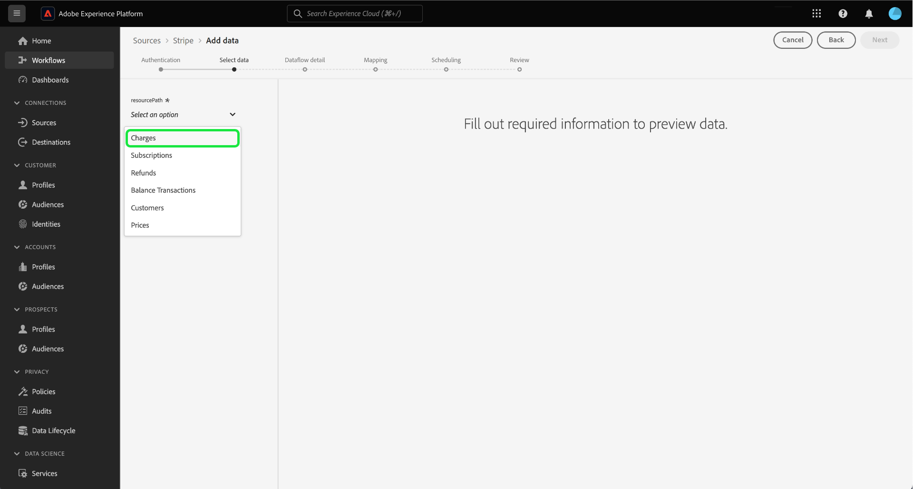

# Betalingsgegevens vanuit uw [!DNL Stripe] -account aan het Experience Platform toevoegen via de gebruikersinterface

>[!NOTE]
>
>De bron [!DNL Stripe] is in bèta. Lees de [ termijnen en voorwaarden ](../../../../home.md#terms-and-conditions) in het bronoverzicht voor meer informatie bij het gebruiken van bèta-geëtiketteerde bronnen.

Lees de volgende zelfstudie om te leren hoe u via de gebruikersinterface betalingsgegevens van uw [!DNL Stripe] -account aan Adobe Experience Platform kunt toevoegen.

## Aan de slag

Deze zelfstudie vereist een goed begrip van de volgende onderdelen van het Experience Platform:

* [[!DNL Experience Data Model (XDM)]  Systeem ](../../../../../xdm/home.md): Het gestandaardiseerde kader waardoor [!DNL Experience Platform] gegevens van de klantenervaring organiseert.
   * [ Grondbeginselen van schemacompositie ](../../../../../xdm/schema/composition.md): Leer over de basisbouwstenen van schema&#39;s XDM, met inbegrip van zeer belangrijke principes en beste praktijken in schemacompositie.
   * [ het leerprogramma van de Redacteur van het Schema ](../../../../../xdm/tutorials/create-schema-ui.md): Leer hoe te om douaneschema&#39;s tot stand te brengen gebruikend de Redacteur UI van het Schema.
* [[!DNL Real-Time Customer Profile]](../../../../../profile/home.md): biedt een uniform, real-time consumentenprofiel dat is gebaseerd op geaggregeerde gegevens van meerdere bronnen.

### Verificatie

Lees het [[!DNL Stripe]  overzicht ](../../../../connectors/payments/stripe.md) voor informatie over hoe te om uw authentificatiegeloofsbrieven terug te winnen.

## Sluit uw [!DNL Stripe] -account aan {#connect}

Selecteer in de gebruikersinterface van het platform de optie **[!UICONTROL Sources]** in de linkernavigatie voor toegang tot de werkruimte van [!UICONTROL Sources] . U kunt de juiste categorie selecteren in de catalogus aan de linkerkant van het scherm. U kunt ook de specifieke bron vinden waarmee u wilt werken met de zoekoptie.

Onder de *categorie van Betalingen*, selecteer **[!DNL Stripe]**, en selecteer dan **[!UICONTROL Set up]**.

>[!TIP]
>
>Bronnen in de catalogus met bronnen geven de optie **[!UICONTROL Set up]** weer wanneer een bepaalde bron nog geen geverifieerde account heeft. Zodra een geverifieerd account bestaat, verandert deze optie in **[!UICONTROL Add data]** .

De pagina **[!UICONTROL Connect Stripe account]** wordt weergegeven. Op deze pagina kunt u nieuwe of bestaande referenties gebruiken.

>[!BEGINTABS]

>[!TAB  creeer een nieuwe rekening ]

Als u een nieuwe account wilt maken, selecteert u **[!UICONTROL New account]** en geeft u een naam, een optionele beschrijving en uw referenties op.

Als u klaar bent, selecteert u **[!UICONTROL Connect to source]** en laat u de nieuwe verbinding enige tijd tot stand brengen.

| Credentials | Beschrijving |
| --- | --- |
| Toegangstoken | Uw toegangstoken van [!DNL Stripe]. Voor informatie over hoe te om uw toegangstoken terug te winnen, lees de [[!DNL Stripe]  authentificatiegids ](../../../../connectors/payments/stripe.md). |

>[!TAB  Gebruik een bestaande rekening ]

Als u een bestaande account wilt gebruiken, selecteert u **[!UICONTROL Existing account]** en selecteert u vervolgens de account die u wilt gebruiken in de bestaande accountcatalogus.

Selecteer **[!UICONTROL Next]** om door te gaan.

>[!ENDTABS]

## Gegevens selecteren {#select-data}

Nu u toegang hebt tot uw account, moet u het juiste pad aangeven naar de [!DNL Stripe] -gegevens die u wilt invoeren. Selecteer **[!UICONTROL Resource path]** en selecteer vervolgens het eindpunt waaruit u gegevens wilt invoeren. De beschikbare [!DNL Stripe] eindpunten zijn:

* Heffingen
* Lidmaatschappen
* Restituties
* Transacties balanceren
* Klanten
* Prijzen

Zodra uw eindpunt wordt geselecteerd, werkt de interface in een voorproefscherm bij, die de gegevensstructuur van het [!DNL Stripe] eindpunt toont dat u selecteerde. Selecteer **[!UICONTROL Next]** om door te gaan.

## Gegevensset en gegevens over gegevensstroom opgeven {#provide-dataset-and-dataflow-details}

Daarna, moet u informatie over uw dataset en uw gegevensstroom verstrekken.

### Gegevens over gegevensset {#dataset-details}

Een dataset is een opslag en beheersconstructie voor een inzameling van gegevens, typisch een lijst, die een schema (kolommen) en gebieden (rijen) bevat. De gegevens die met succes in Experience Platform worden opgenomen worden opgeslagen binnen het gegevensmeer als datasets. Tijdens deze stap, kunt u een nieuwe dataset tot stand brengen of een bestaande dataset gebruiken.

>[!BEGINTABS]

>[!TAB  Gebruik een nieuwe dataset ]

Als u een nieuwe gegevensset wilt gebruiken, selecteert u **[!UICONTROL New dataset]** en geeft u een naam en een optionele beschrijving voor de gegevensset op. U moet ook een schema van het Model van de Gegevens van de Ervaring (XDM) selecteren dat uw dataset volgt aan.

| Nieuwe gegevens gegevensset | Beschrijving |
| --- | --- |
| Naam uitvoergegevensset | De naam van uw nieuwe dataset. |
| Beschrijving | (Optioneel) Een korte toelichting op de nieuwe gegevensset. |
| Schema | Een vervolgkeuzelijst met schema&#39;s die in uw organisatie bestaan. U kunt ook uw eigen schema vóór het proces van de bronconfiguratie maken. Voor meer informatie, lees de gids op [ creërend een schema XDM in UI ](../../../../../xdm/tutorials/create-schema-ui.md). |

>[!TAB  Gebruik een bestaande dataset ]

Als u al een bestaande dataset hebt, selecteert u **[!UICONTROL Existing dataset]** en gebruikt u vervolgens de optie **[!UICONTROL Advanced search]** om een venster weer te geven met alle datasets in uw organisatie, inclusief de respectievelijke details, zoals of deze zijn ingeschakeld voor opname in het realtime-klantprofiel.

>[!ENDTABS]

+++Selecteer voor stappen om de opname van het Profiel, de diagnostiek van de fout, en gedeeltelijke opname toe te laten.

Als uw dataset voor het Profiel van de Klant in real time wordt toegelaten, dan tijdens deze stap, kunt u **[!UICONTROL Profile dataset]** van een knevel voorzien om uw gegevens voor Profiel-opname toe te laten. U kunt deze stap ook gebruiken om **[!UICONTROL Error diagnostics]** en **[!UICONTROL Partial ingestion]** in te schakelen.

* **[!UICONTROL Error diagnostics]**: Selecteer **[!UICONTROL Error diagnostics]** om de bron de instructie te geven foutdiagnostiek te produceren waarnaar u later kunt verwijzen bij het controleren van de gegevenssetactiviteit en de status van de gegevensstroom.
* **[!UICONTROL Partial ingestion]**: Gedeeltelijke batch-opname is de mogelijkheid om gegevens met fouten in te voeren tot een bepaalde configureerbare drempel. Met deze functie kunt u al uw nauwkeurige gegevens in het Experience Platform opnemen, terwijl al uw onjuiste gegevens afzonderlijk worden opgeslagen met informatie over waarom deze niet geldig zijn.

+++

### Gegevens gegevensstroom {#dataflow-details}

Zodra uw dataset wordt gevormd, moet u details op uw gegevensstroom, met inbegrip van een naam, een facultatieve beschrijving, en waakzame configuraties dan verstrekken.

| Dataflow-configuraties | Beschrijving |
| --- | --- |
| Naam gegevensstroom | De naam van de gegevensstroom.  Standaard wordt hiervoor de naam gebruikt van het bestand dat wordt geïmporteerd. |
| Beschrijving | (Optioneel) Een korte beschrijving van uw gegevensstroom. |
| Waarschuwingen | Experience Platform kan op gebeurtenissen gebaseerde waarschuwingen genereren waarop gebruikers zich kunnen abonneren. Deze opties vereisen allen een lopende gegevensstroom om hen teweeg te brengen.  Voor meer informatie, lees het [ alarm overzicht ](../../alerts.md) <ul><li>**het Begin van de Looppas van Bronnen Dataflow**: Selecteer dit alarm om een bericht te ontvangen wanneer uw dataflow looppas begint.</li><li>**Bronnen Dataflow de Succes van de Looppas**: Selecteer dit alarm om een bericht te ontvangen als uw dataflow zonder enige fouten beëindigt.</li><li>**de Uitval van de Looppas van Gegevensstroom van Bronnen**: Selecteer dit alarm om een bericht te ontvangen als uw dataflow looppas met om het even welke fouten beëindigt.</li></ul> |

Als u klaar bent, selecteert u **[!UICONTROL Next]** om door te gaan.

## Velden toewijzen aan een XDM-schema {#mapping}

De stap **[!UICONTROL Mapping]** wordt weergegeven. Gebruik de toewijzingsinterface om uw brongegevens aan de aangewezen schemagebieden in kaart te brengen alvorens die gegevens in Experience Platform in te voeren. Voor een uitgebreide gids op hoe te om de kaartinterface te gebruiken, lees de [ gids UI van de Prep van Gegevens ](../../../../../data-prep/ui/mapping.md) voor meer informatie.

## Inlogschema configureren {#scheduling}

Daarna, gebruik de het plannen interface om een innameprogramma voor uw dataflow tot stand te brengen.

Selecteer de frequentie dropdown om de de innamefrequentie van uw gegevensstroom te vormen.

U kunt ook het kalenderpictogram selecteren en een pop-upkalender gebruiken om de begintijd van de opname te configureren.

| Configuratie plannen | Beschrijving |
| --- | --- |
| Frequentie | Vorm frequentie om erop te wijzen hoe vaak dataflow zou moeten lopen. U kunt de frequentie instellen op: <ul><li>**Eenmaal**: Plaats uw frequentie aan `once` om eenmalig te creëren. Configuraties voor interval en backfill zijn niet beschikbaar wanneer u een eenmalige gegevensstroom maakt. Standaard wordt de planningsfrequentie ingesteld op één keer.</li><li>**Minuut**: Plaats uw frequentie aan `minute` om uw gegevensstroom te plannen om gegevens op een per-minieme basis in te voeren.</li><li>**Uur**: Plaats uw frequentie aan `hour` om uw gegevensstroom te plannen om gegevens op een per-uurbasis in te voeren.</li><li>**Dag**: Plaats uw frequentie aan `day` om uw gegevensstroom te plannen om gegevens op een per-dagbasis in te voeren.</li><li>**Week**: Plaats uw frequentie aan `week` om uw gegevensstroom te plannen om gegevens op een per-weekbasis in te voeren.</li></ul> |
| Interval | Zodra u een frequentie selecteert, kunt u het interval dat dan vormen om het tijdkader tussen elke opname te vestigen. Bijvoorbeeld, als u uw frequentie aan dag plaatst en het interval aan 15 vormt, dan zal uw dataflow om de 15 dagen lopen. U kunt het interval niet instellen op nul. De minimaal toegestane intervalwaarde voor elke frequentie is als volgt:<ul><li>**Eenmaal**: n/a</li><li>**Minuut**: 15</li><li>**Uur**: 1</li><li>**Dag**: 1</li><li>**Week**: 1</li></ul> |
| Begintijd | Het tijdstempel voor de geprojecteerde run, weergegeven in UTC-tijdzone. |
| Achtergrond | Met Backfill wordt bepaald welke gegevens in eerste instantie worden ingevoerd. Als backfill is ingeschakeld, worden alle huidige bestanden in het opgegeven pad tijdens de eerste geplande inname opgenomen. Als terugvullen is uitgeschakeld, worden alleen de bestanden opgenomen die tussen de eerste opname en de begintijd worden geladen. Bestanden die vóór de begintijd zijn geladen, worden niet opgenomen. |

Selecteer **[!UICONTROL Next]** als u het schema voor inname van de gegevensstroom hebt geconfigureerd.

## Controleer uw gegevensstroom

De laatste stap in het proces voor het maken van een gegevensstroom is het controleren van de gegevensstroom voordat deze wordt uitgevoerd. Gebruik de stap **[!UICONTROL Review]** om de details van de nieuwe gegevensstroom te bekijken voordat deze wordt uitgevoerd. De details worden gegroepeerd in de volgende categorieën:

* **Verbinding**: Toont het brontype, de relevante weg van het gekozen brondossier, en het aantal kolommen binnen dat brondossier.
* **wijst dataset &amp; kaartgebieden** toe: Toont welke dataset de brongegevens in, met inbegrip van het schema worden opgenomen dat de dataset aan vasthoudt.
* **Plannend**: Toont de actieve periode, de frequentie, en het interval van het innameprogramma.

Nadat u de gegevensstroom hebt gereviseerd, selecteert u **[!UICONTROL Finish]** en laat u enige tijd over om de gegevensstroom te maken.

## Volgende stappen

Aan de hand van deze zelfstudie hebt u een gegevensstroom gemaakt om betalingsgegevens van uw [!DNL Stripe] -bron naar het Experience Platform te verzenden. Voor extra bronnen raadpleegt u de documentatie die hieronder wordt beschreven.

### Uw gegevensstroom controleren

Zodra uw gegevensstroom is gecreeerd, kunt u de gegevens controleren die door het worden opgenomen om informatie over innamesnelheden, succes, en fouten te bekijken. Voor meer informatie over hoe te om dataflow te controleren, bezoek het leerprogramma op [ controlerekeningen en dataflows in UI ](../../../../../dataflows/ui/monitor-sources.md).

### Uw gegevensstroom bijwerken

Om configuraties voor uw dataflows bij te werken die, afbeelding, en algemene informatie plannen, bezoek het leerprogramma op [ bijwerken brondataflows in UI ](../../update-dataflows.md).

### Uw gegevensstroom verwijderen

U kunt gegevensstromen verwijderen die niet meer nodig zijn of die onjuist zijn gemaakt met de functie **[!UICONTROL Delete]** die beschikbaar is in de **[!UICONTROL Dataflows]** -werkruimte. Voor meer informatie over hoe te om dataflows te schrappen, bezoek het leerprogramma bij [ het schrappen van dataflows in UI ](../../delete.md).
