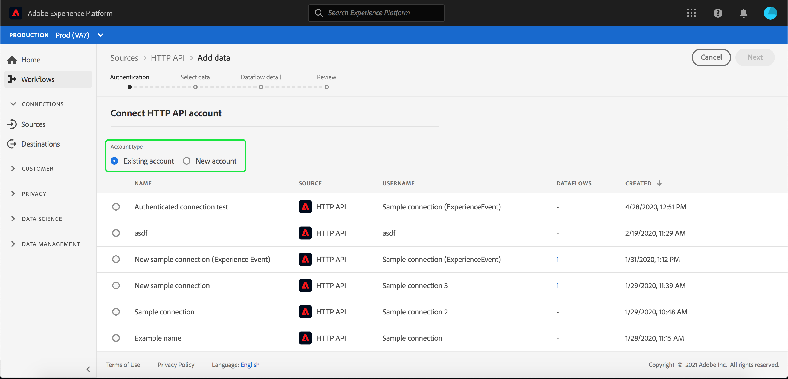

# Een streamingverbinding maken met de gebruikersinterface

Deze UI-handleiding helpt u bij het maken van een streamingverbinding met Adobe Experience Platform.

## Aan de slag

Deze zelfstudie vereist een goed begrip van de volgende onderdelen van Adobe Experience Platform:

- [[!DNL Experience Data Model (XDM)] Systeem](../../../../../xdm/home.md): Het gestandaardiseerde kader waardoor de gegevens van de  [!DNL Experience Platform] klantenervaring worden georganiseerd.
   - [Basisbeginselen van de schemacompositie](../../../../../xdm/schema/composition.md): Leer over de basisbouwstenen van schema&#39;s XDM, met inbegrip van zeer belangrijke principes en beste praktijken in schemacompositie.
   - [Zelfstudie](../../../../../xdm/tutorials/create-schema-ui.md) Schema-editor: Leer hoe te om douaneschema&#39;s tot stand te brengen gebruikend de Redacteur UI van het Schema.
- [[!DNL Real-time Customer Profile]](../../../../../profile/home.md): Verstrekt een verenigd, real-time consumentenprofiel dat op bijeengevoegde gegevens van veelvoudige bronnen wordt gebaseerd.

## Een streamingverbinding maken

Nadat u zich hebt aangemeld bij de [!DNL Experience Platform] UI, selecteert u **[!UICONTROL Bronnen]** in de linkernavigatiebalk om toegang te krijgen tot de werkruimte **[!UICONTROL Bronnen]**. Het scherm **[!UICONTROL Catalog]** toont een verscheidenheid van bronnen waarvoor u een rekening kunt tot stand brengen met.

U kunt de juiste categorie selecteren in de catalogus aan de linkerkant van het scherm. U kunt ook de specifieke bron vinden waarmee u wilt werken met de zoekoptie.

Selecteer **[!UICONTROL HTTP API]** onder de categorie **[!UICONTROL Streaming]**. Als dit uw eerste keer gebruikend deze schakelaar is, uitgezocht **[!UICONTROL vorm]**. Anders selecteert u **[!UICONTROL Gegevens toevoegen]** om een nieuwe HTTP-streamingconnector te maken.

De pagina **[!UICONTROL Connect HTTP API-account]** wordt weergegeven. Op deze pagina kunt u nieuwe of bestaande referenties gebruiken.

### Nieuwe account

Als u nieuwe geloofsbrieven gebruikt, selecteer **[!UICONTROL Nieuwe rekening]**. Geef in het invoerformulier dat wordt weergegeven een accountnaam en een optionele beschrijving op. U zult ook de optie krijgen om de volgende configuratieeigenschappen te verstrekken:

- **[!UICONTROL Verificatie]:** Deze eigenschap bepaalt of verificatie is vereist voor de streamingverbinding. Verificatie zorgt ervoor dat gegevens worden verzameld van vertrouwde bronnen. Als u met Persoonlijk Identificeerbare Informatie (PII) werkt, zou dit bezit moeten worden aangezet. Deze eigenschap is standaard uitgeschakeld.
- **[!UICONTROL Compatibiliteit met] XDM-schema:** deze eigenschap geeft aan of deze streamingverbinding gebeurtenissen verzendt die compatibel zijn met XDM-schema&#39;s. Deze eigenschap is standaard ingeschakeld.

Selecteer **[!UICONTROL Verbinden met bron]**, gevolgd door **[!UICONTROL Volgende]** om door te gaan.

### Bestaande account

Als u verbinding wilt maken met bestaande referenties, selecteert u de HTTP API-verbinding die u wilt gebruiken en selecteert u **[!UICONTROL Volgende]** om door te gaan.

## Gegevens selecteren

Nadat u de HTTP API-verbinding hebt gemaakt, wordt de stap **[!UICONTROL Gegevens selecteren]** weergegeven en wordt een interface weergegeven waarmee u kunt kiezen met welke gegevensset u verbinding wilt maken. U hebt de optie om of een nieuwe dataset tot stand te brengen of met een bestaande dataset te verbinden.

### Een nieuwe gegevensset maken

Om een nieuwe dataset tot stand te brengen, selecteer **[!UICONTROL Nieuwe dataset]**. Voor de vorm die verschijnt, verstrek de naam, een facultatieve beschrijving, evenals het doelschema voor de dataset. Als u een Profiel toegelaten schema selecteert, kunt u kiezen als de dataset ook toegelaten Profiel zou moeten zijn.

### Een bestaande gegevensset gebruiken

Als u een bestaande gegevensset wilt gebruiken, selecteert u **[!UICONTROL Bestaande gegevensset]**. Selecteer in het formulier dat wordt weergegeven de gegevensset die u wilt gebruiken. Zodra u een dataset selecteert, kunt u kiezen als de dataset toegelaten Profiel zou moeten zijn.

## Gegevens

De stap **[!UICONTROL Dataflow detail]** wordt weergegeven. Op deze pagina kunt u details voor de gemaakte gegevensstroom verstrekken door een naam en een facultatieve beschrijving te geven.

Nadat u de details voor de gegevensstroom hebt opgegeven, selecteert u **[!UICONTROL Volgende]**.

## Controleren

De stap **[!UICONTROL Review]** verschijnt, die u toestaat om de details van uw gegevensstroom te herzien alvorens het wordt gecreeerd. De details zijn groep binnen de volgende categorieën:

- **[!UICONTROL Verbinding]**: Hier worden de naam van de account, het bronplatform en de bronnaam weergegeven.
- **[!UICONTROL Gegevensset- en kaartvelden]** toewijzen: Toont de doeldataset en het schema dat de dataset aansluit.

Nadat u de details hebt bevestigd, selecteert u **[!UICONTROL Voltooien]**.

## URL voor streamingeindpunt ophalen

Als de verbinding is gemaakt, wordt de pagina met brondetails weergegeven. Deze pagina bevat details van de zojuist gemaakte verbinding, waaronder eerder uitgevoerde dataflows, ID en URL van het streamingeindpunt.

## Volgende stappen

Door deze zelfstudie te volgen, hebt u een het stromen verbinding van HTTP gecreeerd, toelatend u om het het stromen eindpunt te gebruiken om tot een verscheidenheid van [!DNL Data Ingestion] APIs toegang te hebben. Voor instructies voor het maken van een streamingverbinding in de API leest u de [zelfstudie voor het maken van een streamingverbinding](../../../api/create/streaming/http.md).

Lees de zelfstudie over [streamingtijdreeksgegevens](../../../../../ingestion/tutorials/streaming-time-series-data.md) of de zelfstudie over [streamingrecordgegevens](../../../../../ingestion/tutorials/streaming-record-data.md) voor meer informatie over het streamen van gegevens naar Platform.
