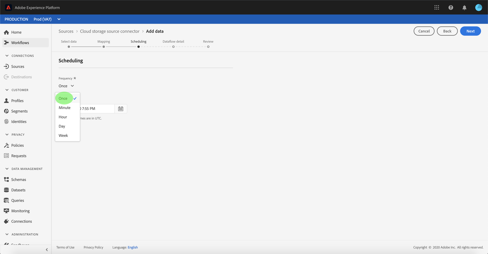

# Een gegevensstroom configureren voor een batch-verbinding voor cloudopslag in de gebruikersinterface

Een dataflow is een geplande taak die gegevens van een bron aan een [!DNL Platform] dataset terugwint en opneemt. Deze zelfstudie bevat stappen voor het configureren van een nieuwe gegevensstroom met uw cloud storage account.

## Aan de slag

Deze zelfstudie vereist een goed begrip van de volgende onderdelen van Adobe Experience Platform:

* [[!DNL Experience Data Model (XDM)] Systeem](../../../../../xdm/home.md): Het gestandaardiseerde kader waardoor de gegevens van de  [!DNL Experience Platform] klantenervaring worden georganiseerd.
   * [Basisbeginselen van de schemacompositie](../../../../../xdm/schema/composition.md): Leer over de basisbouwstenen van schema&#39;s XDM, met inbegrip van zeer belangrijke principes en beste praktijken in schemacompositie.
   * [Zelfstudie](../../../../../xdm/tutorials/create-schema-ui.md) Schema-editor: Leer hoe te om douaneschema&#39;s tot stand te brengen gebruikend de Redacteur UI van het Schema.
* [[!DNL Real-time Customer Profile]](../../../../../profile/home.md): Verstrekt een verenigd, real-time consumentenprofiel dat op bijeengevoegde gegevens van veelvoudige bronnen wordt gebaseerd.

Daarnaast vereist deze zelfstudie dat u beschikt over een gevestigde account voor cloudopslag. Een lijst met zelfstudies voor het maken van verschillende cloudopslagaccounts in de gebruikersinterface vindt u in het [overzicht van de bronconnectors](../../../../home.md).

### Ondersteunde bestandsindelingen

[!DNL Experience Platform] ondersteunt de volgende bestandsindelingen die door externe opslagmedia moeten worden ingevoerd:

* Door scheidingstekens gescheiden waarden (DSV): Elke waarde van één teken kan worden gebruikt als scheidingsteken voor gegevensbestanden met DSV-indeling.
* [!DNL JavaScript Object Notation] (JSON): Gegevensbestanden met JSON-indeling moeten XDM-compatibel zijn.
* [!DNL Apache Parquet]: Gegevensbestanden met parketindeling moeten XDM-compatibel zijn.

## Gegevens selecteren

Nadat u uw account voor cloudopslag hebt gemaakt, wordt de stap **[!UICONTROL Gegevens selecteren]** weergegeven. Deze stap vormt een interface waarmee u de hiërarchie van uw cloudopslagbestanden kunt verkennen.

* Het linkergedeelte van de interface is een directorybrowser waarin uw bestanden en mappen voor cloudopslag worden weergegeven.
* In het rechtergedeelte van de interface kunt u maximaal 100 rijen gegevens uit een compatibel bestand voorvertonen.

Als u een map in de lijst selecteert, kunt u de mappenhiërarchie doorlopen in diepere mappen. U kunt één map selecteren om alle bestanden in de map recursief in te voeren. Wanneer u een volledige map opgeeft, moet u ervoor zorgen dat alle bestanden in de map hetzelfde schema hebben.

Als u een compatibel bestand of een compatibele map hebt geselecteerd, selecteert u de corresponderende gegevensindeling in het vervolgkeuzemenu [!UICONTROL Gegevensindeling selecteren].

In de volgende tabel wordt de juiste gegevensindeling voor de ondersteunde bestandstypen weergegeven:

| Bestandstype | Gegevensindeling |
| --- | --- |
| CSV | [!UICONTROL Gescheiden] |
| JSON | [!UICONTROL JSON] |
| Parquet | [!UICONTROL XDM Parquet] |

Selecteer **[!UICONTROL JSON]** en wacht een paar seconden tot de voorvertoningsinterface wordt gevuld.

>[!NOTE]
>
>In tegenstelling tot de bestandstypen Gescheiden door scheidingstekens en JSON, zijn bestanden met de indeling Parquet niet beschikbaar voor voorvertoning.

Met de voorvertoningsinterface kunt u de inhoud en structuur van een bestand controleren. Standaard wordt in de voorvertoningsinterface het eerste bestand weergegeven in de map die u hebt geselecteerd.

Als u een voorvertoning van een ander bestand wilt weergeven, selecteert u het voorvertoningspictogram naast de naam van het bestand dat u wilt inspecteren.

Als u de inhoud en structuur van de bestanden in uw map hebt geïnspecteerd, selecteert u **[!UICONTROL Volgende]** om alle bestanden in de map recursief in te voeren.

Als u liever een specifiek bestand wilt selecteren, selecteert u het bestand dat u wilt invoegen en selecteert u **[!UICONTROL Volgende]**.

### Een aangepast scheidingsteken instellen voor gescheiden bestanden

U kunt een aangepast scheidingsteken instellen bij het invoegen van gescheiden bestanden. Selecteer de optie **[!UICONTROL Scheidingsteken]** en selecteer vervolgens een scheidingsteken in het vervolgkeuzemenu. In het menu worden de meest gebruikte opties voor scheidingstekens weergegeven, zoals een komma (`,`), een tab (`\t`) en een pipe (`|`). Als u liever een aangepast scheidingsteken wilt gebruiken, selecteert u **[!UICONTROL Aangepast]** en voert u een scheidingsteken voor één teken van uw keuze in de pop-upinvoerbalk in.

Nadat u de gegevensindeling hebt geselecteerd en het scheidingsteken hebt ingesteld, selecteert u **[!UICONTROL Volgende]**.

## Gegevensvelden toewijzen aan een XDM-schema

De stap **[!UICONTROL Toewijzing]** verschijnt, die een interactieve interface verstrekt om de brongegevens aan een [!DNL Platform] dataset in kaart te brengen. De brondossiers die in Parquet worden geformatteerd moeten XDM volgzaam zijn en vereisen u niet om de afbeelding manueel te vormen, terwijl de Csv- dossiers u vereisen om de afbeelding uitdrukkelijk te vormen, maar u toe te staan om te kiezen welke brongegevensgebieden aan kaart te brengen. Voor JSON-bestanden is geen handmatige configuratie vereist als deze zijn gemarkeerd als XDM-klacht. Nochtans, als het niet duidelijk als volgzaam XDM is, zal het u vereisen om de afbeelding uitdrukkelijk te vormen.

Kies een dataset voor binnenkomende gegevens waarin moeten worden opgenomen. U kunt of een bestaande dataset gebruiken of nieuwe creëren.

**Een bestaande gegevensset gebruiken**

Om gegevens in een bestaande dataset in te voeren, selecteer **[!UICONTROL Bestaande dataset]**, dan het datasetpictogram selecteren.

Het dialoogvenster **[!UICONTROL Gegevensset selecteren]** wordt weergegeven. Zoek de dataset u wenst te gebruiken, het te selecteren, dan **[!UICONTROL ga]** te klikken.

**Een nieuwe gegevensset gebruiken**

Om gegevens in een nieuwe dataset in te voeren, selecteer **[!UICONTROL Nieuwe dataset]** en ga een naam en een beschrijving voor de dataset op de verstrekte gebieden in. Als u een schema wilt toevoegen, kunt u een bestaande schemanaam invoeren in het dialoogvenster **[!UICONTROL Selecteer schema]**. Alternatief, kunt u **[!UICONTROL Schema geavanceerd onderzoek]** selecteren om naar een aangewezen schema te zoeken.

Tijdens deze stap, kunt u uw dataset voor [!DNL Real-time Customer Profile] toelaten en een holistische mening van de attributen en het gedrag van een entiteit creëren. De gegevens van alle toegelaten datasets zullen in [!DNL Profile] worden omvat en de veranderingen worden toegepast wanneer u uw gegevensstroom bewaart.

Schakel de knop **[!UICONTROL Profieldataset]** in of uit om uw doelgegevensset in te schakelen voor [!DNL Profile].

Het dialoogvenster **[!UICONTROL Selecteer schema]** wordt weergegeven. Selecteer het schema u wenst om op de nieuwe dataset toe te passen, dan uitgezocht **[!UICONTROL Done]**.

Op basis van uw behoeften kunt u ervoor kiezen om velden rechtstreeks toe te wijzen of mapperfuncties te gebruiken om brongegevens om berekende of berekende waarden af te leiden. Raadpleeg de zelfstudie over het toewijzen van CSV-gegevens aan XDM-schemavelden](../../../../../ingestion/tutorials/map-a-csv-file.md) voor meer informatie over gegevenstoewijzing en mapperfuncties.[

Voor JSON-bestanden kunt u, naast het rechtstreeks toewijzen van velden aan andere velden, objecten rechtstreeks toewijzen aan andere objecten en arrays aan andere arrays. U kunt ook complexe gegevenstypen voorvertonen en toewijzen, zoals arrays in JSON-bestanden, met behulp van een bronconnector voor cloudopslag.

Houd er rekening mee dat u geen toewijzingen kunt maken voor verschillende typen. U kunt een object bijvoorbeeld niet toewijzen aan een array of een veld aan een object.

>[!TIP]
>
>[!DNL Platform] verstrekt intelligente aanbevelingen voor auto-in kaart gebrachte gebieden die op het doelschema of de dataset worden gebaseerd dat u selecteerde. U kunt toewijzingsregels handmatig aanpassen aan uw gebruiksgevallen.

Selecteer **[!UICONTROL Voorvertoningsgegevens]** om de toewijzingsresultaten van maximaal 100 rijen met voorbeeldgegevens uit de geselecteerde gegevensset weer te geven.

Tijdens de voorvertoning krijgt de identiteitskolom de prioriteit als het eerste veld, omdat dit de belangrijkste informatie is die nodig is voor het valideren van toewijzingsresultaten.

Wanneer uw brongegevens zijn toegewezen, selecteert u **[!UICONTROL Close]**.

## Planninguitvoering

De **[!UICONTROL Plannende]** stap verschijnt, toestaand u om een insluitingsprogramma te vormen om de geselecteerde brongegevens automatisch in te nemen gebruikend de gevormde afbeeldingen. De volgende lijst schetst de verschillende configureerbare gebieden voor het plannen:

| Veld | Beschrijving |
| --- | --- |
| Frequentie | Selecteerbare frequenties zijn onder andere `Once`, `Minute`, `Hour`, `Day` en `Week`. |
| Interval | Een geheel getal dat het interval voor de geselecteerde frequentie instelt. |
| Begintijd | Een UTC-tijdstempel die aangeeft wanneer de eerste opname wordt uitgevoerd. |
| Achtergrond | Een booleaanse waarde die bepaalt welke gegevens eerst worden ingevoerd. Als **[!UICONTROL Backfill]** wordt toegelaten, zullen alle huidige dossiers in de gespecificeerde weg tijdens de eerste geplande opname worden opgenomen. Als **[!UICONTROL Backfill]** is uitgeschakeld, worden alleen de bestanden opgenomen die tussen de eerste opname en de begintijd worden geladen. Bestanden die vóór de begintijd zijn geladen, worden niet opgenomen. |

Dataflows worden ontworpen om gegevens automatisch in te voeren op een geplande basis. Begin door de innamefrequentie te selecteren. Daarna, plaats het interval om de periode tussen twee stroomlooppas aan te wijzen. De waarde van het interval moet een geheel getal zijn dat niet gelijk is aan nul en moet worden ingesteld op groter dan of gelijk aan 15.

Als u de begintijd voor inname wilt instellen, past u de datum en tijd aan die worden weergegeven in het vak Begintijd. U kunt ook het kalenderpictogram selecteren om de begintijdwaarde te bewerken. De begintijd moet groter zijn dan of gelijk zijn aan de huidige tijd in UTC.

Geef waarden op voor het schema en selecteer **[!UICONTROL Next]**.

### Eenmalige gegevensstroom voor inname instellen

Als u eenmalige invoer wilt instellen, selecteert u de pijl voor de frequentieverlaging en selecteert u **[!UICONTROL Eenmaal]**. U kunt bewerkingen blijven uitvoeren op een gegevensstroom die is ingesteld voor eenmalig opnemen van de frequentie, zolang de begintijd in de toekomst behouden blijft. Zodra de begintijd is verstreken, kan de eenmalig frequentiewaarde niet meer worden bewerkt. **** Intervaland  **** backfillare not visible when setting a one-time ingestion dataflow.

>[!IMPORTANT]
>
>Het wordt sterk geadviseerd om uw gegevensstroom voor eenmalig ingang te plannen wanneer het gebruiken van de [FTP schakelaar](../../../../connectors/cloud-storage/ftp.md).

Nadat u de juiste waarden voor het schema hebt opgegeven, selecteert u **[!UICONTROL Volgende]**.

## Gegevens over gegevensstroom opgeven

De stap **[!UICONTROL Dataflow detail]** verschijnt, toestaand u om een naam en een korte beschrijving over uw nieuwe dataflow te geven.

Tijdens dit proces kunt u **[!UICONTROL Gedeeltelijke inname]** en **[!UICONTROL Foutdiagnostiek]** ook inschakelen. Als u **[!UICONTROL Gedeeltelijke inname]** inschakelt, kunt u gegevens met fouten, tot een bepaalde drempel die u kunt instellen, invoeren. Als u **[!UICONTROL Foutdiagnostiek]** inschakelt, worden details weergegeven over eventuele onjuiste gegevens die afzonderlijk in een batch worden opgenomen. Voor meer informatie, zie [gedeeltelijk partijingesinzicht overzicht](../../../../../ingestion/batch-ingestion/partial.md).

Geef waarden op voor de gegevensstroom en selecteer **[!UICONTROL Volgende]**.

## Controleer uw gegevensstroom

De stap **[!UICONTROL Review]** verschijnt, die u toestaat om uw nieuwe gegevensstroom te herzien alvorens het wordt gecreeerd. De details worden gegroepeerd in de volgende categorieën:

* **[!UICONTROL Verbinding]**: Toont het brontype, de relevante weg van het gekozen brondossier, en de hoeveelheid kolommen binnen dat brondossier.
* **[!UICONTROL Gegevensset- en kaartvelden]** toewijzen: Toont welke dataset de brongegevens worden opgenomen in, met inbegrip van het schema dat de dataset zich aan houdt.
* **[!UICONTROL Planning]**: Toont de actieve periode, de frequentie, en het interval van het innameprogramma.

Zodra u uw gegevensstroom hebt herzien, klik **[!UICONTROL Afwerking]** en laat wat tijd voor dataflow toe om worden gecreeerd.

## Uw gegevensstroom controleren

Zodra uw gegevensstroom is gecreeerd, kunt u de gegevens controleren die door het worden opgenomen om informatie over innamepercentages, succes, en fouten te zien. Voor meer informatie over hoe te om dataflow te controleren, zie de zelfstudie over [het controleren van rekeningen en dataflows in UI](../../monitor.md).

## Uw gegevensstroom verwijderen

U kunt gegevensstromen schrappen die niet meer noodzakelijk of verkeerd gecreeerd gebruikend **[!UICONTROL Delete]** functie beschikbaar in **[!UICONTROL Dataflows]** werkruimte zijn. Voor meer informatie over hoe te om dataflows te schrappen, zie de zelfstudie over [het schrappen van gegevensstromen in UI](../../delete.md).

## Volgende stappen

Door deze zelfstudie te volgen, hebt u met succes een dataflow gemaakt om gegevens van een externe wolkenopslag in te brengen, en hebt u inzicht gekregen in de controle van datasets. Als u meer wilt weten over het maken van gegevensstromen, kunt u uw studie aanvullen door de onderstaande video te bekijken. Bovendien kunnen inkomende gegevens nu worden gebruikt door downstreamservices [!DNL Platform] zoals [!DNL Real-time Customer Profile] en [!DNL Data Science Workspace]. Raadpleeg de volgende documenten voor meer informatie:

* [[!DNL Real-time Customer Profile]  - overzicht](../../../../../profile/home.md)
* [[!DNL Data Science Workspace]  - overzicht](../../../../../data-science-workspace/home.md)

>[!WARNING]
>
> De interface [!DNL Platform] die in de volgende video wordt getoond is verouderd. Raadpleeg de bovenstaande documentatie voor de meest recente schermafbeeldingen en functionaliteit van de gebruikersinterface.

>[!VIDEO](https://video.tv.adobe.com/v/29695?quality=12&learn=on)

## Aanhangsel

De volgende secties verstrekken extra informatie voor het werken met bronschakelaars.

### Een gegevensstroom uitschakelen

Wanneer een gegevensstroom wordt gecreeerd, wordt het onmiddellijk actief en neemt gegevens volgens het programma op het werd gegeven. U kunt een actieve gegevensstroom op elk ogenblik onbruikbaar maken door de instructies hieronder te volgen.

Klik in de werkruimte **[!UICONTROL Bronnen]** op het tabblad **[!UICONTROL Bladeren]**. Klik vervolgens op de naam van de account die is gekoppeld aan de actieve gegevensstroom die u wilt uitschakelen.

De pagina **[!UICONTROL Bronactiviteit]** wordt weergegeven. Selecteer de actieve dataflow in de lijst om zijn **[!UICONTROL Eigenschappen]** kolom op de rechterkant van het scherm te openen, die **[!UICONTROL Enabled]** knevelknoop bevat. Klik op de schakeloptie om de gegevensstroom uit te schakelen. Dezelfde schakeloptie kan worden gebruikt om een gegevensstroom opnieuw in te schakelen nadat deze is uitgeschakeld.

### Binnenkomende gegevens voor [!DNL Profile] populatie activeren

De binnenkomende gegevens van uw bronschakelaar kunnen worden gebruikt om uw [!DNL Real-time Customer Profile] gegevens te verrijken en te vullen. Zie de zelfstudie over [Profielpopulatie](../../profile.md) voor meer informatie over het vullen van uw [!DNL Real-time Customer Profile]-gegevens.
