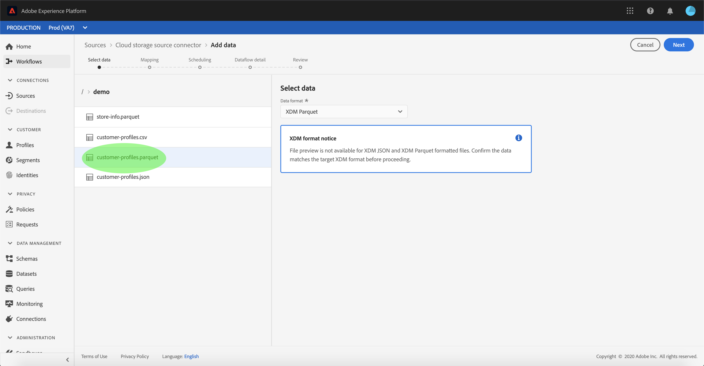

# Een gegevensstroom configureren voor een batchaansluiting voor cloudopslag in de gebruikersinterface

Een dataflow is een geplande taak die gegevens van een bron aan een [!DNL Platform] dataset terugwint en opneemt. Deze zelfstudie bevat stappen voor het configureren van een nieuwe gegevensstroom met uw cloud storage account.

## Aan de slag

Deze zelfstudie vereist een goed begrip van de volgende onderdelen van Adobe Experience Platform:

* [[!DNL Experience Data Model (XDM)] Systeem](../../../../../xdm/home.md): Het gestandaardiseerde kader waardoor de gegevens van de klantenervaring worden [!DNL Experience Platform] georganiseerd.
   * [Basisbeginselen van de schemacompositie](../../../../../xdm/schema/composition.md): Leer over de basisbouwstenen van schema&#39;s XDM, met inbegrip van zeer belangrijke principes en beste praktijken in schemacompositie.
   * [Zelfstudie](../../../../../xdm/tutorials/create-schema-ui.md)Schema-editor: Leer hoe te om douaneschema&#39;s tot stand te brengen gebruikend de Redacteur UI van het Schema.
* [[!DNL Real-time Customer Profile]](../../../../../profile/home.md): Verstrekt een verenigd, real-time consumentenprofiel dat op bijeengevoegde gegevens van veelvoudige bronnen wordt gebaseerd.

Daarnaast vereist deze zelfstudie dat u beschikt over een gevestigde account voor cloudopslag. Een lijst met zelfstudies voor het maken van verschillende cloudopslagaccounts in de gebruikersinterface vindt u in het overzicht [van de](../../../../home.md)bronconnectors.

### Ondersteunde bestandsindelingen

[!DNL Experience Platform] ondersteunt de volgende bestandsindelingen die door externe opslagmedia moeten worden ingevoerd:

* Door scheidingstekens gescheiden waarden (DSV): De ondersteuning voor gegevensbestanden met DSV-indeling is momenteel beperkt tot door komma&#39;s gescheiden waarden. De waarde van veldkoppen in bestanden met DSV-indeling mag alleen bestaan uit alfanumerieke tekens en onderstrepingstekens. Algemene DSV-bestanden worden in de toekomst ondersteund.
* [!DNL JavaScript Object Notation] (JSON): Gegevensbestanden met JSON-indeling moeten XDM-compatibel zijn.
* [!DNL Apache Parquet]: Gegevensbestanden met parketindeling moeten XDM-compatibel zijn.

## Gegevens selecteren

Nadat u uw account voor cloudopslag hebt gemaakt, wordt de stap Gegevens **** selecteren weergegeven en krijgt u een interactieve interface om uw hiërarchie voor cloudopslag te verkennen.

* De linkerhelft van de interface is een directorybrowser waarin de bestanden en mappen van uw server worden weergegeven.
* Met de rechterhelft van de interface kunt u maximaal 100 rijen gegevens uit een compatibel bestand voorvertonen.

Als u een map in de lijst selecteert, kunt u de mappenhiërarchie doorlopen in diepere mappen. Als u een compatibel bestand of een compatibele map hebt geselecteerd, wordt het vervolgkeuzemenu Gegevensindeling **** selecteren weergegeven. Hier kunt u een indeling kiezen waarmee de gegevens in het voorvertoningsvenster worden weergegeven.

Wanneer het voorvertoningsvenster is gevuld, kunt u **[!UICONTROL Volgende]** selecteren om alle bestanden in de geselecteerde map te uploaden. Als u naar een specifiek bestand wilt uploaden, selecteert u dat bestand in de aanbieding voordat u **[!UICONTROL Volgende]** selecteert.

### Parket- of JSON-bestanden samenvoegen

Cloudopslagaccounts ondersteunen ook JSON- en Parquet-bestanden. Parketbestanden moeten XDM-compatibel zijn, terwijl JSON-bestanden geen XDM-klacht hoeven te zijn. Als u JSON- of Parquet-bestanden wilt innemen, selecteert u de juiste bestandsindeling in de directorybrowser en past u de compatibele gegevensindeling in de rechterinterface toe.

Als de gegevensindeling in JSON is, wordt een voorbeeld weergegeven met informatie over de gegevens in het bestand. Op het voorvertoningsscherm kunt u selecteren of de JSON XDM-compatibel is met de **[!UICONTROL XDM-compatibele]** vervolgkeuzelijst.

Selecteer **[!UICONTROL Volgende]** om door te gaan.

>[!IMPORTANT]
>
>In tegenstelling tot de bestandstypen Gescheiden door scheidingstekens en JSON, zijn bestanden met de indeling Parquet niet beschikbaar voor voorvertoning.

## Gegevensvelden toewijzen aan een XDM-schema

De stap **[!UICONTROL Toewijzing]** verschijnt, die een interactieve interface verstrekt om de brongegevens aan een [!DNL Platform] dataset in kaart te brengen. De brondossiers die in Parquet worden geformatteerd moeten XDM volgzaam zijn en vereisen u niet om de afbeelding manueel te vormen, terwijl de Csv- dossiers u vereisen om de afbeelding uitdrukkelijk te vormen, maar u toe te staan om te kiezen welke brongegevensgebieden aan kaart te brengen. Voor JSON-bestanden is geen handmatige configuratie vereist als deze zijn gemarkeerd als XDM-klacht. Nochtans, als het niet duidelijk als volgzaam XDM is, zal het u vereisen om de afbeelding uitdrukkelijk te vormen.

Kies een dataset voor binnenkomende gegevens waarin moeten worden opgenomen. U kunt of een bestaande dataset gebruiken of nieuwe creëren.

**Een bestaande gegevensset gebruiken**

Om gegevens in een bestaande dataset in te voeren, selecteer **[!UICONTROL Bestaande dataset]**, dan het datasetpictogram.

Het dialoogvenster **[!UICONTROL Gegevensset]** selecteren wordt geopend. Zoek de gegevensset die u wilt gebruiken, selecteer deze en klik op **[!UICONTROL Doorgaan]**.

**Een nieuwe gegevensset gebruiken**

Om gegevens in een nieuwe dataset in te voeren, selecteer **[!UICONTROL Nieuwe dataset]** en ga een naam en een beschrijving voor de dataset op de verstrekte gebieden in. Als u een schema wilt toevoegen, kunt u een bestaande schemanaam in het dialoogvenster Schema **** selecteren invoeren. Alternatief, kunt u het **[!UICONTROL Schema Geavanceerde onderzoek]** selecteren om naar een aangewezen schema te zoeken.

Tijdens deze stap, kunt u uw dataset voor toelaten [!DNL Real-time Customer Profile] en tot een holistische mening van de attributen en het gedrag van een entiteit leiden. De gegevens van alle toegelaten datasets zullen in worden omvat [!DNL Profile] en de veranderingen worden toegepast wanneer u uw gegevensstroom bewaart.

Schakel de knop Gegevensset **[!UICONTROL Profiel]** in of uit om uw doelgegevensset in te schakelen [!DNL Profile].

Het dialoogvenster Schema **** selecteren wordt geopend. Selecteer het schema u wenst om op de nieuwe dataset toe te passen, dan uitgezocht **[!UICONTROL Gedaan]**.

Op basis van uw behoeften kunt u ervoor kiezen om velden rechtstreeks toe te wijzen of mapperfuncties te gebruiken om brongegevens om berekende of berekende waarden af te leiden. Raadpleeg de zelfstudie over het [toewijzen van CSV-gegevens aan XDM-schemavelden](../../../../../ingestion/tutorials/map-a-csv-file.md)voor meer informatie over gegevenstoewijzing en mapperfuncties.

Voor JSON-bestanden kunt u, naast velden rechtstreeks toewijzen aan andere velden, objecten rechtstreeks toewijzen aan andere objecten en arrays aan andere arrays.

Houd er rekening mee dat u geen toewijzingen kunt maken voor verschillende typen. U kunt een object bijvoorbeeld niet toewijzen aan een array of een veld aan een object.

>[!TIP]
>
>[!DNL Platform] verstrekt intelligente aanbevelingen voor auto-in kaart gebrachte gebieden die op het doelschema of de dataset worden gebaseerd dat u selecteerde. U kunt toewijzingsregels handmatig aanpassen aan uw gebruiksgevallen.

Selecteer Gegevens **[!UICONTROL van de]** Voorproef om afbeeldingsresultaten van maximaal 100 rijen steekproefgegevens van de geselecteerde dataset te zien.

Tijdens de voorvertoning krijgt de identiteitskolom de prioriteit als het eerste veld, omdat dit de belangrijkste informatie is die nodig is voor het valideren van toewijzingsresultaten.

Als de brongegevens eenmaal zijn toegewezen, selecteert u **[!UICONTROL Sluiten]**.

## Planninguitvoering

De **[!UICONTROL Plannende]** stap verschijnt, toestaand u om een innameprogramma te vormen om de geselecteerde brongegevens automatisch in te nemen gebruikend de gevormde afbeeldingen. De volgende lijst schetst de verschillende configureerbare gebieden voor het plannen:

| Veld | Beschrijving |
| --- | --- |
| Frequentie | De selecteerbare frequenties omvatten `Once`, `Minute`, `Hour`, `Day`, en `Week`. |
| Interval | Een geheel getal dat het interval voor de geselecteerde frequentie instelt. |
| Begintijd | Een UTC-tijdstempel die aangeeft wanneer de eerste opname wordt uitgevoerd. |
| Achtergrond | Een booleaanse waarde die bepaalt welke gegevens eerst worden ingevoerd. Als **[!UICONTROL Backfill]** is ingeschakeld, worden alle huidige bestanden in het opgegeven pad tijdens de eerste geplande opname opgenomen. Als **[!UICONTROL Backfill]** is uitgeschakeld, worden alleen de bestanden opgenomen die tussen de eerste opname en de begintijd worden geladen. Bestanden die vóór de begintijd zijn geladen, worden niet opgenomen. |

Dataflows worden ontworpen om gegevens automatisch in te voeren op een geplande basis. Begin door de innamefrequentie te selecteren. Daarna, plaats het interval om de periode tussen twee stroomlooppas aan te wijzen. De waarde van het interval moet een geheel getal zijn dat niet gelijk is aan nul en moet worden ingesteld op groter dan of gelijk aan 15.

Als u de begintijd voor inname wilt instellen, past u de datum en tijd aan die worden weergegeven in het vak Begintijd. U kunt ook het kalenderpictogram selecteren om de begintijdwaarde te bewerken. De begintijd moet groter zijn dan of gelijk zijn aan de huidige tijd in UTC.

Geef waarden op voor het schema en selecteer **[!UICONTROL Volgende]**.

### Eenmalige gegevensstroom voor inname instellen

Als u eenmalige invoer wilt instellen, selecteert u de vervolgkeuzepijl voor de frequentie en selecteert u **[!UICONTROL Eenmaal]**. U kunt bewerkingen blijven uitvoeren op een gegevensstroom die is ingesteld voor eenmalig opnemen van de frequentie, zolang de begintijd in de toekomst behouden blijft. Zodra de begintijd is verstreken, kan de eenmalig frequentiewaarde niet meer worden bewerkt.

>[!TIP]
>
>**[!UICONTROL Interval]** en **[!UICONTROL backfill]** zijn niet zichtbaar tijdens eenmalig gebruik.

Als u de juiste waarden voor het schema hebt opgegeven, selecteert u **[!UICONTROL Volgende]**.

## Gegevens over gegevensstroom opgeven

De stap met **[!UICONTROL details]** over gegevensstroom wordt weergegeven, zodat u een naam kunt geven en een korte beschrijving kunt geven van uw nieuwe gegevensstroom.

Tijdens dit proces kunt u ook **[!UICONTROL gedeeltelijke inname]** en **[!UICONTROL foutdiagnose]** inschakelen. Als u **[!UICONTROL Gedeeltelijke opname]** inschakelt, kunt u gegevens met fouten, tot een bepaalde drempel die u kunt instellen, insluiten. Als **[!UICONTROL foutdiagnostiek]** wordt ingeschakeld, worden details weergegeven over eventuele onjuiste gegevens die afzonderlijk in een batch worden opgeslagen. Voor meer informatie, zie het [gedeeltelijke partijingestie overzicht](../../../../../ingestion/batch-ingestion/partial.md).

Geef waarden op voor de gegevensstroom en selecteer **[!UICONTROL Volgende]**.

## Controleer uw gegevensstroom

De stap **[!UICONTROL Revisie]** wordt weergegeven, zodat u de nieuwe gegevensstroom kunt controleren voordat deze wordt gemaakt. De details worden gegroepeerd in de volgende categorieën:

* **[!UICONTROL Verbinding]**: Toont het brontype, de relevante weg van het gekozen brondossier, en de hoeveelheid kolommen binnen dat brondossier.
* **[!UICONTROL Gegevensset- en kaartvelden]** toewijzen: Toont welke dataset de brongegevens worden opgenomen in, met inbegrip van het schema dat de dataset zich aan houdt.
* **[!UICONTROL Planning]**: Toont de actieve periode, de frequentie, en het interval van het innameprogramma.

Nadat u de gegevensstroom hebt gereviseerd, klikt u op **[!UICONTROL Voltooien]** en laat u enige tijd over tot de gegevensstroom.

## Uw gegevensstroom controleren

Zodra uw gegevensstroom is gecreeerd, kunt u de gegevens controleren die door het worden opgenomen om informatie over innamepercentages, succes, en fouten te zien. Voor meer informatie over hoe te om dataflow te controleren, zie de zelfstudie over het [controleren van rekeningen en dataflows in UI](../../monitor.md).

## Uw gegevensstroom verwijderen

U kunt gegevensstromen schrappen die niet meer noodzakelijk of verkeerd gecreeerd gebruikend de functie van de **[!UICONTROL Schrapping]** beschikbaar in de **[!UICONTROL werkruimte Dataflows]** zijn. Voor meer informatie over hoe te om dataflows te schrappen, zie de zelfstudie over het [schrappen van gegevensstromen in UI](../../delete.md).

## Volgende stappen

Door deze zelfstudie te volgen, hebt u met succes een dataflow gemaakt om gegevens van een externe wolkenopslag in te brengen, en hebt u inzicht gekregen in de controle van datasets. Als u meer wilt weten over het maken van gegevensstromen, kunt u uw studie aanvullen door de onderstaande video te bekijken. Bovendien kunnen inkomende gegevens nu worden gebruikt door downstreamservices [!DNL Platform] zoals [!DNL Real-time Customer Profile] en [!DNL Data Science Workspace]. Raadpleeg de volgende documenten voor meer informatie:

* [[!DNL Real-time Customer Profile]  - overzicht](../../../../../profile/home.md)
* [[!DNL Data Science Workspace]  - overzicht](../../../../../data-science-workspace/home.md)

>[!WARNING]
>
> De [!DNL Platform] UI die in de volgende video wordt getoond is verouderd. Raadpleeg de bovenstaande documentatie voor de meest recente schermafbeeldingen en functionaliteit van de gebruikersinterface.

>[!VIDEO](https://video.tv.adobe.com/v/29695?quality=12&learn=on)

## Aanhangsel

De volgende secties verstrekken extra informatie voor het werken met bronschakelaars.

### Een gegevensstroom uitschakelen

Wanneer een gegevensstroom wordt gecreeerd, wordt het onmiddellijk actief en neemt gegevens volgens het programma op het werd gegeven. U kunt een actieve gegevensstroom op elk ogenblik onbruikbaar maken door de instructies hieronder te volgen.

Klik in de **[!UICONTROL werkruimte Bronnen]** op het tabblad **[!UICONTROL Bladeren]** . Klik vervolgens op de naam van de account die is gekoppeld aan de actieve gegevensstroom die u wilt uitschakelen.

De pagina **[!UICONTROL Bronactiviteit]** wordt weergegeven. Selecteer de actieve gegevensstroom van de lijst om zijn kolom van **[!UICONTROL Eigenschappen]** op de rechterkant van het scherm te openen, die een **[!UICONTROL Toegelaten]** knevelknoop bevat. Klik op de schakeloptie om de gegevensstroom uit te schakelen. Dezelfde schakeloptie kan worden gebruikt om een gegevensstroom opnieuw in te schakelen nadat deze is uitgeschakeld.

### Binnenkomende gegevens voor [!DNL Profile] populatie activeren

De binnenkomende gegevens van uw bronschakelaar kunnen worden gebruikt om uw [!DNL Real-time Customer Profile] gegevens te verrijken en te bevolken. Zie de zelfstudie over de [!DNL Real-time Customer Profile] profielpopulatie voor meer informatie over het vullen van gegevens.
