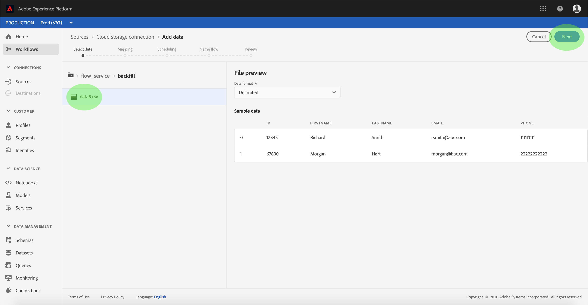
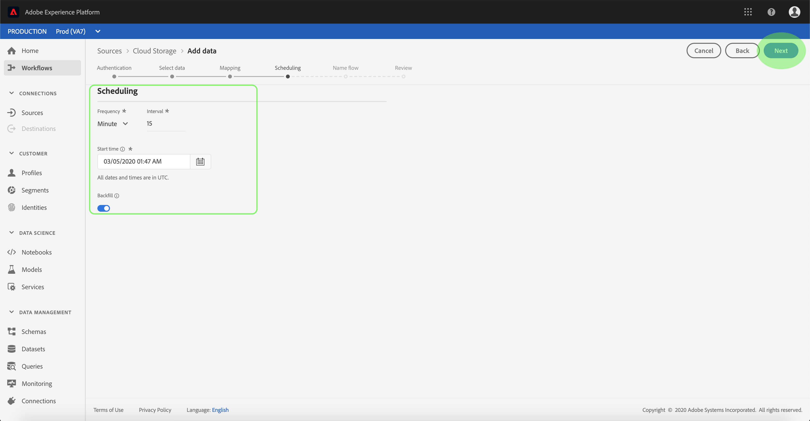

# Een gegevensstroom configureren voor een batchaansluiting voor cloudopslag in de gebruikersinterface

Een dataflow is een geplande taak die gegevens van een bron aan een dataset van het Platform terugwint en opneemt. Deze zelfstudie bevat stappen voor het configureren van een nieuwe gegevensstroom met behulp van de basisaansluiting voor cloudopslag.

## Aan de slag

Voor deze zelfstudie is een goed begrip vereist van de volgende componenten van het Adobe Experience Platform:

* [XDM-systeem](../../../../../xdm/home.md)(Experience Data Model): Het gestandaardiseerde kader waardoor het Platform van de Ervaring gegevens van de klantenervaring organiseert.
   * [Basisbeginselen van de schemacompositie](../../../../../xdm/schema/composition.md): Leer over de basisbouwstenen van schema&#39;s XDM, met inbegrip van zeer belangrijke principes en beste praktijken in schemacompositie.
   * [Zelfstudie](../../../../../xdm/tutorials/create-schema-ui.md)Schema-editor: Leer hoe te om douaneschema&#39;s tot stand te brengen gebruikend de Redacteur UI van het Schema.
* [Klantprofiel](../../../../../profile/home.md)in realtime: Verstrekt een verenigd, real-time consumentenprofiel dat op bijeengevoegde gegevens van veelvoudige bronnen wordt gebaseerd.

Bovendien is voor deze zelfstudie vereist dat u al een cloudopslagaansluiting hebt gemaakt. Een lijst met zelfstudies voor het maken van verschillende cloudopslagconnectors in de gebruikersinterface vindt u in het overzicht [van de](../../../../home.md)bronconnectors.

### Ondersteunde bestandsindelingen

Het Experience Platform ondersteunt de volgende bestandsindelingen die in externe opslagruimten kunnen worden opgenomen:

* Door scheidingstekens gescheiden waarden (DSV): De ondersteuning voor gegevensbestanden met DSV-indeling is momenteel beperkt tot door komma&#39;s gescheiden waarden. De waarde van veldkoppen in bestanden met DSV-indeling mag alleen bestaan uit alfanumerieke tekens en onderstrepingstekens. Algemene DSV-bestanden worden in de toekomst ondersteund.
* JavaScript Object Notation (JSON): Gegevensbestanden met JSON-indeling moeten XDM-compatibel zijn.
* Apache Parquet: Gegevensbestanden met parketindeling moeten XDM-compatibel zijn.

## Gegevens selecteren

Nadat u de aansluiting voor cloudopslag hebt gemaakt, wordt de stap Gegevens ** selecteren weergegeven en krijgt u een interactieve interface om de hiërarchie voor cloudopslag te verkennen.

* De linkerhelft van de interface is een directorybrowser waarin de bestanden en mappen van uw server worden weergegeven.
* Met de rechterhelft van de interface kunt u maximaal 100 rijen gegevens uit een compatibel bestand voorvertonen.

Als u op een map in de lijst klikt, kunt u de mappenhiërarchie doorlopen in diepere mappen. Als u een compatibel bestand of een compatibele map hebt geselecteerd, wordt het vervolgkeuzemenu Gegevensindeling **** selecteren weergegeven. Hier kunt u een indeling kiezen waarmee de gegevens in het voorvertoningsvenster worden weergegeven.

Wanneer het voorvertoningsvenster is gevuld, kunt u op **Volgende** klikken om alle bestanden in de geselecteerde map te uploaden. Als u naar een specifiek bestand wilt uploaden, selecteert u dat bestand in de aanbieding voordat u op **Volgende** klikt.

>[!NOTE] Tot de ondersteunde bestandsindelingen behoren CSV, JSON en Parquet. JSON- en Parquet-bestanden moeten XDM-compatibel zijn.

## Gegevensvelden toewijzen aan een XDM-schema

De stap *Toewijzing* verschijnt, die een interactieve interface verstrekt om de brongegevens aan een dataset van het Platform in kaart te brengen. De brondossiers die in JSON of Parquet worden geformatteerd moeten XDM-Volgzaam zijn en vereisen u niet om de afbeelding manueel te vormen. Omgekeerd is voor CSV-bestanden vereist dat u de toewijzing expliciet configureert, maar dat u kunt kiezen welke brongegevensvelden moeten worden toegewezen.

Kies een dataset voor binnenkomende gegevens waarin moeten worden opgenomen. U kunt of een bestaande dataset gebruiken of nieuwe creëren.

**Een bestaande gegevensset gebruiken**

Om gegevens in een bestaande dataset in te voeren, selecteer **Gebruik bestaande dataset**, dan klik het datasetpictogram.

Het dialoogvenster _Gegevensset_ selecteren wordt geopend. Zoek de gegevensset die u wilt gebruiken, selecteer deze en klik op **Doorgaan**.

**Een nieuwe gegevensset gebruiken**

Om gegevens in een nieuwe dataset in te voeren, **creeer nieuwe dataset** en ga een naam en een beschrijving voor de dataset op de verstrekte gebieden in. Klik vervolgens op het schemapictogram.

Het dialoogvenster Schema __ selecteren wordt geopend. Selecteer het schema u wenst om op de nieuwe dataset toe te passen, dan klik **Gedaan**.

Op basis van uw behoeften kunt u ervoor kiezen om velden rechtstreeks toe te wijzen of mapperfuncties te gebruiken om brongegevens om berekende of berekende waarden af te leiden. Raadpleeg de zelfstudie over het [toewijzen van CSV-gegevens aan XDM-schemavelden](../../../../../ingestion/tutorials/map-a-csv-file.md)voor meer informatie over gegevenstoewijzing en mapperfuncties.

Klik op **Volgende** als de brongegevens zijn toegewezen.

## Planninguitvoering

De *Plannende* stap verschijnt, toestaand u om een innameprogramma te vormen om de geselecteerde brongegevens automatisch in te nemen gebruikend de gevormde afbeeldingen. De volgende lijst schetst de verschillende configureerbare gebieden voor het plannen:

| Veld | Beschrijving |
| --- | --- |
| Frequentie | Selecteerbare frequenties zijn Minuut, Uur, Dag en Week. |
| Interval | Een geheel getal dat het interval voor de geselecteerde frequentie instelt. |
| Begintijd | Een UTC-tijdstempel waarvoor de eerste invoer wordt uitgevoerd. |
| Achtergrond | Een booleaanse waarde die bepaalt welke gegevens eerst worden ingevoerd. Als *Backfill* is ingeschakeld, worden alle huidige bestanden in het opgegeven pad tijdens de eerste geplande opname opgenomen. Als *Backfill* is uitgeschakeld, worden alleen de bestanden opgenomen die tussen de eerste opname en de *begintijd* worden geladen. Bestanden die vóór het begin van het *starten* zijn geladen, worden niet opgenomen. |

Dataflows worden ontworpen om gegevens automatisch in te voeren op een geplande basis. Als u slechts één keer wilt opnemen via deze workflow, kunt u dit doen door de **Frequentie** in te stellen op &quot;Dag&quot; en een zeer groot aantal toe te passen voor het **Interval**, zoals 10000 of een vergelijkbaar aantal.

Geef waarden op voor het schema en klik op **Volgende**.

## Geef uw gegevensstroom een naam

De stap *Naam doorloop* wordt weergegeven, zodat u een naam kunt geven en een korte beschrijving kunt geven van uw nieuwe gegevensstroom.

Geef waarden op voor de gegevensstroom en klik op **Volgende**.

### Controleer uw gegevensstroom

De stap *Revisie* wordt weergegeven, zodat u de nieuwe gegevensstroom kunt controleren voordat deze wordt gemaakt. De details worden gegroepeerd in de volgende categorieën:

* *Brongegevens*: Toont het brontype, de relevante weg van het gekozen brondossier, en de hoeveelheid kolommen binnen dat brondossier.
* *Doelgegevens*: Toont welke dataset de brongegevens worden opgenomen in, met inbegrip van het schema dat de dataset zich aan houdt.
* *Details* schema: Toont de actieve periode, de frequentie, en het interval van het innameprogramma.

Nadat u de gegevensstroom hebt gereviseerd, klikt u op **Voltooien** en laat u enige tijd over tot de gegevensstroom.

## Uw gegevensstroom controleren

Nadat u de gegevens voor de cloudopslag hebt gemaakt, kunt u de gegevens controleren die er doorheen worden ingevoerd. Voor meer informatie over controledatasets, zie het leerprogramma bij het [controleren van het stromen gegevens](../../../../../ingestion/quality/monitor-data-flows.md).

## Volgende stappen

Door deze zelfstudie te volgen, hebt u met succes een dataflow gemaakt om gegevens van een externe wolkenopslag in te brengen, en hebt u inzicht gekregen in de controle van datasets. De inkomende gegevens kunnen nu door de stroomafwaartse diensten van het Platform zoals het Profiel van de Klant in real time en de Werkruimte van de Wetenschap van Gegevens worden gebruikt. Raadpleeg de volgende documenten voor meer informatie:

* [Overzicht van het realtime klantprofiel](../../../../../profile/home.md)
* [Overzicht van de Data Science Workspace](../../../../../data-science-workspace/home.md)

## Aanhangsel

De volgende secties verstrekken extra informatie voor het werken met bronschakelaars.

### Een gegevensstroom uitschakelen

Wanneer een gegevensstroom wordt gecreeerd, wordt het onmiddellijk actief en neemt gegevens volgens het programma op het werd gegeven. U kunt een actieve gegevensstroom op elk ogenblik onbruikbaar maken door de instructies hieronder te volgen.

Klik in de *werkruimte Bronnen* op het tabblad **Bladeren** . Klik vervolgens op de naam van de account die is gekoppeld aan de actieve gegevensstroom die u wilt uitschakelen.

De pagina *Bronactiviteit* wordt weergegeven. Selecteer de actieve gegevensstroom van de lijst om zijn kolom van *Eigenschappen* op de rechterkant van het scherm te openen, die een **Toegelaten** knevelknoop bevat. Klik op de schakeloptie om de gegevensstroom uit te schakelen. Dezelfde schakeloptie kan worden gebruikt om een gegevensstroom opnieuw in te schakelen nadat deze is uitgeschakeld.

### Inkomende gegevens activeren voor profielpopulatie

De binnenkomende gegevens van uw bronschakelaar kunnen worden gebruikt om uw gegevens van het Profiel van de Klant in real time te verrijken en te bevolken. Voor meer informatie over het bevolken van uw gegevens van het Profiel van de Real-Customer, zie de zelfstudie over de [bevolking](../../profile.md)van het Profiel.
