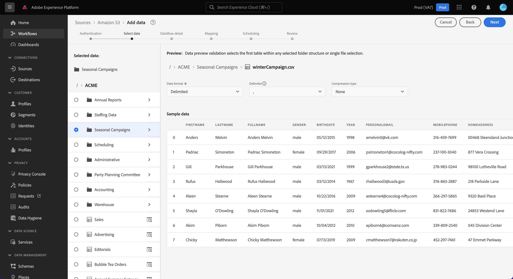

# Een gegevensstroom configureren om batchgegevens van een bron voor cloudopslag in de gebruikersinterface in te voeren

Deze zelfstudie bevat stappen voor het configureren van een gegevensstroom om batchgegevens van uw bron voor cloudopslag over te brengen naar Adobe Experience Platform.

## Aan de slag

>[!NOTE]
>
>Als u een gegevensstroom wilt maken om batchgegevens van een cloudopslag te kunnen ophalen, moet u al toegang hebben tot een geverifieerde bron voor cloudopslag. Als u geen toegang hebt, ga naar het [ overzicht van bronnen ](../../../../home.md#cloud-storage) voor een lijst van de bronnen van de wolkenopslag die u een rekening kunt tot stand brengen met.

Deze zelfstudie vereist een goed begrip van de volgende onderdelen van het Experience Platform:

* [[!DNL Experience Data Model (XDM)]  Systeem ](../../../../../xdm/home.md): Het gestandaardiseerde kader waardoor het Experience Platform gegevens van de klantenervaring organiseert.
   * [ Grondbeginselen van schemacompositie ](../../../../../xdm/schema/composition.md): Leer over de basisbouwstenen van schema&#39;s XDM, met inbegrip van zeer belangrijke principes en beste praktijken in schemacompositie.
   * [ het leerprogramma van de Redacteur van het Schema ](../../../../../xdm/tutorials/create-schema-ui.md): Leer hoe te om douaneschema&#39;s tot stand te brengen gebruikend de Redacteur UI van het Schema.
* [[!DNL Real-Time Customer Profile]](../../../../../profile/home.md): biedt een uniform, real-time consumentenprofiel dat is gebaseerd op geaggregeerde gegevens van meerdere bronnen.

### Ondersteunde bestandsindelingen

Cloudopslagbronnen voor batchgegevens ondersteunen de volgende bestandsindelingen voor inname:

* DSV (Delimiter-separated-separated values, gescheiden waarden): elke waarde van één teken kan worden gebruikt als scheidingsteken voor gegevensbestanden met DSV-indeling.
* [!DNL JavaScript Object Notation] (JSON): gegevensbestanden met JSON-indeling moeten XDM-compatibel zijn.
* [!DNL Apache Parquet]: gegevensbestanden met Parketindeling moeten XDM-compatibel zijn.
* Gecomprimeerde bestanden: JSON- en gescheiden bestanden kunnen worden gecomprimeerd als: `bzip2`, `gzip`, `deflate`, `zipDeflate`, `tarGzip` en `tar` .

## Gegevens toevoegen

Nadat u uw account voor cloudopslag hebt gemaakt, wordt de stap **[!UICONTROL Add data]** weergegeven. Deze stap bevat een interface waarmee u de hiërarchie van uw cloudopslagbestanden kunt verkennen en de map of het specifieke bestand kunt selecteren die u naar het platform wilt verzenden.

* Het linkergedeelte van de interface is een mappenbrowser waarin de hiërarchie van de bestanden voor cloudopslag wordt weergegeven.
* In het rechtergedeelte van de interface kunt u maximaal 100 rijen gegevens uit een compatibele map of bestand voorvertonen.

Selecteer de hoofdmap voor toegang tot de mappenhiërarchie. Van hieruit kunt u één map selecteren om alle bestanden in de map recursief in te voeren. Wanneer u een volledige map opgeeft, moet u ervoor zorgen dat alle bestanden in die map dezelfde gegevensindeling en hetzelfde schema hebben.

Nadat u een map hebt geselecteerd, wordt de juiste interface bijgewerkt met een voorvertoning van de inhoud en structuur van het eerste bestand in de geselecteerde map.

Tijdens deze stap kunt u verschillende configuraties aan uw gegevens toevoegen voordat u verdergaat. Selecteer eerst **[!UICONTROL Data format]** en selecteer vervolgens de juiste gegevensindeling voor het bestand in het vervolgkeuzemenu dat wordt weergegeven.

In de volgende tabel worden de juiste gegevensindelingen voor de ondersteunde bestandstypen weergegeven:

| Bestandstype | Gegevensindeling |
| --- | --- |
| CSV | [!UICONTROL Delimited] |
| JSON | [!UICONTROL JSON] |
| Parquet | [!UICONTROL XDM Parquet] |

### Een kolomscheidingsteken selecteren

Nadat u de gegevensindeling hebt geconfigureerd, kunt u een kolomscheidingsteken instellen bij het invoegen van gescheiden bestanden. Selecteer de optie **[!UICONTROL Delimiter]** en selecteer vervolgens een scheidingsteken in het vervolgkeuzemenu. Het menu toont de vaakst gebruikte opties voor afbakeningen, met inbegrip van een komma (`,`), een lusje (`\t`), en een pijp (`|`).

Als u liever een aangepast scheidingsteken gebruikt, selecteert u **[!UICONTROL Custom]** en voert u in de pop-upinvoerbalk een scheidingsteken voor één teken in.

### Gecomprimeerde bestanden samenvoegen

U kunt ook gecomprimeerde JSON- of gescheiden bestanden opnemen door het compressietype ervan op te geven.

Selecteer in de stap [!UICONTROL Select data] een gecomprimeerd bestand voor inname en selecteer vervolgens het juiste bestandstype en of het al dan niet compatibel is met XDM. Selecteer vervolgens **[!UICONTROL Compression type]** en selecteer het juiste gecomprimeerde bestandstype voor de brongegevens.

Als u een specifiek bestand wilt overbrengen naar Platform, selecteert u een map en selecteert u vervolgens het bestand dat u wilt opnemen. Tijdens deze stap kunt u ook een voorbeeld van de bestandsinhoud van andere bestanden in een bepaalde map bekijken met het voorvertoningspictogram naast een bestandsnaam.

Selecteer **[!UICONTROL Next]** als u klaar bent.

## Gegevens over gegevensstroom opgeven

Met de pagina [!UICONTROL Dataflow detail] kunt u selecteren of u een bestaande gegevensset of een nieuwe gegevensset wilt gebruiken. Tijdens dit proces kunt u ook de gegevens configureren die u in het profiel wilt opnemen en instellingen als [!UICONTROL Error diagnostics] , [!UICONTROL Partial ingestion] en [!UICONTROL Alerts] inschakelen.

### Een bestaande gegevensset gebruiken

Selecteer **[!UICONTROL Existing dataset]** als u gegevens in een bestaande gegevensset wilt opnemen. U kunt of een bestaande dataset terugwinnen gebruikend de [!UICONTROL Advanced search] optie of door door de lijst van bestaande datasets in het dropdown menu te scrollen. Zodra u een dataset hebt geselecteerd, verstrek een naam en een beschrijving voor uw gegevensstroom.

### Een nieuwe gegevensset gebruiken

Om in een nieuwe dataset in te gaan, selecteer **[!UICONTROL New dataset]** en verstrek dan een naam van de outputdataset en een facultatieve beschrijving. Selecteer vervolgens het schema dat u wilt toewijzen met de optie [!UICONTROL Advanced search] of door door de lijst met bestaande schema&#39;s in het vervolgkeuzemenu te bladeren. Nadat u een schema hebt geselecteerd, geeft u een naam en een beschrijving voor de gegevensstroom op.

### Profiel- en foutdiagnostiek inschakelen

Selecteer vervolgens de schakeloptie **[!UICONTROL Profile dataset]** om de gegevensset in te schakelen voor Profiel. Hierdoor kunt u een holistische weergave maken van de kenmerken en het gedrag van een entiteit. De gegevens van alle profiel-toegelaten datasets zullen in Profiel worden omvat en de veranderingen worden toegepast wanneer u sparen uw gegevensstroom.

In [!UICONTROL Error diagnostics] kunnen gedetailleerde foutberichten worden gegenereerd voor onjuiste records in de gegevensstroom, terwijl u in [!UICONTROL Partial ingestion] gegevens met fouten kunt invoeren tot een bepaalde drempel die u handmatig definieert. Zie het [ gedeeltelijke overzicht van partijingestie ](../../../../../ingestion/batch-ingestion/partial.md) voor meer informatie.

### Waarschuwingen inschakelen

U kunt waarschuwingen inschakelen om meldingen te ontvangen over de status van uw gegevensstroom. Selecteer een waarschuwing in de lijst om u te abonneren op meldingen over de status van uw gegevensstroom. Voor meer informatie over alarm, zie de gids bij [ het intekenen aan bronalarm gebruikend UI ](../../alerts.md).

Wanneer u klaar bent met het opgeven van details voor de gegevensstroom, selecteert u **[!UICONTROL Next]** .

## Gegevensvelden toewijzen aan een XDM-schema

De stap [!UICONTROL Mapping] verschijnt, die u van een interface voorziet om de brongebieden van uw bronschema aan hun aangewezen doelXDM gebieden in het doelschema in kaart te brengen.

Platform biedt intelligente aanbevelingen voor automatisch toegewezen velden op basis van het doelschema of de gegevensset die u hebt geselecteerd. U kunt toewijzingsregels handmatig aanpassen aan uw gebruiksgevallen. Op basis van uw behoeften kunt u ervoor kiezen om velden rechtstreeks toe te wijzen of gegevens prep-functies te gebruiken om brongegevens om berekende of berekende waarden af te leiden. Voor uitvoerige stappen bij het gebruiken van de kaartperinterface en berekende gebieden, zie de [ gids UI van de Prep van Gegevens ](../../../../../data-prep/ui/mapping.md).

Selecteer **[!UICONTROL Next]** wanneer de brongegevens correct zijn toegewezen.

## Planninguitvoering

>[!IMPORTANT]
>
>Het wordt sterk geadviseerd om uw dataflow voor eenmalige opname te plannen wanneer het gebruiken van de [ bron van FTP ](../../../../connectors/cloud-storage/ftp.md).

De stap [!UICONTROL Scheduling] verschijnt, die u toestaat om een innameprogramma te vormen om de geselecteerde brongegevens automatisch in te nemen gebruikend de gevormde afbeeldingen. De planning wordt standaard ingesteld op `Once` . Als u de innamefrequentie wilt aanpassen, selecteert u **[!UICONTROL Frequency]** en vervolgens een optie in het vervolgkeuzemenu.

>[!TIP]
>
>Interval en backfill zijn niet zichtbaar tijdens een eenmalige opname.

Als u de innamefrequentie instelt op `Minute` , `Hour` , `Day` of `Week` , moet u een interval instellen om een bepaald tijdkader tussen elke inname te maken. Als de innamefrequentie bijvoorbeeld is ingesteld op `Day` en als het interval is ingesteld op `15` , worden gegevens elke 15 dagen opgenomen.

Tijdens deze stap, kunt u **backfill** ook toelaten en een kolom voor de stijgende opname van gegevens bepalen. Backfill wordt gebruikt om historische gegevens in te voeren, terwijl in de kolom die u voor incrementele inname definieert, nieuwe gegevens kunnen worden onderscheiden van bestaande gegevens.

Zie de lijst hieronder voor meer informatie over het plannen van configuraties.

| Veld | Beschrijving |
| --- | --- |
| Frequentie | De frequentie waarin inname plaatsvindt. Selecteerbare frequenties zijn `Once` , `Minute` , `Hour` , `Day` en `Week` . |
| Interval | Een geheel getal dat het interval voor de geselecteerde frequentie instelt. De waarde van het interval moet een geheel getal anders dan nul zijn en moet worden ingesteld op groter dan of gelijk aan 15. |
| Begintijd | Een UTC-tijdstempel die aangeeft wanneer de eerste opname wordt uitgevoerd. De begintijd moet groter zijn dan of gelijk zijn aan de huidige UTC-tijd. |
| Achtergrond | Een booleaanse waarde die bepaalt welke gegevens eerst worden ingevoerd. Als backfill is ingeschakeld, worden alle huidige bestanden in het opgegeven pad tijdens de eerste geplande inname opgenomen. Als terugvullen is uitgeschakeld, worden alleen de bestanden opgenomen die tussen de eerste opname en de begintijd worden geladen. Bestanden die vóór de begintijd zijn geladen, worden niet opgenomen. |

>[!NOTE]
>
>Voor batch-opname, selecteert elke volgende dataflow dossiers die van uw bron worden opgenomen die op hun **worden gebaseerd laatste gewijzigde** timestamp. Dit betekent dat de batch-gegevens uitgezocht bestanden van de bron zijn die nieuw zijn of zijn gewijzigd sinds de laatste flowuitvoering. Bovendien moet u ervoor zorgen dat er voldoende tijd is tussen het uploaden van een bestand en een geplande doorloop, omdat bestanden die niet volledig naar uw account voor cloudopslag zijn geüpload voordat de geplande doorlooptijd wordt uitgevoerd, niet kunnen worden opgehaald voor opname.

Selecteer **[!UICONTROL Next]** wanneer u klaar bent met het configureren van uw innameschema.

## Controleer uw gegevensstroom

De stap **[!UICONTROL Review]** wordt weergegeven, zodat u de nieuwe gegevensstroom kunt bekijken voordat deze wordt gemaakt. De details worden gegroepeerd in de volgende categorieën:

* **[!UICONTROL Connection]**: geeft het brontype, het relevante pad van het gekozen bronbestand en de hoeveelheid kolommen in dat bronbestand weer.
* **[!UICONTROL Assign dataset & map fields]**: Toont welke dataset de brongegevens worden opgenomen in, met inbegrip van het schema dat de dataset volgt aan.
* **[!UICONTROL Scheduling]**: geeft de actieve periode, frequentie en interval van het innameschema weer.

Nadat u de gegevensstroom hebt gereviseerd, klikt u op **[!UICONTROL Finish]** en laat u enige tijd over tot de gegevensstroom.

## Volgende stappen

Door deze zelfstudie te volgen, hebt u met succes een dataflow gemaakt om gegevens van een externe wolkenopslag in te brengen, en hebt u inzicht gekregen in de controle van datasets. Als u meer wilt weten over het maken van gegevensstromen, kunt u uw studie aanvullen door de onderstaande video te bekijken. Bovendien kunnen binnenkomende gegevens nu worden gebruikt door [!DNL Platform] -services, zoals [!DNL Real-Time Customer Profile] en [!DNL Data Science Workspace] . Raadpleeg de volgende documenten voor meer informatie:

* [[!DNL Real-Time Customer Profile]-overzicht](../../../../../profile/home.md)
* [[!DNL Data Science Workspace]-overzicht](../../../../../data-science-workspace/home.md)

>[!WARNING]
>
> De gebruikersinterface van [!DNL Platform] in de volgende video is verouderd. Raadpleeg de bovenstaande documentatie voor de meest recente schermafbeeldingen en functionaliteit van de gebruikersinterface.

>[!VIDEO](https://video.tv.adobe.com/v/29695?quality=12&learn=on)

## Bijlage

De volgende secties verstrekken extra informatie voor het werken met bronschakelaars.

## Uw gegevensstroom controleren

Zodra uw gegevensstroom is gecreeerd, kunt u de gegevens controleren die door het worden opgenomen om informatie over innamesnelheden, succes, en fouten te bekijken. Voor meer informatie over hoe te om dataflow te controleren, bezoek het leerprogramma op [ controlerekeningen en dataflows in UI ](../../monitor.md).

## Uw gegevensstroom bijwerken

Om configuraties voor uw dataflows bij te werken die, afbeelding, en algemene informatie plannen, bezoek het leerprogramma op [ bijwerken brondataflows in UI ](../../update-dataflows.md).

## Uw gegevensstroom verwijderen

U kunt gegevensstromen verwijderen die niet meer nodig zijn of die onjuist zijn gemaakt met de functie **[!UICONTROL Delete]** die beschikbaar is in de **[!UICONTROL Dataflows]** -werkruimte. Voor meer informatie over hoe te om dataflows te schrappen, bezoek het leerprogramma bij [ het schrappen van dataflows in UI ](../../delete.md).