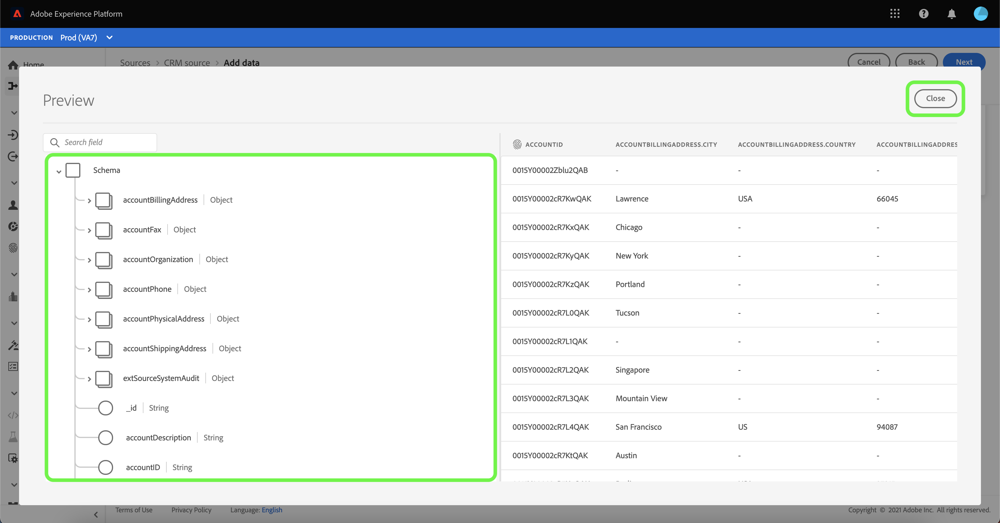

# Een gegevensstroom configureren voor een CRM-verbinding in de gebruikersinterface

Een dataflow is een geplande taak die gegevens van een bron aan een dataset van de Platform terugwint en opneemt. Deze zelfstudie biedt stappen om een nieuwe gegevensstroom te configureren met behulp van uw CRM-account.

## Aan de slag

Deze zelfstudie vereist een goed begrip van de volgende onderdelen van Adobe Experience Platform:

* [[!DNL Experience Data Model (XDM)] Systeem](../../../../xdm/home.md): Het gestandaardiseerde kader waardoor [!DNL Experience Platform] organiseert de gegevens van de klantenervaring.
   * [Basisbeginselen van de schemacompositie](../../../../xdm/schema/composition.md): Leer over de basisbouwstenen van schema&#39;s XDM, met inbegrip van zeer belangrijke principes en beste praktijken in schemacompositie.
   * [Zelfstudie Schema Editor](../../../../xdm/tutorials/create-schema-ui.md): Leer hoe te om douaneschema&#39;s tot stand te brengen gebruikend de Redacteur UI van het Schema.
* [[!DNL Real-time Customer Profile]](../../../../profile/home.md): Verstrekt een verenigd, real-time consumentenprofiel dat op bijeengevoegde gegevens van veelvoudige bronnen wordt gebaseerd.

Bovendien, vereist dit leerprogramma dat u reeds een rekening van CRM hebt gecreeerd. Een lijst met zelfstudies voor het maken van verschillende CRM-connectors in de gebruikersinterface vindt u in het dialoogvenster [overzicht van bronconnectors](../../../home.md).

## Gegevens selecteren

Nadat u uw CRM-account hebt gemaakt, [!UICONTROL Select data] wordt weergegeven en biedt een interface waarmee u de bestandshiërarchie kunt verkennen.

* De linkerhelft van de interface is een folderbrowser, die de dossiers en de folders van uw CRM toont.
* Met de rechterhelft van de interface kunt u maximaal 100 rijen gegevens uit een compatibel bestand voorvertonen.

U kunt de **[!UICONTROL Search]** boven aan de pagina om snel de brongegevens te identificeren die u wilt gebruiken.

>[!NOTE]
>
>De optie van onderzoeksbrongegevens is beschikbaar aan alle op tabelvorm-gebaseerde bronschakelaars behalve de Analytics, Classifications, de Hubs van de Gebeurtenis, en de schakelaars van Kinesis.

Wanneer u de brongegevens hebt gevonden, selecteert u de map en selecteert u **[!UICONTROL Next]**.

## Gegevensvelden toewijzen aan een XDM-schema

De **[!UICONTROL Mapping]** stap verschijnt, verstrekkend een interface om de brongegevens aan een dataset van het Platform in kaart te brengen.

Kies een dataset voor binnenkomende gegevens waarin moeten worden opgenomen. U kunt of een bestaande dataset gebruiken of een nieuwe dataset tot stand brengen.

### Een bestaande gegevensset gebruiken

Om gegevens in een bestaande dataset in te voeren, selecteer **[!UICONTROL Existing dataset]** en selecteert u vervolgens het gegevenspictogram  naast de invoerbalk.

De **[!UICONTROL Select dataset]** wordt weergegeven. Zoek de dataset u wenst te gebruiken, het te selecteren, dan klik **[!UICONTROL Continue]**.

### Een nieuwe gegevensset gebruiken

Om gegevens in een nieuwe dataset in te voeren, selecteer **[!UICONTROL New dataset]** en voert een naam en een beschrijving voor de gegevensset in de opgegeven velden in.

U kunt een schemagebied vastmaken door een schemanaam in te gaan in **[!UICONTROL Select schema]** zoekbalk. U kunt ook het vervolgkeuzepictogram selecteren om een lijst met bestaande schema&#39;s weer te geven. U kunt ook **[!UICONTROL Advanced search]** toegang tot het scherm van bestaande schema&#39;s, met inbegrip van hun respectieve details.

Tijdens deze stap, kunt u uw dataset voor toelaten [!DNL Real-time Customer Profile] en een holistische weergave te maken van de kenmerken en gedragingen van een entiteit. Gegevens van alle ingeschakelde gegevenssets worden opgenomen in [!DNL Profile] en wijzigingen worden toegepast wanneer u de gegevensstroom opslaat.

Schakelen tussen **[!UICONTROL Profile dataset]** knoop om uw doeldataset voor toe te laten [!DNL Profile].

De **[!UICONTROL Select schema]** wordt weergegeven. Selecteer het schema u op de nieuwe dataset wenst toe te passen, dan klik **[!UICONTROL Done]**.

Op basis van uw behoeften kunt u ervoor kiezen om velden rechtstreeks toe te wijzen of gegevens prep-functies te gebruiken om brongegevens om berekende of berekende waarden af te leiden. Voor uitvoerige stappen bij het gebruiken van de kaartperinterface en berekende gebieden, zie [UI-hulplijn voor gegevensvoorinstelling](../../../../data-prep/ui/mapping.md)

>[!TIP]
>
>Als u het [!DNL Salesforce] bron als deel van B2B CDP, verwijs naar [[!DNL Salesforce] tabellen voor veldtoewijzing](../../../connectors/adobe-applications/mapping/salesforce.md) voor een leidraad voor de desbetreffende toewijzingensets: [!DNL Salesforce] bronvelden en XDM-doelvelden.

Platform biedt intelligente aanbevelingen voor automatisch toegewezen velden op basis van het doelschema of de gegevensset die u hebt geselecteerd. U kunt toewijzingsregels handmatig aanpassen aan uw gebruiksgevallen.

Selecteren **[!UICONTROL Preview data]** om afbeeldingsresultaten van maximaal 100 rijen steekproefgegevens van de geselecteerde dataset te zien.

Tijdens de voorvertoning krijgt de identiteitskolom de prioriteit als het eerste veld, omdat dit de belangrijkste informatie is die nodig is voor het valideren van toewijzingsresultaten.

Selecteer **[!UICONTROL Close]**.

Volgende, vanaf de [!UICONTROL Mapping] scherm, selecteren **[!UICONTROL Next]** om verder te gaan.

## Planninguitvoering

De **[!UICONTROL Scheduling]** de stap verschijnt, toestaand u om een innameprogramma te vormen om de geselecteerde brongegevens automatisch in te nemen gebruikend de gevormde afbeeldingen. De volgende lijst schetst de verschillende configureerbare gebieden voor het plannen:

| Veld | Beschrijving |
| --- | --- |
| Frequentie | Selecteerbare frequenties omvatten `Once`, `Minute`, `Hour`, `Day`, en `Week`. |
| Interval | Een geheel getal dat het interval voor de geselecteerde frequentie instelt. |
| Begintijd | Een UTC-tijdstempel die aangeeft wanneer de eerste opname wordt uitgevoerd. |
| Achtergrond | Een booleaanse waarde die bepaalt welke gegevens eerst worden ingevoerd. Indien **[!UICONTROL Backfill]** is ingeschakeld, worden alle huidige bestanden in het opgegeven pad tijdens de eerste geplande opname opgenomen. Indien **[!UICONTROL Backfill]** is uitgeschakeld, alleen de bestanden die worden geladen tussen de eerste opname en de **[!UICONTROL Start time]** wordt opgenomen. Bestanden geladen vóór **[!UICONTROL Start time]** wordt niet opgenomen. |
| Delta-kolom | Een optie met een gefilterde reeks gebieden van het bronschema van type, datum, of tijd. Dit veld wordt gebruikt om onderscheid te maken tussen nieuwe en bestaande gegevens. Incrementele gegevens worden opgenomen op basis van het tijdstempel van de geselecteerde kolom. |

Dataflows worden ontworpen om gegevens automatisch in te voeren op een geplande basis. Begin door de innamefrequentie te selecteren. Daarna, plaats het interval om de periode tussen twee stroomlooppas aan te wijzen. De waarde van het interval moet een geheel getal zijn dat niet gelijk is aan nul en moet worden ingesteld op groter dan of gelijk aan 15.

Als u de begintijd voor inname wilt instellen, past u de datum en tijd aan die worden weergegeven in het vak Begintijd. U kunt ook het kalenderpictogram selecteren om de begintijdwaarde te bewerken. De begintijd moet groter zijn dan of gelijk zijn aan de huidige UTC-tijd.

Selecteren **[!UICONTROL Load incremental data by]** om de deltakolom toe te wijzen. In dit veld wordt een onderscheid gemaakt tussen nieuwe en bestaande gegevens.

### Eenmalige gegevensstroom voor inname instellen

Als u eenmalige invoer wilt instellen, selecteert u de pijl-omlaag voor de frequentie en selecteert u **[!UICONTROL Once]**.

>[!TIP]
>
>**[!UICONTROL Interval]** en **[!UICONTROL Backfill]** niet zichtbaar zijn tijdens eenmalig gebruik.

Als u de juiste waarden voor het schema hebt opgegeven, selecteert u **[!UICONTROL Next]**.

## Gegevens over gegevensstroom opgeven

De **[!UICONTROL Dataflow detail]** wordt weergegeven, zodat u een naam kunt geven en een korte beschrijving kunt geven van uw nieuwe gegevensstroom.

Tijdens dit proces kunt u ook **[!UICONTROL Partial ingestion]** en **[!UICONTROL Error diagnostics]**. Inschakelen **[!UICONTROL Partial ingestion]** biedt de mogelijkheid om gegevens met fouten tot een bepaalde drempel in te voeren. Eenmaal **[!UICONTROL Partial ingestion]** is ingeschakeld, versleept u de **[!UICONTROL Error threshold %]** wijzerplaat om de foutendrempel van de partij aan te passen. U kunt de drempelwaarde ook handmatig aanpassen door het invoervak te selecteren. Zie voor meer informatie de [gedeeltelijke batch-opname, overzicht](../../../../ingestion/batch-ingestion/partial.md).

Geef waarden op voor de gegevensstroom en selecteer **[!UICONTROL Next]**.

## Controleer uw gegevensstroom

De *Controleren* wordt weergegeven, zodat u de nieuwe gegevensstroom kunt controleren voordat deze wordt gemaakt. De details worden gegroepeerd in de volgende categorieën:

* **[!UICONTROL Connection]**: Hiermee geeft u de naam van de bronaccount, het bronplatform, het relevante pad van het gekozen bronbestand en de hoeveelheid kolommen in dat bronbestand weer.
* **[!UICONTROL Assign dataset and map fields]**: Toont de doeldataset de brongegevens worden opgenomen in, met inbegrip van het schema dat de dataset volgt aan.
* **[!UICONTROL Scheduling]**: Geeft de begintijd en frequentie van de gegevensstroom weer.

Nadat u de gegevensstroom hebt gecontroleerd, klikt u op **[!UICONTROL Finish]** en laat enige tijd voor de gegevensstroom worden gecreeerd.

## Uw gegevensstroom controleren

Zodra uw gegevensstroom is gecreeerd, kunt u de gegevens controleren die door het worden opgenomen om informatie over innamepercentages, succes, en fouten te zien. Voor meer informatie over hoe te om dataflow te controleren, zie de zelfstudie op [het controleren van rekeningen en gegevensstromen in UI](../monitor.md).

## Uw gegevensstroom verwijderen

U kunt gegevensstromen schrappen die niet meer noodzakelijk of verkeerd gecreeerd gebruikend zijn **[!UICONTROL Delete]** functie beschikbaar in de **[!UICONTROL Dataflows]** werkruimte. Raadpleeg de zelfstudie voor meer informatie over het verwijderen van gegevensstromen [verwijderen, gegevensstromen in de gebruikersinterface](../delete.md).

## Volgende stappen

Door dit leerprogramma te volgen, hebt u met succes een dataflow gecreeerd om gegevens van CRM in te brengen en inzicht verworven in de controles van datasets. Als u meer wilt weten over het maken van gegevensstromen, kunt u uw studie aanvullen door de onderstaande video te bekijken. Bovendien kunnen binnenkomende gegevens nu worden gebruikt door downstreamdiensten van Platforms zoals [!DNL Real-time Customer Profile] en [!DNL Data Science Workspace]. Raadpleeg de volgende documenten voor meer informatie:

* [Overzicht van het realtime klantprofiel](../../../../profile/home.md)
* [Overzicht van de Data Science Workspace](../../../../data-science-workspace/home.md)

>[!WARNING]
>
> De interface van het Platform die in de volgende video wordt getoond is verouderd. Raadpleeg de bovenstaande documentatie voor de meest recente schermafbeeldingen en functionaliteit van de gebruikersinterface.
>
>[!VIDEO](https://video.tv.adobe.com/v/29711?quality=12&learn=on)
