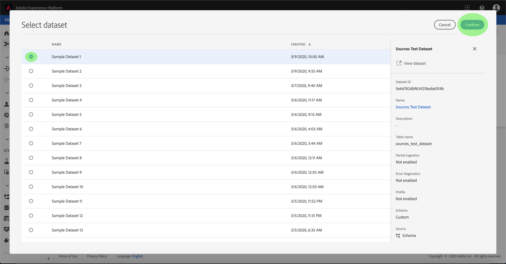
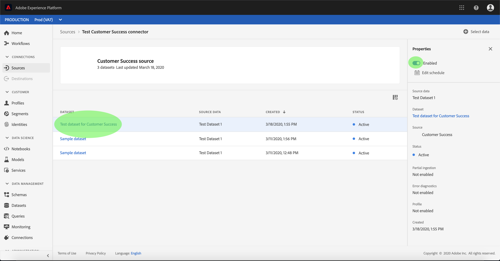

# Vorm een dataflow voor een schakelaar van het klantensucces in UI

Een dataflow is een geplande taak die gegevens van een bron aan een [!DNL Platform] dataset terugwint en opneemt. Deze zelfstudie biedt stappen om een nieuwe gegevensstroom te configureren met behulp van uw account voor klantsucces.

## Aan de slag

Deze zelfstudie vereist een goed begrip van de volgende onderdelen van Adobe Experience Platform:

- [XDM-systeem](../../../../xdm/home.md)(Experience Data Model): Het gestandaardiseerde kader waardoor de gegevens van de klantenervaring worden [!DNL Experience Platform] georganiseerd.
   - [Basisbeginselen van de schemacompositie](../../../../xdm/schema/composition.md): Leer over de basisbouwstenen van schema&#39;s XDM, met inbegrip van zeer belangrijke principes en beste praktijken in schemacompositie.
   - [Zelfstudie](../../../../xdm/tutorials/create-schema-ui.md)Schema-editor: Leer hoe te om douaneschema&#39;s tot stand te brengen gebruikend de Redacteur UI van het Schema.
- [Klantprofiel](../../../../profile/home.md)in realtime: Verstrekt een verenigd, real-time consumentenprofiel dat op bijeengevoegde gegevens van veelvoudige bronnen wordt gebaseerd.

Bovendien, vereist deze zelfstudie dat u reeds een rekening van het klantensucces hebt gecreeerd. Een lijst van leerprogramma&#39;s voor het creëren van verschillende schakelaars van het klantensucces in UI kan in het overzicht [van](../../../home.md)bronschakelaars worden gevonden.

## Gegevens selecteren

Na het creëren van uw schakelaar van het de succes van de klant, verschijnt de *[!UICONTROL Uitgezochte gegevensstap]* , die een interactieve interface verstrekt voor u om uw dossierhiërarchie te onderzoeken.

- De linkerhelft van de interface is een directorybrowser waarin de bestanden en mappen van uw server worden weergegeven.
- Met de rechterhelft van de interface kunt u maximaal 100 rijen gegevens uit een compatibel bestand voorvertonen.

Selecteer de directory die u wilt gebruiken en klik op **[!UICONTROL Volgende]**.

## Gegevensvelden toewijzen aan een XDM-schema

De stap *[!UICONTROL Toewijzing]* verschijnt, die een interactieve interface verstrekt om de brongegevens aan een [!DNL Platform] dataset in kaart te brengen.

Kies een dataset voor binnenkomende gegevens waarin moeten worden opgenomen. U kunt of een bestaande dataset gebruiken of een nieuwe dataset tot stand brengen.

### Een bestaande gegevensset gebruiken

Om gegevens in een bestaande dataset in te voeren, selecteer **[!UICONTROL Gebruik bestaande dataset]**, dan klik het datasetpictogram.

Het dialoogvenster *[!UICONTROL Gegevensset]* selecteren wordt geopend. Zoek de gegevensset die u wilt gebruiken, selecteer deze en klik op **[!UICONTROL Doorgaan]**.

### Een nieuwe gegevensset gebruiken

Om gegevens in een nieuwe dataset in te voeren, **[!UICONTROL creeer nieuwe dataset]** en ga een naam en een beschrijving voor de dataset op de verstrekte gebieden in.

U kunt een schemagebied vastmaken door een schemanaam in te gaan in de **[!UICONTROL Uitgezochte bar van het schemaonderzoek]** . U kunt ook het vervolgkeuzepictogram selecteren om een lijst met bestaande schema&#39;s weer te geven. U kunt ook **[!UICONTROL Geavanceerd zoeken]** selecteren om toegang te krijgen tot het scherm met bestaande schema&#39;s en de bijbehorende details.

Het dialoogvenster Schema ** selecteren wordt geopend. Selecteer het schema u wenst om op de nieuwe dataset toe te passen, dan klik **[!UICONTROL Gedaan]**.

Op basis van uw behoeften kunt u ervoor kiezen om velden rechtstreeks toe te wijzen of mapperfuncties te gebruiken om brongegevens om berekende of berekende waarden af te leiden. Raadpleeg de zelfstudie over het [toewijzen van CSV-gegevens aan XDM-schemavelden](../../../../ingestion/tutorials/map-a-csv-file.md)voor meer informatie over gegevenstoewijzing en mapperfuncties.

Klik op **[!UICONTROL Volgende]** als de brongegevens zijn toegewezen.

## Planninguitvoering

De *[!UICONTROL Plannende]* stap verschijnt, toestaand u om een innameprogramma te vormen om de geselecteerde brongegevens automatisch in te nemen gebruikend de gevormde afbeeldingen. De volgende lijst schetst de verschillende configureerbare gebieden voor het plannen:

| Veld | Beschrijving |
| --- | --- |
| Frequentie | De selecteerbare frequenties omvatten `Once`, `Minute`, `Hour`, `Day`, en `Week`. |
| Interval | Een geheel getal dat het interval voor de geselecteerde frequentie instelt. |
| Begintijd | Een UTC-tijdstempel die aangeeft wanneer de eerste opname wordt uitgevoerd. |
| Achtergrond | Een booleaanse waarde die bepaalt welke gegevens eerst worden ingevoerd. Als *[!UICONTROL Backfill]* is ingeschakeld, worden alle huidige bestanden in het opgegeven pad tijdens de eerste geplande opname opgenomen. Als *Backfill* is uitgeschakeld, worden alleen de bestanden opgenomen die tussen de eerste opname en de *[!UICONTROL begintijd]* worden geladen. Bestanden die vóór het begin van het *[!UICONTROL starten]* zijn geladen, worden niet opgenomen. |
| Delta-kolom | Een optie met een gefilterde reeks gebieden van het bronschema van type, datum, of tijd. Dit veld wordt gebruikt om onderscheid te maken tussen nieuwe en bestaande gegevens. Incrementele gegevens worden opgenomen op basis van het tijdstempel van de geselecteerde kolom. |

Dataflows worden ontworpen om gegevens automatisch in te voeren op een geplande basis. Begin door de innamefrequentie te selecteren. Daarna, plaats het interval om de periode tussen twee stroomlooppas aan te wijzen. De waarde van het interval moet een geheel getal zijn dat niet gelijk is aan nul en moet worden ingesteld op groter dan of gelijk aan 15.

Als u de begintijd voor inname wilt instellen, past u de datum en tijd aan die worden weergegeven in het vak Begintijd. U kunt ook het kalenderpictogram selecteren om de begintijdwaarde te bewerken. De begintijd moet groter zijn dan of gelijk zijn aan de huidige UTC-tijd.

Selecteer Incrementele gegevens **[!UICONTROL laden door]** de deltabkolom toe te wijzen. In dit veld wordt een onderscheid gemaakt tussen nieuwe en bestaande gegevens.

### Eenmalige gegevensstroom voor inname instellen

Als u eenmalige invoer wilt instellen, selecteert u de vervolgkeuzepijl voor de frequentie en selecteert u **[!UICONTROL Eenmaal]**.

>[!TIP]
>
>**[!UICONTROL Interval]** en **[!UICONTROL backfill]** zijn niet zichtbaar tijdens eenmalig gebruik.

Als u de juiste waarden voor het schema hebt opgegeven, selecteert u **[!UICONTROL Volgende]**.

## Gegevens over gegevensstroom opgeven

De stap met *[!UICONTROL details]* over gegevensstroom wordt weergegeven, zodat u een naam kunt geven en een korte beschrijving kunt geven van uw nieuwe gegevensstroom.

Tijdens dit proces kunt u ook *[!UICONTROL gedeeltelijke inname]* en *[!UICONTROL foutdiagnose]* inschakelen. Als u *[!UICONTROL Gedeeltelijke inname]* inschakelt, kunt u gegevens met fouten tot een bepaalde drempel innemen. Wanneer *[!UICONTROL Partiële inname]* is ingeschakeld, sleept u de *[!UICONTROL foutdrempel %]* voor een wijziging van de foutdrempel van de batch. U kunt de drempelwaarde ook handmatig aanpassen door het invoervak te selecteren. Voor meer informatie, zie het [gedeeltelijke partijingestie overzicht](../../../../ingestion/batch-ingestion/partial.md).

Geef waarden op voor de gegevensstroom en selecteer **[!UICONTROL Volgende]**.

## Controleer uw gegevensstroom

De stap *[!UICONTROL Revisie]* wordt weergegeven, zodat u de nieuwe gegevensstroom kunt controleren voordat deze wordt gemaakt. De details worden gegroepeerd in de volgende categorieën:

- *[!UICONTROL Verbindingsgegevens]*: Toont het brontype, de relevante weg van het gekozen brondossier, en de hoeveelheid kolommen binnen dat brondossier.
- *[!UICONTROL Toewijzingsdetails]*: Toont welke dataset de brongegevens worden opgenomen in, met inbegrip van het schema dat de dataset zich aan houdt.
- *[!UICONTROL Details]* schema: Toont de actieve periode, de frequentie, en het interval van het innameprogramma.

Nadat u de gegevensstroom hebt gereviseerd, klikt u op **[!UICONTROL Voltooien]** en laat u enige tijd over tot de gegevensstroom.

## Uw gegevensstroom controleren en verwijderen

Zodra uw gegevensstroom is gecreeerd, kunt u de gegevens controleren die door het worden opgenomen. Voor meer informatie over hoe te om uw gegevensstroom te controleren en te schrappen, zie de zelfstudie over het [controleren van en het schrappen van gegevensstromen](../monitor.md).

## Volgende stappen

Door dit leerprogramma te volgen, hebt u met succes een dataflow gecreeerd om gegevens van een bron van het klantensucces in te brengen en inzicht verworven bij de controle van datasets. Inkomende gegevens kunnen nu worden gebruikt door downstreamdiensten [!DNL Platform] zoals [!DNL Real-time Customer Profile] en [!DNL Data Science Workspace]. Raadpleeg de volgende documenten voor meer informatie:

- [Overzicht van het realtime klantprofiel](../../../../profile/home.md)
- [Overzicht van de Data Science Workspace](../../../../data-science-workspace/home.md)

## Aanhangsel

De volgende secties verstrekken extra informatie voor het werken met bronschakelaars.

### Een gegevensstroom uitschakelen

Wanneer een gegevensstroom wordt gecreeerd, wordt het onmiddellijk actief en neemt gegevens volgens het programma op het werd gegeven. U kunt een actieve gegevensstroom op elk ogenblik onbruikbaar maken door de instructies hieronder te volgen.

Selecteer in het *[!UICONTROL verificatiescherm]* de naam van de account die is gekoppeld aan de gegevensstroom die u wilt uitschakelen.

De pagina _Bronactiviteit_ wordt weergegeven. Selecteer de actieve gegevensstroom van de lijst om zijn kolom van *[!UICONTROL Eigenschappen]* op de rechterkant van het scherm te openen, die een **[!UICONTROL Toegelaten]** knevelknoop bevat. Klik op de schakeloptie om de gegevensstroom uit te schakelen. Dezelfde schakeloptie kan worden gebruikt om een gegevensstroom opnieuw in te schakelen nadat deze is uitgeschakeld.

### Binnenkomende gegevens voor [!DNL Profile] populatie activeren

De binnenkomende gegevens van uw bronschakelaar kunnen worden gebruikt om uw [!DNL Real-time Customer Profile] gegevens te verrijken en te bevolken. Zie de zelfstudie over de [!DNL Real-time Customer Profile] profielpopulatie voor meer informatie over het vullen van gegevens.