# Vorm een dataflow voor een gegevensbestandschakelaar in UI

Een dataflow is een geplande taak die gegevens van een bron aan een dataset van het Platform terugwint en opneemt. Dit leerprogramma verstrekt stappen om een nieuwe dataflow te vormen gebruikend uw schakelaar van de gegevensbestandbasis.

## Aan de slag

Voor deze zelfstudie is een goed begrip vereist van de volgende componenten van het Adobe Experience Platform:

- [XDM-systeem](../../../../xdm/home.md)(Experience Data Model): Het gestandaardiseerde kader waardoor het Platform van de Ervaring gegevens van de klantenervaring organiseert.
   - [Basisbeginselen van de schemacompositie](../../../../xdm/schema/composition.md): Leer over de basisbouwstenen van schema&#39;s XDM, met inbegrip van zeer belangrijke principes en beste praktijken in schemacompositie.
   - [Zelfstudie](../../../../xdm/tutorials/create-schema-ui.md)Schema-editor: Leer hoe te om douaneschema&#39;s tot stand te brengen gebruikend de Redacteur UI van het Schema.
- [Klantprofiel](../../../../profile/home.md)in realtime: Verstrekt een verenigd, real-time consumentenprofiel dat op bijeengevoegde gegevens van veelvoudige bronnen wordt gebaseerd.

Bovendien, vereist dit leerprogramma dat u reeds een gegevensbestandschakelaar hebt gecreeerd. Een lijst van leerprogramma&#39;s voor het creëren van verschillende gegevensbestandschakelaars in UI kan in het overzicht [van](../../../home.md)bronschakelaars worden gevonden.

## Gegevens selecteren

Nadat u de databaseverbinding hebt gemaakt, wordt de stap Gegevens ** selecteren weergegeven en krijgt u een interactieve interface om de databasehiërarchie te verkennen.

- De linkerhelft van de interface is een browser die de lijst met databases van uw account weergeeft.
- Met de rechterhelft van de interface kunt u maximaal 100 rijen met gegevens voorvertonen.

Selecteer de database die u wilt gebruiken en klik op **Volgende**.

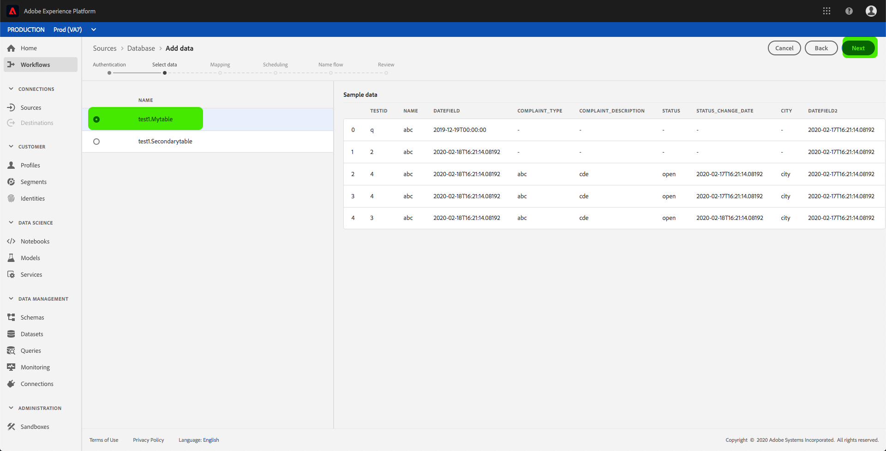

## Gegevensvelden toewijzen aan een XDM-schema

De stap *Toewijzing* verschijnt, die een interactieve interface verstrekt om de brongegevens aan een dataset van het Platform in kaart te brengen.

Kies een dataset voor binnenkomende gegevens waarin moeten worden opgenomen. U kunt of een bestaande dataset gebruiken of een nieuwe dataset tot stand brengen.

### Een bestaande gegevensset gebruiken

Om gegevens in een bestaande dataset in te voeren, selecteer **Gebruik bestaande dataset**, dan klik het datasetpictogram.

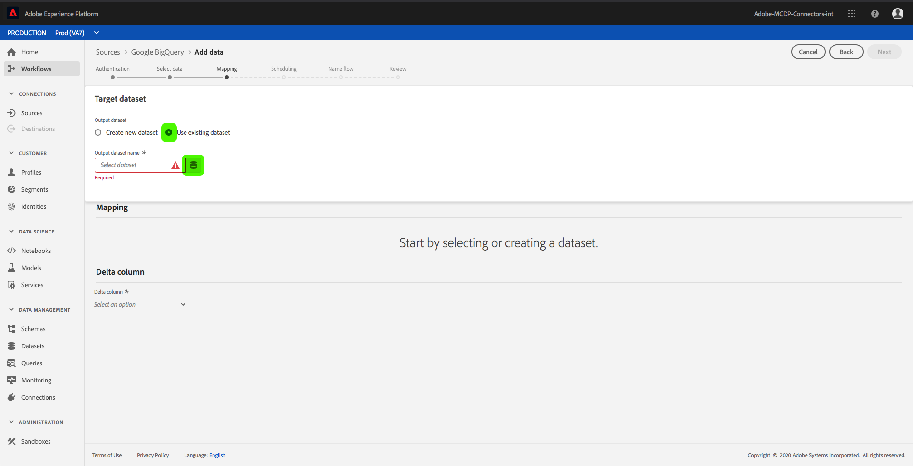

Het dialoogvenster _Gegevensset_ selecteren wordt geopend. Zoek de gegevensset die u wilt gebruiken, selecteer deze en klik op **Doorgaan**.

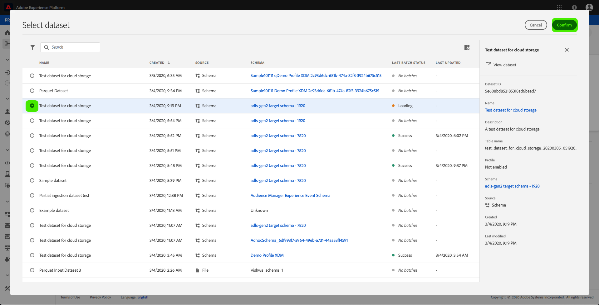

### Een nieuwe gegevensset gebruiken

Om gegevens in een nieuwe dataset in te voeren, **creeer nieuwe dataset** en ga een naam en een beschrijving voor de dataset op de verstrekte gebieden in. Klik vervolgens op het schemapictogram.

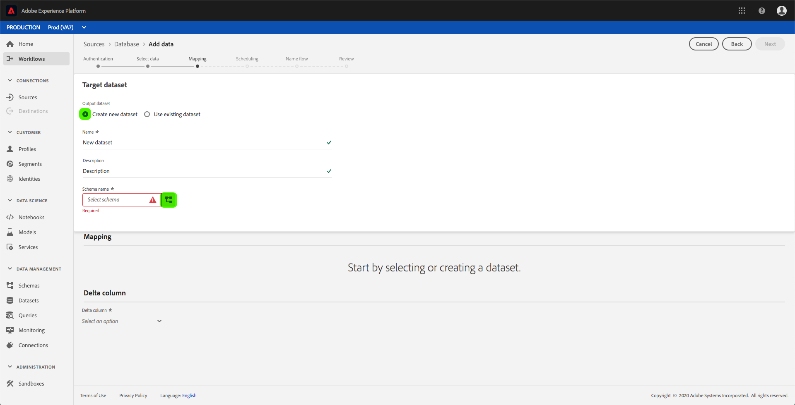

Het dialoogvenster Schema __ selecteren wordt geopend. Selecteer het schema u wenst om op de nieuwe dataset toe te passen, dan klik **Gedaan**.

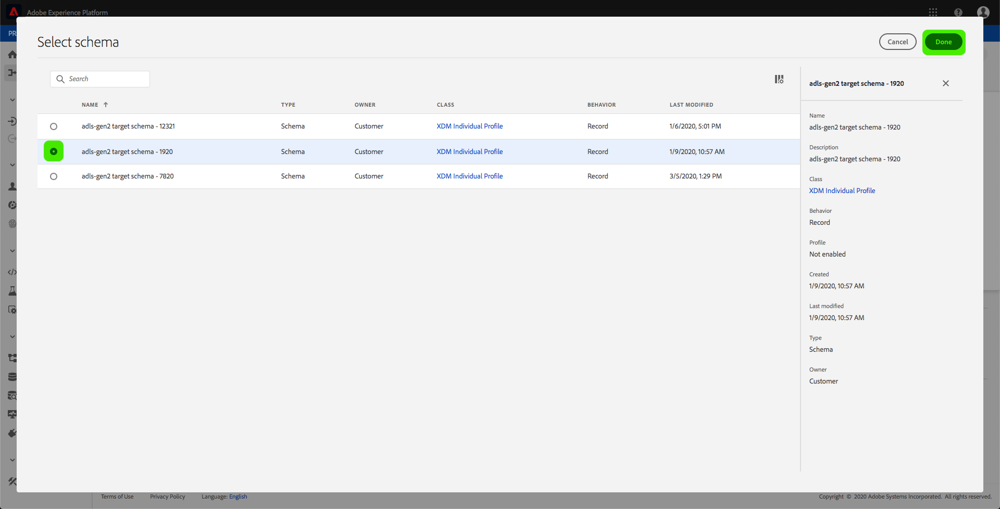

Op basis van uw behoeften kunt u ervoor kiezen om velden rechtstreeks toe te wijzen of mapperfuncties te gebruiken om brongegevens om berekende of berekende waarden af te leiden. Raadpleeg de zelfstudie over het [toewijzen van CSV-gegevens aan XDM-schemavelden](../../../../ingestion/tutorials/map-a-csv-file.md)voor meer informatie over gegevenstoewijzing en mapperfuncties.

Klik op **Volgende** als de brongegevens zijn toegewezen.

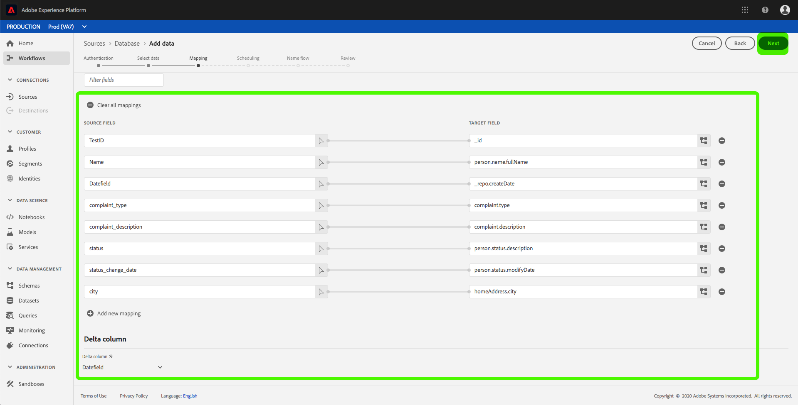

## Planninguitvoering

De *Plannende* stap verschijnt, toestaand u om een innameprogramma te vormen om de geselecteerde brongegevens automatisch in te nemen gebruikend de gevormde afbeeldingen. De volgende lijst schetst de verschillende configureerbare gebieden voor het plannen:

| Veld | Beschrijving |
| --- | --- |
| Frequentie | Selecteerbare frequenties zijn Minuut, Uur, Dag en Week. |
| Interval | Een geheel getal dat het interval voor de geselecteerde frequentie instelt. |
| Begintijd | Een UTC-tijdstempel waarvoor de eerste invoer wordt uitgevoerd. |
| Achtergrond | Een booleaanse waarde die bepaalt welke gegevens eerst worden ingevoerd. Als *Backfill* is ingeschakeld, worden alle huidige bestanden in het opgegeven pad tijdens de eerste geplande opname opgenomen. Als *Backfill* is uitgeschakeld, worden alleen de bestanden opgenomen die tussen de eerste opname en de *begintijd* worden geladen. Bestanden die vóór het begin van het *starten* zijn geladen, worden niet opgenomen. |

Dataflows worden ontworpen om gegevens automatisch in te voeren op een geplande basis. Als u slechts één keer wilt opnemen via deze workflow, kunt u dit doen door de **Frequentie** in te stellen op &quot;Dag&quot; en een zeer groot aantal toe te passen voor het **Interval**, zoals 10000 of een vergelijkbaar aantal.

Geef waarden op voor het schema en klik op **Volgende**.

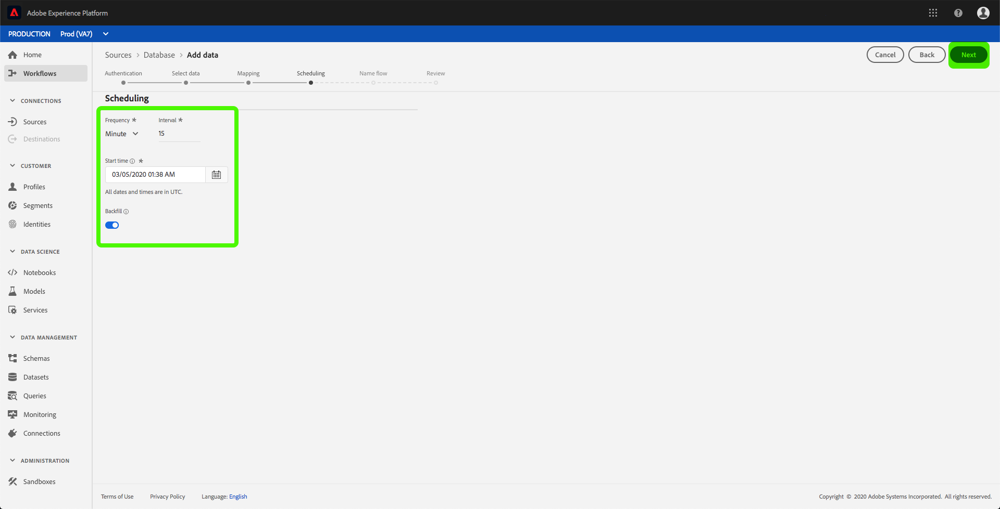

## Geef uw gegevensstroom een naam

De stap voor *naamstroom* wordt weergegeven. Hier moet u een naam en een optionele beschrijving voor de gegevensstroom opgeven. Klik op Volgende als u klaar bent.&quot;

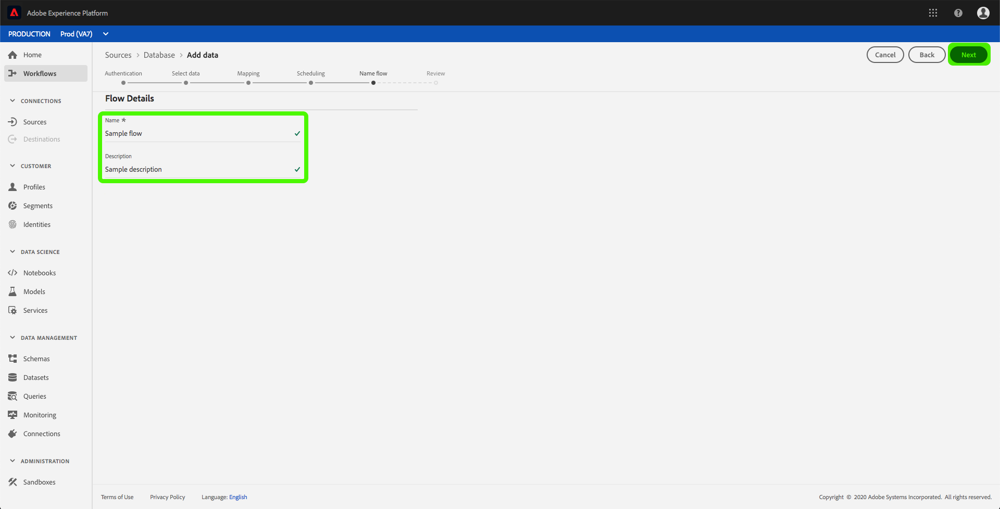

## Controleer uw gegevensstroom

De stap *Revisie* wordt weergegeven, zodat u de nieuwe gegevensstroom kunt controleren voordat deze wordt gemaakt. De details worden gegroepeerd in de volgende categorieën:

- *Verbindingsgegevens*: Toont het brontype, de relevante weg van het gekozen brondossier, en de hoeveelheid kolommen binnen dat brondossier.
- *Toewijzingsdetails*: Toont welke dataset de brongegevens worden opgenomen in, met inbegrip van het schema dat de dataset zich aan houdt.
- *Details* schema: Toont de actieve periode, de frequentie, en het interval van het innameprogramma.

Nadat u de gegevensstroom hebt gereviseerd, klikt u op **Voltooien** en laat u enige tijd over tot de gegevensstroom.

## Uw gegevensstroom controleren

Zodra uw gegevensstroom is gecreeerd, kunt u de gegevens controleren die door het worden opgenomen. Voer de onderstaande stappen uit om toegang te krijgen tot de gegevenssetcontrole van een gegevensstroom.

Klik in de werkruimte _Bronnen_ op het tabblad **Bladeren** om uw basisverbindingen weer te geven. Zoek in de weergegeven lijst naar de verbinding die de gegevensstroom bevat die u wilt controleren door op de naam ervan te klikken.

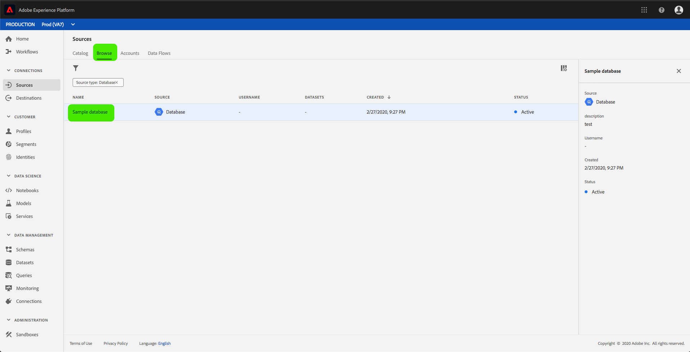

Het scherm *Bronactiviteit* wordt weergegeven. Van hier, klik de naam van een dataset waarvan activiteit u wilt controleren.

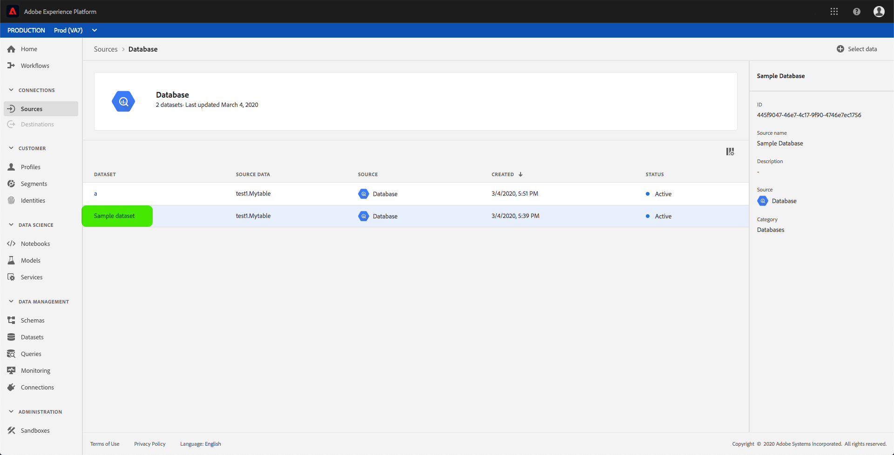

Het scherm *Dataset-activiteit* wordt weergegeven. Op deze pagina wordt de snelheid van berichten weergegeven die in de vorm van een grafiek worden gebruikt.

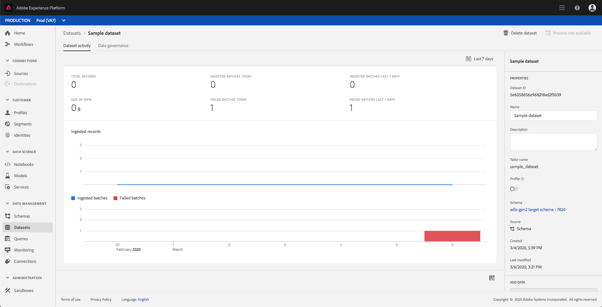

Voor meer informatie over het controleren van datasets en ingestie, verwijs naar het leerprogramma bij het [controleren van het stromen gegevens](../../../../ingestion/quality/monitor-data-flows.md).

## Volgende stappen

Door dit leerprogramma te volgen, hebt u met succes een dataflow gecreeerd om gegevens van een extern gegevensbestand in te brengen en inzicht verworven op controledatasets. De inkomende gegevens kunnen nu door de stroomafwaartse diensten van het Platform zoals het Profiel van de Klant in real time en de Werkruimte van de Wetenschap van Gegevens worden gebruikt. Raadpleeg de volgende documenten voor meer informatie:

- [Overzicht van het realtime klantprofiel](../../../../profile/home.md)
- [Overzicht van de Data Science Workspace](../../../../data-science-workspace/home.md)

## Aanhangsel

De volgende secties verstrekken extra informatie voor het werken met bronschakelaars.

### Een gegevensstroom uitschakelen

Wanneer een gegevensstroom wordt gecreeerd, wordt het onmiddellijk actief en neemt gegevens volgens het programma op het werd gegeven. U kunt een actieve gegevensstroom op elk ogenblik onbruikbaar maken door de instructies hieronder te volgen.

Klik in de _werkruimte Bronnen_ op het tabblad **Bladeren** . Klik vervolgens op de naam van de basisverbinding die is gekoppeld aan de gegevensstroom die u wilt uitschakelen.

De pagina _Bronactiviteit_ wordt weergegeven. Selecteer de actieve gegevensstroom van de lijst om zijn kolom van *Eigenschappen* op de rechterkant van het scherm te openen, die een **Toegelaten** knevelknoop bevat. Klik op de schakeloptie om de gegevensstroom uit te schakelen. Dezelfde schakeloptie kan worden gebruikt om een gegevensstroom opnieuw in te schakelen nadat deze is uitgeschakeld.

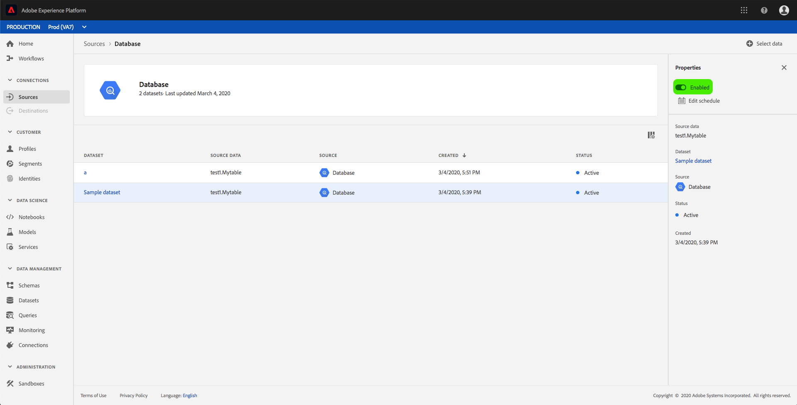

### Inkomende gegevens activeren voor profielpopulatie

De binnenkomende gegevens van uw bronschakelaar kunnen worden gebruikt om uw gegevens van het Profiel van de Klant in real time te verrijken en te bevolken. Voor meer informatie over het bevolken van uw gegevens van het Profiel van de Real-Customer, zie de zelfstudie over de [bevolking](../profile.md)van het Profiel.