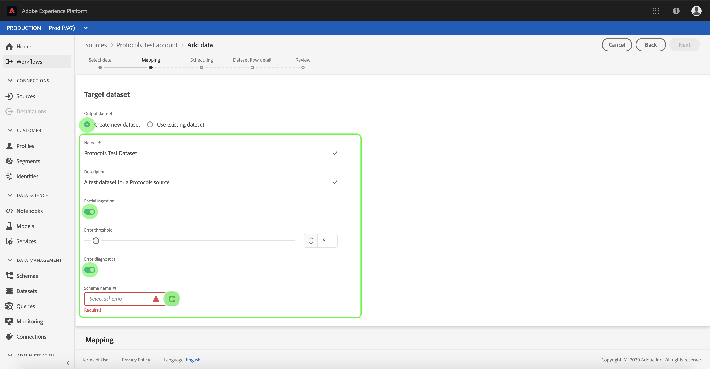
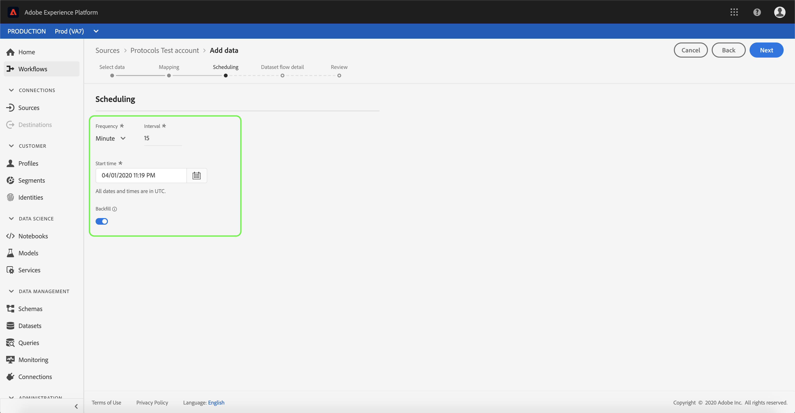
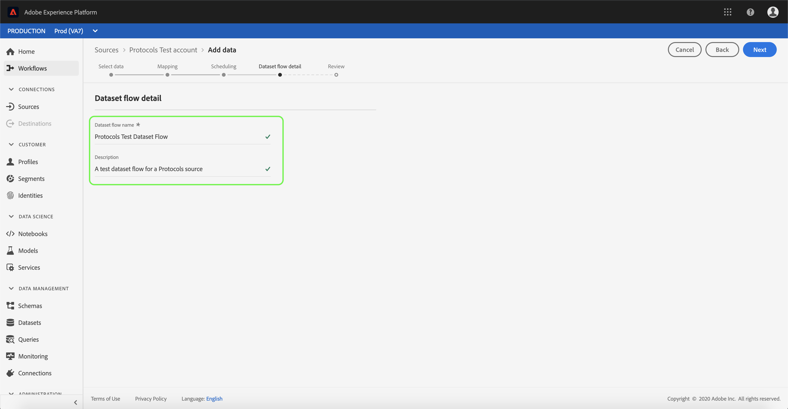
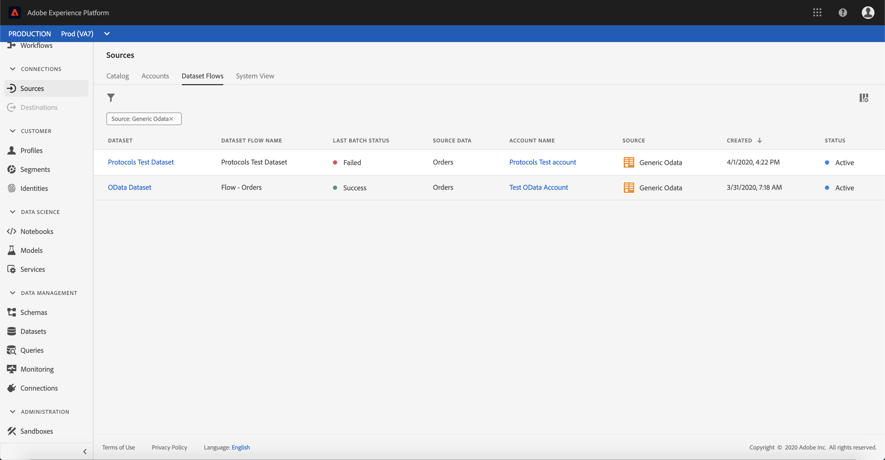

# Vorm een dataflow voor een protocolschakelaar in UI

Een datasetstroom is een geplande taak die gegevens van een bron aan een dataset van het Platform van de Ervaring van Adobe terugwint en opneemt. Dit leerprogramma verstrekt stappen om een nieuwe datasetstroom te vormen gebruikend uw protocolrekening.

## Aan de slag

Voor deze zelfstudie is een goed begrip vereist van de volgende componenten van het Adobe Experience Platform:

- [XDM-systeem](../../../../xdm/home.md)(Experience Data Model): Het gestandaardiseerde kader waardoor het Platform van de Ervaring gegevens van de klantenervaring organiseert.
   - [Basisbeginselen van de schemacompositie](../../../../xdm/schema/composition.md): Leer over de basisbouwstenen van schema&#39;s XDM, met inbegrip van zeer belangrijke principes en beste praktijken in schemacompositie.
   - [Zelfstudie](../../../../xdm/tutorials/create-schema-ui.md)Schema-editor: Leer hoe te om douaneschema&#39;s tot stand te brengen gebruikend de Redacteur UI van het Schema.
- [Klantprofiel](../../../../profile/home.md)in realtime: Verstrekt een verenigd, real-time consumentenprofiel dat op bijeengevoegde gegevens van veelvoudige bronnen wordt gebaseerd.

Bovendien, vereist dit leerprogramma dat u reeds een protocolrekening hebt gecreeerd. Een lijst van leerprogramma&#39;s voor het creëren van verschillende protocolschakelaars in UI kan in het overzicht [van](../../../home.md)bronschakelaars worden gevonden.

## Gegevens selecteren

Nadat u uw protocolaccount hebt gemaakt, wordt de stap Gegevens ** selecteren weergegeven. Deze stap bevat een interactieve interface waarmee u de bestandshiërarchie kunt verkennen.

- De linkerhelft van de interface is een directorybrowser waarin de bestanden en mappen van uw server worden weergegeven.
- Met de rechterhelft van de interface kunt u maximaal 100 rijen gegevens uit een compatibel bestand voorvertonen.

Selecteer de directory die u wilt gebruiken en klik op **Volgende**.

## Gegevensvelden toewijzen aan een XDM-schema

De stap *Toewijzing* verschijnt, die een interactieve interface verstrekt om de brongegevens aan een dataset van het Platform in kaart te brengen.

Kies een dataset voor binnenkomende gegevens waarin moeten worden opgenomen. U kunt of een bestaande dataset gebruiken of een nieuwe dataset tot stand brengen.

### Een bestaande gegevensset gebruiken

Om gegevens in een bestaande dataset in te voeren, selecteer **Gebruik bestaande dataset**, dan klik het datasetpictogram.

Het dialoogvenster *Gegevensset* selecteren wordt geopend. Zoek de gegevensset die u wilt gebruiken, selecteer deze en klik op **Doorgaan**.

### Een nieuwe gegevensset gebruiken

Om gegevens in een nieuwe dataset in te voeren, **creeer nieuwe dataset** en ga een naam en een beschrijving voor de dataset op de verstrekte gebieden in.

Tijdens dit proces kunt u ook *gedeeltelijke inname* en *foutdiagnose* inschakelen. Als u *Gedeeltelijke opname* inschakelt, kunt u gegevens met fouten, tot een bepaalde drempel die u kunt instellen, insluiten. Als u de diagnostische functie Fout inschakelt, worden details weergegeven over onjuiste gegevens die afzonderlijk in een batch worden opgeslagen. Voor meer informatie, zie het [gedeeltelijke partijingestie overzicht](../../../../ingestion/batch-ingestion/partial.md).

Klik op het schemapictogram als u klaar bent.

Het dialoogvenster Schema ** selecteren wordt geopend. Selecteer het schema u wenst om op de nieuwe dataset toe te passen, dan klik **Gedaan**.

Op basis van uw behoeften kunt u ervoor kiezen om velden rechtstreeks toe te wijzen of mapperfuncties te gebruiken om brongegevens om berekende of berekende waarden af te leiden. Raadpleeg de zelfstudie over het [toewijzen van CSV-gegevens aan XDM-schemavelden](../../../../ingestion/tutorials/map-a-csv-file.md)voor meer informatie over gegevenstoewijzing en mapperfuncties.

In het scherm *Toewijzen* kunt u ook de *Delta-kolom* instellen. Wanneer de datasetstroom wordt gecreeerd, kunt u om het even welk tijdstempelgebied als basis plaatsen om te beslissen welke verslagen in geplande stijgende ingestities moeten worden opgenomen.

Klik op **Volgende** als de brongegevens zijn toegewezen.

De *Plannende* stap verschijnt, toestaand u om een innameprogramma te vormen om de geselecteerde brongegevens automatisch in te nemen gebruikend de gevormde afbeeldingen. De volgende lijst schetst de verschillende configureerbare gebieden voor het plannen:

| Veld | Beschrijving |
| --- | --- |
| Frequentie | Selecteerbare frequenties zijn Minuut, Uur, Dag en Week. |
| Interval | Een geheel getal dat het interval voor de geselecteerde frequentie instelt. |
| Begintijd | Een UTC-tijdstempel waarvoor de eerste invoer wordt uitgevoerd. |
| Achtergrond | Een booleaanse waarde die bepaalt welke gegevens eerst worden ingevoerd. Als *Backfill* is ingeschakeld, worden alle huidige bestanden in het opgegeven pad tijdens de eerste geplande opname opgenomen. Als *Backfill* is uitgeschakeld, worden alleen de bestanden opgenomen die tussen de eerste opname en de *begintijd* worden geladen. Bestanden die vóór het begin van het *starten* zijn geladen, worden niet opgenomen. |

Datasetstromen worden ontworpen om automatisch gegevens op een geplande basis in te voeren. Als u slechts één keer wilt opnemen via deze workflow, kunt u dit doen door de **Frequentie** in te stellen op &quot;Dag&quot; en een zeer groot aantal toe te passen voor het **Interval**, zoals 10000 of een vergelijkbaar aantal.

Geef waarden op voor het schema en klik op **Volgende**.

## Geef de gegevenssetstroom een naam

De stap met de details *van de* Dataset-stroom wordt weergegeven. Hier moet u een naam en een optionele beschrijving opgeven voor de gegevenssetstroom. Klik op **Volgende** als u klaar bent.

## De gegevenssetstroom controleren

De stap *Revisie* wordt weergegeven, zodat u de nieuwe gegevensstroom kunt controleren voordat deze wordt gemaakt. De details worden gegroepeerd in de volgende categorieën:

- *Verbinding*: Toont het brontype, de relevante weg van het gekozen brondossier, en de hoeveelheid kolommen binnen dat brondossier.
- *Gegevensset- en kaartvelden* toewijzen: Toont welke dataset de brongegevens worden opgenomen in, met inbegrip van het schema dat de dataset zich aan houdt.
- *Planning*: Toont de actieve periode, de frequentie, en het interval van het innameprogramma.

Nadat u de gegevensstroom hebt gereviseerd, klikt u op **Voltooien** en laat u enige tijd over tot de gegevensstroom.

## De gegevenssetstroom controleren

Zodra uw datasetstroom is gecreeerd, kunt u de gegevens controleren die door het worden opgenomen. Voor meer informatie over hoe te om uw datasetstromen te controleren, zie de zelfstudie over [rekeningen en datasetstromen](../monitor.md).

## Volgende stappen

Door deze zelfstudie te volgen, hebt u met succes een datasetstroom gecreeerd om gegevens van een systeem van de marketingautomatisering in te brengen en inzicht verworven in de controle van datasets. De inkomende gegevens kunnen nu door de stroomafwaartse diensten van het Platform zoals het Profiel van de Klant in real time en de Werkruimte van de Wetenschap van Gegevens worden gebruikt. Raadpleeg de volgende documenten voor meer informatie:

- [Overzicht van het realtime klantprofiel](../../../../profile/home.md)
- [Overzicht van de Data Science Workspace](../../../../data-science-workspace/home.md)

## Aanhangsel

De volgende secties verstrekken extra informatie voor het werken met bronschakelaars.

### Een gegevenssetstroom uitschakelen

Wanneer een datasetstroom wordt gecreeerd, wordt het onmiddellijk actief en neemt gegevens volgens het programma op het werd gegeven. U kunt een actieve datasetstroom op elk ogenblik onbruikbaar maken door de instructies hieronder te volgen.

Binnen het scherm van de Stromen *van de* Dataset, selecteer de naam van de datasetstroom u wenst om onbruikbaar te maken.

De kolom *Eigenschappen* wordt aan de rechterkant van het scherm weergegeven. Dit deelvenster bevat een schakelknop **Ingeschakeld** . Klik op de schakeloptie om de gegevensstroom uit te schakelen. Dezelfde schakeloptie kan worden gebruikt om een gegevensstroom opnieuw in te schakelen nadat deze is uitgeschakeld.

### Inkomende gegevens activeren voor profielpopulatie

De binnenkomende gegevens van uw bronschakelaar kunnen worden gebruikt om uw gegevens van het Profiel van de Klant in real time te verrijken en te bevolken. Voor meer informatie over het bevolken van uw gegevens van het Profiel van de Real-Customer, zie de zelfstudie over de [bevolking](../profile.md)van het Profiel.